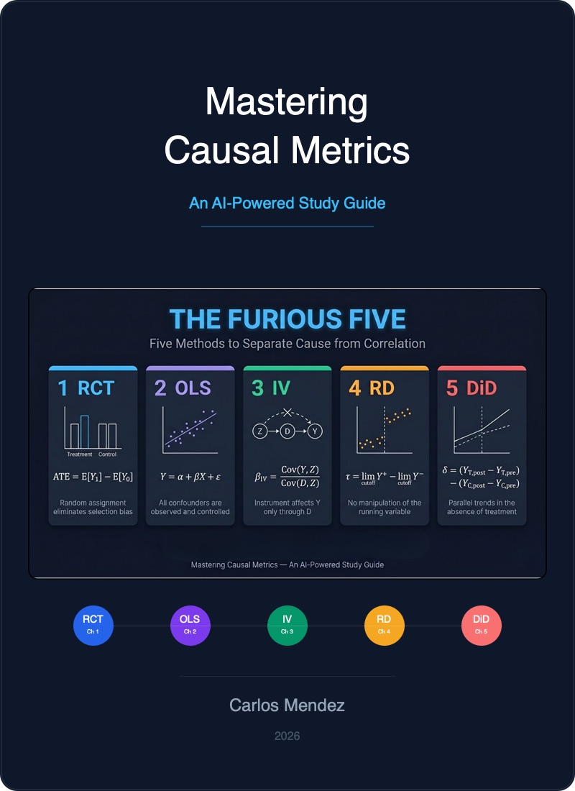
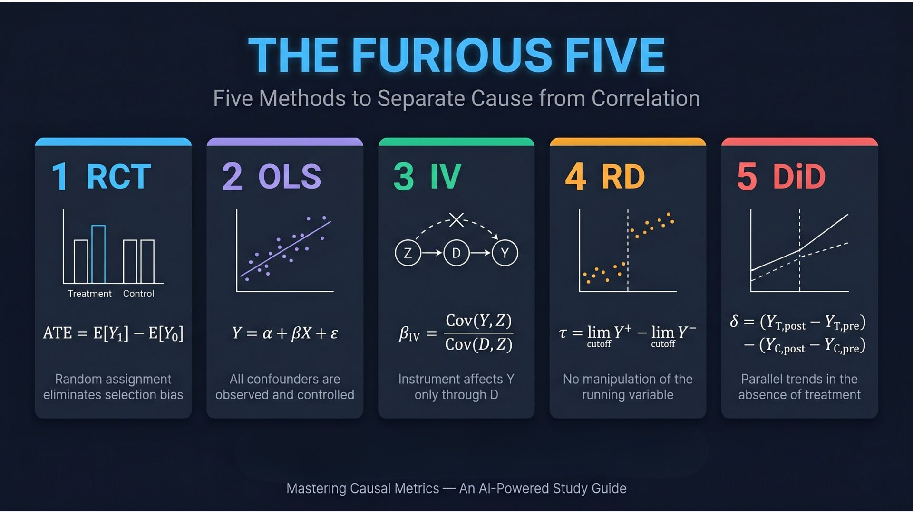

{.hidden width=0}

# Preface {.unnumbered}

**Welcome to *Mastering Causal Metrics*!** This book is an AI-powered study guide designed to accompany *Mastering 'Metrics: The Path from Cause to Effect* by Joshua D. Angrist and Jorn-Steffen Pischke. It brings the key lessons, empirical examples, and econometric tools of the book into the interactive, computational world of Python programming and AI-enhanced learning.

The vision behind this project is to make causal inference accessible, interactive, and engaging. By combining rigorous econometric concepts with cloud-based computational notebooks and AI-powered learning tools, we aim to transform the journey of learning causal inference into an exciting, hands-on discovery of how data can reveal cause and effect.

## The Challenge of Learning Causal Inference

Causal inference is one of the most important---and most challenging---topics in modern social science. The core question is deceptively simple: *does X cause Y?* But answering it rigorously requires understanding selection bias, potential outcomes, and a toolkit of clever research designs that economists have developed over decades.

Traditional approaches to learning these methods face two hurdles. First, the conceptual leap from correlation to causation is genuinely difficult---it requires rethinking how we interpret data. Second, the gap between understanding a method in theory and implementing it with real data can be substantial.

This book addresses both challenges by providing:

- **Conceptual frameworks** with visual diagrams and intuitive explanations
- **Working Python code** that implements every method on real datasets
- **AI-powered learning aids** that offer multiple ways to engage with the material

## This Book's Approach

This study guide follows Angrist and Pischke's *Mastering 'Metrics*, which organizes causal inference around **five core tools**:

1. **Randomized Trials** --- The gold standard for causal inference
2. **Regression** --- The workhorse that controls for observable differences
3. **Instrumental Variables** --- Exploiting natural experiments through exogenous variation
4. **Regression Discontinuity** --- Using sharp cutoffs to identify causal effects
5. **Differences-in-Differences** --- Comparing changes over time across groups

Each chapter provides a complete study guide with learning objectives, visual roadmaps, hands-on Python code, and interpretation guides. The final chapter synthesizes all five tools through the lens of a single question: *What are the returns to schooling?*

## Three Pillars of Learning

### Pillar 1: Causal Inference Foundations

The foundation rests on Angrist and Pischke's pedagogical framework, which makes sophisticated econometric methods accessible through real-world examples and clear exposition. You will learn not just *how* to use each tool, but *when* and *why* each one works---and when it might fail.

### Pillar 2: Computational Python Notebooks

Every chapter has a corresponding Python notebook that can run in Google Colab with zero installation. Data streams directly from GitHub, making each notebook fully self-contained. You will work with the same real datasets used in the book: the RAND Health Insurance Experiment, the Oregon Health Plan lottery, the Minneapolis Domestic Violence Experiment, and more.

The Python stack includes:

- **pandas** for data manipulation
- **statsmodels** for OLS, WLS, and regression with robust standard errors
- **linearmodels** for instrumental variables (2SLS)
- **matplotlib** and **seaborn** for visualization

Every chapter ends with exercises --- multiple choice and open-ended --- with solutions revealed through inline toggle boxes, so you can test your understanding immediately.

### Pillar 3: AI-Powered Learning

AI-enhanced study materials complement the notebooks:

- **Five AI Tutors** --- Learning Coach, Socratic Challenger, Code-First Experimenter, Exam Coach, and Case-Study Explainer --- each a Google Gemini Gem with a distinct pedagogical style
- **Visual roadmaps** and concept diagrams for every chapter
- **AI-generated podcasts** (via NotebookLM) for each chapter, so you can review key ideas on the go
- **YouTube videos** --- curated lectures and AI-generated video summaries --- linked per chapter

## Who This Book Is For

**Economics and social science students** taking their first econometrics or causal inference course will find a comprehensive, hands-on companion to *Mastering 'Metrics*.

**Researchers and analysts** looking to apply causal inference methods to their own data will benefit from seeing complete Python implementations of each technique.

**Self-learners** interested in causal reasoning will appreciate the zero-installation approach and multiple learning modalities.

## How to Use This Book

**If you're reading alongside *Mastering 'Metrics***: Follow the chapters in order. Each study guide corresponds to a chapter in the book and is designed to reinforce and extend the material.

**If you're looking for a specific method**: Jump directly to the relevant chapter. Each study guide is self-contained with its own data loading and setup.

**If you want hands-on practice**: Open the Google Colab notebooks and run the code yourself. Experiment with the data, modify the analyses, and work through the exercises.

**Accessibility features**: The book supports dark and light reading modes, includes a Google Translate widget for multilingual access, and provides visual summary cards and historical perspective sections in most chapters to give you multiple entry points into each topic.

## Acknowledgments

This project builds on the excellent work of Joshua D. Angrist and Jorn-Steffen Pischke, whose *Mastering 'Metrics* (Princeton University Press, 2015) provides the conceptual foundation for everything here. The datasets used in this project are made available through the book's companion website.

Additional inspiration comes from Matheus Facure's *Causal Inference for the Brave and True* and Scott Cunningham's *Causal Inference: The Mixtape*, which demonstrate the power of making econometrics accessible through code.
