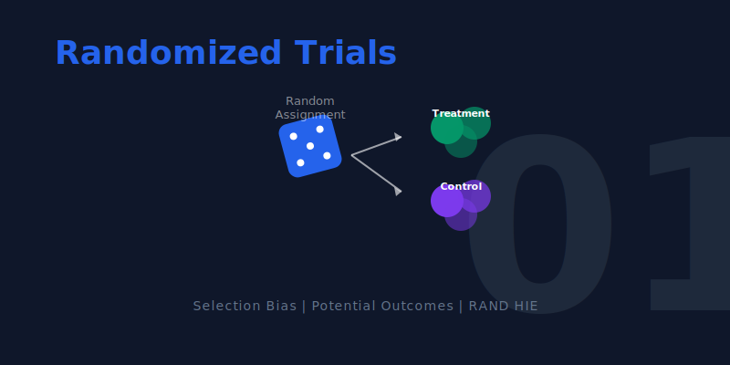

[](https://colab.research.google.com/github/cmg777/intro2causal/blob/main/notebooks_colab/01-randomized-trials.ipynb)


::: {.callout-tip}
### Learning Objectives

By the end of this chapter, you will be able to:

- Explain why simple comparisons between treated and untreated groups often fail to reveal causal effects
- Define **potential outcomes**, **selection bias**, and **average treatment effects**
- Describe how **random assignment** eliminates selection bias
- Use **regression on a dummy variable** as a tool to compare group means
- Interpret results from two landmark health insurance experiments
- Understand **standard errors** and **statistical significance**
:::

This chapter follows a clear arc: we start with a real-world question, discover why naive data comparisons are misleading, learn the theoretical framework that explains the problem, and then see how randomized experiments provide a solution.

```{mermaid}
%%| label: fig-roadmap
%%| fig-cap: "Roadmap for Chapter 1"

graph TD
    A["THE QUESTION: Does insurance improve health?"]
    B["NAIVE EVIDENCE: Insured are healthier, but is it causal?"]
    C["THE PROBLEM: Selection bias contaminates the comparison"]
    D["THE SOLUTION: Random assignment eliminates selection bias"]
    E["THE EVIDENCE: Two landmark experiments — RAND and Oregon"]

    A --> B --> C --> D --> E

    style A fill:#3498db,color:#fff
    style B fill:#e67e22,color:#fff
    style C fill:#c0392b,color:#fff
    style D fill:#8e44ad,color:#fff
    style E fill:#2d8659,color:#fff
    linkStyle default stroke:#64748b,stroke-width:2px
```


## Does Health Insurance Improve Health?

The United States spends more on health care than any other developed country, yet millions of Americans remain uninsured. A natural question arises: **does having health insurance actually make people healthier?**

::: {.callout-note}
### Intuition Builder: The Road Not Taken

Imagine standing at a fork in a road. One path leads through a world where you have health insurance; the other through a world where you don't. You can only walk one path --- you'll never know what would have happened on the other. This is the **fundamental problem of causal inference**: we observe one outcome per person, but the causal effect requires comparing two.
:::

At first glance, the answer seems obvious. We can look at survey data and compare the health of insured and uninsured people. Let's do exactly that using the **National Health Interview Survey (NHIS)**, an annual survey of the U.S. population.

```{python}
import pandas as pd
import statsmodels.formula.api as smf

# Data URL — all datasets are hosted on GitHub
DATA = "https://raw.githubusercontent.com/cmg777/intro2causal/main/data/"

# Load pre-cleaned NHIS 2009 data (married couples aged 26-59)
nhis = pd.read_csv(DATA + "ch1/nhis_clean.csv")
nhis.head(3)
```

The dataset contains a health index (1 = poor, 5 = excellent), insurance status (1 = insured, 0 = uninsured), and demographic characteristics for married couples.

### A First Look: Insured vs. Uninsured

Let's start with the simplest possible comparison. What is the average health of insured people versus uninsured people?

```{python}
#| label: tbl-means
#| tbl-cap: "Average health by insurance status"

# Average health by insurance status
means = nhis.groupby("insurance")["health"].mean()
pd.DataFrame({
    "Insurance Status": ["Uninsured", "Insured"],
    "Average Health (1-5)": [round(means[0], 2), round(means[1], 2)]
})
```

Insured people *are* healthier. But can we conclude that insurance *caused* this difference?

### The Problem: Other Differences Between Groups

Before drawing causal conclusions, let's check whether insured and uninsured people differ in other ways too.

::: {.callout-note}
### Regression as a comparison tool

A simple but powerful trick: if you regress an outcome $Y$ on a dummy variable $D$ (where $D = 1$ for treated, $D = 0$ for untreated), the regression gives you:

- **Intercept** = average of $Y$ in the untreated group (the control mean)
- **Coefficient on $D$** = difference in means between treated and untreated
- **Standard error** = a measure of how precisely the difference is estimated

This is exactly the same as computing group means and their difference --- but regression also gives us a standard error, which tells us whether the difference is statistically meaningful.
:::

Before we dive into the numbers, let's clarify how to read the regression output we will use throughout this study guide.

::: {.callout-note}
### How to read regression results

Throughout this study guide, we report regression results with **standard errors** (SE) in parentheses.

- The **SE** measures how precisely a coefficient is estimated
- Rule of thumb: if |coefficient / SE| > 2, the result is **statistically significant** at the 5% level
- For **balance checks**, we *want* insignificant results (confirming groups are similar)
- For **treatment effects**, significant results provide evidence of a causal effect
:::

Let's apply this to compare insured and uninsured people across multiple characteristics:

```{python}
#| label: tbl-nhis
#| tbl-cap: "Comparing insured and uninsured in the NHIS (2009). Each row is a separate regression of the variable on the insurance dummy."

# Variables to compare across insurance groups
outcomes = ["health", "nonwhite", "age", "education",
            "family_size", "employed", "family_income"]

# Run a separate regression for each variable and collect results
rows = []
for var in outcomes:
    # Regress each variable on insurance dummy (with survey weights and robust SEs)
    model = smf.wls(f"{var} ~ insurance", data=nhis, weights=nhis["weight"])
    result = model.fit(cov_type="HC1")

    # Intercept = uninsured mean; insurance coefficient = difference
    rows.append({
        "Variable": var,
        "Uninsured mean": round(result.params["Intercept"], 2),
        "Insured − Uninsured": round(result.params["insurance"], 2),
        "Std. Error": round(result.bse["insurance"], 2),
    })

pd.DataFrame(rows)
```

::: {.callout-warning}
### The red flags of selection bias

The insured are healthier --- but they are also:

- **~3 years more educated**
- **\$60,000 richer** in family income
- **More likely to be employed**

These are *enormous* differences. People who choose insurance are fundamentally different from those who don't. The health gap we observed almost certainly reflects these pre-existing advantages, not (just) the causal effect of insurance.
:::


## Why Naive Comparisons Fail: Selection Bias

The NHIS comparison illustrates a deep problem in causal inference. To understand it precisely, we need a framework for thinking about what *would have happened* under different circumstances.

### The Potential Outcomes Framework

Imagine person $i$ stands at a fork in the road. One path leads to having insurance; the other doesn't. Each path leads to a health outcome:

- $Y_{1i}$ = health **with** insurance (what happens on the insurance road)
- $Y_{0i}$ = health **without** insurance (what happens on the other road)

The **causal effect** of insurance for person $i$ is $Y_{1i} - Y_{0i}$ --- the difference between the two roads. But here's the catch: each person takes only one road. We observe $Y_{1i}$ or $Y_{0i}$, never both.

#### Seeing It Through an Example

| | **Anika** | **Ben** |
|:---|:---:|:---:|
| Health *without* insurance ($Y_{0i}$) | 3 | 5 |
| Health *with* insurance ($Y_{1i}$) | 4 | 5 |
| Choice: buys insurance? ($D_i$) | Yes (1) | No (0) |
| **Observed** health | 4 | 5 |
| True causal effect | +1 | 0 |

: Potential outcomes for two hypothetical students {.striped}

Anika, who is prone to illness, buys insurance --- it improves her health by 1 point. Ben, naturally robust, skips it --- insurance wouldn't have helped him anyway.

**What do we observe?** Anika's health is 4; Ben's is 5. The naive comparison ($4 - 5 = -1$) suggests insurance is *harmful*! The true effect on Anika is +1, but the comparison is polluted by the fact that Ben was healthier to begin with.

::: {.callout-warning}
### Common Misconception

"Insured people are healthier, so insurance must work." This confuses correlation with causation. The Anika/Ben example shows that even when the treated group looks *worse*, the true treatment effect can be positive. The observed comparison reflects both the causal effect and the pre-existing differences between people who choose treatment and those who don't. You cannot read causation from a simple comparison --- ever.
:::

### The Decomposition

This leads to a fundamental equation. Any observed comparison can be split into two pieces:

$$\underbrace{\text{Observed difference}}_{\text{What we see}} = \underbrace{\kappa}_{\text{Causal effect}} + \underbrace{\text{Avg}[Y_{0i} | D_i\!=\!1] - \text{Avg}[Y_{0i} | D_i\!=\!0]}_{\text{Selection bias}}$$

```{mermaid}
%%| label: fig-decomposition
%%| fig-cap: "The observed comparison bundles together the causal effect and selection bias. We need tools to separate them."

graph LR
    A["Observed Difference<br/>(Insured vs. Uninsured)"] --> B["Causal Effect (κ)<br/>What insurance<br/>actually does"]
    A --> C["Selection Bias<br/>Pre-existing differences<br/>between the groups"]
    style B fill:#2d8659,color:#fff
    style C fill:#c0392b,color:#fff
    style A fill:#475569,color:#fff
    linkStyle default stroke:#64748b,stroke-width:2px
```

**Selection bias** is the difference in health that would exist *even without insurance* --- it reflects the fact that healthier, wealthier, more educated people are more likely to be insured. The NHIS data above showed exactly this pattern.

We can visualize this problem as a causal diagram. Confounders like education, income, and employment create a "backdoor path" between insurance status and health outcomes. Because these factors influence *both* who gets insured *and* how healthy they are, the naive comparison captures their influence along with any true causal effect of insurance.

```{mermaid}
%%| label: fig-dag-bias
%%| fig-cap: "Why the naive comparison fails. Confounders create a 'back-door path' that makes it impossible to isolate the causal effect."

graph TD
    C["Confounders<br/>(Education, Income,<br/>Employment, etc.)"] -->|"affects"| I["Insurance<br/>Status"]
    C -->|"affects"| H["Health<br/>Outcomes"]
    I -.->|"causal effect?"| H
    style C fill:#e67e22,color:#fff
    style I fill:#3498db,color:#fff
    style H fill:#2d8659,color:#fff
    linkStyle default stroke:#64748b,stroke-width:2px
```

::: {.callout-important}
### The Fundamental Problem of Causal Inference

We want $\kappa$ (the causal effect), but what we observe is $\kappa$ **plus** selection bias. We cannot separate the two without a strategy that eliminates the bias.
:::


## The Solution: Random Assignment

### The Core Idea

What if, instead of letting people *choose* insurance, we assigned it randomly --- like a coin flip? This is the insight behind **randomized controlled trials (RCTs)**.

When treatment is randomly assigned:

- The insured and uninsured groups are drawn from the **same population**
- They have similar education, income, health habits, and *every other characteristic*
- This includes characteristics we **cannot observe or measure**

The **Law of Large Numbers** guarantees this: in large random samples, group averages converge to the population average. So both groups end up looking alike.

::: {.callout-note}
### Intuition Builder: The Dice Analogy

Roll a fair die once --- you might get 1 or 6, far from the expected value of 3.5. Roll it 10 times --- the average gets closer. Roll it 10,000 times --- the average is almost exactly 3.5. This is why **casinos always win in the long run**: any single bet is a toss-up, but over thousands of plays, the house edge reliably prevails. Random assignment works the same way: with enough people, the treatment and control groups converge to being identical on *every* characteristic --- even ones we can't see.
:::

```{mermaid}
%%| label: fig-rct-design
%%| fig-cap: "In an RCT, random assignment ensures the two groups are comparable. Any difference in outcomes must be caused by the treatment."

graph TD
    P["Target Population"] --> R{"Random<br/>Assignment"}
    R -->|"Coin = Heads"| T["Treatment Group<br/>(Receives insurance)"]
    R -->|"Coin = Tails"| C["Control Group<br/>(No insurance)"]
    T --> OT["Measure Health"]
    C --> OC["Measure Health"]
    OT --> D["Difference in Means<br/>= Causal Effect (κ)"]
    OC --> D

    style P fill:#3498db,color:#fff
    style R fill:#8e44ad,color:#fff
    style T fill:#2d8659,color:#fff
    style C fill:#c0392b,color:#fff
    style OT fill:#475569,color:#fff
    style OC fill:#475569,color:#fff
    style D fill:#2d8659,color:#fff
    linkStyle default stroke:#64748b,stroke-width:2px
```

### Why It Works Mathematically

With random assignment, the expected baseline health is the same in both groups:

$$E[Y_{0i} \mid D_i = 1] = E[Y_{0i} \mid D_i = 0]$$

This makes the selection bias term **zero**, so the observed difference equals the causal effect:

$$E[Y_i \mid D_i = 1] - E[Y_i \mid D_i = 0] = \kappa$$

### Checking for Balance

Even in a randomized experiment, good practice requires us to **check for balance**: verify that baseline characteristics look similar across treatment groups. If they do, we can be confident that randomization worked and that the comparison is credible.


## Case Study 1: The RAND Health Insurance Experiment

### Background

The **RAND Health Insurance Experiment (HIE)**, running from 1974 to 1982, remains one of the most influential social experiments ever conducted. Nearly 4,000 people from six U.S. sites were randomly assigned to insurance plans with varying levels of generosity:

| Plan Type | What Participants Pay | Role in the Experiment |
|:---|:---|:---|
| **Catastrophic** (3 plans) | 95% of costs (capped) | **Control group** (≈ no insurance) |
| **Deductible** (1 plan) | 95% outpatient only (lower cap) | Moderate treatment |
| **Coinsurance** (9 plans) | 25--50% of costs (capped) | Moderate treatment |
| **Free** (1 plan) | Nothing --- all care is free | Most generous treatment |

: The four plan categories in the RAND HIE. {.striped}

The experiment asked two questions:

1. When health care is cheaper, do people use more of it?
2. Does using more health care improve health?

### Step 1: Verify Randomization (Balance Check)

First, we check whether randomization created comparable groups. We regress each baseline characteristic on plan-type dummies. The **catastrophic plan is the omitted reference group**, so each coefficient represents the difference between that plan group and the catastrophic group.

```{python}
# Load pre-cleaned RAND HIE baseline data
rand = pd.read_csv(DATA + "ch1/rand_balance.csv")
rand.head(3)
```

Before running the full table, let's see what a single balance check looks like. Is the average **age** different across plan groups?

```{python}
#| label: tbl-balance-example
#| tbl-cap: "Example balance check: is average age different across plan groups?"

# Prepare data (drop rows with missing values)
d = rand[["age", "plan_free", "plan_deductible", "plan_coinsurance", "family_id"]].dropna()

# Regress age on plan-type dummies (catastrophic = omitted reference group)
model = smf.ols("age ~ plan_free + plan_deductible + plan_coinsurance", data=d)

# Cluster standard errors by family (family members share the same plan)
result = model.fit(cov_type="cluster", cov_kwds={"groups": d["family_id"]})

# Extract key regression results into a clear table
pd.DataFrame({
    "Variable": result.params.index,
    "Coefficient": result.params.round(4).values,
    "Std. Error": result.bse.round(4).values,
    "t-statistic": result.tvalues.round(2).values,
    "p-value": result.pvalues.round(3).values,
})
```

The **Intercept** (32.4) is the average age in the catastrophic group. The coefficients on the plan dummies (0.43 to 0.97) are the age differences --- all small and statistically insignificant. Age is balanced.

::: {.callout-note collapse="true"}
### Why do we cluster standard errors by family?

In the RAND HIE, all members of a family were assigned to the **same** insurance plan. This means observations within a family are not independent --- knowing one family member's plan tells you the other's. **Clustering** standard errors at the family level corrects for this correlation, preventing us from overstating the precision of our estimates.
:::

Now let's run the full balance check across all baseline variables:

```{python}
#| label: tbl-balance
#| tbl-cap: "Baseline balance across RAND HIE plan groups. Each row is a separate regression. Differences are relative to the catastrophic (control) group."

# List of baseline variables to check
balance_vars = ["female", "nonwhite", "age", "education", "family_income",
                "health_index", "cholesterol", "blood_pressure", "mental_health"]

# Run a separate regression for each variable and collect results
rows = []
for var in balance_vars:
    # Drop missing values for this variable
    d = rand[[var, "plan_free", "plan_deductible", "plan_coinsurance", "family_id"]].dropna()

    # Regress baseline variable on plan dummies
    model = smf.ols(f"{var} ~ plan_free + plan_deductible + plan_coinsurance", data=d)

    # Cluster standard errors by family (family members share the same plan)
    r = model.fit(cov_type="cluster", cov_kwds={"groups": d["family_id"]})

    # Extract coefficients and standard errors for each plan comparison
    coef_free = round(r.params["plan_free"], 2)
    se_free = round(r.bse["plan_free"], 2)
    coef_ded = round(r.params["plan_deductible"], 2)
    se_ded = round(r.bse["plan_deductible"], 2)
    coef_coin = round(r.params["plan_coinsurance"], 2)
    se_coin = round(r.bse["plan_coinsurance"], 2)

    rows.append({
        "Variable": var,
        "Catastrophic mean": round(r.params["Intercept"], 1),
        "Free − Catastrophic": format(coef_free, ".2f") + " (" + format(se_free, ".2f") + ")",
        "Deductible − Catastrophic": format(coef_ded, ".2f") + " (" + format(se_ded, ".2f") + ")",
        "Coinsurance − Catastrophic": format(coef_coin, ".2f") + " (" + format(se_coin, ".2f") + ")",
    })

pd.DataFrame(rows)
```

**Verdict:** Differences are small, go in both directions, and almost none are statistically significant. Randomization worked. Compare this to the NHIS table earlier, where insured and uninsured groups differed dramatically on *every* dimension.


### Step 2: Estimate Causal Effects on Health-Care Use

Now we turn to outcomes. Because treatment was randomly assigned, the same regression approach that checked balance now gives us **causal effects**. The coefficient on each plan dummy tells us how much that plan changed health-care use *relative to having no insurance*.

```{python}
# Load pre-cleaned RAND HIE utilization data (person-year panel)
hie = pd.read_csv(DATA + "ch1/rand_utilization.csv")
hie.head(3)
```

```{python}
#| label: tbl-utilization
#| tbl-cap: "Causal effects of insurance on health-care use (RAND HIE). Spending in inflation-adjusted dollars."

# Outcome variables measuring health-care utilization
use_vars = ["visits", "outpatient_expenses", "admissions",
            "inpatient_expenses", "total_expenses"]

# Run a separate regression for each variable and collect results
rows = []
for var in use_vars:
    # Drop missing values for this outcome
    d = hie[[var, "plan_free", "plan_deductible", "plan_coinsurance", "family_id"]].dropna()

    # Regress outcome on plan dummies — gives causal effects (because of randomization!)
    model = smf.ols(f"{var} ~ plan_free + plan_deductible + plan_coinsurance", data=d)

    # Cluster standard errors by family (family members share the same plan)
    r = model.fit(cov_type="cluster", cov_kwds={"groups": d["family_id"]})

    # Intercept = control group (catastrophic plan) mean
    # Coefficients = causal effect of each plan relative to catastrophic
    coef_free = int(round(r.params["plan_free"]))
    se_free = int(round(r.bse["plan_free"]))
    coef_ded = int(round(r.params["plan_deductible"]))
    se_ded = int(round(r.bse["plan_deductible"]))
    coef_coin = int(round(r.params["plan_coinsurance"]))
    se_coin = int(round(r.bse["plan_coinsurance"]))

    rows.append({
        "Outcome": var,
        "Catastrophic mean": int(round(r.params["Intercept"])),
        "Free effect": str(coef_free) + " (" + str(se_free) + ")",
        "Deductible effect": str(coef_ded) + " (" + str(se_ded) + ")",
        "Coinsurance effect": str(coef_coin) + " (" + str(se_coin) + ")",
    })

pd.DataFrame(rows)
```

::: {.callout-note}
### Interpretation: The demand for health care

The free plan caused large increases in utilization:

- **+1.7 more doctor visits** per year
- **+\$169 in outpatient spending** (a 68% increase over the catastrophic group's \$248)
- **+\$285 in total spending** (a 45% increase)

This is the **demand curve** at work: when insurance lowers the out-of-pocket price of care to zero, people use substantially more of it. Economists call this **moral hazard** --- not a moral judgment, but simply the observation that people respond to incentives.
:::


### Step 3: Estimate Causal Effects on Health

Here is the crucial test. All that extra spending bought more health care --- but did it buy better **health**? These outcomes were measured 3--5 years after random assignment.

```{python}
# Load pre-cleaned RAND HIE exit health measures
health = pd.read_csv(DATA + "ch1/rand_health_outcomes.csv")
health.head(3)
```

```{python}
#| label: tbl-health
#| tbl-cap: "Causal effects of insurance on health outcomes (RAND HIE). Exit measures taken 3--5 years after random assignment."

# Health outcome variables (measured at the end of the experiment)
health_vars = ["health_index", "cholesterol", "blood_pressure", "mental_health"]

# Run a separate regression for each variable and collect results
rows = []
for var in health_vars:
    # Drop missing values
    d = health[[var, "plan_free", "plan_deductible", "plan_coinsurance", "family_id"]].dropna()

    # Regress health outcome on plan dummies
    model = smf.ols(f"{var} ~ plan_free + plan_deductible + plan_coinsurance", data=d)

    # Cluster standard errors by family (family members share the same plan)
    r = model.fit(cov_type="cluster", cov_kwds={"groups": d["family_id"]})

    # Extract coefficients and standard errors
    coef_free = round(r.params["plan_free"], 2)
    se_free = round(r.bse["plan_free"], 2)
    coef_ded = round(r.params["plan_deductible"], 2)
    se_ded = round(r.bse["plan_deductible"], 2)
    coef_coin = round(r.params["plan_coinsurance"], 2)
    se_coin = round(r.bse["plan_coinsurance"], 2)

    rows.append({
        "Health Measure": var,
        "Catastrophic mean": round(r.params["Intercept"], 1),
        "Free effect": format(coef_free, ".2f") + " (" + format(se_free, ".2f") + ")",
        "Deductible effect": format(coef_ded, ".2f") + " (" + format(se_ded, ".2f") + ")",
        "Coinsurance effect": format(coef_coin, ".2f") + " (" + format(se_coin, ".2f") + ")",
    })

pd.DataFrame(rows)
```

::: {.callout-important}
### The RAND Paradox: More Care ≠ Better Health

The results are striking. Across all four health measures --- general health, cholesterol, blood pressure, and mental health --- the differences between plan groups are **small and statistically insignificant**.

Despite consuming **45% more health care**, participants in the free plan showed **no measurable improvement** in health compared to those with minimal coverage.

This is a **precisely estimated null**: the standard errors are small enough to rule out large health benefits. The experiment was not too small to detect an effect --- the effect simply wasn't there.
:::

#### What Did We Learn from the RAND HIE?

The RAND experiment delivered three key lessons:

1. **People respond to prices.** Cheaper health care leads to more consumption (moral hazard is real).
2. **More care does not automatically mean better health.** The marginal medical care consumed when it's free may not be very valuable.
3. **Randomization reveals the truth.** The naive NHIS comparison suggested a large health benefit of insurance. The randomized experiment showed this was mostly selection bias.

These findings directly shaped the policy debate around the **Affordable Care Act** (2010). Proponents argued for universal coverage to improve health; skeptics cited RAND to argue that subsidized insurance mainly increases spending. The truth, as we'll see from Oregon, is more nuanced.

The RAND experiment studied middle-class families who already had at least catastrophic coverage. But what about the people most affected by insurance policy debates --- low-income adults with no coverage at all? A natural experiment in Oregon addressed exactly this gap.


## Case Study 2: The Oregon Health Plan

### Why a Second Experiment?

The RAND HIE was groundbreaking, but it studied **middle-class families** who all had at least catastrophic coverage. Today's uninsured Americans are different: younger, poorer, less educated. Would insurance help *them* more?

In 2008, the state of Oregon ran a **health insurance lottery**. About 75,000 low-income adults applied for Medicaid expansion; roughly 30,000 were randomly selected to apply for coverage. Economist Amy Finkelstein and colleagues studied the results.

::: {.callout-note}
### Connection to Chapter 3: Non-Compliance

In the Oregon lottery, only about **25% of winners** actually enrolled in Medicaid (the rest failed paperwork or were ineligible). This means the simple winner/loser comparison understates the true effect on those who gained insurance. Adjusting for this non-compliance requires **instrumental variables** (Chapter 3): divide the winner/loser difference by the enrollment rate. This is a preview of the IV method.
:::

### Results at a Glance

| Outcome | Effect of Winning the Lottery |
|:---|:---|
| **Medicaid enrollment** | +25.6 percentage points |
| **Hospital admissions** | Small increase |
| **Emergency dept. visits** | +10% (policymakers expected a *decrease*) |
| **Self-reported health** | Modest improvement (+3.9 pp) |
| **Physical health** (cholesterol, BP) | No significant change |
| **Mental health** | Improved |
| **Catastrophic medical expenses** | Decreased |
| **Medical debt** | Decreased |

: Oregon Health Plan lottery results (Finkelstein et al., 2012; Baicker et al., 2013) {#tbl-ohp .striped}

### Comparing the Two Experiments

| | RAND HIE (1974--1982) | Oregon OHP (2008) |
|:---|:---:|:---:|
| **Population** | Middle-class families | Low-income adults |
| **More care used?** | Yes | Yes |
| **Better physical health?** | No | No |
| **Better mental health?** | Not measured | Yes |
| **Less financial hardship?** | Not measured | Yes |

: Comparing findings from two landmark health insurance experiments {#tbl-comparison .striped}

The two experiments, conducted decades apart on very different populations, reached remarkably similar conclusions about physical health. The Oregon study added two important insights: insurance provides **financial protection** (less medical debt) and **mental health benefits** --- which may be its primary value for low-income populations.


## Historical Perspective: Pioneers of Randomization

The idea of using controlled comparisons did not appear overnight. Key milestones in the development of experimental methods:

```{mermaid}
%%| label: fig-timeline
%%| fig-cap: "Key milestones in the history of randomized experiments."

timeline
    title From Ancient Wisdom to Modern Trials
    section Ancient
        ~600 BCE : Daniel's dietary trial
                 : First recorded use of a control group
    section 18th Century
        1747 : James Lind's scurvy experiment
             : Tested citrus fruits on sailors
             : His theory was wrong, but his data were right
    section 19th Century
        1885 : Peirce & Jastrow
             : First use of random assignment
    section 20th Century
        1925 : R.A. Fisher formalizes RCTs
             : Statistical Methods for Research Workers
        1974 : RAND HIE launches
             : Largest social experiment of its era
```

- **Daniel** (~600 BCE) proposed a 10-day vegetarian diet trial with a control group eating the king's rich food --- perhaps the first controlled experiment
- **James Lind** (1747) tested citrus fruits against other scurvy remedies. His theory (acids cure scurvy) was wrong, but his empirical finding was correct --- a lesson about letting data speak
- **R.A. Fisher** (1920s--30s) formalized the theory of random assignment and experimental design, launching the modern era of RCTs


Throughout this chapter, we have relied on standard errors and t-statistics to judge whether differences are real or due to chance. The following toolkit formalizes these concepts.

## Statistical Inference Toolkit

Here is a brief guide to interpreting the numbers we have been using.

### The Core Problem: Sampling Variability

Any estimate from a sample could differ if we drew a different sample from the same population. **Statistical inference** quantifies this uncertainty.

### Key Concepts

| Concept | Symbol | Plain English |
|:---|:---:|:---|
| Sample mean | $\bar{Y}$ | The average in our data |
| Standard error | $SE(\bar{Y})$ | How much $\bar{Y}$ would vary across different samples |
| t-statistic | coefficient / SE | How many SEs away from zero is our estimate? |
| 95% Confidence interval | estimate $\pm$ 2 $\times$ SE | The range of values consistent with our data |

: Key inference tools. {.striped}

### The Rule of Thumb

::: {.callout-tip}
### When is a result "statistically significant"?

If the **t-statistic** (coefficient divided by its standard error) exceeds **2** in absolute value, the result is statistically significant at the 5% level. This means it is unlikely to have arisen by chance alone.

**For balance checks**: we *want* insignificant results (small t-stats), confirming groups are comparable.

**For treatment effects**: significant results provide evidence of a real causal effect.
:::

### A Crucial Caveat

Statistical significance measures **precision**, not **importance**:

- A large t-statistic can come from a huge sample (very precise), not necessarily a large effect
- A small t-statistic can mean the effect is small *or* that our sample is too small to detect it
- **Lack of significance ≠ lack of effect** --- it may just mean insufficient data

Always consider both the **size** of a coefficient and its **statistical precision**.


## Key Takeaways

The following concept map shows how the key ideas in this chapter connect --- from the initial causal question, through the problem of selection bias, to the solution of random assignment and the evidence from two landmark experiments.

```{mermaid}
%%| label: fig-concept-map
%%| fig-cap: "How the key concepts of Chapter 1 connect."

graph TD
    Q["Causal Question"] --> NC["Naive Comparison"]
    NC --> SB["Selection Bias discovered"]
    SB --> PO["Potential Outcomes Framework explains why"]
    PO --> RA["Random Assignment as the solution"]
    RA --> BC["Balance Check to verify"]
    BC --> TE["Estimate Causal Effect"]
    TE --> R["RAND HIE: more care does not improve health"]
    TE --> O["Oregon OHP: insurance helps finances and mental health"]

    style Q fill:#475569,color:#fff
    style SB fill:#c0392b,color:#fff
    style PO fill:#e67e22,color:#fff
    style RA fill:#8e44ad,color:#fff
    style BC fill:#3498db,color:#fff
    style TE fill:#2d8659,color:#fff
    style R fill:#2d8659,color:#fff
    style O fill:#2d8659,color:#fff
    linkStyle default stroke:#64748b,stroke-width:2px
```

1. **Correlation is not causation.** Observed differences between groups reflect causal effects *plus* selection bias.

2. **The potential outcomes framework** ($Y_{1i}$, $Y_{0i}$) gives precise language for causal questions.

3. **Selection bias** arises because people who choose treatment differ from those who don't.

4. **Random assignment** eliminates selection bias by making groups comparable.

5. **Always check for balance** to verify that randomization worked.

6. **Regression on a dummy variable** is the primary tool for comparing group means and testing for differences.

7. **The RAND HIE** found that free insurance increased spending by 45% but did not improve health.

8. **The Oregon OHP** confirmed these findings and showed that insurance helps with financial protection and mental health.


## Learn by Coding

Copy this code into a Python notebook to reproduce the key results from this chapter.

```python
# ============================================================
# Chapter 1: Randomized Trials — Code Cheatsheet
# ============================================================
import pandas as pd
import statsmodels.formula.api as smf

DATA = "https://raw.githubusercontent.com/cmg777/intro2causal/main/data/"

# --- Step 1: Load NHIS data and compare health by insurance status ---
nhis = pd.read_csv(DATA + "ch1/nhis_clean.csv")
print("Average health by insurance status:")
print(nhis.groupby("insurance")["health"].mean().round(2))

# --- Step 2: Regression on a dummy (difference in means + standard error) ---
model = smf.ols("health ~ insurance", data=nhis)
result = model.fit(cov_type="HC1")
print("\nHealth ~ Insurance:")
print(result.summary().tables[1])

# --- Step 3: Balance check (RAND HIE — did randomization work?) ---
rand = pd.read_csv(DATA + "ch1/rand_balance.csv")
d = rand[["age", "plan_free", "plan_deductible", "plan_coinsurance", "family_id"]].dropna()
model = smf.ols("age ~ plan_free + plan_deductible + plan_coinsurance", data=d)
result = model.fit(cov_type="cluster", cov_kwds={"groups": d["family_id"]})
print("\nBalance check — Age across plan groups:")
print(result.summary().tables[1])

# --- Step 4: Causal effect of free insurance on spending ---
hie = pd.read_csv(DATA + "ch1/rand_utilization.csv")
d = hie[["total_expenses", "plan_free", "plan_deductible", "plan_coinsurance", "family_id"]].dropna()
model = smf.ols("total_expenses ~ plan_free + plan_deductible + plan_coinsurance", data=d)
result = model.fit(cov_type="cluster", cov_kwds={"groups": d["family_id"]})
print("\nCausal effect on total spending:")
print(result.summary().tables[1])

# --- Step 5: Causal effect on health (the RAND paradox: no effect!) ---
health = pd.read_csv(DATA + "ch1/rand_health_outcomes.csv")
d = health[["health_index", "plan_free", "plan_deductible", "plan_coinsurance", "family_id"]].dropna()
model = smf.ols("health_index ~ plan_free + plan_deductible + plan_coinsurance", data=d)
result = model.fit(cov_type="cluster", cov_kwds={"groups": d["family_id"]})
print("\nCausal effect on health (expect: no significant effect):")
print(result.summary().tables[1])
```

::: {.callout-tip}
### Try it yourself!
Copy the code above and paste it into [this Google Colab scratchpad](https://colab.research.google.com/notebooks/empty.ipynb) to run it interactively. Modify the variables, change the specifications, and see how results change!
:::

Below is the same cheatsheet in Stata syntax.

```stata
* ============================================================
* Chapter 1: Randomized Trials — Stata Cheatsheet
* ============================================================
clear all
set more off

* --- Step 1: Load NHIS data and compare health by insurance status ---
import delimited using "https://raw.githubusercontent.com/cmg777/intro2causal/main/data/ch1/nhis_clean.csv", clear
tabstat health, by(insurance)

* --- Step 2: Regression on a dummy (difference in means + standard error) ---
reg health insurance, robust

* --- Step 3: Balance check (RAND HIE — did randomization work?) ---
import delimited using "https://raw.githubusercontent.com/cmg777/intro2causal/main/data/ch1/rand_balance.csv", clear
reg age plan_free plan_deductible plan_coinsurance, cluster(family_id)

* --- Step 4: Causal effect of free insurance on spending ---
import delimited using "https://raw.githubusercontent.com/cmg777/intro2causal/main/data/ch1/rand_utilization.csv", clear
reg total_expenses plan_free plan_deductible plan_coinsurance, cluster(family_id)

* --- Step 5: Causal effect on health (the RAND paradox: no effect!) ---
import delimited using "https://raw.githubusercontent.com/cmg777/intro2causal/main/data/ch1/rand_health_outcomes.csv", clear
reg health_index plan_free plan_deductible plan_coinsurance, cluster(family_id)
```

::: {.callout-tip}
### Try it in Stata!
Copy the code above into a `.do` file and run it in Stata 14 or later (which supports loading data from URLs). If your Stata cannot access the internet, download the CSV files from the `data/` folder on [GitHub](https://github.com/cmg777/intro2causal/tree/main/data) and replace each URL with a local file path.
:::


## Exercises

### Multiple Choice Questions

::: {.callout-caution}
### Multiple Choice Questions

1. **What is the fundamental problem of causal inference?**
   a) We cannot measure outcomes accurately
   b) We can only observe one potential outcome per person
   c) Random assignment is impossible in practice
   d) Sample sizes are always too small

2. **In the RAND Health Insurance Experiment, what happened to physical health when people received free insurance?**
   a) It improved dramatically
   b) It worsened due to overuse of care
   c) It showed no significant improvement despite higher spending
   d) It improved only for high-income participants

3. **Selection bias occurs when:**
   a) The sample size is too small for reliable estimates
   b) The treatment and control groups differ in ways related to the outcome
   c) Researchers choose which results to report
   d) Survey respondents lie about their behavior

4. **Why is random assignment considered the gold standard for causal inference?**
   a) It guarantees a large sample size
   b) It eliminates measurement error
   c) It makes treatment and control groups comparable on all characteristics, even unobserved ones
   d) It ensures perfect compliance with assigned treatment

5. **A regression coefficient has a t-statistic of 3.5. This means:**
   a) The effect is large in practical terms
   b) The result is unlikely to have arisen by chance alone
   c) The regression model fits the data well
   d) The sample is representative of the population
:::

### Conceptual Questions

::: {.callout-caution}
### Conceptual Questions

1. **Spotting selection bias**: A study reports that people who eat organic food live 3 years longer. List three reasons why this comparison might reflect selection bias rather than a causal effect of organic food.

2. **Reading a regression**: In the balance check above, the coefficient on `plan_free` for `family_income` is approximately −976 with SE ≈ 1,345. (a) What is the t-statistic? (b) Is this difference statistically significant? (c) What does your answer tell us about whether randomization worked for this variable?

3. **The RAND paradox**: Your friend says "The RAND experiment proves health insurance is worthless." Write a short paragraph explaining why this is an oversimplification. What did the Oregon experiment show that insurance *is* good for?

4. **Random assignment and selection bias**: Using the decomposition equation from this chapter, explain step by step why random assignment makes the selection bias term equal to zero. What role does the Law of Large Numbers play?

5. **Designing an RCT**: You want to test whether free school lunches improve student test scores. (a) How would you randomly assign treatment? (b) What outcome would you measure? (c) What balance check would you run? (d) Why might some students assigned to "free lunch" not actually eat it, and what problem does this create?
:::

### Research Tasks

::: {.callout-caution}
### Research Tasks

1. **Binary balance check**: Using `rand_balance.csv`, run a balance check using the single dummy `any_insurance` (instead of the three plan dummies). Regress `age`, `education`, and `health_index` on `any_insurance` with family-clustered SEs. Do you reach the same conclusion about balance as the three-dummy specification?

2. **Relative utilization increases**: Using `rand_utilization.csv`, compute the percentage increase in each utilization outcome for the free plan relative to the catastrophic group mean. Which outcome shows the largest *relative* increase: visits, outpatient expenses, admissions, or total expenses?

3. **Husbands vs. wives**: Using `nhis_clean.csv`, run the insurance-health comparison separately for husbands and wives. Is the selection bias (the gap in education and income between insured and uninsured) larger for one gender? What might explain any differences?
:::


## Solutions

### Conceptual Questions

**Q1.** **Organic food buyers differ systematically from non-buyers, making any health comparison suspect.** Three sources of selection bias:

1. **Income:** People who buy organic food tend to have higher incomes, and wealthier people have better access to health care and live longer regardless of diet.
2. **Health behavior:** Organic food buyers are likely more health-conscious overall --- they exercise more, smoke less, and manage stress better. This is a classic case of bundled lifestyle choices acting as confounders.
3. **Education:** Education is correlated with both organic food consumption and longevity; more-educated people make healthier choices across many domains.

All three sources violate the comparability assumption from the selection bias decomposition: $E[Y_{0i} | D_i = 1] \neq E[Y_{0i} | D_i = 0]$, so the observed difference overstates any true causal effect of organic food.

**Q2.** **A small t-statistic confirms that randomization successfully balanced family income across plan groups.**

1. **Compute:** The t-statistic is −976 / 1,345 ≈ −0.73.
2. **Evaluate:** Since |−0.73| < 2, this difference is NOT statistically significant at conventional levels.
3. **Interpret:** The difference in family income between the free plan and catastrophic plan groups is small enough to be attributable to chance. Randomization worked for this variable --- the groups are comparable on family income. This is exactly what the balance check in the chapter's Table "Balance of baseline characteristics" is designed to verify: if $D_i$ is randomly assigned, baseline covariates should look similar across groups.

**Q3.** **No effect on physical health does not mean insurance is useless --- it means health is a narrow outcome that misses other benefits.**

1. **Financial protection:** The Oregon experiment showed that lottery winners had less medical debt and fewer catastrophic medical expenses. Insurance smooths financial risk, which is valuable even without health gains.
2. **Mental health:** Oregon lottery winners reported better mental health scores, an outcome dimension the RAND study did not emphasize.
3. **Access to care:** Insurance increases access to care, which may matter more for acute conditions or preventive services not captured by the RAND outcome measures.

The correct conclusion connects both experiments from the chapter: more generous insurance increases spending without improving measurable physical health (RAND), but it provides valuable financial security and mental health benefits (Oregon). Different outcomes can tell different causal stories from the same intervention.

**Q4.** **Random assignment eliminates selection bias by making the treatment and control groups statistically identical at baseline.**

1. **Start from the decomposition:** Observed difference = $\kappa$ + Selection bias, where selection bias = $E[Y_{0i} | D_i = 1] - E[Y_{0i} | D_i = 0]$.
2. **Apply randomization:** When $D_i$ is randomly assigned, the treatment and control groups are drawn from the same population, so baseline characteristics are independent of treatment status.
3. **Invoke the Law of Large Numbers:** With a large enough sample, the average baseline outcome $Y_{0i}$ will be nearly identical in both groups. Formally, $E[Y_{0i} | D_i = 1] = E[Y_{0i} | D_i = 0]$, so the selection bias term equals zero.
4. **Conclude:** The observed difference then equals $\kappa$, the true causal effect. This is the core logic behind every balance check in the chapter --- if randomization works, baseline variables should be balanced.

**Q5.** **Designing an experiment requires specifying randomization, outcomes, balance checks, and anticipating non-compliance.**

1. **Randomization:** Randomly select classrooms or schools to receive the program (cluster randomization), or randomly assign individual students within each school. Cluster randomization avoids contamination across students in the same classroom.
2. **Outcome:** Measure standardized test scores at the end of the semester/year. This gives a clear, quantifiable dependent variable $Y_i$.
3. **Balance check:** Compare baseline characteristics (prior test scores, demographics, family income) between treatment and control groups to verify balance --- just as the RAND experiment checked age, education, and income in the chapter.
4. **Non-compliance threat:** Some students may refuse the lunch, share it, or already receive food from other sources. This is a *non-compliance* problem: the intent-to-treat effect (being offered lunch) may differ from the effect of actually eating it. This foreshadows the instrumental variables approach in Chapter 3, where random assignment serves as an instrument for actual treatment.

### Research Tasks

**R1.**

```{python}
#| label: tbl-sol-binary-balance
#| tbl-cap: "Binary balance check: any insurance vs. catastrophic"

# --- Load data ---
import pandas as pd
import statsmodels.formula.api as smf

rand = pd.read_csv(DATA + "ch1/rand_balance.csv")

# --- Run balance regressions ---
# Use a single binary dummy (any_insurance) instead of three plan dummies
rows = []
for var in ["age", "education", "health_index"]:
    d = rand[[var, "any_insurance", "family_id"]].dropna()
    # OLS with clustered SEs at the family level
    r = smf.ols(f"{var} ~ any_insurance", data=d).fit(
        cov_type="cluster", cov_kwds={"groups": d["family_id"]})
    rows.append({
        "Variable": var,
        "Catastrophic mean": round(r.params["Intercept"], 1),  # control group mean
        "Any ins. difference": round(r.params["any_insurance"], 2),  # treatment-control gap
        "SE": round(r.bse["any_insurance"], 2),
        "t-stat": round(r.tvalues["any_insurance"], 2),  # difference / SE
    })

pd.DataFrame(rows)
```

(1) **What the numbers show:** All t-statistics are small (well below 2), so none of the baseline differences are statistically significant. The catastrophic and any-insurance groups look comparable on age, education, and health.

(2) **Why:** Randomization ensures that treatment assignment is independent of pre-existing characteristics. The Law of Large Numbers makes the group means converge, as discussed in Q4.

(3) **What it teaches:** Balance holds regardless of whether we use three plan dummies or a single binary indicator. The binary specification pools all non-catastrophic plans together, which is simpler but loses information about differences across plan types. This illustrates a general point: the choice of treatment variable definition can affect granularity but should not affect the core balance result if randomization worked.

**R2.**

```{python}
#| label: tbl-sol-pct-increase
#| tbl-cap: "Percentage increase in utilization for the free plan relative to catastrophic"

# --- Load data ---
hie = pd.read_csv(DATA + "ch1/rand_utilization.csv")

# --- Run regressions and compute percentage effects ---
rows = []
for var in ["visits", "outpatient_expenses", "admissions", "inpatient_expenses", "total_expenses"]:
    d = hie[[var, "plan_free", "plan_deductible", "plan_coinsurance", "family_id"]].dropna()
    # OLS with plan dummies; clustered SEs at the family level
    r = smf.ols(f"{var} ~ plan_free + plan_deductible + plan_coinsurance", data=d).fit(
        cov_type="cluster", cov_kwds={"groups": d["family_id"]})

    cat_mean = r.params["Intercept"]       # intercept = catastrophic plan mean (reference group)
    free_effect = r.params["plan_free"]     # coefficient = absolute increase from free plan
    pct_increase = (free_effect / cat_mean) * 100  # express as percentage of baseline

    rows.append({
        "Outcome": var,
        "Catastrophic mean": round(cat_mean),
        "Free plan effect": round(free_effect),
        "% increase": round(pct_increase, 1),
    })

pd.DataFrame(rows)
```

(1) **What the numbers show:** Outpatient expenses show the largest relative increase (~68%), followed by face-to-face visits (~60%). Hospital admissions show a smaller relative increase (~29%). Total expenses rose ~45%.

(2) **Why:** Inpatient decisions are made primarily by doctors rather than patients, so reducing cost-sharing has less effect on admissions. Outpatient care, where patients have more discretion over whether to seek treatment, responds most strongly to price changes --- consistent with basic demand elasticity.

(3) **What it teaches:** The same experiment can reveal heterogeneous causal effects across different outcomes. The RAND results show that moral hazard (the tendency to use more care when insured) is concentrated in outpatient services, not hospital stays. This pattern is key to understanding the policy implications of insurance design discussed in the chapter.

**R3.**

```{python}
#| label: tbl-sol-gender
#| tbl-cap: "Selection bias by gender: comparing insured vs. uninsured separately for husbands and wives"

# --- Load data ---
nhis = pd.read_csv(DATA + "ch1/nhis_clean.csv")

# --- Run WLS regressions by gender ---
rows = []
for gender in ["husband", "wife"]:
    subset = nhis[nhis["gender"] == gender]  # split sample by gender
    for var in ["health", "education", "family_income"]:
        # WLS with survey weights; HC1 robust standard errors
        r = smf.wls(f"{var} ~ insurance", data=subset, weights=subset["weight"]).fit(cov_type="HC1")
        rows.append({
            "Gender": gender,
            "Variable": var,
            "Difference (Ins - Unins)": round(r.params["insurance"], 2),  # coefficient = gap
            "SE": round(r.bse["insurance"], 2),
        })

pd.DataFrame(rows)
```

(1) **What the numbers show:** The education and income gaps between insured and uninsured are similar for husbands and wives. The health gap may differ slightly across genders.

(2) **Why:** Selection into insurance is driven by socioeconomic factors (education, income) that operate similarly for both spouses in a household. Any gender-specific differences in the health gap likely reflect gender-specific health patterns rather than differences in the selection mechanism.

(3) **What it teaches:** Both groups show substantial selection bias, reinforcing the chapter's central lesson: observational comparisons between insured and uninsured people confound the causal effect of insurance with pre-existing differences. This is precisely why the RAND and Oregon experiments --- which use randomization to eliminate selection bias --- provide more credible evidence.
