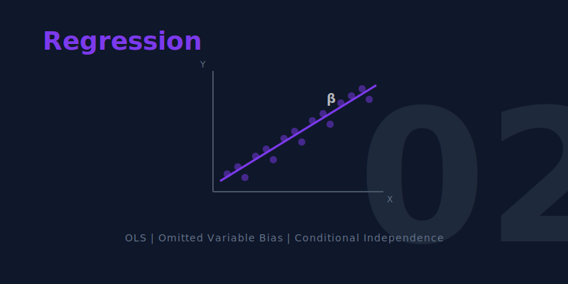

[](https://colab.research.google.com/github/cmg777/intro2causal/blob/main/notebooks_colab/02-regression.ipynb)


::: {.callout-tip}
### Learning Objectives

By the end of this chapter, you will be able to:

- Explain how **regression controls** approximate experimental comparisons
- Write and interpret a **regression model** with treatment and control variables
- State the **Omitted Variables Bias (OVB) formula** and use it to predict the direction of bias
- Distinguish between **short** and **long** regressions
- Understand when adding controls helps --- and when it can make things worse (**bad controls**)
- Apply regression sensitivity analysis to assess the robustness of causal estimates
:::

This chapter introduces regression --- the most widely used tool in the econometrician's toolkit. When randomized experiments are not available, regression lets us approximate an experimental comparison by holding observable characteristics constant.

```{mermaid}
%%| label: fig-roadmap
%%| fig-cap: "Roadmap for Chapter 2"

graph TD
    A["THE QUESTION: Is a private college worth the extra tuition?"]
    B["THE PROBLEM: Private school students differ from public school students"]
    C["THE TOOL: Regression holds observed characteristics constant"]
    D["THE RISK: Omitted Variables Bias when controls are incomplete"]
    E["THE TEST: Sensitivity analysis — do results change with more controls?"]

    A --> B --> C --> D --> E

    style A fill:#3498db,color:#fff
    style B fill:#c0392b,color:#fff
    style C fill:#8e44ad,color:#fff
    style D fill:#e67e22,color:#fff
    style E fill:#2d8659,color:#fff
    linkStyle default stroke:#fff,stroke-width:2px
```


## Is a Private College Worth It?

Students at elite private universities in the United States pay roughly $20,000 more per year in tuition than those at public universities. Graduates of Harvard, Stanford, and Yale earn substantially more than graduates of state schools. But does the private school *cause* higher earnings, or are the students who attend these schools simply different --- smarter, more motivated, better connected --- in ways that would lead to high earnings regardless?

This is the same selection bias problem we met in Chapter 1. But here, we can't run a randomized experiment (Harvard's admissions office won't flip a coin). Instead, we reach for regression.

::: {.callout-note}
### Intuition Builder: Regression as Automated Matching

Think of regression as a matchmaking service. It finds pairs of students who look similar on paper --- same test scores, same family income, same types of schools applied to --- but one went private and the other went public. The regression estimate is like averaging the earnings difference across all these matched pairs.

When the matching is on **all the right variables**, regression approximates what a randomized experiment would show. When important variables are missing, the match is imperfect, and bias creeps in.
:::

To separate the school's causal effect from the student's pre-existing advantages, we need a tool that holds observable characteristics constant. That tool is regression.


## How Regression Works

### The Regression Model

A regression links an outcome ($Y_i$) to a treatment variable ($P_i$) while holding control variables ($X_i$) constant:

$$Y_i = \alpha + \beta P_i + \gamma X_i + e_i$$

where:

- $\alpha$ = intercept (average outcome when $P_i = 0$ and $X_i = 0$)
- $\beta$ = the treatment effect we're after (how much $Y$ changes when $P$ switches from 0 to 1, holding $X$ constant)
- $\gamma$ = effect of the control variable
- $e_i$ = residual (everything else affecting $Y$ that's not in the model)

**OLS (Ordinary Least Squares)** chooses $\alpha$, $\beta$, and $\gamma$ to minimize the sum of squared residuals --- making the model's predictions as close to the actual data as possible.

::: {.callout-note}
### Connection to Chapter 1

In Chapter 1, we regressed outcomes on a treatment dummy with no controls. The coefficient was the difference in means between treated and untreated. Adding controls is the key innovation of Chapter 2: regression holds the controls constant, producing an "other things equal" comparison within groups that share the same control values.
:::


## Seeing OVB with Simulated Data

To understand omitted variables bias, let's create a dataset where we **know the truth** --- because we designed it ourselves. This makes it easy to see when regression gets it right and when it goes wrong.

### The Data-Generating Process

We simulate 1,000 students choosing between private and public colleges:

```{python}
import numpy as np
import pandas as pd
import statsmodels.formula.api as smf

# Set seed so everyone gets the same random numbers
np.random.seed(42)
n = 1000  # number of simulated students

# --- Step 1: Generate ABILITY (the unobserved confounder) ---
# Each student gets a random ability score (mean=50, sd=10)
ability = np.random.normal(50, 10, n)

# --- Step 2: Private school CHOICE depends on ability ---
# Higher ability → higher probability of choosing private school (logistic function)
# Students with ability above 50 have >50% chance; below 50 have <50% chance
prob_private = 1 / (1 + np.exp(-(ability - 50) / 5))
# Flip a coin for each student using their personal probability
private = np.random.binomial(1, prob_private)

# --- Step 3: EARNINGS depend on both private school AND ability ---
# The TRUE causal effect of private school is exactly $5,000
true_effect = 5000
# Base pay ($30,000) + private school bonus + ability bonus + random noise
earnings = (30000
            + true_effect * private
            + 800 * ability
            + np.random.normal(0, 5000, n))

# --- Step 4: Combine into a clean dataset ---
students = pd.DataFrame({
    "earnings": earnings,
    "private": private,
    "ability": ability,
})

students.head(5)
```

::: {.callout-important}
### The Ground Truth

We built this data so that:

- The **true causal effect** of private school is exactly **$5,000**
- **Ability** independently increases earnings AND makes private school more likely
- This creates **selection bias**: private school students earn more partly because they're higher-ability, not just because of the school
:::


### The Short Regression (Omitting Ability)

What happens if we regress earnings on `private` without controlling for ability?

```{python}
#| label: tbl-short
#| tbl-cap: "Short regression: earnings on private school dummy only. The coefficient is biased upward because ability is omitted."

# SHORT regression: omit the confounder (ability)
short_model = smf.ols("earnings ~ private", data=students)
short = short_model.fit()

# Extract key regression results into a clear table
pd.DataFrame({
    "Variable": short.params.index,
    "Coefficient": short.params.round(2).values,
    "Std. Error": short.bse.round(2).values,
    "t-statistic": short.tvalues.round(2).values,
    "p-value": short.pvalues.round(3).values,
})
```

The coefficient on `private` is well above $5,000. This is **omitted variables bias** --- the regression attributes some of ability's effect to the private school dummy because the two are correlated.


### The Long Regression (Including Ability)

Now add ability as a control:

```{python}
#| label: tbl-long
#| tbl-cap: "Long regression: earnings on private school dummy plus ability control. The coefficient is close to the true effect of $5,000."

# LONG regression: include the confounder (ability)
long_model = smf.ols("earnings ~ private + ability", data=students)
long = long_model.fit()

# Extract key regression results into a clear table
pd.DataFrame({
    "Variable": long.params.index,
    "Coefficient": long.params.round(2).values,
    "Std. Error": long.bse.round(2).values,
    "t-statistic": long.tvalues.round(2).values,
    "p-value": long.pvalues.round(3).values,
})
```

With ability controlled, the private school coefficient drops to approximately $5,000 --- close to the true causal effect we built into the data.

::: {.callout-warning}
### Common Misconception: "Just add more controls"

Adding controls helps *only* when the controls are confounders (variables that affect both treatment and outcome). Adding irrelevant variables wastes statistical precision. And adding **bad controls** --- variables that are *caused by* the treatment --- can actually introduce bias. We return to this danger in Chapter 6.
:::


## The OVB Formula

### The Most Important Equation in Econometrics

The relationship between the short and long regression coefficients follows a precise formula:

$$\text{OVB} = \beta^s - \beta^l = \underbrace{\pi_1}_{\text{Relationship between}\atop\text{omitted and treatment}} \times \underbrace{\gamma}_{\text{Effect of omitted}\atop\text{in long regression}}$$

where:

- $\beta^s$ = coefficient on treatment in the **short** regression (fewer controls)
- $\beta^l$ = coefficient on treatment in the **long** regression (more controls)
- $\pi_1$ = coefficient from regressing the **omitted variable** on the **treatment variable**
- $\gamma$ = coefficient on the **omitted variable** in the long regression

::: {.callout-note}
### Intuition Builder: The Missing Ingredient

Think of baking a cake. The recipe calls for flour, sugar, and eggs. If you forget the sugar (omitted variable), the cake will taste different from what you intended. The OVB formula tells you *how much* the taste changes and *in what direction*:

- **$\pi_1$**: How correlated is sugar with the other ingredients you *did* include? (If you always add sugar when you add flour, omitting sugar distorts the flour effect.)
- **$\gamma$**: How much does sugar matter for the final taste? (If sugar is critical, omitting it causes big bias.)
- **OVB = $\pi_1 \times \gamma$**: The bias is the product of these two factors.

If either factor is zero --- the omitted variable is unrelated to treatment, or it doesn't affect the outcome --- there's no bias.
:::

### Verifying the OVB Formula

Let's check that the formula works with our simulated data:

```{python}
#| label: tbl-ovb
#| tbl-cap: "Verifying the OVB formula: the product of the two components exactly equals the difference between short and long regression coefficients."

# --- Step 1: Get the short and long coefficients on "private" ---
beta_short = short.params["private"]
beta_long = long.params["private"]

# --- Step 2: Compute OVB directly (short minus long) ---
ovb_direct = beta_short - beta_long

# --- Step 3: Compute the two components of the OVB formula ---
# pi_1: regress the OMITTED variable (ability) on the TREATMENT (private)
aux_model = smf.ols("ability ~ private", data=students)
auxiliary = aux_model.fit()
pi_1 = auxiliary.params["private"]  # how much ability differs by private status

# gamma: coefficient on ability in the LONG regression
gamma = long.params["ability"]  # how much ability affects earnings

# --- Step 4: OVB from the formula (should match Step 2) ---
ovb_formula = pi_1 * gamma

# --- Display results ---
pd.DataFrame({
    "Component": [
        "Short reg coefficient (private)",
        "Long reg coefficient (private)",
        "OVB (direct: short - long)",
        "pi_1 (ability ~ private)",
        "gamma (ability in long reg)",
        "OVB (formula: pi_1 x gamma)",
    ],
    "Value": [
        round(beta_short),
        round(beta_long),
        round(ovb_direct),
        round(pi_1, 2),
        round(gamma),
        round(ovb_formula),
    ],
})
```

The formula matches. The two components reveal *why* the bias exists:

- **$\pi_1 > 0$**: Higher-ability students are more likely to attend private school
- **$\gamma > 0$**: Higher ability increases earnings
- **OVB = positive $\times$ positive = positive**: The short regression overstates the private school effect

### Predicting the Direction of Bias

Even when we can't observe the omitted variable, the OVB formula lets us **predict the direction of bias** by reasoning about the signs of $\pi_1$ and $\gamma$:

| $\pi_1$ (omitted ↔ treatment) | $\gamma$ (omitted → outcome) | OVB direction |
|:---:|:---:|:---:|
| Positive | Positive | **Upward** bias |
| Positive | Negative | **Downward** bias |
| Negative | Positive | **Downward** bias |
| Negative | Negative | **Upward** bias |

: The sign of OVB depends on the signs of both components {.striped}


## Case Study: The Private College Premium

### Dale and Krueger's Self-Revelation Model

Economists Stacy Dale and Alan Krueger studied the earnings of over 14,000 college students using the **College and Beyond (C&B)** dataset. Their key insight was that the schools students *applied to* reveal information about their ambition and ability. *Note: The C&B dataset is not publicly available, so we discuss Dale and Krueger's findings rather than replicating the analysis in code. The simulated data above demonstrated the same OVB principles that their study applies to real data.*

**The matching strategy**: Compare students who were admitted to the same set of schools but chose to attend different ones. For example, a student admitted to both Harvard and UMass who chose Harvard versus one who chose UMass. Both students were *equally qualified* (admitted to the same schools), but made different enrollment decisions.

**The findings** (paraphrased):

- Without controls, private school graduates earned about **14% more** than public school graduates
- Controlling for Barron's selectivity group reduced this to about **7%**
- Controlling for the specific schools applied to (the "self-revelation" model) reduced it to **close to zero**

::: {.callout-important}
### Key Finding: The Private School Premium is Mostly Selection

Once you compare students who were equally ambitious (applied to similar schools), the earnings advantage of attending an elite private college **largely disappears**. Most of the raw earnings gap reflects who attends private school, not what private school does.

This is a textbook demonstration of OVB at work: when you add the right controls, the treatment effect shrinks dramatically.
:::

### Regression Sensitivity Analysis

The Dale and Krueger results illustrate an important robustness check: **sensitivity analysis**. When adding controls doesn't change the estimate much, we can be more confident that the remaining estimate isn't driven by further omitted variables.

In their data:

- Adding SAT scores, parental income, and demographics **barely changed** the private school coefficient once the self-revelation controls were included
- The OVB formula explains why: conditional on application behavior, private school attendance was **no longer correlated** with these variables ($\pi_1 \approx 0$), so omitting them caused little bias

The Dale and Krueger study succeeded because they controlled for the *right* variables --- pre-treatment characteristics like application behavior. But what happens when researchers control for the *wrong* variables?


## When Controls Go Wrong: Bad Controls

::: {.callout-warning}
### Not All Controls Are Good Controls

A **bad control** is a variable that is *caused by* the treatment. Controlling for it blocks the causal pathway and distorts the estimate.

**Example**: Suppose private school causes students to enter higher-paying occupations. If you control for occupation, you're asking "among people in the same job, do private school grads earn more?" This removes one of the main ways private school helps, leading you to underestimate the true effect.

**Rule of thumb**: Only control for variables determined *before* the treatment was assigned. Variables determined *after* treatment (occupation, graduate degree, industry) are potential outcomes, not confounders.
:::

::: {.callout-note}
### Connection to Chapter 6

Chapter 6 revisits bad controls in the context of returns to schooling. Controlling for occupation when estimating the effect of education is a classic bad-control mistake. The lesson is the same: controls must be *pre-treatment* characteristics, not downstream outcomes.
:::


## How Regression Connects to Every Other Chapter

Regression is not just a standalone method --- it is the **building block** for every other tool in this book:

| Chapter | How Regression Appears |
|:---|:---|
| **Ch 1 (RCTs)** | Difference in means *is* a regression on a treatment dummy |
| **Ch 3 (IV)** | First stage and reduced form are regressions; 2SLS uses predicted values from regression |
| **Ch 4 (RD)** | RD regression controls for a polynomial in the running variable |
| **Ch 5 (DD)** | DD is a regression with group and time fixed effects |
| **Ch 6 (Schooling)** | OLS regression is the baseline; twins FE is a differenced regression |

: Regression is the foundation of all five methods in the book {.striped}


## Historical Perspective: Galton and Yule

### Francis Galton and "Regression to the Mean"

The word "regression" comes from **Sir Francis Galton** (1886), who studied the heights of parents and children. He observed that very tall parents tend to have children who are tall but *less extreme* than their parents --- heights "regress toward the mean." Galton's finding was about a statistical regularity, not causation, but the mathematical tool he developed to describe it became the foundation of modern regression analysis.

### George Udny Yule and Social Statistics

**George Udny Yule** (1899) was among the first to apply regression to social policy questions. He studied the causes of changes in pauperism (poverty) in England, using regression to control for multiple factors simultaneously. Yule's work pioneered the use of regression with multiple control variables --- exactly the approach we've been learning.

Both Galton and Yule worked in an era before causal inference was formalized. Their statistical tools were designed for description and prediction. The causal interpretation of regression --- asking whether $\beta$ represents a causal effect --- is a modern contribution that depends on the assumptions we've discussed (correct controls, no omitted variables).


## Key Takeaways

```{mermaid}
%%| label: fig-concept-map
%%| fig-cap: "How the key concepts of Chapter 2 connect"

graph TD
    Q["Causal question with no experiment available"]
    REG["Regression holds observed variables constant"]
    SHORT["Short regression: fewer controls, more bias risk"]
    LONG["Long regression: more controls, less bias"]
    OVB["OVB = pi x gamma tells you the direction of bias"]
    SENS["Sensitivity analysis: do results change with more controls?"]
    BC["Bad controls: don't control for post-treatment variables"]

    Q --> REG
    REG --> SHORT
    REG --> LONG
    SHORT --> OVB
    LONG --> OVB
    OVB --> SENS
    REG --> BC

    style Q fill:#2c3e50,color:#fff
    style REG fill:#8e44ad,color:#fff
    style OVB fill:#e67e22,color:#fff
    style SENS fill:#2d8659,color:#fff
    style BC fill:#c0392b,color:#fff
    linkStyle default stroke:#fff,stroke-width:2px
```

1. **Regression approximates an experiment** by comparing treated and untreated observations that share the same values of control variables.

2. **OVB = $\pi_1 \times \gamma$** --- the bias from omitting a variable equals the correlation of the omitted variable with treatment times its effect on the outcome.

3. **The direction of OVB can be predicted** by reasoning about the signs of $\pi_1$ and $\gamma$, even when the omitted variable is unobserved.

4. **Sensitivity analysis**: If adding controls doesn't change the estimate much, we gain confidence that remaining omitted variables aren't causing large bias.

5. **Bad controls** (post-treatment variables) should never be included --- they block causal pathways and introduce new bias.

6. **Regression is foundational**: Every method in the book (IV, RD, DD) uses regression as a building block.

7. **The private college premium** largely disappears once you match students by the schools they applied to --- most of the raw gap is selection, not causation.


## Learn by Coding

Copy this code into a Python notebook to reproduce the key results from this chapter.

```python
# ============================================================
# Chapter 2: Regression — Code Cheatsheet
# ============================================================
import numpy as np
import pandas as pd
import statsmodels.formula.api as smf

# --- Step 1: Simulate data where we KNOW the true causal effect ---
np.random.seed(42)
n = 1000
ability = np.random.normal(50, 10, n)
prob_private = 1 / (1 + np.exp(-(ability - 50) / 5))
private = np.random.binomial(1, prob_private)
true_effect = 5000
earnings = 30000 + true_effect * private + 800 * ability + np.random.normal(0, 5000, n)
students = pd.DataFrame({"earnings": earnings, "private": private, "ability": ability})

# --- Step 2: Short regression (omitting ability → biased) ---
short = smf.ols("earnings ~ private", data=students).fit()
print("SHORT regression (biased — omits ability):")
print(f"  Private school coefficient: ${short.params['private']:,.0f}")
print(f"  True effect is $5,000 — the estimate is too high!\n")

# --- Step 3: Long regression (including ability → unbiased) ---
long = smf.ols("earnings ~ private + ability", data=students).fit()
print("LONG regression (controls for ability):")
print(f"  Private school coefficient: ${long.params['private']:,.0f}")
print(f"  Close to the true effect of $5,000\n")

# --- Step 4: Verify the OVB formula ---
ovb_direct = short.params["private"] - long.params["private"]
aux = smf.ols("ability ~ private", data=students).fit()
pi_1 = aux.params["private"]       # relationship: omitted ↔ treatment
gamma = long.params["ability"]      # effect of omitted in long regression
ovb_formula = pi_1 * gamma
print("OVB Formula Verification:")
print(f"  Direct OVB (short - long):  ${ovb_direct:,.0f}")
print(f"  Formula OVB (pi1 x gamma): ${ovb_formula:,.0f}")
print(f"  pi1 = {pi_1:.2f}, gamma = {gamma:.0f}")
```

::: {.callout-tip}
### Try it yourself!
Copy the code above and paste it into [this Google Colab scratchpad](https://colab.research.google.com/notebooks/empty.ipynb) to run it interactively. Modify the variables, change the specifications, and see how results change!
:::


## Exercises

### Multiple Choice Questions

::: {.callout-caution}
### Multiple Choice Questions

1. **What is the main purpose of adding control variables in a regression?**
   a) To increase the R-squared of the model
   b) To hold confounders constant and approximate an experimental comparison
   c) To make the regression coefficients larger
   d) To reduce the sample size needed for significance

2. **Omitted variable bias pushes the treatment coefficient upward when the omitted variable is:**
   a) Negatively correlated with both treatment and outcome
   b) Positively correlated with treatment but negatively correlated with outcome
   c) Positively correlated with both treatment and outcome
   d) Uncorrelated with the treatment variable

3. **A "bad control" is a variable that:**
   a) Has missing values in the dataset
   b) Is measured with error
   c) Is caused by the treatment and should not be controlled for
   d) Is correlated with the error term

4. **According to the OVB formula, the bias is zero when:**
   a) The sample size is very large
   b) The R-squared of the regression is high
   c) Either the omitted variable is uncorrelated with treatment, or it has no effect on the outcome
   d) The treatment variable is binary

5. **Dale and Krueger's study of private colleges found that the earnings premium of private school:**
   a) Was even larger than OLS suggested
   b) Was robust across all specifications
   c) Largely disappeared when controlling for the selectivity of schools students applied to
   d) Only existed for students from wealthy families
:::

### Conceptual Questions

::: {.callout-caution}
### Conceptual Questions

1. **OVB direction**: A study estimates the effect of job training on wages but does not control for prior work experience. Workers with more experience are more likely to receive training AND earn higher wages. Using the OVB formula, predict: is the training coefficient biased upward or downward?

2. **Short vs. long**: You run a regression of test scores on class size (small vs. large) and get a coefficient of -5. When you add family income as a control, the coefficient changes to -2. (a) What is the OVB? (b) What does this imply about the relationship between family income, class size, and test scores?

3. **Bad controls**: A researcher studies whether exercise improves mental health. She controls for body weight in her regression. Why might this be a bad control? (Hint: does exercise affect body weight?)

4. **Sensitivity analysis**: Two studies estimate the effect of class size on test scores. Study A gets -3 without controls and -2.8 with controls. Study B gets -8 without controls and -2 with controls. Which study's results are more credible, and why?

5. **Regression vs. RCT**: A regression of health on exercise, controlling for age, income, and diet, finds that exercise improves health. Under what conditions would this estimate be causal? What could still go wrong?
:::

### Research Tasks

::: {.callout-caution}
### Research Tasks

1. **Change the true effect**: In the simulated data code above, change `true_effect` from 5000 to 0 (no causal effect). Re-run the short and long regressions. Does the short regression still show a positive coefficient? What does this demonstrate about selection bias?

2. **Strengthen the confounder**: Modify the simulation so that ability has a *stronger* relationship with private school choice (change the division by 5 to division by 2 in `prob_private`). How does this change the OVB? Verify with the formula.

3. **Add a second confounder**: Add a `family_income` variable to the simulation that affects both private school choice and earnings. Run the long regression with only ability (omitting family income), then with both. Use the OVB formula to explain the difference.
:::


## Solutions

### Multiple Choice Questions

**MCQ1.** **(b)** Regression controls hold confounders constant, allowing us to compare treated and untreated individuals who share the same values of the control variables. This approximates the "other things equal" comparison we would get from a randomized experiment. Option (a) is a side effect, not the purpose; (c) is false — controls typically reduce the treatment coefficient; (d) is unrelated.

**MCQ2.** **(c)** When the omitted variable is positively correlated with both treatment and outcome, the OVB formula gives: OVB = π₁ × γ, where both π₁ > 0 and γ > 0, so OVB > 0 (upward bias). In our simulation, ability was positively correlated with both private school attendance and earnings, inflating the OLS estimate above the true effect.

**MCQ3.** **(c)** A bad control is a variable that lies on the causal pathway between treatment and outcome — it is *caused by* the treatment. Controlling for it blocks part of the treatment's effect and can introduce bias. For example, controlling for occupation when estimating the effect of education on earnings is problematic because education affects occupation choice.

**MCQ4.** **(c)** The OVB formula is OVB = π₁ × γ. If π₁ = 0 (omitted variable uncorrelated with treatment) OR γ = 0 (omitted variable doesn't affect outcome), the product is zero and there is no bias. Options (a), (b), and (d) are unrelated to the formula.

**MCQ5.** **(c)** Dale and Krueger found that when they controlled for the selectivity of schools students *applied to* (a proxy for unobserved ability and ambition), the private school premium largely disappeared. Students who applied to elite schools but attended public ones earned similar amounts to those who attended the elite schools — suggesting the premium reflected selection, not causation.

### Conceptual Questions

**Q1.** Using the OVB formula: $\pi_1$ = relationship between experience and training (positive, since experienced workers get more training). $\gamma$ = effect of experience on wages in the long regression (positive, since experience raises wages). OVB = positive × positive = **positive**. The training coefficient is biased **upward** --- it overstates the true effect of training because it partly captures the effect of experience.

**Q2.** (a) OVB = short − long = −5 − (−2) = −3. (b) This means family income is negatively correlated with class size (richer families choose smaller classes, $\pi_1 < 0$) and positively correlated with test scores ($\gamma > 0$). The product is negative, so omitting income biases the class size effect *downward* (making it look more negative than it is). Some of the apparent class size effect was really a family income effect.

**Q3.** Body weight is a bad control because exercise *causes* changes in body weight. Controlling for weight blocks one of the pathways through which exercise improves mental health (exercise → lower weight → better mental health). This would lead to understating the total effect of exercise. Only control for variables determined *before* the person started exercising.

**Q4.** Study A is more credible. Its estimate barely changes when controls are added (−3 to −2.8), suggesting the uncontrolled estimate was already close to the causal effect. Study B's estimate drops dramatically (−8 to −2), suggesting the uncontrolled estimate was severely biased. By the OVB formula, the large change means the added controls were highly correlated with class size and with test scores. Study A's stability suggests omitted variables are less of a concern.

**Q5.** The regression estimate is causal if age, income, and diet are the *only* confounders (conditional independence assumption). But unobserved factors could still bias the result: genetics (some people are naturally healthier AND more inclined to exercise), motivation, social support, or pre-existing health conditions. Without random assignment of exercise, we can never be sure we've controlled for everything. This is why the book's methods beyond regression (IV, RD, DD) exist.

### Research Tasks

**R1.**

```{python}
#| label: tbl-sol-zero
#| tbl-cap: "With true effect = 0, the short regression still shows a positive (spurious) coefficient"

# --- Regenerate data with NO causal effect (true_effect = 0) ---
np.random.seed(42)
ability2 = np.random.normal(50, 10, n)

# Same logistic function for private school choice (ability still matters)
# Higher ability → higher probability of choosing private school (logistic function)
prob2 = 1 / (1 + np.exp(-(ability2 - 50) / 5))
private2 = np.random.binomial(1, prob2)

# KEY CHANGE: true effect is 0 — private school does nothing to earnings
earnings2 = 30000 + 0 * private2 + 800 * ability2 + np.random.normal(0, 5000, n)

students2 = pd.DataFrame({
    "earnings": earnings2,
    "private": private2,
    "ability": ability2,
})

# Short regression (biased — omits ability)
short2_model = smf.ols("earnings ~ private", data=students2)
short2 = short2_model.fit()

# Long regression (correct — includes ability)
long2_model = smf.ols("earnings ~ private + ability", data=students2)
long2 = long2_model.fit()

# Compare the two coefficients against the true effect of zero
pd.DataFrame({
    "Regression": ["Short (omit ability)", "Long (include ability)"],
    "Private coefficient": [
        round(short2.params["private"]),
        round(long2.params["private"]),
    ],
    "True effect": [0, 0],
})
```

The short regression shows a positive coefficient even though the true effect is zero. This is pure selection bias --- higher-ability students choose private school AND earn more. The long regression correctly recovers approximately zero.

**R2.**

```{python}
#| label: tbl-sol-strong
#| tbl-cap: "Stronger confounder → larger OVB"

# --- KEY CHANGE: divide by 2 instead of 5 → stronger ability-private link ---
np.random.seed(42)
ability3 = np.random.normal(50, 10, n)

# Steeper logistic: ability has a STRONGER effect on private school choice
# Higher ability → higher probability of choosing private school (logistic function)
prob3 = 1 / (1 + np.exp(-(ability3 - 50) / 2))
private3 = np.random.binomial(1, prob3)

# Earnings: same true effect of $5,000 as before
earnings3 = 30000 + 5000 * private3 + 800 * ability3 + np.random.normal(0, 5000, n)

students3 = pd.DataFrame({
    "earnings": earnings3,
    "private": private3,
    "ability": ability3,
})

# --- Run the three regressions ---
# Short regression (omits ability)
short3_model = smf.ols("earnings ~ private", data=students3)
short3 = short3_model.fit()

# Long regression (includes ability)
long3_model = smf.ols("earnings ~ private + ability", data=students3)
long3 = long3_model.fit()

# Auxiliary regression (ability on private) to get pi_1
aux3_model = smf.ols("ability ~ private", data=students3)
aux3 = aux3_model.fit()

# --- Compute OVB two ways ---
ovb3_direct = round(short3.params["private"] - long3.params["private"])
pi_1_val = round(aux3.params["private"], 2)
gamma_val = round(long3.params["ability"])
ovb3_formula = round(aux3.params["private"] * long3.params["ability"])

# Display comparison
pd.DataFrame({
    "Metric": [
        "Short coef", "Long coef",
        "OVB (direct)", "pi_1",
        "gamma", "OVB (formula)",
    ],
    "Value": [
        round(short3.params["private"]),
        round(long3.params["private"]),
        ovb3_direct, pi_1_val,
        gamma_val, ovb3_formula,
    ],
})
```

With a stronger ability-private link, $\pi_1$ increases and OVB grows. The short regression is now much further from the true effect. This demonstrates that stronger confounders create larger bias.

**R3.**

```{python}
#| label: tbl-sol-twoconf
#| tbl-cap: "Adding a second confounder: family income"

# --- KEY CHANGE: add family_income as a SECOND confounder ---
np.random.seed(42)
ability4 = np.random.normal(50, 10, n)
family_income = np.random.normal(60000, 20000, n)  # mean=$60k, sd=$20k

# Both ability AND income affect private school choice
# Higher ability → higher probability of choosing private school (logistic function)
# Higher family income → also higher probability of choosing private school
ability_part = (ability4 - 50) / 5
income_part = (family_income - 60000) / 20000
prob4 = 1 / (1 + np.exp(-(ability_part + income_part)))
private4 = np.random.binomial(1, prob4)

# Both ability AND income affect earnings (true private effect = $5,000)
earnings4 = (10000
             + 5000 * private4
             + 800 * ability4
             + 0.3 * family_income
             + np.random.normal(0, 5000, n))

students4 = pd.DataFrame({
    "earnings": earnings4,
    "private": private4,
    "ability": ability4,
    "family_income": family_income,
})

# --- Three regressions with increasing controls ---
# Short: no controls at all
r_short_model = smf.ols("earnings ~ private", data=students4)
r_short = r_short_model.fit()

# Medium: control for ability only (still omits family income)
r_medium_model = smf.ols("earnings ~ private + ability", data=students4)
r_medium = r_medium_model.fit()

# Long: control for BOTH ability and family income
r_long_model = smf.ols("earnings ~ private + ability + family_income", data=students4)
r_long = r_long_model.fit()

# Compare all three against the true effect
pd.DataFrame({
    "Regression": [
        "Short (no controls)",
        "Medium (ability only)",
        "Long (ability + income)",
    ],
    "Private coefficient": [
        round(r_short.params["private"]),
        round(r_medium.params["private"]),
        round(r_long.params["private"]),
    ],
    "True effect": [5000, 5000, 5000],
})
```

With two confounders, the short regression is most biased. Adding ability (medium) helps but still omits family income. Adding both controls (long) gets closest to the true $5,000 effect. Each additional relevant control reduces OVB.
