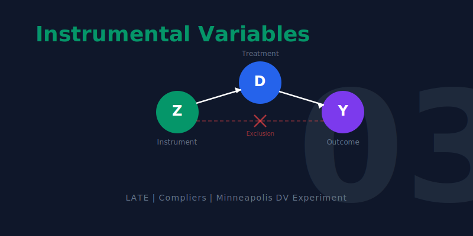

[](https://colab.research.google.com/github/cmg777/intro2causal/blob/main/notebooks_colab/03-instrumental-variables.ipynb)


::: {.callout-tip}
### Learning Objectives

By the end of this chapter, you will be able to:

- Explain why **non-compliance** in experiments creates a gap between assigned and received treatment
- Define the **Local Average Treatment Effect (LATE)** and the IV formula: LATE = reduced form / first stage
- Classify subjects into **complier types**: never-takers, compliers, always-takers, and defiers
- Understand the three requirements for a valid instrument
- Explain how **Two-Stage Least Squares (2SLS)** implements IV in practice
- Recognize **weak instruments** and why they matter
:::

This chapter addresses a common real-world complication: what happens when people don't follow their assigned treatment? The solution --- instrumental variables --- turns partial compliance into a powerful tool for causal inference.

```{mermaid}
%%| label: fig-roadmap
%%| fig-cap: "Roadmap for Chapter 3"

graph TD
    A["THE QUESTION: What if people don't comply with their treatment assignment?"]
    B["THE COMPLIANCE PROBLEM: Assigned treatment differs from received treatment"]
    C["THE IV FRAMEWORK: Use assignment as an instrument for actual treatment"]
    D["THE CASE STUDIES: KIPP lotteries, domestic violence, family size"]
    E["THE TOOLKIT: Two-Stage Least Squares and weak instrument diagnostics"]

    A --> B --> C --> D --> E

    style A fill:#3498db,color:#fff
    style B fill:#e67e22,color:#fff
    style C fill:#c0392b,color:#fff
    style D fill:#8e44ad,color:#fff
    style E fill:#2d8659,color:#fff
    linkStyle default stroke:#64748b,stroke-width:2px
```


## When Experiments Break Down

Randomized experiments are the gold standard for causal inference (Chapter 1). But in practice, experiments rarely go exactly as planned. Police officers may not follow their assigned protocol. Patients may not take their assigned medication. Lottery winners may not enroll in the program they won.

When the treatment people **receive** differs from the treatment they were **assigned**, we face the problem of **non-compliance**. Simply comparing outcomes by *received* treatment reintroduces selection bias, because the choice to comply may be related to the outcome.

### The Minneapolis Domestic Violence Experiment

The **Minneapolis Domestic Violence Experiment (MDVE)** illustrates this perfectly. In the early 1980s, researchers randomly assigned police officers responding to domestic violence calls to one of three actions:

- **Arrest** the suspect
- **Advise** the couple (counseling/mediation)
- **Separate** them (remove suspect for 8 hours)

The goal was to learn which response best prevented future violence. But police officers didn't always follow their assignment.

```{python}
import pandas as pd
import statsmodels.formula.api as smf

# --- Data source ---
DATA = "https://raw.githubusercontent.com/cmg777/intro2causal/main/data/"

# Load clean MDVE data: each row is one domestic violence case
# 'assigned' = what police were told to do; 'delivered' = what they actually did
mdve = pd.read_csv(DATA + "ch3/mdve_clean.csv")
mdve.head(3)
```

```{python}
#| label: tbl-crosstab
#| tbl-cap: "Cross-tabulation of assigned vs. delivered police response in the MDVE. Row percentages show compliance rates."

# Cross-tabulate: what treatment was assigned vs. what was actually delivered?
ct = pd.crosstab(mdve["assigned"], mdve["delivered"], margins=True, margins_name="Total")
ct = ct[["Arrest", "Advise", "Separate", "Total"]]  # reorder columns

# Show counts
ct
```

The cross-tabulation reveals a striking pattern: the diagonal (where assigned = delivered) is much larger for arrest than for advise or separate. Officers followed arrest orders almost perfectly but frequently deviated from the other assignments --- usually by arresting instead. Let's quantify these compliance rates:

```{python}
#| label: tbl-compliance
#| tbl-cap: "Compliance rates by assignment group. Officers almost always followed arrest orders but frequently deviated from advise/separate assignments."

# Compute compliance rate for each assignment group
# Loop through each assignment type and count how many officers followed orders
rows = []
for group in ["Arrest", "Advise", "Separate"]:
    group_data = mdve[mdve["assigned"] == group]
    complied = (group_data["delivered"] == group).sum()
    # Calculate the percentage of officers who complied
    rate = round(100 * complied / len(group_data), 1)
    rows.append({
        "Assigned": group,
        "N": len(group_data),
        "Complied": complied,
        "Compliance Rate": str(rate) + "%",
    })

pd.DataFrame(rows)
```

::: {.callout-warning}
### Asymmetric compliance

Officers followed arrest orders **99% of the time** but deviated from advise and separate assignments much more often (78% and 73%). When they deviated, they almost always chose to arrest instead --- likely because the suspect was particularly aggressive. This means the group that *actually received* arrest includes both randomly assigned arrests and the most dangerous cases from other assignments. Comparing outcomes by delivered treatment would be biased.
:::

::: {.callout-note}
### Intuition Builder: IV as a Chain Reaction

Think of IV as tracing a chain of dominoes:

- **Domino 1 (Instrument → Treatment)**: The random assignment form *nudges* the police officer's action. This is the **first stage**.
- **Domino 2 (Treatment → Outcome)**: The police action *affects* future violence. This is the **causal effect** we want.
- **What we observe**: The assignment form's effect on future violence — the **reduced form** (Domino 1 × Domino 2).
- **The IV trick**: Divide the reduced form by the first stage to isolate Domino 2 alone.

The instrument must push the first domino (relevance) and must *only* work through the chain (exclusion restriction). If the instrument directly tips the last domino without going through treatment, the chain is broken.
:::


## The IV Framework

### The Core Idea

Instrumental variables solves the compliance problem by using the **random assignment** (the instrument) instead of the actual treatment to estimate causal effects. The logic is a chain reaction:

```{mermaid}
%%| label: fig-iv-chain
%%| fig-cap: "The IV chain reaction: the instrument affects the outcome only through its effect on treatment."

graph LR
    Z["Instrument (Z): Random assignment"]
    D["Treatment (D): Actual police action"]
    Y["Outcome (Y): Future violence"]

    Z -->|"First stage"| D
    D -->|"Causal effect"| Y
    Z -.->|"Reduced form"| Y

    style Z fill:#8e44ad,color:#fff
    style D fill:#3498db,color:#fff
    style Y fill:#2d8659,color:#fff
    linkStyle default stroke:#64748b,stroke-width:2px
```

The **LATE (Local Average Treatment Effect)** combines these two pieces:

$$\lambda_{LATE} = \frac{\rho}{\phi} = \frac{\text{Reduced form (effect of } Z \text{ on } Y)}{\text{First stage (effect of } Z \text{ on } D)}$$

where $\rho$ (rho) is the reduced-form effect of the instrument on the outcome, and $\phi$ (phi) is the first-stage effect of the instrument on the treatment.

### Three Requirements for a Valid Instrument

1. **Relevance**: The instrument must affect the treatment. In the MDVE, random assignment must actually change what police do (first stage $\neq$ 0).

2. **Independence**: The instrument must be randomly assigned (or "as good as random"). The MDVE's randomization satisfies this.

3. **Exclusion restriction**: The instrument affects the outcome **only through** the treatment. The random assignment shouldn't directly affect recidivism except through the police action taken.

### Applying the IV Formula to the MDVE

Let's compute the IV estimate step by step using the MDVE data. We simplify to a binary comparison: **arrest** ($Z = 0$) vs. **coddle** (advise or separate, $Z = 1$).

```{python}
#| label: tbl-iv-recipe
#| tbl-cap: "The IV recipe applied to the MDVE: reduced form divided by first stage gives the LATE."

# Create binary variables for the IV calculation
# Z = instrument: assigned to coddle (advise or separate) vs. arrest
mdve["z_coddle"] = (mdve["assigned"] != "Arrest").astype(int)

# D = treatment: actually coddled (advise or separate) vs. arrested
mdve["d_coddle"] = (mdve["delivered"] != "Arrest").astype(int)

# Step 1: FIRST STAGE — does assignment (Z) affect actual treatment (D)?
# Compute the mean of D for each value of Z
# .loc[] selects rows where the condition is true, then takes the mean of d_coddle
fs_coddle = mdve.loc[mdve["z_coddle"] == 1, "d_coddle"].mean()
fs_arrest = mdve.loc[mdve["z_coddle"] == 0, "d_coddle"].mean()
first_stage = fs_coddle - fs_arrest

# Step 2: REDUCED FORM — does assignment (Z) affect recidivism (Y)?
# (We don't have recidivism in this clean dataset, so we use published numbers)
reduced_form = 0.211 - 0.097  # from the original study

# Step 3: LATE = reduced form / first stage
# This isolates the causal effect for compliers
late = reduced_form / first_stage

pd.DataFrame({
    "Step": ["First stage (coddled if assigned coddle)", "First stage (coddled if assigned arrest)",
             "First stage (difference)", "Reduced form (recidivism difference)", "LATE = RF / FS"],
    "Value": [round(fs_coddle, 3), round(fs_arrest, 3), round(first_stage, 3),
              round(reduced_form, 3), round(late, 3)],
})
```

::: {.callout-important}
### Key finding

Coddling (advise/separate) **increases recidivism by 14.5 percentage points** among compliers --- those officers who followed their assignment. This is much larger than the naive comparison of delivered treatments (8.7 pp) would suggest, because the naive estimate is contaminated by selection bias.
:::

::: {.callout-warning}
### Common Misconception: LATE is not the Average Treatment Effect

The IV estimate of 14.5 pp applies **only to compliers** --- officers who followed whatever their assignment form said. It tells us nothing about:

- **Always-takers** (officers who always arrest, regardless of assignment) --- they may be more experienced and arrest more effectively
- **Never-takers** (hypothetical officers who never arrest) --- they don't exist in this data

Different instruments identify effects for *different subpopulations*. A KIPP lottery identifies effects for families who participate in the lottery; a twin birth identifies effects for families on the margin of having another child. The "L" in LATE stands for "local" --- local to the population whose behavior is changed by the instrument.
:::


## The Four Types of Subjects

In any IV setting, subjects fall into four categories based on how they would respond to the instrument:

| Type | Behavior | Role in IV |
|:---|:---|:---|
| **Complier** | Does what they're told — treatment follows assignment | The population LATE estimates effects for |
| **Always-taker** | Always gets treatment regardless of assignment | Unaffected by instrument; IV is silent |
| **Never-taker** | Never gets treatment regardless of assignment | Unaffected by instrument; IV is silent |
| **Defier** | Does the opposite of assignment | Assumed not to exist (monotonicity) |

: The four complier types in an IV framework {.striped}

::: {.callout-note}
### LATE is the effect for compliers only

The IV estimate tells us the causal effect **specifically for compliers** --- people whose treatment was determined by the instrument. It does not necessarily apply to always-takers or never-takers. In the MDVE, compliers are officers who followed whatever assignment they received. The LATE tells us what happens when *these particular officers* arrest vs. coddle.
:::


## Case Study: KIPP Charter School Lotteries

The **Knowledge Is Power Program (KIPP)** is a network of charter schools with extended school days and a "no excuses" discipline culture. KIPP Lynn in Massachusetts became oversubscribed after 2005, so admission was decided by lottery --- creating a natural instrument.

**The IV components:**

- **Instrument ($Z$)**: Winning the KIPP lottery
- **Treatment ($D$)**: Actually attending KIPP
- **Outcome ($Y$)**: Math test scores

**Results:**

| Component | Estimate |
|:---|:---|
| First stage (lottery → attendance) | 0.741 (74.1% of winners attended) |
| Reduced form (lottery → math scores) | +0.355 standard deviations |
| **LATE** (attendance → math scores) | **+0.48 standard deviations** |

: IV estimates of KIPP attendance effects on math scores {.striped}

A half standard deviation improvement in math in one year is a remarkable effect. Balance checks confirmed that lottery winners and losers looked similar at baseline, supporting the validity of the instrument.

This lottery-based evidence has been influential in education policy. Charter school supporters cite KIPP's results as proof that intensive, structured programs can close achievement gaps for disadvantaged students. Critics note that LATE applies only to lottery compliers (motivated families who applied), and the effect might not generalize to all students.

The KIPP lottery gave us a clean instrument for school attendance. Our next case study finds instruments in an even more surprising place: the biology of twin births and the psychology of gender preferences.


## Case Study: Does Family Size Reduce Children's Education?

The quantity-quality tradeoff hypothesis suggests that larger families dilute parental investment, reducing each child's education. The naive correlation supports this: children with more siblings get less schooling (-0.15 years per sibling in OLS).

But is this causal? Less-educated parents tend to have more children *and* less-educated children. Two clever instruments address this:

**Twin births**: When a second birth produces twins instead of a singleton, family size increases by one --- essentially at random. First stage: +0.32 children.

**Sibling sex composition**: Parents with same-sex first two children are more likely to have a third (seeking gender balance). First stage: +0.08 children.

**Results**: Both instruments show a reduced form of approximately **zero** --- no effect of family size on children's education. The 2SLS estimate using both instruments is +0.24 (SE: 0.13), completely reversing the negative OLS estimate.

::: {.callout-important}
### Selection bias explains the naive correlation

The strong negative OLS relationship between family size and education appears to be entirely driven by selection bias. When we use instruments that generate exogenous variation in family size, the effect vanishes. Less-educated parents have more children AND less-educated children --- but one does not cause the other.
:::

This finding has major **policy implications**. For decades, governments promoted smaller families based on the belief that fewer children means more investment per child (the "quantity-quality tradeoff"). China's one-child policy and India's forced sterilization programs were partly justified by this logic. The IV evidence suggests the tradeoff is much weaker than previously thought --- the naive correlation was driven by confounders, not causation.


### When to Use IV vs. Other Methods

| Feature | RCT (Chapter 1) | OLS with Controls | IV / 2SLS (This Chapter) |
|:---|:---|:---|:---|
| **Requires** | Random assignment of treatment | Observable confounders only | A valid instrument |
| **Handles** | All confounders (observed + unobserved) | Only observed confounders | Unobserved confounders (via instrument) |
| **Estimates** | ATE (average for everyone) | Conditional association | LATE (average for compliers) |
| **Weakness** | Expensive, often impractical | Fails with unobserved confounders | Needs strong, valid instrument |

: When to use which method {.striped}


## Two-Stage Least Squares (2SLS)

The IV formula $\lambda = \rho / \phi$ works for a single binary instrument. In practice, we often have multiple instruments, covariates, or non-binary treatments. **Two-Stage Least Squares** handles all of these.

**Stage 1 (First Stage):** Predict treatment using the instrument(s)
$$D_i = \alpha_1 + \phi Z_i + \gamma_1 X_i + e_{1i}$$

**Stage 2 (Second Stage):** Regress the outcome on the predicted treatment
$$Y_i = \alpha_2 + \lambda_{2SLS} \hat{D}_i + \gamma_2 X_i + e_{2i}$$

::: {.callout-warning}
### Never run 2SLS by hand

If you manually run two separate regressions and use fitted values from the first in the second, you will get the right coefficient but **wrong standard errors**. Always use dedicated IV software that computes correct standard errors automatically.
:::

### 2SLS in Python

In Python, the `linearmodels` library provides `IV2SLS`. The formula syntax uses **square brackets** to indicate the endogenous variable and its instrument:

```
"outcome ~ exogenous_controls + [endogenous_variable ~ instrument]"
```

Here is how you would run 2SLS for the KIPP charter school example (using hypothetical data to illustrate the syntax):

```
# Syntax demonstration (not run — KIPP data is not publicly available)
from linearmodels.iv import IV2SLS

result = IV2SLS.from_formula(
    "math_score ~ 1 + [attended_kipp ~ won_lottery]",
    data=kipp_data,
).fit(cov_type="robust")

# The key parts:
#   math_score           = outcome (Y)
#   attended_kipp        = endogenous treatment (D) — inside [ ]
#   won_lottery          = instrument (Z) — after the ~ inside [ ]
#   1                    = intercept (constant)
#   cov_type="robust"    = heteroskedasticity-robust standard errors
```

::: {.callout-note}
### Why no live IV code in this chapter?

The KIPP and family size datasets used in this chapter's case studies are not publicly available. The syntax block above shows how you *would* run 2SLS in Python. Chapter 6 provides a full working IV analysis using quarter-of-birth data, where you will see `IV2SLS` in action with real data.
:::


## Weak Instruments

An instrument is **weak** when it has only a small effect on the treatment (small first stage). Weak instruments cause:

- 2SLS estimates biased toward OLS
- Misleading confidence intervals
- Unreliable inference

::: {.callout-tip}
### The F > 10 rule of thumb

Test the joint significance of instruments in the first-stage regression. If the **F-statistic is below 10**, the instruments may be too weak. When in doubt, check the reduced form --- if the instrument's direct effect on the outcome isn't visible, the IV estimate is likely unreliable.
:::

::: {.callout-warning}
### Common Misconception: More data doesn't fix weak instruments

Unlike standard estimation, where larger samples give more precise estimates, **weak-instrument bias does not vanish with more data**. Even with a million observations, if the first-stage F-statistic is below 10, the 2SLS estimate can be severely biased toward OLS. The solution is a stronger instrument, not a bigger sample.
:::

::: {.callout-note}
### Connection to Chapters 1 and 4

IV connects the methods from other chapters:

- **Chapter 1 (RCTs)**: When an experiment has non-compliance (some people don't take their assigned treatment), the random assignment serves as an instrument. The ITT (intent-to-treat) effect is the reduced form; dividing by the compliance rate gives the LATE.
- **Chapter 4 (RD)**: A **fuzzy RD** is an IV problem where the cutoff dummy serves as the instrument. The first stage is the jump in treatment probability at the cutoff; the reduced form is the jump in outcomes. LATE = reduced form / first stage.
:::


## Historical Perspective: Philip Wright

The identification problem --- how to separate supply from demand when both are determined simultaneously --- was solved by **Philip G. Wright** in 1928. In an appendix to his book on tariffs, Wright introduced "external factors" (what we now call instruments) that shift one curve without affecting the other.

Wright's innovation lay dormant for decades before being rediscovered. His son **Sewall Wright**, a geneticist, contributed the mathematical framework of path analysis. Together, they pioneered the idea that researchers must find sources of variation that affect one part of a system without directly affecting the outcome of interest.


## Key Takeaways

The following concept map shows how the key ideas in this chapter connect --- from the problem of non-compliance, through the IV framework of first stage and reduced form, to the LATE estimand and its practical implementation via 2SLS.

```{mermaid}
%%| label: fig-concept-map
%%| fig-cap: "How the key concepts of Chapter 3 connect"

graph TD
    Q["Non-compliance in experiments"]
    Z["Instrument: random assignment"]
    FS["First stage: does Z affect D?"]
    RF["Reduced form: does Z affect Y?"]
    LATE["LATE = reduced form / first stage"]
    CT["Complier types determine who LATE applies to"]
    TSLS["Two-Stage Least Squares: practical implementation"]

    Q --> Z --> FS
    Z --> RF
    FS --> LATE
    RF --> LATE
    LATE --> CT
    LATE --> TSLS

    style Q fill:#c0392b,color:#fff
    style Z fill:#8e44ad,color:#fff
    style FS fill:#3498db,color:#fff
    style RF fill:#3498db,color:#fff
    style LATE fill:#2d8659,color:#fff
    style CT fill:#e67e22,color:#fff
    style TSLS fill:#475569,color:#fff
    linkStyle default stroke:#64748b,stroke-width:2px
```

1. **Non-compliance** is common in experiments. Comparing outcomes by *received* treatment reintroduces selection bias.

2. **Instrumental variables** uses random assignment as an instrument to recover causal effects despite non-compliance.

3. **LATE = reduced form / first stage** --- the ratio of the instrument's effect on the outcome to its effect on treatment.

4. **LATE applies to compliers only** --- the subpopulation whose treatment was actually changed by the instrument.

5. **Three requirements**: relevance (first stage), independence (random assignment), and exclusion restriction (single channel).

6. **2SLS** is the practical implementation. Always use dedicated software for correct standard errors.

7. **Weak instruments** (F < 10) produce unreliable estimates. Always check the first stage.


## Learn by Coding

Copy this code into a Python notebook to reproduce the key results from this chapter.

```python
# ============================================================
# Chapter 3: Instrumental Variables — Code Cheatsheet
# ============================================================
import pandas as pd
import statsmodels.formula.api as smf

DATA = "https://raw.githubusercontent.com/cmg777/intro2causal/main/data/"

# --- Step 1: Load Minneapolis Domestic Violence Experiment data ---
mdve = pd.read_csv(DATA + "ch3/mdve_clean.csv")
print("MDVE data:", mdve.shape[0], "cases")
print(mdve[["assigned", "delivered", "recidivism"]].head())

# --- Step 2: Compliance — did officers follow their assignment? ---
print("\nAssigned vs. delivered treatment:")
print(pd.crosstab(mdve["assigned"], mdve["delivered"], margins=True))

# --- Step 3: Create binary variables (arrest vs. coddle) ---
mdve["z_coddle"] = (mdve["assigned"] != "Arrest").astype(int)   # instrument
mdve["d_coddle"] = (mdve["delivered"] != "Arrest").astype(int)   # treatment

# --- Step 4: First stage (does assignment change actual treatment?) ---
fs = smf.ols("d_coddle ~ z_coddle", data=mdve).fit(cov_type="HC1")
first_stage = fs.params["z_coddle"]
print(f"\nFirst stage: {first_stage:.3f}")
print("  (Fraction who comply with coddle assignment)")

# --- Step 5: Reduced form (does assignment affect recidivism?) ---
rf = smf.ols("recidivism ~ z_coddle", data=mdve).fit(cov_type="HC1")
reduced_form = rf.params["z_coddle"]
print(f"\nReduced form: {reduced_form:.3f}")
print("  (Effect of coddle ASSIGNMENT on recidivism)")

# --- Step 6: IV estimate (LATE = reduced form / first stage) ---
late = reduced_form / first_stage
print(f"\nLATE = {reduced_form:.3f} / {first_stage:.3f} = {late:.3f}")
print("  Coddling increases recidivism by ~15 pp among compliers")
```

::: {.callout-tip}
### Try it yourself!
Copy the code above and paste it into [this Google Colab scratchpad](https://colab.research.google.com/notebooks/empty.ipynb) to run it interactively. Modify the variables, change the specifications, and see how results change!
:::


## Exercises

### Multiple Choice Questions

::: {.callout-caution}
### Multiple Choice Questions

1. **What problem does instrumental variables (IV) solve?**
   a) Small sample sizes in randomized experiments
   b) Non-compliance — when the treatment received differs from the treatment assigned
   c) Measurement error in the outcome variable
   d) Missing data in the control variables

2. **LATE stands for Local Average Treatment Effect. "Local" means:**
   a) The effect applies only to a specific geographic area
   b) The effect applies only to compliers — people whose treatment status is changed by the instrument
   c) The effect is estimated using local polynomial regression
   d) The effect applies only to the time period studied

3. **Which of the following is NOT a requirement for a valid instrument?**
   a) The instrument must affect the treatment (relevance)
   b) The instrument must be randomly assigned or "as good as random" (independence)
   c) The instrument must directly affect the outcome (direct effect)
   d) The instrument must affect the outcome only through the treatment (exclusion restriction)

4. **In the Minneapolis Domestic Violence Experiment, the instrument was:**
   a) Whether the suspect was actually arrested
   b) The random assignment form given to the officer
   c) The severity of the domestic violence incident
   d) The officer's years of experience

5. **A "complier" in IV terminology is someone who:**
   a) Always receives the treatment regardless of assignment
   b) Never receives the treatment regardless of assignment
   c) Follows whatever their assignment says — treatment if assigned to treatment, control if assigned to control
   d) Does the opposite of their assignment
:::

### Conceptual Questions

::: {.callout-caution}
### Conceptual Questions

1. **Classifying complier types**: In a medical trial, patients are randomly assigned to receive a new drug or placebo, but some placebo patients obtain the drug on their own, and some drug patients refuse to take it. (a) Who are the always-takers? (b) Who are the compliers? (c) If 80% of the drug group takes the drug and 10% of the placebo group obtains it, what is the first stage?

2. **Computing LATE**: Using the MDVE numbers: first stage = 0.786, reduced form = 0.114. (a) Compute the LATE. (b) Why is this larger than the naive comparison of delivered treatments (0.087)? (c) What does "selection into treatment" mean in this context?

3. **Exclusion restriction**: A researcher uses rainfall as an instrument for agricultural output to estimate the effect of output on conflict. What could violate the exclusion restriction?

4. **Why LATE is local**: Using the MDVE context, explain why the IV estimate applies only to compliers. What can we say (or not say) about the effect of arrest on always-takers --- those suspects who would be arrested regardless of what the assignment form said?

5. **Monotonicity**: The IV framework assumes there are no "defiers" (people who do the opposite of their assignment). In the MDVE, a defier would be an officer who arrests when told to coddle and coddles when told to arrest. Why is this assumption reasonable in the MDVE context? Can you think of a setting where it might fail?
:::

### Research Tasks

::: {.callout-caution}
### Research Tasks

1. **Compliance by assignment group**: Using `mdve_clean.csv`, compute the compliance rate separately for each of the three assignment groups (Arrest, Advise, Separate). Which group has the highest compliance? What does this asymmetry suggest about how police exercise discretion?

2. **Binary vs. multi-category first stage**: Using `mdve_clean.csv`, compute the first stage two ways: (a) using the binary "arrest vs. coddle" indicator, and (b) using all three assignment categories in a cross-tabulation. Compare the results and explain which approach is simpler for an IV analysis.

3. **Cross-over patterns**: Using `mdve_clean.csv`, among officers who deviated from their assignment, which direction did they most commonly cross over (e.g., from advise to arrest, or from separate to arrest)? What does this pattern suggest about officer behavior?
:::


## Solutions

### Multiple Choice Questions

**MCQ1.** **(b)** IV addresses the problem of non-compliance (endogeneity): when people don't follow their assigned treatment, comparing outcomes by *received* treatment reintroduces selection bias. IV uses the random assignment (instrument) instead of the actual treatment to estimate causal effects. Options (a) and (d) are different problems; (c) is addressed by different techniques.

**MCQ2.** **(b)** "Local" means the IV estimate applies specifically to compliers — the subpopulation whose treatment status is changed by the instrument. IV tells us nothing about always-takers or never-takers. Different instruments identify effects for different complier populations, which is why LATE estimates can vary across studies of the same treatment.

**MCQ3.** **(c)** This is the opposite of what's required. The exclusion restriction (option d) requires that the instrument does NOT directly affect the outcome — it must work *only through* the treatment. If the instrument had a direct effect on the outcome, the IV estimate would be biased. Options (a), (b), and (d) are all genuine requirements.

**MCQ4.** **(b)** The instrument is the random assignment form — what the officer was *told* to do, not what they actually did. The key distinction is between the instrument (assignment, Z) and the treatment (delivered action, D). Option (a) is the treatment variable, not the instrument; (c) and (d) are potential confounders.

**MCQ5.** **(c)** A complier follows their assignment in both directions: they take treatment when assigned to it AND avoid treatment when assigned to control. In the MDVE context, a complier is an officer who arrests when told to arrest and counsels when told to counsel. Option (a) describes an always-taker; (b) describes a never-taker; (d) describes a defier.

### Conceptual Questions

**Q1.** (a) Always-takers are patients who take the drug regardless of assignment --- those in the placebo group who obtain it on their own. (b) Compliers are patients who follow their assignment: they take the drug when assigned to drug, and don't take it when assigned to placebo. (c) The first stage is: $P(\text{take drug} | \text{assigned drug}) - P(\text{take drug} | \text{assigned placebo}) = 0.80 - 0.10 = 0.70$.

**Q2.** (a) LATE = 0.114 / 0.786 = 0.145 (14.5 percentage points). (b) The naive comparison (0.087) is smaller because it is contaminated by selection bias: officers who deviated from their "coddle" assignment to arrest instead were responding to more violent suspects. These suspects would have reoffended at higher rates regardless. The naive estimate mixes the causal effect with this selection. (c) "Selection into treatment" means that the officers who chose to arrest (despite being told to coddle) were systematically selecting the most dangerous cases, making the arrested group look worse than it would under random assignment.

**Q3.** Rainfall could affect conflict through channels other than agricultural output. For example: (a) heavy rain may flood roads and prevent armed groups from mobilizing, reducing conflict directly; (b) drought may force migration, creating social tensions unrelated to agricultural output; (c) rainfall affects water availability for drinking and sanitation, which could spark resource conflicts. Any of these channels would violate the exclusion restriction because rainfall would affect conflict independently of its effect on agricultural output.

**Q4.** The IV estimate is a Local Average Treatment Effect --- it applies specifically to compliers, whose treatment was changed by the instrument. In the MDVE, compliers are officers who followed their random assignment. For always-takers (officers who arrested regardless of what the form said), the instrument didn't change their behavior, so IV cannot tell us anything about the treatment effect for them. Always-takers may respond differently to arrest --- perhaps they are more experienced officers who arrest only when necessary, making arrest more effective for their cases. But IV is silent on this.

### Research Tasks

**R1.**

```{python}
#| label: tbl-sol-compliance
#| tbl-cap: "Compliance rates by assignment group"

import pandas as pd

mdve = pd.read_csv(DATA + "ch3/mdve_clean.csv")

# Compute compliance rate: fraction who received their assigned treatment
# Loop through each assignment type and count how many officers followed orders
rows = []
for group in ["Arrest", "Advise", "Separate"]:
    group_data = mdve[mdve["assigned"] == group]
    complied = (group_data["delivered"] == group).sum()
    # Calculate the percentage of officers who complied
    rate = round(100 * complied / len(group_data), 1)
    rows.append({
        "Assigned": group,
        "N": len(group_data),
        "Complied": complied,
        "Compliance rate": str(rate) + "%",
    })

pd.DataFrame(rows)
```

Arrest has the highest compliance (99%). Officers almost always arrest when told to, but frequently deviate from advise (78%) and separate (73%) assignments --- usually by arresting instead. This suggests officers exercise discretion toward arrest when they perceive danger, which is why comparing by *delivered* treatment introduces selection bias.

**R2.**

```{python}
#| label: tbl-sol-firststage
#| tbl-cap: "First stage: binary vs. multi-category"

# Binary approach: arrest (Z=0) vs. coddle (Z=1)
mdve["z_coddle"] = (mdve["assigned"] != "Arrest").astype(int)
mdve["d_coddle"] = (mdve["delivered"] != "Arrest").astype(int)

# Compute the fraction coddled in each assignment group
fs_binary = mdve.groupby("z_coddle")["d_coddle"].mean()
print("Binary first stage:")
print("  P(coddled | assigned coddle) = " + str(round(fs_binary[1], 3)))
print("  P(coddled | assigned arrest) = " + str(round(fs_binary[0], 3)))
print("  Difference = " + str(round(fs_binary[1] - fs_binary[0], 3)))

# Multi-category: full cross-tabulation
print("\nFull cross-tabulation:")
ct = pd.crosstab(mdve["assigned"], mdve["delivered"], normalize="index").round(3)
ct
```

The binary approach gives a clean first stage of ~0.786. The multi-category cross-tab provides more detail but is harder to use in a standard IV framework because IV requires a single treatment variable. The binary simplification (arrest vs. everything else) is standard practice when the research question is "does arrest reduce recidivism compared to alternative responses."

**Q5.** In the MDVE, monotonicity is reasonable: it's hard to imagine an officer who would arrest when told to coddle but coddle when told to arrest. Officers deviate *toward* arrest (the more cautious action), not away from it. Monotonicity might fail in settings where the instrument triggers opposite reactions in different subgroups --- for example, a mandatory tutoring assignment where some students rebel against being told to attend (defiers who skip when assigned) but voluntarily attend when not assigned.

**R3.**

```{python}
#| label: tbl-sol-crossover
#| tbl-cap: "Cross-over patterns: where do deviating officers go?"

# Among cases where assignment != delivery, what are the patterns?
deviators = mdve[mdve["assigned"] != mdve["delivered"]]

crossover = pd.crosstab(deviators["assigned"], deviators["delivered"])
crossover
```

The dominant pattern is cross-over from advise or separate **toward arrest**. Very few officers cross from arrest to another action. This asymmetry reflects officers exercising discretion toward the more protective response when they perceive the situation as dangerous --- exactly the selection bias that makes naive comparisons misleading.
