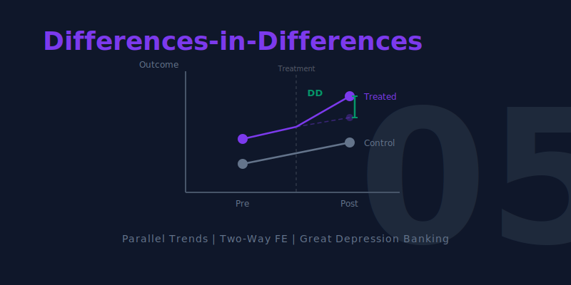

[](https://colab.research.google.com/github/cmg777/intro2causal/blob/main/notebooks_colab/05-differences-in-differences.ipynb)


::: {.callout-tip}
### Learning Objectives

By the end of this chapter, you will be able to:

- Explain the **difference-in-differences (DD)** strategy for causal inference
- Construct a **counterfactual** using a control group's trajectory
- State and assess the **parallel trends assumption**
- Estimate DD effects using **regression with fixed effects**
- Understand why **state-specific trends**, **weighting**, and **clustered standard errors** matter
- Interpret DD results from two case studies: banking crises and drinking age policy
:::

This chapter introduces a method for settings where treatment is not randomly assigned but varies across groups and over time. By comparing *changes* rather than levels, DD removes time-invariant confounders.

```{mermaid}
%%| label: fig-roadmap
%%| fig-cap: "Roadmap for Chapter 5"

graph TD
    A["THE QUESTION: Did Fed intervention save banks during the Great Depression?"]
    B["THE INSIGHT: Compare changes in treated vs. control groups over time"]
    C["THE ASSUMPTION: Without treatment, both groups would have followed parallel trends"]
    D["THE TOOL: Regression with state and year fixed effects"]
    E["THE EVIDENCE: Banking crises and drinking age mortality"]

    A --> B --> C --> D --> E

    style A fill:#3498db,color:#fff
    style B fill:#e67e22,color:#fff
    style C fill:#c0392b,color:#fff
    style D fill:#8e44ad,color:#fff
    style E fill:#2d8659,color:#fff
    linkStyle default stroke:#64748b,stroke-width:2px
```


## Key Concepts and Definitions

**Difference-in-Differences (DD):** A causal inference method that compares the change in outcomes over time for a treated group to the change for an untreated control group. By differencing twice --- across groups and across time --- DD removes both fixed group differences and common time trends.

::: {.callout-tip collapse="true" appearance="simple" title="Example"}
Comparing the change in bank survival in the 6th Fed District (intervention) to the change in the 8th District (no intervention) during the Great Depression isolates the causal effect of Fed policy.
:::

::: {.callout-note collapse="true" appearance="simple" title="Analogy"}
Like a diet experiment where you and your friend both weigh yourselves before and after the holidays. You dieted; your friend did not. The difference in your weight changes (not your weight levels) reveals whether the diet worked.
:::

**Parallel Trends Assumption:** The critical identifying assumption of DD: in the absence of treatment, the treated and control groups would have followed the same trajectory over time. Groups can start at different levels, but their changes must be similar.

::: {.callout-tip collapse="true" appearance="simple" title="Example"}
The assumption requires that, without the Fed's intervention, the 6th District would have lost banks at the same rate as the 8th District.
:::

::: {.callout-note collapse="true" appearance="simple" title="Analogy"}
Like two runners on parallel tracks. They can start at different positions, but without any intervention, they would run at the same pace. If one suddenly speeds up, the intervention (treatment) must have caused it.
:::

**Counterfactual:** The unobserved outcome that would have occurred in the absence of treatment. In DD, the control group's trajectory is used to construct the counterfactual for the treated group.

::: {.callout-tip collapse="true" appearance="simple" title="Example"}
The dashed line in the Mississippi banking chart shows how many banks the 6th District would have had if it had followed the 8th District's decline --- that is the counterfactual.
:::

::: {.callout-note collapse="true" appearance="simple" title="Analogy"}
Like an alternate timeline in a movie. You cannot observe what would have happened if the hero had made a different choice, but you can estimate it using information from other characters who faced similar circumstances.
:::

**Treatment Group vs. Control Group:** The treatment group receives the intervention; the control group does not. In DD, the control group provides the benchmark trajectory that estimates what would have happened to the treated group without the intervention.

::: {.callout-tip collapse="true" appearance="simple" title="Example"}
In the MLDA DD, states that lowered their drinking age are the treatment group; states that did not change their laws are the control group.
:::

::: {.callout-note collapse="true" appearance="simple" title="Analogy"}
Like a science fair project where one plant gets fertilizer (treatment) and another identical plant does not (control). The control plant shows what growth looks like without the fertilizer.
:::

**Before-After Comparison:** A simple comparison of outcomes before and after a treatment within the same group. Alone, it is vulnerable to confounding by time trends; DD improves on it by subtracting the control group's change.

::: {.callout-tip collapse="true" appearance="simple" title="Example"}
Comparing bank counts in the 6th District in 1930 vs. 1933 shows a decline, but some decline was caused by the Depression, not the policy. The before-after comparison alone cannot separate the two.
:::

::: {.callout-note collapse="true" appearance="simple" title="Analogy"}
Like noticing you feel better after taking medicine during flu season. You might have recovered naturally --- the improvement could be the passage of time, not the pill. You need a comparison group to tell.
:::

**Fixed Effects:** Variables included in a regression to absorb all time-invariant differences between groups (group fixed effects) or all group-invariant differences across time periods (time fixed effects).

::: {.callout-tip collapse="true" appearance="simple" title="Example"}
State fixed effects remove permanent differences between states (culture, geography). Year fixed effects remove nationwide trends (improvements in vehicle safety).
:::

::: {.callout-note collapse="true" appearance="simple" title="Analogy"}
Like adjusting for the home-court advantage in sports. Some teams always play better at home (group fixed effect); some seasons are more competitive overall (time fixed effect). Fixed effects remove these constant factors so you can see the effect of a specific coaching change.
:::

**State-Specific Trends:** An extension of the DD model that allows each state (or group) to follow its own linear time trend, rather than assuming all groups share the same trend. This is a more demanding test of the DD estimate.

::: {.callout-tip collapse="true" appearance="simple" title="Example"}
Some states may have had declining death rates even before changing their drinking age. State-specific trends allow each state its own baseline trajectory, so the DD estimate captures deviations from that trajectory.
:::

::: {.callout-note collapse="true" appearance="simple" title="Analogy"}
Like allowing each student in a class to have their own grade trend (some improving, some declining) before a new teaching method is introduced. The method's effect is the change in trajectory, not just the change in level.
:::

**Clustered Standard Errors:** Standard errors that account for correlation among observations within the same cluster (e.g., state, school, firm) over time. Without clustering, standard errors are too small and significance tests are unreliable.

::: {.callout-tip collapse="true" appearance="simple" title="Example"}
Death rates within the same state are correlated over time (a state with high rates one year tends to have high rates the next). Clustering by state corrects for this serial correlation.
:::

::: {.callout-note collapse="true" appearance="simple" title="Analogy"}
Like recognizing that poll responses from members of the same family are not truly independent. If you count each family member as a separate opinion, you overstate how much information you have.
:::

**Serial Correlation:** The tendency for a variable measured over time within the same unit (person, state, firm) to be correlated with its own past values. Positive serial correlation means high values tend to be followed by high values.

::: {.callout-tip collapse="true" appearance="simple" title="Example"}
A state with a high death rate in 1975 likely has a high rate in 1976 too, because the underlying factors (demographics, road conditions) change slowly.
:::

::: {.callout-note collapse="true" appearance="simple" title="Analogy"}
Like the weather. Today's temperature is a good predictor of tomorrow's --- hot days tend to follow hot days. Ignoring this correlation would make you overconfident in your forecasts.
:::

**Average Treatment Effect on the Treated (ATT):** The average causal effect of treatment specifically for the group that actually received treatment. DD typically estimates the ATT, not the ATE for the whole population.

::: {.callout-tip collapse="true" appearance="simple" title="Example"}
The DD estimate of the MLDA's effect on mortality applies to the states that actually changed their drinking laws, not to all states in the country.
:::

::: {.callout-note collapse="true" appearance="simple" title="Analogy"}
Like measuring how much a new exercise routine helped the people who actually did it, rather than averaging across everyone including those who never exercised.
:::

**Staggered Adoption:** A setting where different units (states, firms) adopt a policy at different times, creating multiple treatment-control comparisons. This is the typical setting for DD in practice.

::: {.callout-tip collapse="true" appearance="simple" title="Example"}
Different U.S. states lowered their drinking age to 18 at different points between 1970 and 1975, then raised it back to 21 at different points in the 1980s.
:::

::: {.callout-note collapse="true" appearance="simple" title="Analogy"}
Like a chain of restaurants rolling out a new menu one location at a time over several months. Each new location becomes "treated" while the others serve as controls --- for now.
:::

**Panel Data:** A dataset that tracks the same units (individuals, states, firms) across multiple time periods. Panel data is the natural structure for DD because it allows researchers to observe changes within units over time.

::: {.callout-tip collapse="true" appearance="simple" title="Example"}
A dataset with death rates for each of 51 states in each year from 1970 to 1983 (51 states x 14 years = 714 observations).
:::

::: {.callout-note collapse="true" appearance="simple" title="Analogy"}
Like a class roster where the teacher records each student's grade on every test throughout the year. Following the same students over time reveals individual trajectories, not just snapshots.
:::

**Policy Variation:** Differences in policy across groups (states, countries) or over time that create the variation researchers exploit for causal identification. Without policy variation, there is nothing to compare.

::: {.callout-tip collapse="true" appearance="simple" title="Example"}
The fact that some states set the drinking age at 18 while others kept it at 21 creates policy variation that DD exploits.
:::

::: {.callout-note collapse="true" appearance="simple" title="Analogy"}
Like a patchwork quilt where each square is a different color. The variation in colors (policies) across squares (states) is what lets you study the effect of a particular color on warmth.
:::


## A Mississippi Experiment

### The Great Depression and the Fed

In 1930, the collapse of Caldwell and Company, a Nashville banking giant, triggered a cascade of bank failures across the American South. Within weeks, dozens of banks closed. The question for policymakers: **could aggressive central bank intervention have prevented the collapse?**

A natural experiment emerged from the structure of the Federal Reserve System. The border between two Fed districts runs through Mississippi, splitting the state between:

- **6th District (Atlanta Fed)**: favored easy credit and liquidity support for struggling banks
- **8th District (St. Louis Fed)**: followed a restrictive "Real Bills" doctrine, tightening credit during the crisis

Banks on either side of this border faced the same economic conditions but received very different policy responses.

```{python}
# Load clean bank failure data (July 1 each year, both districts)
import pandas as pd
import numpy as np
import matplotlib.pyplot as plt
import seaborn as sns
import statsmodels.formula.api as smf
sns.set_style("whitegrid")

# --- Data source ---
DATA = "https://raw.githubusercontent.com/cmg777/intro2causal/main/data/"

# bib6 = banks in business (6th district), bib8 = banks in business (8th district)
# counterfactual = what 6th district would look like under parallel trends
banks = pd.read_csv(DATA + "ch5/banks_clean.csv")
banks
```

### Visualizing the DD

```{python}
#| label: fig-banks
#| fig-cap: "Banks in business in the 6th and 8th Federal Reserve Districts, with DD counterfactual. The dashed line shows what would have happened to the 6th District without intervention."

fig, ax = plt.subplots(figsize=(9, 5))

# Plot actual data for both districts
ax.plot(banks["year"], banks["bib8"], "ko-", markersize=8, label="8th District (no intervention)")
ax.plot(banks["year"], banks["bib6"], "ks-", markersize=8, label="6th District (Fed intervention)")
ax.plot(banks["year"], banks["counterfactual"], "k^--", markersize=8, alpha=0.6,
        label="6th District counterfactual")

ax.set_xlabel("Year")
ax.set_ylabel("Number of Banks in Business")
ax.set_title("Fed intervention and bank survival during the Great Depression")
ax.legend()
ax.set_ylim(60, 180)
plt.tight_layout()
plt.show()
```

The divergence is striking. Both districts started with roughly similar numbers of banks in 1930. After the crisis hit, the 8th District (no intervention) lost banks rapidly, while the 6th District (Fed intervention) held up much better. The dashed counterfactual line shows where the 6th District would have ended up if it had followed the same trajectory as the 8th --- the gap between the actual and counterfactual lines is the DD estimate of how many banks the Fed saved.

### Computing the DD

Let's quantify this visual impression. The DD calculation compares **changes** across groups, which removes any fixed differences between the districts:

```{python}
#| label: tbl-dd-calc
#| tbl-cap: "Difference-in-differences calculation for bank survival. The DD estimate represents the causal effect of Fed intervention."

# Compute DD for each post-crisis year
# Get the 1930 baseline values for each district
pre_6 = banks.loc[banks["year"] == 1930, "bib6"].values[0]
pre_8 = banks.loc[banks["year"] == 1930, "bib8"].values[0]

# Loop over each year after 1930
rows = []
post_years = banks[banks["year"] > 1930]
for _, row in post_years.iterrows():
    # Change in each district relative to 1930
    change_6 = row["bib6"] - pre_6
    change_8 = row["bib8"] - pre_8
    # DD = treated change minus control change
    dd = change_6 - change_8

    rows.append({
        "Year": int(row["year"]),
        "Change in 6th (treated)": int(change_6),
        "Change in 8th (control)": int(change_8),
        "DD estimate (banks saved)": int(dd),
    })

pd.DataFrame(rows)
```

::: {.callout-important}
### Key finding

The Atlanta Fed's easy money policy saved approximately **19--23 banks** relative to the restrictive St. Louis Fed approach. The DD works by subtracting the control group's change from the treated group's change, removing any common trends.
:::

::: {.callout-note}
### Intuition Builder: The Diet Analogy

Suppose you and a friend both plan to eat well over the holidays. You go on a new diet; your friend doesn't. After the holidays, you gained 2 lbs and your friend gained 7 lbs. Did the diet work?

- **Naive comparison**: You weigh more than before (gained 2 lbs) --- diet "failed"?
- **DD comparison**: You gained 2, your friend gained 7. The diet saved you 5 lbs (7 − 2 = 5).

The key assumption: without the diet, you would have gained the same 7 lbs as your friend (parallel trends). DD uses the control group to estimate this counterfactual.
:::


## The DD Framework

### The Core Logic

DD compares changes over time in a treatment group with changes in a control group:

$$\delta_{DD} = \underbrace{(\bar{Y}_{treat,after} - \bar{Y}_{treat,before})}_{\text{Change in treated}} - \underbrace{(\bar{Y}_{control,after} - \bar{Y}_{control,before})}_{\text{Change in control}}$$

```{mermaid}
%%| label: fig-dd-logic
%%| fig-cap: "The DD method: subtract the control group's change from the treated group's change to isolate the causal effect."

graph TD
    T1["Treated group: BEFORE"]
    T2["Treated group: AFTER"]
    C1["Control group: BEFORE"]
    C2["Control group: AFTER"]
    DT["Change in treated"]
    DC["Change in control"]
    DD["DD = Change in treated minus change in control"]

    T1 --> DT
    T2 --> DT
    C1 --> DC
    C2 --> DC
    DT --> DD
    DC --> DD

    style T1 fill:#475569,color:#fff
    style T2 fill:#475569,color:#fff
    style C1 fill:#475569,color:#fff
    style C2 fill:#475569,color:#fff
    style DD fill:#2d8659,color:#fff
    style DT fill:#3498db,color:#fff
    style DC fill:#e67e22,color:#fff
    linkStyle default stroke:#64748b,stroke-width:2px
```

### The Parallel Trends Assumption

::: {.callout-warning}
### The key assumption

DD requires that, **absent treatment**, the treated and control groups would have followed **parallel trends**. The treatment and control groups can start at different levels --- but their *changes over time* must be similar.

If this assumption fails (e.g., the treated group was already on a different trajectory), the DD estimate will be biased.
:::

::: {.callout-warning}
### Common Misconception: DD does NOT require equal levels

Students often think DD requires the treatment and control groups to have the same *level* of the outcome. This is wrong. The 6th District had 135 banks and the 8th had 165 --- very different levels. What matters is that they would have *changed at the same rate* without the intervention. Groups can start miles apart; DD only needs them to travel in the same direction at the same speed.
:::


## Case Study: MLDA and Death Rates

### The Policy Variation

After Prohibition ended in 1933, states set their own drinking ages. In 1984, federal legislation pushed all states to adopt a minimum legal drinking age of 21, but states complied at different times. This staggered adoption creates variation for a DD analysis.

```{python}
# Load clean MLDA death rate data (state-year panel, 18-20 year olds, 1970-1983)
# mrate = death rate per 100,000; legal = fraction of 18-20 yr olds who can legally drink
# dtype = cause of death (all, MVA, suicide, internal); pop = state population of 18-20 yr olds
deaths = pd.read_csv(DATA + "ch5/deaths_clean.csv")
deaths.head(3)
```

### The Regression DD Model

With many states and years, DD is implemented as a regression with **fixed effects**:

$$Y_{st} = \alpha + \delta \, D_{st} + \sum_s \beta_s \, \text{STATE}_s + \sum_t \gamma_t \, \text{YEAR}_t + e_{st}$$

where $Y_{st}$ is the death rate (`mrate`) in state $s$ at time $t$, and $D_{st}$ is the fraction of 18--20 year olds who can legally drink (`legal`).

- **State fixed effects** ($\beta_s$) absorb permanent differences between states (culture, geography, road conditions)
- **Year fixed effects** ($\gamma_t$) absorb nationwide trends (vehicle safety improvements, national campaigns)
- **$\delta$** is the DD estimate: the causal effect of legal drinking access on the death rate

::: {.callout-note}
### Why cluster standard errors by state?

The treatment variable (`legal`) changes at the state level, and death rates within a state are correlated over time. **Clustering** standard errors at the state level accounts for this serial correlation, preventing us from overstating precision.
:::

Let's start with a single regression for all-cause mortality:

```{python}
#| label: tbl-dd-example
#| tbl-cap: "Regression DD: effect of legal drinking access on all-cause death rates among 18-20 year olds (with state and year fixed effects, clustered SEs)."

# Filter to all-cause deaths
allcause = deaths[deaths["dtype"] == "all"]

# DD regression with state and year fixed effects
model = smf.ols("mrate ~ legal + C(state) + C(year)", data=allcause)

# Cluster standard errors by state because treatment (legal) varies at the state level
result = model.fit(cov_type="cluster", cov_kwds={"groups": allcause["state"]})

# Show just the key coefficient
coef_table = pd.DataFrame({
    "Variable": ["legal"],
    "Coefficient": [round(result.params["legal"], 2)],
    "Std. Error": [round(result.bse["legal"], 2)],
    "t-stat": [round(result.tvalues["legal"], 2)],
})
coef_table
```

The `legal` coefficient tells us that a one-unit increase in the fraction of 18--20 year olds who can legally drink is associated with approximately 7--10 additional deaths per 100,000. The t-statistic exceeds 2, confirming statistical significance. But does this finding hold up across different causes of death and model specifications? Let's check:

```{python}
#| label: tbl-dd-full
#| tbl-cap: "Regression DD estimates of MLDA effects on death rates across causes and specifications. Standard errors clustered at the state level."

# Compare three specifications for each cause of death:
#   Spec 1 — Unweighted OLS with state + year fixed effects
#   Spec 2 — Add state-specific linear trends (each state gets its own slope over time)
#   Spec 3 — Population-weighted WLS (larger states count more)

dtype_labels = {"all": "All causes", "MVA": "Motor vehicle", "suicide": "Suicide", "internal": "Internal"}

rows = []
for dtype_val, label in dtype_labels.items():
    s = deaths[deaths["dtype"] == dtype_val].copy()

    # Spec 1: State + Year FE, unweighted
    model1 = smf.ols("mrate ~ legal + C(state) + C(year)", data=s)
    r1 = model1.fit(cov_type="cluster", cov_kwds={"groups": s["state"]})

    # Spec 2: Add state-specific linear trends
    # C(state):year = interaction of state dummies with year, giving each state its own slope
    model2 = smf.ols("mrate ~ legal + C(state) + C(year) + C(state):year", data=s)
    r2 = model2.fit(cov_type="cluster", cov_kwds={"groups": s["state"]})

    # Spec 3: Population-weighted (WLS)
    # Weight by state population so larger states count more (more reliable death rates)
    model3 = smf.wls("mrate ~ legal + C(state) + C(year)", data=s, weights=s["pop"])
    r3 = model3.fit(cov_type="cluster", cov_kwds={"groups": s["state"]})

    # Format each result as "coefficient (standard error)"
    coef1 = format(round(r1.params["legal"], 2), ".2f") + " (" + format(round(r1.bse["legal"], 2), ".2f") + ")"
    coef2 = format(round(r2.params["legal"], 2), ".2f") + " (" + format(round(r2.bse["legal"], 2), ".2f") + ")"
    coef3 = format(round(r3.params["legal"], 2), ".2f") + " (" + format(round(r3.bse["legal"], 2), ".2f") + ")"

    rows.append({
        "Cause": label,
        "Unweighted": coef1,
        "With state trends": coef2,
        "Pop. weighted": coef3,
    })

pd.DataFrame(rows)
```

::: {.callout-important}
### Interpreting the DD results

- **Legal drinking access increases the death rate** by approximately **7--10 per 100,000** among 18--20 year olds
- **Motor vehicle accidents** account for most of the effect (~5--7 deaths)
- **Internal causes** (disease) show no significant effect --- a **placebo test** confirming the design
- Results are **robust** to adding state-specific trends and population weighting
:::


## Robustness Checks

The baseline results are encouraging, but how confident can we be? A careful researcher should probe whether the findings hold up under alternative specifications.

### State-Specific Trends

Adding state-specific linear time trends is a more demanding test. It allows each state to have its own background trajectory and asks whether the MLDA effect is a **deviation from this trend** rather than a continuation of pre-existing patterns. The results hold up.

### Beer Tax Control

Another potential confounder is beer taxes, which some states changed around the same time as their drinking age laws. If beer taxes independently affect mortality, omitting them could bias the DD estimate. Controlling for beer taxes tests whether the MLDA effect is confounded by these concurrent policy changes:

```{python}
#| label: tbl-beertax
#| tbl-cap: "DD estimates controlling for beer taxes. MLDA effects remain robust."

# Check if MLDA effects hold after controlling for beer taxes
rows = []
for dtype_val, label in [("all", "All causes"), ("MVA", "Motor vehicle")]:
    s = deaths[deaths["dtype"] == dtype_val].dropna(subset=["beertax"]).copy()

    model = smf.ols("mrate ~ legal + beertax + C(state) + C(year)", data=s)
    # Cluster standard errors by state
    r = model.fit(cov_type="cluster", cov_kwds={"groups": s["state"]})

    # Format results as "coefficient (standard error)"
    legal_str = format(round(r.params["legal"], 2), ".2f") + " (" + format(round(r.bse["legal"], 2), ".2f") + ")"
    tax_str = format(round(r.params["beertax"], 2), ".2f") + " (" + format(round(r.bse["beertax"], 2), ".2f") + ")"

    rows.append({
        "Cause": label,
        "Legal effect": legal_str,
        "Beer tax effect": tax_str,
    })

pd.DataFrame(rows)
```

The MLDA coefficients are largely unchanged after controlling for beer taxes, reinforcing the causal interpretation.


## How DD Compares to Other Methods

We now have four causal inference tools in our toolkit. How do they relate to each other?

| Feature | RCT (Ch 1) | IV (Ch 3) | RD (Ch 4) | **DD (This Chapter)** |
|:---|:---|:---|:---|:---|
| **Key requirement** | Random assignment | Valid instrument | Sharp cutoff | Parallel trends |
| **Handles unobservables?** | Yes (by randomization) | Yes (via instrument) | Yes (at the cutoff) | Only time-invariant ones |
| **Estimates** | ATE | LATE (compliers) | Local effect (at cutoff) | ATT (treated group) |
| **Data structure** | Cross-section | Cross-section or panel | Running variable | Panel (group × time) |

: Comparing the four causal inference methods covered so far {.striped}

::: {.callout-note}
### Connection to Chapters 1 and 4

DD complements the other methods:

- **vs. RCTs (Chapter 1)**: DD works when randomization is impossible but policy varies across groups and time. It sacrifices the randomization guarantee for broader applicability.
- **vs. RD (Chapter 4)**: Both exploit policy rules, but RD uses a cutoff in a running variable while DD uses changes over time. The MLDA question appears in *both* chapters: Chapter 4 uses the age-21 cutoff (RD); this chapter uses state-level policy changes over time (DD). Same question, different identification strategies.
:::


## Historical Perspective: John Snow

The logic of DD has a surprisingly long history.

Long before modern econometrics, **John Snow** (1813--1858) used DD reasoning to solve one of the great public health mysteries: the cause of cholera.

In 1854 London, Snow noticed that cholera deaths were concentrated in neighborhoods served by the **Southwark and Vauxhall** water company, which drew from a contaminated stretch of the Thames. A competing company, **Lambeth**, had moved its intake upstream to cleaner water in 1852.

Snow compared the *change* in cholera death rates before and after Lambeth's move, relative to Southwark and Vauxhall's unchanged source. The dramatic decline in Lambeth-served neighborhoods --- with no corresponding decline in Southwark areas --- provided compelling evidence that contaminated water caused cholera, overturning the prevailing "miasma" (bad air) theory.

This was a DD analysis avant la lettre: two groups (water companies), a treatment that changed for one but not the other, and a comparison of changes in outcomes.


## Key Takeaways

The following concept map shows how the key ideas in this chapter connect --- from policy variation across groups and time, through the DD method and its parallel trends assumption, to regression implementation with fixed effects and robustness checks.

```{mermaid}
%%| label: fig-concept-map
%%| fig-cap: "How the key concepts of Chapter 5 connect"

graph TD
    Q["Policy varies across groups and time"]
    DD["DD: compare changes in treated vs. control"]
    PT["Parallel trends assumption must hold"]
    FE["Regression with state and year fixed effects"]
    ROB["Robustness: trends, weights, placebos"]
    EV["Evidence: Fed saved banks; MLDA increases deaths"]

    Q --> DD
    DD --> PT
    DD --> FE
    FE --> ROB
    ROB --> EV

    style Q fill:#3498db,color:#fff
    style DD fill:#8e44ad,color:#fff
    style PT fill:#c0392b,color:#fff
    style FE fill:#e67e22,color:#fff
    style ROB fill:#475569,color:#fff
    style EV fill:#2d8659,color:#fff
    linkStyle default stroke:#64748b,stroke-width:2px
```

1. **DD compares changes over time** between treatment and control groups, removing time-invariant confounders.

2. **The parallel trends assumption** is key: absent treatment, both groups must have been on the same trajectory.

3. **Regression DD with fixed effects** is the standard implementation for multi-group, multi-period settings.

4. **State fixed effects** remove permanent state differences; **year fixed effects** remove common time trends.

5. **Cluster standard errors** at the level of treatment assignment (e.g., state) to account for serial correlation.

6. **Robustness checks** include state-specific trends, population weighting, and placebo tests on unaffected outcomes.


## Learn by Coding

Copy this code into a Python notebook to reproduce the key results from this chapter.

```python
# ============================================================
# Chapter 5: Differences-in-Differences — Code Cheatsheet
# ============================================================
import pandas as pd
import statsmodels.formula.api as smf

DATA = "https://raw.githubusercontent.com/cmg777/intro2causal/main/data/"

# --- Step 1: Manual DD with the Great Depression banking data ---
banks = pd.read_csv(DATA + "ch5/banks_clean.csv")
print("Banks in business by district and year:")
print(banks)

pre_6 = banks.loc[banks["year"] == 1930, "bib6"].values[0]
pre_8 = banks.loc[banks["year"] == 1930, "bib8"].values[0]
post_6 = banks.loc[banks["year"] == 1931, "bib6"].values[0]
post_8 = banks.loc[banks["year"] == 1931, "bib8"].values[0]
dd = (post_6 - pre_6) - (post_8 - pre_8)
print(f"\nDD estimate (1931 vs 1930): {dd} banks saved by Atlanta Fed intervention")

# --- Step 2: Load MLDA death rate panel data ---
deaths = pd.read_csv(DATA + "ch5/deaths_clean.csv")
allcause = deaths[deaths["dtype"] == "all"]
print(f"\nDeath rate panel: {allcause.shape[0]} state-year observations")

# --- Step 3: Regression DD with state and year fixed effects ---
model = smf.ols("mrate ~ legal + C(state) + C(year)", data=allcause)
result = model.fit(cov_type="cluster", cov_kwds={"groups": allcause["state"]})
print(f"\nDD estimate (all-cause deaths): {round(result.params['legal'], 2)}")
print(f"  Standard error: {round(result.bse['legal'], 2)}")

# --- Step 4: Population-weighted DD ---
model = smf.wls("mrate ~ legal + C(state) + C(year)", data=allcause, weights=allcause["pop"])
result = model.fit(cov_type="cluster", cov_kwds={"groups": allcause["state"]})
print(f"\nWeighted DD estimate: {round(result.params['legal'], 2)}")

# --- Step 5: Placebo test (suicide should NOT respond to drinking age) ---
suicide = deaths[deaths["dtype"] == "suicide"]
model = smf.ols("mrate ~ legal + C(state) + C(year)", data=suicide)
result = model.fit(cov_type="cluster", cov_kwds={"groups": suicide["state"]})
print(f"\nPlacebo (suicide): {round(result.params['legal'], 2)}")
print("  (Expect: small and insignificant)")
```

::: {.callout-tip}
### Try it yourself!
Copy the code above and paste it into [this Google Colab scratchpad](https://colab.research.google.com/notebooks/empty.ipynb) to run it interactively. Modify the variables, change the specifications, and see how results change!
:::

Below is the same cheatsheet in Stata syntax.

```stata
* ============================================================
* Chapter 5: Differences-in-Differences — Stata Cheatsheet
* ============================================================
clear all
set more off

* --- Step 1: Manual DD with the Great Depression banking data ---
import delimited using "https://raw.githubusercontent.com/cmg777/intro2causal/main/data/ch5/banks_clean.csv", clear
list
scalar pre_6  = bib6[2]   // District 6 in 1930
scalar pre_8  = bib8[2]   // District 8 in 1930
scalar post_6 = bib6[3]   // District 6 in 1931
scalar post_8 = bib8[3]   // District 8 in 1931
scalar dd = (post_6 - pre_6) - (post_8 - pre_8)
display "DD estimate (1931 vs 1930): " dd " banks saved by Atlanta Fed"

* --- Step 2: Load MLDA death rate panel data ---
import delimited using "https://raw.githubusercontent.com/cmg777/intro2causal/main/data/ch5/deaths_clean.csv", clear
keep if dtype == "all"

* --- Step 3: Regression DD with state and year fixed effects ---
reg mrate legal i.state i.year, cluster(state)

* --- Step 4: Population-weighted DD ---
reg mrate legal i.state i.year [aw=pop], cluster(state)

* --- Step 5: Placebo test (suicide should NOT respond to drinking age) ---
import delimited using "https://raw.githubusercontent.com/cmg777/intro2causal/main/data/ch5/deaths_clean.csv", clear
keep if dtype == "suicide"
reg mrate legal i.state i.year, cluster(state)
* Expect: small and insignificant coefficient on legal
```

::: {.callout-tip}
### Try it in Stata!
Copy the code above into a `.do` file and run it in Stata 14 or later (which supports loading data from URLs). If your Stata cannot access the internet, download the CSV files from the `data/` folder on [GitHub](https://github.com/cmg777/intro2causal/tree/main/data) and replace each URL with a local file path.
:::


## Exercises

### Multiple Choice Questions

1. **The key identifying assumption of differences-in-differences is:**
   a) Treatment and control groups have the same level of the outcome variable
   b) Treatment is randomly assigned
   c) Absent treatment, both groups would have followed parallel trends over time
   d) The treatment effect is constant across all individuals

::: {.callout-note collapse="true"}
### Show answer
**(c)** The parallel trends assumption states that, without the treatment, the treated and control groups would have changed at the same rate. **(a) is wrong** because DD allows the groups to start at different levels — that is precisely why we take differences. **(b) is wrong** because random assignment describes RCTs, not DD; DD exploits policy changes in observational data. **(d) is wrong** because DD does not require the same treatment effect for everyone. The key requirement is parallel *trends*, not equal levels, randomization, or homogeneous effects.
:::

2. **Why does DD subtract the control group's change from the treated group's change?**
   a) To increase the sample size
   b) To remove common time trends that affect both groups equally
   c) To correct for measurement error
   d) To make the treatment and control groups the same size

::: {.callout-note collapse="true"}
### Show answer
**(b)** Both groups may be affected by common shocks (e.g., a national recession, improving vehicle safety). By subtracting the control group's change, DD removes these common trends, isolating the treatment effect. **(a) is wrong** because a single before-after comparison for the treated group cannot distinguish the treatment effect from time trends that affect everyone. **(c) is wrong** because comparing treated and control groups at one point in time conflates the treatment effect with pre-existing level differences. **(d) is wrong** because DD does not require equal group sizes — it relies on the parallel trends assumption instead.
:::

3. **In the Great Depression banking study, what was the "treatment"?**
   a) The collapse of Caldwell and Company
   b) The Atlanta Fed's easy-credit intervention for struggling banks
   c) The creation of the Federal Reserve System
   d) The end of the gold standard

::: {.callout-note collapse="true"}
### Show answer
**(b)** The treatment was the Atlanta Fed's (6th District) policy of providing easy credit and liquidity support to struggling banks, in contrast to the St. Louis Fed's (8th District) restrictive approach. **(a) is wrong** because the Caldwell collapse was the triggering event (common shock), not the treatment — it affected both districts. **(c) is wrong** because the Federal Reserve System was created in 1913, long before the study period. **(d) is wrong** because the end of the gold standard is a macroeconomic event unrelated to the district-level policy comparison.
:::

4. **State fixed effects in a DD regression control for:**
   a) Changes in state policies over time
   b) Permanent differences between states that do not change over time
   c) The interaction between state and year
   d) Differences between treatment and control states after treatment

::: {.callout-note collapse="true"}
### Show answer
**(b)** State fixed effects absorb all characteristics of a state that are constant over time — geography, culture, climate, institutional history, etc. They allow us to compare changes *within* each state over time, rather than comparing levels across states. **(a) is wrong** because it describes state-specific time trends (which allow each state its own slope over time), a more demanding specification than simple fixed effects. **(c) is wrong** because it describes an interaction term between treatment and time, which is the DD coefficient itself, not a fixed effect. **(d) is wrong** because fixed effects do not eliminate measurement error in the dependent variable — they only remove time-invariant confounders.
:::

5. **If the parallel trends assumption is violated, the DD estimate will be:**
   a) Exactly zero
   b) Unbiased but imprecise
   c) Biased — it will confound the treatment effect with pre-existing differential trends
   d) Valid only for the treated group

::: {.callout-note collapse="true"}
### Show answer
**(c)** If the treated group was already on a different trajectory before treatment, the DD estimate captures both the treatment effect and this pre-existing trend difference — a violation of the parallel trends assumption. **(a) is wrong** because heteroscedasticity affects standard errors but does not bias the DD point estimate. **(b) is wrong** because unequal group sizes reduce precision but do not inherently bias the estimate. **(d) is wrong** because a single pre-treatment observation is insufficient to detect diverging trends; multiple pre-treatment periods are needed to assess whether parallel trends hold.
:::

6. **Year fixed effects in a DD regression control for:**
   a) Differences between states that are constant over time
   b) Shocks or trends that affect all states equally in a given year
   c) The treatment effect itself
   d) Measurement error in the outcome variable

::: {.callout-note collapse="true"}
### Show answer
**(b)** Year fixed effects absorb common shocks — economy-wide recessions, nationwide policy changes, or secular trends in mortality — that affect all states in the same year. Without year fixed effects, these common trends could be mistaken for treatment effects. **(a) is wrong** because that describes state fixed effects, not year fixed effects. **(c) is wrong** because the treatment effect is captured by the interaction of treatment group and post-treatment period, not by year fixed effects. **(d) is wrong** because fixed effects do not correct measurement error.
:::

7. **Clustering standard errors at the state level in a DD regression is important because:**
   a) It increases the statistical significance of the estimates
   b) Outcomes within the same state are correlated across years, and ignoring this understates standard errors
   c) It makes the regression coefficients unbiased
   d) It is required whenever the sample size is large

::: {.callout-note collapse="true"}
### Show answer
**(b)** Within a state, outcomes are correlated over time (serial correlation). If we ignore this and treat each state-year as independent, we understate the true uncertainty and get artificially small standard errors, leading to false rejections of the null. Clustering at the state level corrects for this. **(a) is wrong** because clustering typically makes results *less* significant by increasing standard errors. **(c) is wrong** because clustering affects standard errors and inference, not the point estimates. **(d) is wrong** because clustering is motivated by the data structure (repeated observations within units), not by sample size.
:::

8. **Adding state-specific linear time trends to a DD regression:**
   a) Is always necessary for a valid DD estimate
   b) Allows each state to have its own pre-treatment trajectory, testing whether DD results survive this stricter control
   c) Eliminates the need for the parallel trends assumption
   d) Has no effect on the treatment coefficient

::: {.callout-note collapse="true"}
### Show answer
**(b)** State-specific trends allow each state its own linear slope over time. If the DD estimate is robust to adding these trends, it suggests the result is not driven by pre-existing divergent trajectories. If the estimate changes substantially, the parallel trends assumption may be suspect. **(a) is wrong** because state trends are a robustness check, not a requirement — many valid DD studies do not include them. **(c) is wrong** because state trends partially address the concern but do not eliminate it; non-linear differential trends could still bias the estimate. **(d) is wrong** because adding state trends often changes the coefficient, sometimes substantially.
:::

9. **In the MLDA DD analysis, the treatment effect is identified by comparing:**
   a) States that changed their legal drinking age to states that did not, before and after the change
   b) Young people to old people in the same state
   c) States with high drinking rates to states with low drinking rates
   d) Male mortality to female mortality in the same year

::: {.callout-note collapse="true"}
### Show answer
**(a)** The MLDA DD compares changes in mortality in states that lowered their legal drinking age to 18 versus states that kept it at 21, before and after the policy change. The within-state change removes permanent state differences, and the cross-state comparison removes common time trends. **(b) is wrong** because DD compares treatment and control states, not age groups within a state (that would be more like an RD approach). **(c) is wrong** because DD does not compare states by drinking levels but by whether they changed their policy. **(d) is wrong** because comparing across genders is not the DD variation — it could serve as a placebo test, but is not the main identification strategy.
:::

10. **A placebo test in DD involves:**
    a) Administering a placebo treatment to the control group
    b) Testing whether the DD estimate is significant for outcomes that should NOT be affected by the treatment
    c) Randomly reassigning the treatment variable
    d) Running the regression without fixed effects

::: {.callout-note collapse="true"}
### Show answer
**(b)** A placebo test checks whether the DD estimate produces a significant effect on an outcome the treatment should not affect. For example, if a pollution regulation appears to reduce asthma but also "reduces" broken bones, the design is suspect. A clean placebo test (no effect on the irrelevant outcome) strengthens the causal interpretation. **(a) is wrong** because DD is observational — there is no literal placebo administered. **(c) is wrong** because randomly reassigning treatment is a permutation test, not a placebo test. **(d) is wrong** because omitting fixed effects changes the specification but is not a placebo test — it would introduce bias rather than test validity.
:::

### Conceptual Questions

::: {.callout-caution}
### Conceptual Questions

1. **Parallel trends**: A city implements a minimum wage increase in 2020. You plan to compare employment changes in that city with a neighboring city that didn't raise the minimum wage. What would it mean if the two cities already had diverging employment trends before 2020? How would this affect your DD estimate?

2. **Computing DD**: Before a policy change, the treatment group's outcome average is 50 and the control group's is 40. After the change, they are 55 and 48. (a) Compute the DD estimate. (b) What assumption is needed for this to be causal?

3. **Fixed effects**: Explain in your own words why we need *both* state and year fixed effects in the MLDA regression. What would happen if we omitted state effects? Year effects?

4. **State-specific trends**: Explain what adding `C(state):year` to the DD regression does. Under what circumstances might the DD estimate change substantially when you add state-specific trends, and what would that imply about the parallel trends assumption?

5. **Placebo test design**: You are studying whether a new air pollution regulation reduced asthma hospitalizations. Propose a placebo outcome that should NOT be affected by the regulation. Why would finding a significant effect on your placebo outcome be concerning?
:::

### Research Tasks

::: {.callout-caution}
### Research Tasks

1. **DD for suicide deaths**: Using `deaths_clean.csv`, run the DD regression for suicide deaths (`dtype == "suicide"`) with state and year fixed effects and state-clustered SEs. Is the effect of legal drinking significant for suicides? How does the coefficient compare to the all-cause result?

2. **DD over time for banks**: Using `banks_clean.csv`, compute the DD estimate for each post-crisis year (1931, 1932, 1933, 1934) relative to the 1930 baseline. Does the effect grow or shrink over time? What does this trend suggest about the lasting impact of the Fed's intervention?

3. **Population-weighted DD**: Using `deaths_clean.csv`, run the all-cause DD regression with population weights (`smf.wls` with `weights=pop`). Compare the coefficient with the unweighted result. Why might weighting by population change the estimate?

4. **Cross-cause DD comparison**: Using `deaths_clean.csv`, run the DD regression (with state and year fixed effects, clustered SEs) separately for each available cause of death: all, MVA, suicide, homicide, and internal. Build a comparison table showing the `legal` coefficient for each. Which causes are plausibly affected by the MLDA, and which serve as placebos?

5. **State-specific trend robustness**: Using `deaths_clean.csv`, run the DD regression for motor vehicle deaths (`dtype == "MVA"`) with and without state-specific linear time trends. The baseline model uses `mrate ~ legal + C(state) + C(year)`. The augmented model adds `C(state):year` interactions. How much does the coefficient change? What does this imply about the parallel trends assumption?
:::


## Solutions

### Conceptual Questions

**Q1.** **Diverging pre-treatment trends violate the parallel trends assumption and contaminate the DD estimate with a pre-existing trend difference.**

1. The parallel trends assumption requires that, absent the minimum wage increase, both cities would have followed the same employment trajectory. If the treatment city was already losing jobs faster, this assumption fails.
2. The DD estimate equals (treatment effect) + (pre-existing trend gap). If employment in the treatment city was already declining by 2 percentage points more per period, the DD would overstate the negative effect of the minimum wage by that amount.
3. To diagnose this problem, plot employment trends for both cities across multiple pre-treatment periods. If the lines are roughly parallel before the policy change, the assumption is more credible. If they diverge, the DD estimate is unreliable.
4. A possible fix is to add city-specific linear time trends to the regression, which absorbs pre-existing trend differences and isolates deviations from those trends.

**Q2.** **The DD estimate is -3, meaning the treatment caused the outcome to be 3 units lower than it would have been without the policy.**

1. (a) Compute each group's before-after change: Treatment group changed by (55 - 50) = +5. Control group changed by (48 - 40) = +8. The DD estimate is the difference of these changes: 5 - 8 = -3. The treatment group's outcome fell by 3 units relative to the control group's trajectory.
2. (b) The parallel trends assumption is essential: absent the policy change, both groups would have experienced the same +8 change over time. Under this assumption, the treatment group's counterfactual outcome would have been 50 + 8 = 58. Since the observed outcome was 55, the treatment effect is 55 - 58 = -3, matching the DD calculation.
3. This example illustrates why a simple before-after comparison for the treated group (showing a +5 increase) would be misleading --- the DD reveals the policy actually *reduced* the outcome by 3 units relative to the counterfactual trend.

**Q3.** **State and year fixed effects work together to isolate the within-state, within-year variation in MLDA policy --- the only variation that can credibly identify the causal effect.**

1. State fixed effects (`C(state)`) absorb all time-invariant differences between states --- geography, culture, road infrastructure, baseline drinking norms. Without them, we might attribute Montana's permanently higher death rate to its MLDA policy rather than to its rural roads and long driving distances.
2. Year fixed effects (`C(year)`) absorb all nationwide changes over time --- improvements in vehicle safety, national campaigns against drunk driving, economic conditions. Without them, a nationwide decline in mortality could be falsely attributed to states that happened to change their MLDA.
3. Together, they implement the DD logic in a regression framework: we ask whether a state's death rate changed differentially in years when its MLDA policy changed, compared to its own average and compared to the national trend. This is the within-state, within-year variation that identifies the causal effect of MLDA on mortality.

**Q4.** **Adding state-specific trends is a more demanding test of the DD design: it asks whether MLDA changes caused deviations from each state's own trajectory, not just from the national average.**

1. The term `C(state):year` gives each state its own linear time trend. Standard DD with year fixed effects only removes the *common* national trend, assuming all states would have followed the same path absent treatment. State-specific trends relax this by allowing each state to have its own baseline trajectory.
2. If the DD estimate changes substantially after adding state-specific trends, it suggests the standard parallel trends assumption is questionable --- some states were on different trajectories for reasons unrelated to MLDA (e.g., southern states experiencing rapid economic development, or western states with changing demographics).
3. If the estimate remains stable, it strengthens our confidence in the original DD design, because the result is robust to allowing for differential pre-existing trends across states. This is a useful robustness check, though not a definitive test of parallel trends.

### Research Tasks

**R1.**

```{python}
#| label: tbl-sol-suicide-dd
#| tbl-cap: "DD regression for suicide deaths vs. all-cause deaths"

# --- Setup ---
import pandas as pd
import statsmodels.formula.api as smf

deaths = pd.read_csv(DATA + "ch5/deaths_clean.csv")

# --- DD Regressions by Cause of Death ---
rows = []
for dtype_val, label in [("all", "All causes"), ("suicide", "Suicide")]:
    s = deaths[deaths["dtype"] == dtype_val].copy()  # filter to one cause of death
    r = smf.ols("mrate ~ legal + C(state) + C(year)", data=s).fit(
        cov_type="cluster", cov_kwds={"groups": s["state"]})  # cluster SEs by state
    rows.append({
        "Cause": label,
        "Legal effect": round(r.params["legal"], 2),  # DD estimate of MLDA effect
        "SE": round(r.bse["legal"], 2),
        "t-stat": round(r.tvalues["legal"], 2),  # significance check
    })

# --- Display Results ---
pd.DataFrame(rows)
```

Stata equivalent:

```stata
* --- DD regression: suicide vs. all-cause deaths ---
clear all
set more off
import delimited using "https://raw.githubusercontent.com/cmg777/intro2causal/main/data/ch5/deaths_clean.csv", clear

* Encode string variables for fixed effects
encode dtype, gen(dtype_num)
encode state, gen(state_num)

* DD for all-cause deaths
preserve
keep if dtype == "all"
reg mrate legal i.state_num i.year, cluster(state_num)
restore

* DD for suicide deaths
preserve
keep if dtype == "suicide"
reg mrate legal i.state_num i.year, cluster(state_num)
restore
```

(1) **What the numbers show:** The suicide effect is much smaller than the all-cause effect and is not statistically significant (t-stat well below 2), while the all-cause effect is substantial and significant.

(2) **Why:** Alcohol access primarily increases mortality through motor vehicle accidents, where impaired driving has immediate lethal consequences. Suicide is a more complex outcome driven by mental health, social, and economic factors --- simply being able to buy alcohol legally is unlikely to be a dominant cause.

(3) **What it teaches:** This comparison serves as an informal placebo-like check. If MLDA changes affected suicide rates as strongly as all-cause deaths, we might worry that the DD is picking up a general trend in youth mortality rather than the specific channel of alcohol-related accidents. The null result for suicide strengthens the causal interpretation of the all-cause finding.

**R2.**

```{python}
#| label: tbl-sol-banks-dd
#| tbl-cap: "DD estimate for each post-crisis year relative to 1930"

# --- Setup ---
banks = pd.read_csv(DATA + "ch5/banks_clean.csv")

# --- Year-by-Year DD Calculations ---
pre = banks[banks["year"] == 1930].iloc[0]  # baseline (pre-crisis) year
rows = []
for _, row in banks[banks["year"] > 1930].iterrows():
    change_6 = row["bib6"] - pre["bib6"]   # change in treated (6th district, Atlanta Fed)
    change_8 = row["bib8"] - pre["bib8"]   # change in control (8th district, St. Louis Fed)
    dd = change_6 - change_8               # DD = treated change minus control change

    rows.append({
        "Year": int(row["year"]),
        "Change in 6th (treated)": int(change_6),
        "Change in 8th (control)": int(change_8),
        "DD (banks saved)": int(dd),  # positive DD means more banks survived in 6th
    })

# --- Display Results ---
pd.DataFrame(rows)
```

Stata equivalent:

```stata
* --- Year-by-year DD for banks ---
clear all
set more off
import delimited using "https://raw.githubusercontent.com/cmg777/intro2causal/main/data/ch5/banks_clean.csv", clear

* Compute DD for each post-crisis year relative to 1930
sum bib6 if year == 1930
scalar pre6 = r(mean)
sum bib8 if year == 1930
scalar pre8 = r(mean)

forvalues y = 1931/1934 {
    sum bib6 if year == `y'
    scalar change6 = r(mean) - pre6
    sum bib8 if year == `y'
    scalar change8 = r(mean) - pre8
    scalar dd = change6 - change8
    display "Year `y': DD = " dd
}
```

(1) **What the numbers show:** The DD effect grows from 19 banks in 1931 to 23 in 1932, then stabilizes around 21 in 1933--1934. Both districts lost banks, but the 8th District (restrictive policy) consistently lost more.

(2) **Why:** The Atlanta Fed's liquidity support prevented bank runs from cascading --- once a bank survived the initial panic with Fed support, it remained solvent through the Depression. The St. Louis Fed's restrictive approach allowed solvent but illiquid banks to fail, and those failures could not be reversed later.

(3) **What it teaches:** This year-by-year DD reveals the *dynamics* of the treatment effect, something a single DD estimate would miss. The growing then stabilizing gap shows that the intervention had both an immediate rescue effect (1931) and a durable protective effect (1932--1934). This pattern supports a causal interpretation: the Fed's policy permanently changed the trajectory of bank survival in its district.

**Q5.** **A placebo outcome should be theoretically unaffected by the treatment; a significant placebo result is a red flag that the DD design is flawed.**

1. Good placebo outcomes for an air pollution regulation include hospitalizations for broken bones, appendicitis, or dental procedures --- conditions with no biological link to air quality.
2. If the regulation appears to significantly reduce broken-bone hospitalizations, the DD is picking up something other than the treatment effect. This could mean a confounding event coincided with the regulation (e.g., a new hospital opened), or that the treated and control areas were on different trajectories for unrelated reasons (parallel trends violation).
3. A null placebo result does not *prove* the DD is valid, but it increases confidence by ruling out one class of threats. A significant placebo result is strong evidence against the design, because it demonstrates the DD methodology is attributing non-treatment-related changes to the policy.
4. This connects to the MLDA analysis in this chapter: the suicide death rate serves a similar placebo-like function, testing whether the DD picks up effects on outcomes less directly linked to legal drinking.

**R3.**

```{python}
#| label: tbl-sol-wls
#| tbl-cap: "Unweighted vs. population-weighted DD for all-cause deaths"

# --- Setup ---
import pandas as pd
import statsmodels.formula.api as smf

deaths = pd.read_csv(DATA + "ch5/deaths_clean.csv")
allcause = deaths[deaths["dtype"] == "all"]  # keep only all-cause deaths

# --- Unweighted OLS ---
r_uw = smf.ols("mrate ~ legal + C(state) + C(year)", data=allcause).fit(
    cov_type="cluster", cov_kwds={"groups": allcause["state"]})  # cluster SEs by state

# --- Population-Weighted WLS ---
r_wt = smf.wls("mrate ~ legal + C(state) + C(year)", data=allcause,
    weights=allcause["pop"]).fit(  # weight by state population
    cov_type="cluster", cov_kwds={"groups": allcause["state"]})

# --- Display Comparison ---
pd.DataFrame({
    "Specification": ["Unweighted OLS", "Population-weighted WLS"],
    "Legal effect": [round(r_uw.params["legal"], 2), round(r_wt.params["legal"], 2)],
    "SE": [round(r_uw.bse["legal"], 2), round(r_wt.bse["legal"], 2)],
})
```

Stata equivalent:

```stata
* --- Unweighted vs. population-weighted DD ---
clear all
set more off
import delimited using "https://raw.githubusercontent.com/cmg777/intro2causal/main/data/ch5/deaths_clean.csv", clear

encode state, gen(state_num)
keep if dtype == "all"

* Unweighted OLS
reg mrate legal i.state_num i.year, cluster(state_num)

* Population-weighted WLS
reg mrate legal i.state_num i.year [aw=pop], cluster(state_num)
```

(1) **What the numbers show:** The two specifications may produce somewhat different point estimates and standard errors, reflecting how weighting shifts influence across states.

(2) **Why:** Population weighting gives more influence to large states (California, Texas, New York) where death rates are measured more precisely due to larger samples. Unweighted OLS treats each state-year equally, giving small states (Wyoming, Vermont) the same weight as large ones. If MLDA effects vary by state size --- for example, if urban states have different drinking cultures --- the two estimates will diverge.

(3) **What it teaches:** Comparing weighted and unweighted estimates is a robustness check. Similar estimates suggest the MLDA effect is consistent across states of different sizes. Divergent estimates reveal heterogeneity and raise the question of which estimate is more policy-relevant: the unweighted estimate answers "what is the average effect across states?" while the weighted estimate answers "what is the effect for the average person?"

**R4.**

```{python}
#| label: tbl-sol-cross-cause
#| tbl-cap: "DD estimates by cause of death"

# --- Setup ---
import pandas as pd
import statsmodels.formula.api as smf

deaths = pd.read_csv(DATA + "ch5/deaths_clean.csv")

# --- DD Regression for Each Cause ---
rows = []
for dtype_val, label in [("all", "All causes"), ("MVA", "Motor vehicle"),
                          ("suicide", "Suicide"), ("homicide", "Homicide"),
                          ("internal", "Internal (placebo)")]:
    s = deaths[deaths["dtype"] == dtype_val].copy()
    if len(s) > 0:
        r = smf.ols("mrate ~ legal + C(state) + C(year)", data=s).fit(
            cov_type="cluster", cov_kwds={"groups": s["state"]})
        rows.append({
            "Cause": label,
            "Legal effect": round(r.params["legal"], 2),
            "SE": round(r.bse["legal"], 2),
            "t-stat": round(r.tvalues["legal"], 2),
        })

pd.DataFrame(rows)
```

Stata equivalent:

```stata
* --- DD estimates by cause of death ---
clear all
set more off
import delimited using "https://raw.githubusercontent.com/cmg777/intro2causal/main/data/ch5/deaths_clean.csv", clear

encode state, gen(state_num)

foreach cause in "all" "MVA" "suicide" "homicide" "internal" {
    display "=== `cause' ==="
    preserve
    keep if dtype == `cause'
    reg mrate legal i.state_num i.year, cluster(state_num)
    restore
}
```

(1) **What the numbers show:** MVA deaths show the largest and most significant positive effect of legal drinking. All-cause deaths are also significant, reflecting the MVA contribution. Suicide and homicide may show small or insignificant effects. Internal causes (the clean placebo) should show no significant effect.

(2) **Why:** The MLDA primarily affects mortality through drunk driving --- the most direct causal channel from alcohol access to death. Suicide and homicide have partial alcohol channels (impulsivity, aggression) but are driven by many other factors. Internal causes (cancer, heart disease) have no plausible short-term connection to legal drinking age, making them a clean falsification test.

(3) **What it teaches:** This systematic cross-cause comparison is a powerful diagnostic for DD designs. If the `legal` coefficient were large and significant for internal causes, it would suggest the DD is capturing a confounding trend rather than the causal effect of alcohol access. The pattern of results --- strong for MVA, weak for other causes, null for internal --- reinforces the causal interpretation and identifies the primary mechanism (traffic fatalities) through which the MLDA affects mortality.

**R5.**

```{python}
#| label: tbl-sol-mva-trends
#| tbl-cap: "MVA deaths: baseline DD vs. DD with state-specific trends"

# --- Setup ---
deaths = pd.read_csv(DATA + "ch5/deaths_clean.csv")
mva = deaths[deaths["dtype"] == "MVA"].copy()

# --- Baseline DD ---
r_base = smf.ols("mrate ~ legal + C(state) + C(year)", data=mva).fit(
    cov_type="cluster", cov_kwds={"groups": mva["state"]})

# --- DD with State-Specific Linear Time Trends ---
mva["year_num"] = mva["year"] - mva["year"].min()  # center year for numerical stability
r_trend = smf.ols("mrate ~ legal + C(state) + C(year) + C(state):year_num", data=mva).fit(
    cov_type="cluster", cov_kwds={"groups": mva["state"]})

# --- Compare ---
pd.DataFrame({
    "Specification": ["Baseline DD", "DD + state-specific trends"],
    "Legal effect": [round(r_base.params["legal"], 2), round(r_trend.params["legal"], 2)],
    "SE": [round(r_base.bse["legal"], 2), round(r_trend.bse["legal"], 2)],
    "t-stat": [round(r_base.tvalues["legal"], 2), round(r_trend.tvalues["legal"], 2)],
})
```

Stata equivalent:

```stata
* --- MVA: baseline DD vs. state-specific trends ---
clear all
set more off
import delimited using "https://raw.githubusercontent.com/cmg777/intro2causal/main/data/ch5/deaths_clean.csv", clear

encode state, gen(state_num)
keep if dtype == "MVA"

* Baseline DD
reg mrate legal i.state_num i.year, cluster(state_num)

* DD with state-specific linear time trends
reg mrate legal i.state_num i.year i.state_num#c.year, cluster(state_num)
```

(1) **What the numbers show:** The coefficient on `legal` may change when state-specific trends are added. If the change is small, the baseline DD is robust. If the coefficient drops substantially or loses significance, the parallel trends assumption may be questionable for MVA deaths.

(2) **Why:** State-specific trends (`C(state):year`) allow each state to follow its own linear trajectory over time. The baseline DD assumes all states would have followed the same mortality trend absent MLDA changes. If some states were already experiencing declining MVA deaths (due to road improvements, vehicle safety, or enforcement) at different rates, the baseline DD could attribute this pre-existing trend to MLDA changes. State-specific trends absorb these differential trajectories.

(3) **What it teaches:** This is the most demanding robustness check in the DD toolkit. Adding state-specific trends asks: "Did mortality deviate from each state's own trend when the MLDA changed?" rather than "Did mortality deviate from the national average?" If the estimate survives this test, it provides strong evidence that the MLDA effect is not an artifact of differential pre-existing trends. This exercise connects directly to the conceptual discussion of parallel trends in the chapter.
