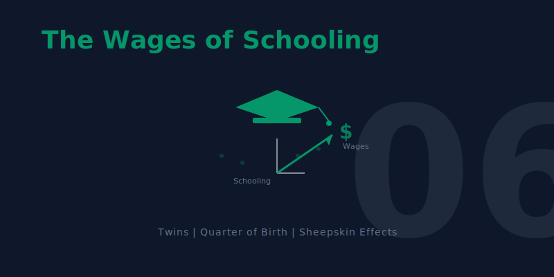

[](https://colab.research.google.com/github/cmg777/intro2causal/blob/main/notebooks_colab/06-wages-of-schooling.ipynb)


::: {.callout-tip}
### Learning Objectives

By the end of this chapter, you will be able to:

- Estimate the **simple OLS return to schooling** and explain why it may overstate the causal effect
- Apply the **omitted variables bias (OVB) formula** to predict the direction of bias from unobserved ability
- Explain why **randomized experiments** are the gold standard but infeasible for schooling
- Use **twin fixed effects** to control for shared family and genetic factors
- Understand how **measurement error** creates attenuation bias, especially in differenced data
- Apply **instrumental variables** (quarter of birth, twin's report, compulsory schooling laws) to education
- Use **regression discontinuity** to test for sheepskin (diploma) effects
- Illustrate how **differences-in-differences** exploits policy changes to estimate causal returns
- Compare estimates across **all five methods** and assess what the true return to schooling is
:::

**This chapter is unique.** It applies *all five* methods from the book --- regression, RCTs, IV, RD, and DD --- to a single question: **does education really cause higher earnings?** When different methods agree, we gain confidence. When they disagree, we learn what each method can and cannot do. The chapter builds a **methods ladder**, starting from the simplest approach and climbing to the most sophisticated, with each step motivated by a limitation of the previous one.

```{mermaid}
%%| label: fig-roadmap
%%| fig-cap: "Roadmap: The Methods Ladder for Chapter 6"

graph TD
    A["THE QUESTION: Does education cause higher earnings?"]
    B["SIMPLE OLS: Naive regression shows about 7% return"]
    C["THE PROBLEM: Ability bias and omitted variables inflate the estimate"]
    D["MULTIPLE REGRESSION: Adding controls helps but cannot fix unobservables"]
    E["QUASI-EXPERIMENTS: IV with twins, QOB, and child labor laws"]
    F["RD: Sheepskin effect tests diploma vs. learning"]
    G["DD: Policy changes provide before-and-after comparisons"]

    A --> B --> C --> D --> E --> F --> G

    style A fill:#3498db,color:#fff
    style B fill:#2c3e50,color:#fff
    style C fill:#c0392b,color:#fff
    style D fill:#e67e22,color:#fff
    style E fill:#8e44ad,color:#fff
    style F fill:#2d8659,color:#fff
    style G fill:#2d8659,color:#fff

    linkStyle 0,1,2,3,4,5 stroke:#888,stroke-width:2px
```


## Key Concepts and Definitions

**Ability Bias:** The upward bias in OLS estimates of the return to schooling caused by the omission of innate ability. More able people get more education AND earn more, inflating the apparent effect of schooling.

::::: {.columns}
:::: {.column width="50%"}
::: {.callout-tip collapse="true" appearance="simple" title="Example"}
A simple regression shows each year of schooling raises earnings by 10%, but part of this reflects the fact that high-IQ individuals stay in school longer and would earn more regardless.
:::
::::
:::: {.column width="50%"}
::: {.callout-note collapse="true" appearance="simple" title="Analogy"}
Like attributing a swimmer's speed entirely to their swimsuit. Faster swimmers tend to buy better suits, so the suit gets credit for speed that was really due to talent.
:::
::::
:::::

**Twin Fixed Effects:** A strategy that compares outcomes within pairs of identical twins who differ in their education levels. Because twins share genes and family background, differencing eliminates these shared confounders.

::::: {.columns}
:::: {.column width="50%"}
::: {.callout-tip collapse="true" appearance="simple" title="Example"}
If one twin has 16 years of schooling and earns \$60,000 while the other twin has 14 years and earns \$54,000, the within-pair return is (\$6,000 / 2 years) = \$3,000 per year.
:::
::::
:::: {.column width="50%"}
::: {.callout-note collapse="true" appearance="simple" title="Analogy"}
Like comparing two identical seeds planted in the same soil and climate, but one gets extra fertilizer. Any difference in growth must be due to the fertilizer, since everything else is shared.
:::
::::
:::::

**Within-Pair Differences:** The technique of subtracting one twin's outcome from the other's to eliminate all shared characteristics. This transforms the data from levels (how much each twin earns) to differences (how much MORE one twin earns than the other).

::::: {.columns}
:::: {.column width="50%"}
::: {.callout-tip collapse="true" appearance="simple" title="Example"}
$\Delta Y_f = Y_{twin1} - Y_{twin2}$ and $\Delta S_f = S_{twin1} - S_{twin2}$. Regressing the wage difference on the schooling difference gives the within-pair return.
:::
::::
:::: {.column width="50%"}
::: {.callout-note collapse="true" appearance="simple" title="Analogy"}
Like measuring the height difference between two siblings rather than their individual heights. The difference removes the family's genetic baseline and isolates the effect of what differed between them.
:::
::::
:::::

**Measurement Error:** Imprecision in the recording of a variable, where reported values differ from true values due to misreporting, rounding, or recall mistakes. In regression, measurement error in the explanatory variable biases the coefficient toward zero.

::::: {.columns}
:::: {.column width="50%"}
::: {.callout-tip collapse="true" appearance="simple" title="Example"}
Twins asked to report their years of education may misremember by a year. This noise dilutes the true variation in schooling and biases the return estimate downward.
:::
::::
:::: {.column width="50%"}
::: {.callout-note collapse="true" appearance="simple" title="Analogy"}
Like trying to read a ruler through foggy glasses. The markings are there, but the fog (measurement error) makes it hard to read them precisely, leading you to underestimate the true length.
:::
::::
:::::

**Signal-to-Noise Ratio:** The proportion of the total variation in a variable that reflects true variation (signal) versus measurement error (noise). A low signal-to-noise ratio causes severe attenuation bias.

::::: {.columns}
:::: {.column width="50%"}
::: {.callout-tip collapse="true" appearance="simple" title="Example"}
If true within-twin schooling variation is 1 year but measurement error adds 2 years of noise, the signal-to-noise ratio is low and the twin FE estimate is badly attenuated.
:::
::::
:::: {.column width="50%"}
::: {.callout-note collapse="true" appearance="simple" title="Analogy"}
Like trying to hear a whisper in a noisy stadium. The whisper (signal) is real, but the crowd noise overwhelms it. In a quiet room, the same whisper is perfectly clear.
:::
::::
:::::

**Reliability Ratio:** The fraction of the total variance of a variable that is true variance (as opposed to error variance). A reliability ratio of 0.5 means that attenuation bias cuts the coefficient in half.

::::: {.columns}
:::: {.column width="50%"}
::: {.callout-tip collapse="true" appearance="simple" title="Example"}
If self-reported education has a reliability ratio of 0.85, the OLS coefficient is biased toward zero by about 15%. In differenced twin data, the reliability ratio can drop to 0.5, doubling the bias.
:::
::::
:::: {.column width="50%"}
::: {.callout-note collapse="true" appearance="simple" title="Analogy"}
Like a scale that is accurate 85% of the time and gives random readings 15% of the time. The more unreliable the scale, the less you can trust its average reading.
:::
::::
:::::

**Sheepskin Effect:** The additional earnings boost associated with completing a degree (earning the diploma) beyond the year-by-year return to education. Named after the sheepskin diplomas were once printed on.

::::: {.columns}
:::: {.column width="50%"}
::: {.callout-tip collapse="true" appearance="simple" title="Example"}
If each year of college raises earnings by 7%, but graduating (year 4 specifically) adds an extra 15% jump, the 15% jump is the sheepskin effect --- the value of the credential itself.
:::
::::
:::: {.column width="50%"}
::: {.callout-note collapse="true" appearance="simple" title="Analogy"}
Like a loyalty card that gives a free coffee after every 10 purchases. The first 9 stamps (years of schooling) are valuable, but the 10th stamp (the degree) unlocks a bonus reward.
:::
::::
:::::

**Human Capital Theory:** The view that education raises earnings by building productive skills, knowledge, and abilities that make workers more valuable to employers.

::::: {.columns}
:::: {.column width="50%"}
::: {.callout-tip collapse="true" appearance="simple" title="Example"}
An engineering student learns calculus, physics, and design --- skills that directly increase her productivity and justify higher pay.
:::
::::
:::: {.column width="50%"}
::: {.callout-note collapse="true" appearance="simple" title="Analogy"}
Like sharpening a knife. More education makes the worker a better tool, and employers pay more for a sharper blade.
:::
::::
:::::

**Signaling Theory:** The view that education raises earnings not by increasing skills but by revealing pre-existing ability to employers. The degree serves as a signal that the holder is talented and hardworking.

::::: {.columns}
:::: {.column width="50%"}
::: {.callout-tip collapse="true" appearance="simple" title="Example"}
An employer who cannot directly observe a job candidate's ability uses a college degree as evidence that the candidate is smart and disciplined enough to complete four years of coursework.
:::
::::
:::: {.column width="50%"}
::: {.callout-note collapse="true" appearance="simple" title="Analogy"}
Like a peacock's tail. The tail does not make the peacock a better flyer --- it signals genetic fitness to potential mates. Similarly, a degree may not make you more productive; it signals that you were productive to begin with.
:::
::::
:::::

**Credential Effect:** The earnings premium attributable specifically to holding a diploma or credential, as opposed to the knowledge gained year by year. It is the empirical counterpart of the sheepskin effect.

::::: {.columns}
:::: {.column width="50%"}
::: {.callout-tip collapse="true" appearance="simple" title="Example"}
Clark and Martorell's RD study found that the Texas high school diploma had almost no credential effect --- students just above and below the exam cutoff had similar earnings.
:::
::::
:::: {.column width="50%"}
::: {.callout-note collapse="true" appearance="simple" title="Analogy"}
Like a name-brand label on a generic product. The credential effect asks: does the label itself add value, or is it what is inside the box that matters?
:::
::::
:::::

**Heterogeneous Treatment Effects:** The idea that the causal effect of treatment varies across individuals or subgroups, rather than being a single number that applies to everyone.

::::: {.columns}
:::: {.column width="50%"}
::: {.callout-tip collapse="true" appearance="simple" title="Example"}
The return to schooling may be 12% for low-income students but only 5% for high-income students, because education opens doors that were already open for the wealthy.
:::
::::
:::: {.column width="50%"}
::: {.callout-note collapse="true" appearance="simple" title="Analogy"}
Like the effect of an umbrella on staying dry. In a light drizzle, the umbrella is barely needed. In a downpour, it is essential. The same treatment has different effects depending on the circumstances.
:::
::::
:::::

**Convergence of Evidence:** The principle that when multiple methods --- each with different assumptions, data, and potential biases --- all point to similar conclusions, we gain much stronger confidence in the finding than any single method can provide.

::::: {.columns}
:::: {.column width="50%"}
::: {.callout-tip collapse="true" appearance="simple" title="Example"}
OLS, twin FE, twin IV, quarter-of-birth IV, child labor law IV, and DD all estimate the return to schooling at roughly 7--10% per year. No single estimate is definitive, but their agreement is powerful.
:::
::::
:::: {.column width="50%"}
::: {.callout-note collapse="true" appearance="simple" title="Analogy"}
Like multiple witnesses to an event all telling the same story from different vantage points. One witness might be mistaken, but if five independent witnesses agree, the story is probably true.
:::
::::
:::::

**Return to Schooling:** The percentage increase in earnings caused by one additional year of education. It is the central parameter this chapter seeks to estimate using multiple methods.

::::: {.columns}
:::: {.column width="50%"}
::: {.callout-tip collapse="true" appearance="simple" title="Example"}
A return of 8% means that one extra year of school causes earnings to increase by 8%, holding all else equal. Over a career, this compounds to a substantial difference.
:::
::::
:::: {.column width="50%"}
::: {.callout-note collapse="true" appearance="simple" title="Analogy"}
Like the interest rate on a savings account. Each "deposit" (year of school) earns a return that accumulates over time. An 8% return per year of schooling is a very high-yield investment.
:::
::::
:::::

**Quarter-of-Birth Instrument:** An instrument for years of schooling based on the quarter of the year in which a person was born. Because school entry and compulsory attendance laws interact with birth timing, children born in different quarters accumulate different amounts of schooling.

::::: {.columns}
:::: {.column width="50%"}
::: {.callout-tip collapse="true" appearance="simple" title="Example"}
Children born in Q4 start school slightly younger and must stay longer before reaching the legal dropout age, accumulating about 0.1 extra years of schooling on average.
:::
::::
:::: {.column width="50%"}
::: {.callout-note collapse="true" appearance="simple" title="Analogy"}
Like a relay race where some runners start a few steps ahead because of where they line up. The starting position (birth quarter) is essentially random but determines how far they run (years of schooling) before they can step off the track (drop out).
:::
::::
:::::

**Compulsory Schooling Laws:** Government regulations that require children to attend school until a specified minimum age (e.g., 16). These laws create exogenous variation in schooling by forcing some students to stay in school longer than they otherwise would.

::::: {.columns}
:::: {.column width="50%"}
::: {.callout-tip collapse="true" appearance="simple" title="Example"}
A state that raises its minimum school-leaving age from 14 to 16 compels students who would have dropped out at 14 to stay two more years --- generating variation that is independent of ability.
:::
::::
:::: {.column width="50%"}
::: {.callout-note collapse="true" appearance="simple" title="Analogy"}
Like a mandatory seatbelt law. Some people would buckle up anyway (always-takers), but the law forces additional compliance from people who would not have done it voluntarily --- and it is these marginal compliers whose outcomes we can study.
:::
::::
:::::

**Endogenous Variable:** A variable in a regression whose value is determined inside the system being studied, meaning it is correlated with the error term. OLS estimates involving endogenous variables are biased because the variable is not "as good as randomly assigned."

::::: {.columns}
:::: {.column width="50%"}
::: {.callout-tip collapse="true" appearance="simple" title="Example"}
Years of schooling is endogenous in an earnings regression because unobserved ability affects both schooling and earnings simultaneously.
:::
::::
:::: {.column width="50%"}
::: {.callout-note collapse="true" appearance="simple" title="Analogy"}
Like the chicken-and-egg problem. Did the variable cause the outcome, or did they both arise from a common underlying factor? When cause and effect are tangled together, you cannot simply read off the causal relationship.
:::
::::
:::::


## The Earnings-Education Gradient

College graduates earn roughly twice as much as high school graduates. But how much of that gap reflects the causal effect of education, and how much reflects the fact that people who go to college were going to earn more anyway?

Let's start with the simplest possible approach: **regress earnings on schooling with no controls**.

```{python}
# Load clean quarter-of-birth data (Angrist & Krueger 1991, 329k men born 1930-1939)
import pandas as pd
import numpy as np
import statsmodels.formula.api as smf
from linearmodels.iv import IV2SLS

GITHUB_DATA_URL = "https://raw.githubusercontent.com/cmg777/intro2causal/main/data/"

qob = pd.read_csv(GITHUB_DATA_URL + "ch6/qob_clean.csv")
qob.head(3)
```

```{python}
#| label: tbl-bivariate
#| tbl-cap: "Simple bivariate regression of log weekly earnings on years of schooling. No controls — just the raw correlation."

# Bivariate OLS: the simplest possible regression
bivariate = smf.ols("lnw ~ s", data=qob).fit(cov_type="HC1")

# Display results
pd.DataFrame({
    "Variable": bivariate.params.index,
    "Coefficient": bivariate.params.round(4).values,
    "Std. Error": bivariate.bse.round(4).values,
    "t-statistic": bivariate.tvalues.round(2).values,
    "p-value": bivariate.pvalues.round(3).values,
})
```

Each additional year of schooling is associated with about **7% higher weekly earnings**. With 329,000 observations, the estimate is extremely precise.

```{python}
#| label: fig-gradient
#| fig-cap: "Average log weekly earnings by years of schooling. The positive gradient is clear, but does it reflect causation or selection?"

import matplotlib.pyplot as plt

# Compute mean earnings by schooling level
binned = qob.groupby("s")["lnw"].mean().reset_index()

fig, ax = plt.subplots(figsize=(8, 5))
ax.scatter(binned["s"], binned["lnw"], color="black", s=40, zorder=5)
ax.plot(binned["s"], binned["lnw"], "k-", alpha=0.4)
ax.set_xlabel("Years of Schooling")
ax.set_ylabel("Mean Log Weekly Earnings")
ax.set_title("The Earnings-Education Gradient")
plt.tight_layout()
plt.show()
```

**But is this causal?** This is the **ability bias** problem. Smarter people stay in school longer AND earn more --- both independently. If we don't account for ability, OLS overstates the true causal return.

$$\hat{\rho}_{OLS} = \rho + \underbrace{\text{Ability bias}}_{\text{likely positive}}$$

where $\rho$ is the true causal return to schooling and $\hat{\rho}_{OLS}$ is the OLS estimate. If more able people get more education *and* earn more (for reasons unrelated to school), the OLS coefficient captures both effects.

**But is ability bias necessarily upward?** The answer is not obvious:

- **Arguments for upward bias** (the standard view): Higher IQ → stay in school longer AND earn more. Schools select on test scores. More-educated parents invest more in their children's education. All of these create positive correlation between ability and schooling.
- **Arguments for downward bias** (the contrarian view): Some highly talented people leave school *early* to pursue lucrative opportunities. Bill Gates, Mark Zuckerberg, and Steve Jobs dropped out of college; Mick Jagger left the London School of Economics to form the Rolling Stones. If such exceptional ability is negatively correlated with schooling, OLS could actually *understate* the true return.
- **For most people**, the standard view probably holds: the college-dropout billionaires are rare exceptions. But the ambiguity is important because it means we cannot assume the direction of OLS bias without evidence.

To understand how much of this 10% estimate is causal, we need to think carefully about omitted variables.


## Multiple Regression and the OVB Problem

### Adding Controls

Chapter 2 taught us that adding control variables can reduce omitted variables bias --- as long as the controls are not "bad controls" (caused by the treatment). Let's add demographic controls using a different dataset: the Twinsburg twins data.

```{python}
# Load clean twins data (340 twin pairs from Twinsburg, Ohio)
twins = pd.read_csv(GITHUB_DATA_URL + "ch6/twins_clean.csv")

# Key variables:
#   lwage  = log weekly wage; educ = own years of education
#   educt_t = twin's report of respondent's education (instrument)
#   first  = 1 for the first twin in each pair (use to avoid double-counting)
#   dlwage = within-pair difference in log wages; deduc = difference in own-reported education
#   deduct = difference in twin's report of education (instrument for deduc)
twins.head(3)
```

```{python}
#| label: tbl-twins-ols
#| tbl-cap: "OLS return to schooling using the Twinsburg twins data. Controls include age, age-squared, gender, and race."

# OLS: regress log wages on education with demographic controls
ols = smf.ols("lwage ~ educ + age + age2 + female + white", data=twins).fit(cov_type="HC1")

# Extract key regression results into a clear table
pd.DataFrame({
    "Variable": ols.params.index,
    "Coefficient": ols.params.round(4).values,
    "Std. Error": ols.bse.round(4).values,
    "t-statistic": ols.tvalues.round(2).values,
    "p-value": ols.pvalues.round(3).values,
})
```

The OLS return with controls is about **11% per year of schooling**. Note that this estimate uses a different dataset (the Twinsburg twins) than the bivariate regression above (the 1980 Census). The higher estimate partly reflects the different sample. Even within this dataset, adding demographic controls does not substantially reduce the schooling coefficient --- because these observables explain little of the ability-education correlation.

### The OVB Formula Applied to Schooling

From Chapter 2, the omitted variables bias formula is:

$$\text{OVB} = \underbrace{\gamma}_{\text{effect of ability on earnings}} \times \underbrace{\pi_1}_{\text{correlation of ability with schooling}}$$

For schooling:

- $\gamma > 0$: More able people earn more, holding schooling constant
- $\pi_1 > 0$: More able people get more education

Therefore $\text{OVB} > 0$, and OLS **overstates** the true return. The short regression (without ability) gives a coefficient that is too large.

### Seeing OVB in Action

To see this concretely, we use a synthetic dataset where we *know* the true causal return (0.08 per year) because we designed the data-generating process.

::: {.callout-note}
### Synthetic data

This dataset was designed to illustrate the OVB concept. It contains 1,000 simulated individuals with schooling, earnings, unobserved ability, and occupation. The true causal return to schooling is 0.08 (8%) per year.
:::

```{python}
#| label: tbl-ovb-demo
#| tbl-cap: "OVB demonstration: the short regression (without ability) overstates the true return. The long regression (with ability) recovers it."

# Load synthetic OVB data (1000 simulated individuals)
ovb = pd.read_csv(GITHUB_DATA_URL + "ch6/synthetic_ovb.csv")

# Short regression: omit ability (like real life — we can't observe ability)
short_reg = smf.ols("earnings ~ schooling", data=ovb).fit(cov_type="HC1")

# Long regression: include ability (the "oracle" regression we can't run with real data)
long_reg = smf.ols("earnings ~ schooling + ability", data=ovb).fit(cov_type="HC1")

# Compare coefficients
pd.DataFrame({
    "Specification": ["Short (omit ability)", "Long (include ability)", "True causal return"],
    "Schooling coefficient": [
        f"{short_reg.params['schooling']:.4f} ({short_reg.bse['schooling']:.4f})",
        f"{long_reg.params['schooling']:.4f} ({long_reg.bse['schooling']:.4f})",
        "0.0900",
    ],
})
```

The short regression gives about 0.12 --- **overstating** the true return by roughly 40%. Adding the unobservable ability recovers the true total causal return (about 0.09). In real life, we cannot observe ability, so we need a different strategy.

### Bad Controls: Do Not Control for Occupation

::: {.callout-warning}
### Bad controls

Occupation is *caused by* education --- it is a "bad control" (a collider or post-treatment variable). Controlling for it absorbs part of the causal effect of education on earnings, biasing the estimate downward. If education raises earnings partly by giving access to higher-paying occupations, then holding occupation constant removes that channel.
:::

```{python}
#| label: tbl-bad-control
#| tbl-cap: "Adding occupation (a bad control) biases the schooling return downward by absorbing part of the causal pathway."

# Bad control: add occupation (which is caused by schooling)
bad_control = smf.ols("earnings ~ schooling + occupation", data=ovb).fit(cov_type="HC1")

pd.DataFrame({
    "Specification": ["Without occupation", "With occupation (bad control)", "True causal return"],
    "Schooling coefficient": [
        f"{short_reg.params['schooling']:.4f} ({short_reg.bse['schooling']:.4f})",
        f"{bad_control.params['schooling']:.4f} ({bad_control.bse['schooling']:.4f})",
        "0.0900",
    ],
})
```

Adding occupation shrinks the schooling coefficient --- not because it reduces bias, but because it removes a real causal channel. **Rule of thumb:** never control for variables that are consequences of the treatment.

Even with good controls, we can never be sure we have accounted for all confounders. What we really want is a research design --- like the randomized experiments in Chapter 1 --- that eliminates ability bias by construction.


## Why Not an RCT?

The gold standard for causal inference is the **randomized controlled trial**: randomly assign some people to get more education, and compare their earnings to a control group. Random assignment breaks the link between ability and education, so the simple difference in means is causal.

**But we cannot randomize education.** It would be unethical and impractical to force some people to drop out and others to stay in school for 20 years.

To see *why* random assignment works, we use a synthetic dataset that simulates a hypothetical scholarship RCT.

::: {.callout-note}
### Synthetic data

This dataset simulates a hypothetical scholarship experiment. 2,000 individuals were randomly assigned to receive a scholarship (or not). The scholarship increases schooling by about 2 years. The true causal return to schooling is 0.08 per year, so the scholarship should increase earnings by about 0.16.
:::

```{python}
#| label: tbl-rct-demo
#| tbl-cap: "Synthetic scholarship RCT: random assignment eliminates ability bias, so a simple comparison of means recovers the causal effect."

# Load synthetic RCT data
rct = pd.read_csv(GITHUB_DATA_URL + "ch6/synthetic_rct.csv")

# Simple comparison of means by scholarship status
means = rct.groupby("scholarship")[["schooling", "earnings"]].mean()
diff_school = means.loc[1, "schooling"] - means.loc[0, "schooling"]
diff_earn = means.loc[1, "earnings"] - means.loc[0, "earnings"]

# Regression of earnings on scholarship (= difference in means)
rct_reg = smf.ols("earnings ~ scholarship", data=rct).fit(cov_type="HC1")

# Wald estimate: earnings effect / schooling effect = per-year return
wald_rct = diff_earn / diff_school

pd.DataFrame({
    "Quantity": [
        "Scholarship → schooling (first stage)",
        "Scholarship → earnings (reduced form)",
        "Per-year return (reduced form / first stage)",
    ],
    "Estimate": [
        f"{diff_school:.3f} years",
        f"{diff_earn:.4f} log points",
        f"{wald_rct:.4f}",
    ],
})
```

With random assignment, the simple difference in earnings between scholarship and non-scholarship groups gives an unbiased estimate of the causal effect. Dividing by the schooling difference gives the per-year return --- close to the true 0.08.

::: {.callout-important}
### The lesson

The RCT recovers the right answer because random assignment makes ability independent of schooling ($\pi_1 = 0$), so OVB = 0. But since we cannot run a schooling RCT, we need **quasi-experimental** methods that approximate random assignment. The rest of this chapter explores four such strategies.
:::


## Strategy 1: Twin Comparisons

### The Logic

Identical twins share genes and family upbringing --- the very factors we suspect drive ability bias. If one twin gets more education than the other, the earnings difference within the pair reflects the causal return, not ability.

### Within-Twin Differences

By taking the difference within each twin pair, we eliminate everything shared between them:

$$\Delta Y_f = \rho \cdot \Delta S_f + \Delta e_f$$

where $\Delta Y_f$ is the difference in log wages (`dlwage`) and $\Delta S_f$ is the difference in years of education (`deduc`) within twin pair $f$. Shared ability cancels out because both twins have the same value.

```{python}
#| label: tbl-twins-fe
#| tbl-cap: "Within-twin estimate of the return to schooling. Differencing eliminates shared genetic and family factors."

# Use only the first twin in each pair (to avoid double-counting)
first = twins[twins["first"] == 1]

# Regress wage difference on education difference
# The "- 1" removes the intercept: when both twins have the same education,
# we expect zero wage difference, so there's no constant term needed
twin_fe = smf.ols("dlwage ~ deduc - 1", data=first).fit(cov_type="HC1")

# Extract key regression results into a clear table
pd.DataFrame({
    "Variable": twin_fe.params.index,
    "Coefficient": twin_fe.params.round(4).values,
    "Std. Error": twin_fe.bse.round(4).values,
    "t-statistic": twin_fe.tvalues.round(2).values,
    "p-value": twin_fe.pvalues.round(3).values,
})
```

The twin estimate drops to about **6%** --- nearly half the OLS estimate. This suggests ability bias pushes OLS upward.

::: {.callout-warning}
### Common Misconception: A lower estimate is not necessarily a better estimate

Twin FE gives 0.06. OLS gives 0.11. Students often assume the lower number must be "more correct."

**This is wrong.** Twin FE has its own bias: **measurement error amplification**.

Here's why: twins report their own education. Small errors (misremembering a year) get amplified by differencing. The true within-pair variation in schooling is tiny. So even small errors dominate the signal.

**Result:** This **attenuation bias** pushes the twin estimate *below* the true return.
:::

### IV: Using the Twin's Report as an Instrument

The twin estimate may be biased *downward* by **measurement error** in self-reported education. If twins misremember their schooling, the differenced data amplifies noise relative to signal.

The fix: use each twin's *report of the other's education* as an instrument. This report is correlated with true education but has independent measurement error, so it satisfies the IV requirements.

::: {.callout-note}
### Reading the IV2SLS formula syntax

In `linearmodels`, the IV formula uses **square brackets** to specify the endogenous variable and its instrument:

- `[educ ~ educt_t]` means: *educ* is the endogenous variable, instrumented by *educt_t*
- `~ 0` or `~ 1` controls whether an intercept is included (0 = no intercept, 1 = with intercept)
- `cov_type="robust"` gives heteroskedasticity-robust standard errors (equivalent to `"HC1"` in `statsmodels`)
:::

```{python}
#| label: tbl-twins-iv
#| tbl-cap: "IV estimates using twin's report of education as instrument. Corrects for measurement error in self-reported schooling."

# IV in levels: instrument own education (educ) with twin's report (educt_t)
iv_levels = IV2SLS.from_formula(
    "lwage ~ 1 + age + age2 + female + white + [educ ~ educt_t]", data=twins
).fit(cov_type="robust")

# IV in differences: instrument own-reported difference (deduc) with twin's report diff (deduct)
first_iv = first[["dlwage", "deduc", "deduct"]].dropna()
iv_diff = IV2SLS.from_formula(
    "dlwage ~ 0 + [deduc ~ deduct]", data=first_iv
).fit(cov_type="robust")

# Combine all four estimates into one table
ols_coef = round(ols.params["educ"], 3)
ols_se = round(ols.bse["educ"], 3)
fe_coef = round(twin_fe.params["deduc"], 3)
fe_se = round(twin_fe.bse["deduc"], 3)
iv_lev_coef = round(iv_levels.params["educ"], 3)
iv_lev_se = round(iv_levels.std_errors["educ"], 3)
iv_dif_coef = round(iv_diff.params["deduc"], 3)
iv_dif_se = round(iv_diff.std_errors["deduc"], 3)

pd.DataFrame({
    "Method": ["OLS (levels)", "Twin FE (differences)", "IV (levels)", "IV (differences)"],
    "Return to schooling": [
        format(ols_coef, ".3f") + " (" + format(ols_se, ".3f") + ")",
        format(fe_coef, ".3f") + " (" + format(fe_se, ".3f") + ")",
        format(iv_lev_coef, ".3f") + " (" + format(iv_lev_se, ".3f") + ")",
        format(iv_dif_coef, ".3f") + " (" + format(iv_dif_se, ".3f") + ")",
    ],
})
```

::: {.callout-important}
### What the twin results tell us

| Method | Estimate | Interpretation |
|:---|:---:|:---|
| OLS | ~0.11 | Likely biased UP by ability |
| Twin FE | ~0.06 | Biased DOWN by measurement error |
| IV (levels) | ~0.12 | Corrects measurement error in levels |
| IV (differences) | ~0.11 | Corrects measurement error in differences |

The true return is probably **8--11% per year**, with OLS slightly overstating and twin FE understating due to different biases.
:::

::: {.callout-note}
### Intuition Builder: The Bathroom Scale Analogy

Imagine weighing yourself on a bathroom scale that randomly adds or subtracts 5 pounds. On average, the scale is right --- but any single reading is noisy. Now suppose you weigh yourself in the morning and evening to measure how much weight you gained during the day. The true gain might be 0.5 lbs, but the scale's error (±5 lbs in each reading) means the *difference* between readings is dominated by noise. This is exactly what happens with twin differences in education: the true within-pair variation is small (twins are similar), but measurement error stays the same size, so noise overwhelms the signal.
:::

**Lessons from the twins strategy:**

- Twin FE controls for shared ability but amplifies measurement error --- two biases push in opposite directions
- IV using the twin's report corrects measurement error, recovering a return near 11%
- **Limitation:** The Twinsburg twins are a self-selected sample (twins who attend an annual twin festival in Ohio). They may not represent the general population

The twins approach offered a first crack at ability bias but raised a new concern: measurement error. Our next strategy sidesteps both problems by finding a source of schooling variation that is entirely independent of ability --- and precisely measured in census data.


## Strategy 2: Quarter-of-Birth IV

**Research question:** What is the causal return to an additional year of schooling, using a source of variation that is independent of ability?

**The data:** Angrist and Krueger (1991) used the 1980 U.S. Census, extracting 329,509 men born between 1930 and 1939. The outcome is log weekly earnings (`lnw`). Schooling is measured in years (`s`). Quarter of birth (`qob`, 1--4) serves as the instrument.

### The Idea

Compulsory schooling laws allow students to drop out at age 16. Because school-entry rules are based on birth date cutoffs, children born later in the year start school younger and accumulate more schooling before reaching the dropout age.

This creates an instrument: **quarter of birth** affects schooling (through compulsory attendance rules) but should not directly affect earnings.

The IV strategy has three equations:

**First stage** (instrument predicts schooling):

$$S_i = \alpha_1 + \phi \, Q4_i + e_{1i}$$

**Reduced form** (instrument predicts earnings directly):

$$\ln W_i = \alpha_2 + \rho_{RF} \, Q4_i + e_{2i}$$

**Wald estimator** (ratio gives the causal return):

$$\hat{\rho}_{IV} = \frac{\hat{\rho}_{RF}}{\hat{\phi}} = \frac{\text{Effect of } Q4 \text{ on earnings}}{\text{Effect of } Q4 \text{ on schooling}}$$

where $Q4_i$ = 1 if individual $i$ was born in the fourth quarter (`q4`), $S_i$ is years of schooling (`s`), and $\ln W_i$ is log weekly earnings (`lnw`). This estimate is a **LATE** (Local Average Treatment Effect): it applies only to compliers whose schooling was changed by compulsory attendance interacting with their birth quarter.

### The IV Recipe: Step by Step

```{python}
#| label: tbl-wald
#| tbl-cap: "The IV recipe (Wald estimate): reduced form divided by first stage gives the causal return to schooling."

# Step 1: Reduced form — does Q4 birth predict higher earnings?
rf = smf.ols("lnw ~ q4", data=qob).fit(cov_type="HC1")

# Step 2: First stage — does Q4 birth predict more schooling?
fs = smf.ols("s ~ q4", data=qob).fit(cov_type="HC1")

# Step 3: Wald estimate = reduced form / first stage
wald = rf.params["q4"] / fs.params["q4"]

# Step 4: Verify with 2SLS
iv = IV2SLS.from_formula("lnw ~ 1 + [s ~ q4]", data=qob).fit(cov_type="robust")

# Extract coefficients and standard errors
rf_coef = round(rf.params["q4"], 4)
rf_se = round(rf.bse["q4"], 4)
fs_coef = round(fs.params["q4"], 4)
fs_se = round(fs.bse["q4"], 4)
wald_rounded = round(wald, 4)
iv_coef = round(iv.params["s"], 4)
iv_se = round(iv.std_errors["s"], 4)

pd.DataFrame({
    "Step": ["Reduced form (Q4 → earnings)", "First stage (Q4 → schooling)",
             "Wald estimate (RF / FS)", "2SLS verification"],
    "Estimate": [
        format(rf_coef, ".4f") + " (" + format(rf_se, ".4f") + ")",
        format(fs_coef, ".4f") + " (" + format(fs_se, ".4f") + ")",
        format(wald_rounded, ".4f"),
        format(iv_coef, ".4f") + " (" + format(iv_se, ".4f") + ")",
    ],
})
```

The reduced form shows that Q4 births earn slightly more. The first stage shows they get about 0.09 more years of schooling. Dividing gives the Wald estimate of about **7% per year** --- which the 2SLS verification confirms.

### Visualizing the First Stage and Reduced Form

```{python}
#| label: fig-qob
#| fig-cap: "First stage (left) and reduced form (right). Q4 births get slightly more schooling and slightly higher earnings."

# Collapse to cell means by age (= birth cohort)
cell = qob.groupby("age").agg(s=("s","mean"), lnw=("lnw","mean"),
                                q4=("q4","mean"), q1=("q1","mean")).reset_index()
cell["yob"] = 80 - cell["age"]
cell["is_q4"] = cell["q4"] > 0.5
cell["is_q1"] = cell["q1"] > 0.5

fig, axes = plt.subplots(1, 2, figsize=(12, 5))

ax = axes[0]
ax.plot(cell["yob"], cell["s"], "k-", alpha=0.4)
ax.scatter(cell.loc[cell["is_q4"], "yob"], cell.loc[cell["is_q4"], "s"],
           color="black", s=50, zorder=5, label="Quarter 4")
ax.scatter(cell.loc[cell["is_q1"], "yob"], cell.loc[cell["is_q1"], "s"],
           facecolors="none", edgecolors="black", s=50, zorder=5, label="Quarter 1")
ax.set_xlabel("Year of Birth")
ax.set_ylabel("Years of Education")
ax.set_title("First Stage")
ax.legend()

ax = axes[1]
ax.plot(cell["yob"], cell["lnw"], "k-", alpha=0.4)
ax.scatter(cell.loc[cell["is_q4"], "yob"], cell.loc[cell["is_q4"], "lnw"],
           color="black", s=50, zorder=5, label="Quarter 4")
ax.scatter(cell.loc[cell["is_q1"], "yob"], cell.loc[cell["is_q1"], "lnw"],
           facecolors="none", edgecolors="black", s=50, zorder=5, label="Quarter 1")
ax.set_xlabel("Year of Birth")
ax.set_ylabel("Log Weekly Earnings")
ax.set_title("Reduced Form")
ax.legend()

plt.tight_layout()
plt.show()
```

::: {.callout-note}
### Who are the compliers?

The QOB IV estimate is a **LATE** (Local Average Treatment Effect) --- it applies only to **compliers**, people whose schooling was actually changed by their quarter of birth interacting with compulsory schooling laws. Compliers are students at the dropout threshold. Students who would have attended college regardless (always-takers) or those who drop out very early (never-takers) are not affected by the instrument.
:::

The quarter-of-birth IV uses a clever natural experiment, but it relies on a single source of variation. Our next strategy uses a different set of instruments --- compulsory schooling laws that vary across states.


## Strategy 3: Child Labor Law IV

**Research question:** Do compulsory schooling laws that forced children to enter school by certain ages provide another valid instrument for estimating the return to education?

**The data:** Angrist and Acemoglu used data on compulsory schooling laws that varied across U.S. states. Three instruments capture whether a state required children to enter school by age 7 (`cl7`), 8 (`cl8`), or 9 (`cl9`). The data has been collapsed to state-of-birth × year-of-birth × census-year cell means.

With multiple instruments and fixed effects, the 2SLS framework is:

**First stage:** Predict schooling using the three compulsory schooling instruments

$$S_{scy} = \alpha_1 + \phi_1 \, CL7_{sc} + \phi_2 \, CL8_{sc} + \phi_3 \, CL9_{sc} + \beta_s + \gamma_c + \delta_y + v_{scy}$$

**Second stage:** Regress earnings on the predicted schooling

$$\ln W_{scy} = \alpha_2 + \rho_{IV} \, \hat{S}_{scy} + \beta_s + \gamma_c + \delta_y + u_{scy}$$

where:

- $CL7$, $CL8$, $CL9$ = indicators for compulsory school entry by age 7, 8, or 9 (`cl7`, `cl8`, `cl9`)
- $\beta_s$ = state-of-birth fixed effects (`C(sob)`)
- $\gamma_c$ = year-of-birth cohort effects (`C(yob)`)
- $\delta_y$ = census-year effects (`C(year)`)
- $\hat{S}_{scy}$ = the fitted value of schooling from the first stage
- $\rho_{IV}$ = the causal return to schooling, identified by the three instruments jointly

```{python}
# Load child labor law data (collapsed cell means, ~2400 observations)
cl = pd.read_csv(GITHUB_DATA_URL + "ch6/childlabor_clean.csv")
cl.head(3)
```

```{python}
#| label: tbl-childlabor-fs
#| tbl-cap: "First stage: compulsory schooling laws jointly predict education. The F-statistic tests instrument relevance."

# First stage: do child labor laws predict education?
fs_cl = smf.wls(
    "indEduc ~ cl7 + cl8 + cl9 + C(sob) + C(yob) + C(year)",
    data=cl, weights=cl["weight"]
).fit(cov_type="cluster", cov_kwds={"groups": cl["sob"]})

# Joint F-test on instruments
f_test = fs_cl.f_test("cl7 = 0, cl8 = 0, cl9 = 0")
f_stat = float(np.atleast_1d(f_test.fvalue).flat[0])

pd.DataFrame({
    "Instrument": ["cl7 (enter by age 7)", "cl8 (enter by age 8)", "cl9 (enter by age 9)", "Joint F-statistic"],
    "Coefficient": [
        f"{fs_cl.params['cl7']:.4f} ({fs_cl.bse['cl7']:.4f})",
        f"{fs_cl.params['cl8']:.4f} ({fs_cl.bse['cl8']:.4f})",
        f"{fs_cl.params['cl9']:.4f} ({fs_cl.bse['cl9']:.4f})",
        f"{f_stat:.2f}",
    ],
})
```

```{python}
#| label: tbl-childlabor-iv
#| tbl-cap: "OLS vs. IV estimates of the return to schooling using compulsory schooling laws as instruments."

# OLS with fixed effects
ols_cl = smf.wls(
    "lnwkwage ~ indEduc + C(sob) + C(yob) + C(year)",
    data=cl, weights=cl["weight"]
).fit(cov_type="cluster", cov_kwds={"groups": cl["sob"]})

# IV/2SLS: residualize out fixed effects first (Frisch-Waugh-Lovell approach)
def residualize(data, y_col, fe_cols, weights):
    """Partial out fixed effects using WLS (Frisch-Waugh-Lovell)."""
    formula = f"{y_col} ~ " + " + ".join([f"C({c})" for c in fe_cols])
    res = smf.wls(formula, data=data, weights=weights).fit()
    return res.resid

fe_vars = ["sob", "yob", "year"]
iv_cl = cl.copy()
for var in ["lnwkwage", "indEduc", "cl7", "cl8", "cl9"]:
    iv_cl[f"{var}_r"] = residualize(iv_cl, var, fe_vars, iv_cl["weight"])

iv_result = IV2SLS.from_formula(
    "lnwkwage_r ~ 0 + [indEduc_r ~ cl7_r + cl8_r + cl9_r]",
    data=iv_cl, weights=iv_cl["weight"]
).fit(cov_type="clustered", clusters=iv_cl["sob"])

pd.DataFrame({
    "Method": ["OLS (with state, YOB, year FE)", "IV/2SLS (child labor law instruments)"],
    "Return to schooling": [
        f"{ols_cl.params['indEduc']:.4f} ({ols_cl.bse['indEduc']:.4f})",
        f"{iv_result.params['indEduc_r']:.4f} ({iv_result.std_errors['indEduc_r']:.4f})",
    ],
})
```

::: {.callout-important}
### What the child labor law results tell us

The OLS estimate with fixed effects gives about **7%**, while the IV estimate is larger at about **13%**. The IV estimate is less precise than the QOB results, in part because the first-stage F-statistic is below 10 --- a sign of **weak instruments** that can inflate IV estimates. Despite the imprecision, the results are broadly consistent with the other IV strategies in pointing to a causal return that is at least as large as the OLS estimate.
:::

Both the twins and IV strategies estimate the *overall* return to education. But they leave open a deeper question: does education raise earnings because of the skills you learn, or because employers value the diploma?


## Strategy 4: Sheepskin Effects via RD

**Research question:** Does the diploma credential itself boost earnings (the **signaling** view), or is it the skills learned in school that matter (the **human capital** view)?

**The data:** Clark and Martorell (2014) studied the Texas high school exit exam. The data consists of 46 score bins around the passing cutoff. The running variable is the test score relative to the passing threshold (`minscore`, where 0 = cutoff).

**Why RD works here:** Students who scored just above vs. just below the cutoff have nearly **identical skills** but very different diploma rates. Any jump in earnings at the cutoff reflects the value of the diploma credential itself.

The RD regression estimates the jump at the passing threshold:

$$Y_i = \alpha + \rho \, D_i + f(\text{Score}_i) + e_i$$

where:

- $Y_i$ = average annual earnings (`avgearnings`) or diploma receipt (`receivehsd`)
- $D_i$ = 1 if the student passed the last-chance exam (`pass_exam`)
- $f(\text{Score}_i)$ = a flexible polynomial in the test score relative to the cutoff (`minscore`), fitted separately on each side of the threshold
- $\rho$ = the **sheepskin effect** --- the jump in the outcome at the passing threshold

If $\rho$ is large for earnings, the diploma itself has value (signaling). If $\rho \approx 0$, the diploma credential adds little beyond the skills already reflected in the score.

```{python}
# Load clean sheepskin RD data (Texas last-chance exam)
sheep = pd.read_csv(GITHUB_DATA_URL + "ch6/sheepskin_clean.csv")
sheep.head(3)
```

```{python}
#| label: fig-sheepskin
#| fig-cap: "RD at the Texas exam cutoff. Left: diploma receipt jumps sharply. Right: earnings barely change."

fig, axes = plt.subplots(1, 2, figsize=(13, 5))

# --- Panel 1: Diploma receipt ---
ax = axes[0]
ax.scatter(sheep["minscore"], sheep["receivehsd"], color="black", s=20, alpha=0.6)

left = sheep[sheep["minscore"] < 0]
right = sheep[sheep["minscore"] >= 0]

fit_l = smf.wls("receivehsd ~ pass_exam + left_1 + left_2 + left_3 + left_4",
                 data=left, weights=left["n"]).fit()
fit_r = smf.wls("receivehsd ~ pass_exam + right_1 + right_2 + right_3 + right_4",
                 data=right, weights=right["n"]).fit()

left_plot = sheep[sheep["minscore"] <= 0].copy()
left_plot["fit"] = fit_l.predict(left_plot)
right_plot = sheep[sheep["minscore"] >= 0].copy()
right_plot["fit"] = fit_r.predict(right_plot)

ax.plot(left_plot["minscore"], left_plot["fit"], "k-", linewidth=2)
ax.plot(right_plot["minscore"], right_plot["fit"], "k-", linewidth=2)
ax.axvline(x=0, color="red", linestyle="--", alpha=0.5)
ax.set_xlabel("Test score relative to cutoff")
ax.set_ylabel("Fraction receiving diploma")
ax.set_title("Diploma Receipt (First Stage)")
ax.set_xlim(-30, 15)
ax.set_ylim(0, 1)

# --- Panel 2: Earnings ---
ax = axes[1]
ax.scatter(sheep["minscore"], sheep["avgearnings"], color="black", s=20, alpha=0.6)

earn_l = smf.wls("avgearnings ~ pass_exam + left_1 + left_2 + left_3 + left_4",
                  data=left[left["minscore"] >= -30], weights=left[left["minscore"] >= -30]["person_years"]).fit()
earn_r = smf.wls("avgearnings ~ pass_exam + right_1 + right_2 + right_3 + right_4",
                  data=right, weights=right["person_years"]).fit()

left_earn = sheep[sheep["minscore"] <= 0].copy()
left_earn["fit"] = earn_l.predict(left_earn)
right_earn = sheep[sheep["minscore"] >= 0].copy()
right_earn["fit"] = earn_r.predict(right_earn)

ax.plot(left_earn["minscore"], left_earn["fit"], "k-", linewidth=2)
ax.plot(right_earn["minscore"], right_earn["fit"], "k-", linewidth=2)
ax.axvline(x=0, color="red", linestyle="--", alpha=0.5)
ax.set_xlabel("Test score relative to cutoff")
ax.set_ylabel("Annual Earnings ($)")
ax.set_title("Earnings (Reduced Form)")
ax.set_xlim(-30, 15)

plt.tight_layout()
plt.show()
```

::: {.callout-important}
### The sheepskin verdict

- **Diploma receipt** jumps by about **40 percentage points** at the cutoff (a strong first stage)
- **Earnings** show **almost no jump** --- the RD effect is near zero
- Most of the education premium reflects actual learning (human capital), not just the piece of paper (signaling)
:::

We have now applied regression, IV, and RD to the schooling question. The final method --- differences-in-differences --- exploits policy changes over time.


## Strategy 5: Differences-in-Differences

**Research question:** Can we estimate the return to schooling by comparing states that changed their compulsory schooling laws to states that did not?

::: {.callout-note}
### Synthetic data

This dataset simulates a compulsory schooling reform adopted by 10 out of 20 states in 2005. It was designed to illustrate the DiD concept with clear parallel pre-trends and a visible treatment effect.
:::

The DD estimator compares changes over time across treated and control groups:

$$\delta_{DD} = \underbrace{(\bar{Y}_{treat,after} - \bar{Y}_{treat,before})}_{\text{Change in treated states}} - \underbrace{(\bar{Y}_{control,after} - \bar{Y}_{control,before})}_{\text{Change in control states}}$$

In regression form with state and year fixed effects:

$$Y_{st} = \alpha + \delta \, (\text{Treated}_s \times \text{Post}_t) + \beta_s + \gamma_t + e_{st}$$

where:

- $Y_{st}$ = average earnings (`avg_earnings`) or average schooling (`avg_schooling`) in state $s$ at time $t$
- $\text{Treated}_s \times \text{Post}_t$ = the interaction term (`treat_post`), equal to 1 for treated states after the reform
- $\beta_s$ = state fixed effects (`C(state)`) --- absorb permanent differences between states
- $\gamma_t$ = year fixed effects (`C(year)`) --- absorb common time trends
- $\delta$ = the DD estimate of the reform's causal effect

The **parallel trends assumption** requires that treated and control states would have followed the same trajectory absent the reform: $E[Y_{st}(0) \mid \text{Treated}=1] - E[Y_{st}(0) \mid \text{Treated}=0]$ is constant over time.

```{python}
# Load synthetic DiD data (20 states × 20 years)
did = pd.read_csv(GITHUB_DATA_URL + "ch6/synthetic_did.csv")
did.head(3)
```

```{python}
#| label: fig-did
#| fig-cap: "Parallel trends in schooling (left) and earnings (right). Treated states (solid) and control states (dashed) follow the same trend before the reform, then diverge after 2005."

# Compute group means by year
group_means = did.groupby(["year", "treated"]).agg(
    schooling=("avg_schooling", "mean"),
    earnings=("avg_earnings", "mean"),
).reset_index()

treated_g = group_means[group_means["treated"] == 1]
control_g = group_means[group_means["treated"] == 0]

fig, axes = plt.subplots(1, 2, figsize=(13, 5))

ax = axes[0]
ax.plot(treated_g["year"], treated_g["schooling"], "k-", linewidth=2, label="Treated states")
ax.plot(control_g["year"], control_g["schooling"], "k--", linewidth=2, label="Control states")
ax.axvline(x=2005, color="red", linestyle="--", alpha=0.5, label="Reform year")
ax.set_xlabel("Year")
ax.set_ylabel("Average Years of Schooling")
ax.set_title("Schooling (First Stage)")
ax.legend(loc="upper left")

ax = axes[1]
ax.plot(treated_g["year"], treated_g["earnings"], "k-", linewidth=2, label="Treated states")
ax.plot(control_g["year"], control_g["earnings"], "k--", linewidth=2, label="Control states")
ax.axvline(x=2005, color="red", linestyle="--", alpha=0.5, label="Reform year")
ax.set_xlabel("Year")
ax.set_ylabel("Log Average Earnings")
ax.set_title("Earnings (Reduced Form)")
ax.legend(loc="upper left")

plt.tight_layout()
plt.show()
```

```{python}
#| label: tbl-did
#| tbl-cap: "Differences-in-differences estimate of the reform effect on schooling and earnings, with state and year fixed effects."

# DD regression for schooling (first stage)
did["treat_post"] = did["treated"] * did["post"]
dd_school = smf.ols("avg_schooling ~ treat_post + C(state) + C(year)", data=did).fit(
    cov_type="cluster", cov_kwds={"groups": did["state"]}
)

# DD regression for earnings (reduced form)
dd_earn = smf.ols("avg_earnings ~ treat_post + C(state) + C(year)", data=did).fit(
    cov_type="cluster", cov_kwds={"groups": did["state"]}
)

# Implied return: earnings effect / schooling effect
dd_return = dd_earn.params["treat_post"] / dd_school.params["treat_post"]

pd.DataFrame({
    "Quantity": [
        "DD effect on schooling (first stage)",
        "DD effect on earnings (reduced form)",
        "Implied return per year (RF / FS)",
    ],
    "Estimate": [
        f"{dd_school.params['treat_post']:.4f} ({dd_school.bse['treat_post']:.4f})",
        f"{dd_earn.params['treat_post']:.4f} ({dd_earn.bse['treat_post']:.4f})",
        f"{dd_return:.4f}",
    ],
})
```

::: {.callout-important}
### Connection to the child labor law IV

The child labor law IV (Strategy 3) and the DiD approach exploit the **same underlying variation** --- policy changes in compulsory schooling laws across states and time. Both give similar estimates, reinforcing the causal interpretation.
:::


## The Furious Five: A Grand Synthesis

This chapter has applied **all five methods** from the book to a single question. Each method can be summarized by its key equation, all targeting the same parameter $\rho$ --- the causal return to schooling:

| Method | Key Equation |
|:---|:---|
| **Bivariate OLS** | $\ln W_i = \alpha + \rho \, S_i + e_i$ |
| **OLS with controls** | $\ln W_i = \alpha + \rho \, S_i + \gamma' X_i + e_i$ |
| **Twin FE** | $\Delta Y_f = \rho \, \Delta S_f + \Delta e_f$ |
| **IV (Wald)** | $\hat{\rho}_{IV} = \hat{\rho}_{RF} \, / \, \hat{\phi}$ |
| **2SLS** | Stage 1: $S_i = \pi_0 + \pi_1 Z_i + v_i$; Stage 2: $\ln W_i = \alpha + \rho_{IV} \hat{S}_i + u_i$ |
| **RD** | $Y_i = \alpha + \rho \, D_i + f(\text{Score}_i) + e_i$ |
| **DD** | $Y_{st} = \alpha + \delta \, (\text{Treated}_s \times \text{Post}_t) + \beta_s + \gamma_t + e_{st}$ |

: The equation behind each method {.striped}

| Method | Chapter | Key Assumption | What It Estimates | Used Here? |
|:---|:---:|:---|:---|:---:|
| **RCT** | 1 | Random assignment | ATE | Synthetic demo |
| **Regression** | 2 | Observable confounders only | Conditional average | Yes (OLS baseline) |
| **IV / 2SLS** | 3 | Valid instrument | LATE (compliers) | Yes (twins, QOB, child labor) |
| **RD** | 4 | Smooth running variable | Local effect at cutoff | Yes (sheepskin) |
| **DD** | 5 | Parallel trends | ATT | Synthetic demo |

: The Furious Five methods and their role in estimating returns to schooling {.striped}

### What Is the True Return to Schooling?

| Method | Estimate | Main Bias | Direction |
|:---|:---:|:---|:---:|
| Simple OLS (no controls) | ~0.07 | Ability + OVB | Upward |
| OLS with controls | ~0.11 | Unobserved ability | Upward |
| Twin FE | ~0.06 | Measurement error | Downward |
| Twin IV | ~0.11 | Corrects measurement error | --- |
| Quarter-of-birth IV | ~0.07--0.08 | LATE for compliers only | --- |
| Child labor law IV | ~0.07--0.13 | Weak instruments, imprecise | --- |
| Sheepskin RD | ~0 | Diploma effect specifically | --- |
| DD (synthetic) | ~0.06 | Parallel trends required | --- |

: Comparing returns to schooling across all methods {.striped}

::: {.callout-note}
### The big picture

The true causal return to schooling is probably **7--10% per year**. OLS slightly overstates it (ability bias), while twin FE understates it (measurement error). The IV estimates cluster around 7--10%. The near-zero sheepskin effect suggests that the return comes from actual learning, not credential signaling.

No single method is perfect. The power of this chapter lies in seeing how **multiple imperfect strategies converge** on a similar answer.
:::

**Why this matters for policy.** Multiple methods converge: twins, quarter of birth, and compulsory schooling laws all point to a **genuine causal return of 7--10% per year**. Education is one of the best investments individuals and governments can make --- and the return comes from actual learning, not just the diploma.


## Key Takeaways

```{mermaid}
%%| label: fig-concept-map
%%| fig-cap: "How the key concepts of Chapter 6 connect: from the question through five methods to the synthesis"

graph TD
    Q["Does education cause higher earnings?"]
    AB["Ability bias inflates simple OLS"]
    OVB["OVB formula: bias equals gamma times pi"]
    RCT["RCT is ideal but infeasible"]
    TW["Twin FE removes shared ability"]
    ME["Measurement error biases twins down"]
    IV["IV corrects both biases"]
    RD["Sheepskin RD: diploma effect is small"]
    DD["DD: policy changes confirm returns"]
    SYN["Synthesis: true return is about seven to ten percent"]

    Q --> AB
    AB --> OVB
    OVB --> RCT
    RCT --> TW
    TW --> ME
    ME --> IV
    Q --> RD
    Q --> DD
    TW --> SYN
    IV --> SYN
    RD --> SYN
    DD --> SYN

    style Q fill:#2c3e50,color:#fff
    style AB fill:#c0392b,color:#fff
    style OVB fill:#e67e22,color:#fff
    style RCT fill:#3498db,color:#fff
    style TW fill:#8e44ad,color:#fff
    style ME fill:#c0392b,color:#fff
    style IV fill:#3498db,color:#fff
    style RD fill:#2d8659,color:#fff
    style DD fill:#2d8659,color:#fff
    style SYN fill:#2d8659,color:#fff

    linkStyle 0,1,2,3,4,5,6,7,8,9,10 stroke:#888,stroke-width:2px
```

1. **Simple OLS returns to schooling (~7%)** capture correlation, not causation.

2. **The OVB formula** predicts upward bias: ability raises both schooling and earnings.

3. **RCTs** are the gold standard but infeasible for schooling --- motivating quasi-experimental methods.

4. **OLS with controls (~11%)** on the twins data shows that demographic controls do not substantially reduce the schooling coefficient.

5. **Twin fixed effects (~6%)** control for shared ability but suffer from measurement error amplification.

6. **IV using twin's report (~11%)** corrects measurement error, recovering a higher estimate.

7. **Quarter-of-birth IV (~7%)** uses compulsory schooling as exogenous variation, estimating a LATE for dropout-margin students.

8. **Child labor law IV (~7--10%)** uses a different set of instruments, confirming the QOB results.

9. **Sheepskin RD (~0%)** shows the diploma itself has little earnings value --- learning matters more.

10. **DD exploiting policy changes (~8%)** provides yet another perspective using before/after comparisons.

11. **Multiple methods converge** on a true return of about 7--10% per year.

12. **No single method is perfect.** The lesson is to use multiple approaches and look for convergence.


## Learn by Coding

Copy this code into a Python notebook to reproduce the key results from this chapter.

```python
# ============================================================
# Chapter 6: The Wages of Schooling — Code Cheatsheet
# ============================================================
import pandas as pd
import numpy as np
import statsmodels.formula.api as smf
from linearmodels.iv import IV2SLS

DATA = "https://raw.githubusercontent.com/cmg777/intro2causal/main/data/"

# --- Step 1: Simple bivariate OLS (no controls) ---
qob = pd.read_csv(DATA + "ch6/qob_clean.csv")
bivariate = smf.ols("lnw ~ s", data=qob).fit(cov_type="HC1")
print(f"Simple OLS return: {round(bivariate.params['s'], 3)} ({round(bivariate.bse['s'], 3)})")
print("  (~7% per year — raw correlation, likely biased by ability)\n")

# --- Step 2: OLS with controls (twins data) ---
twins = pd.read_csv(DATA + "ch6/twins_clean.csv")
ols = smf.ols("lwage ~ educ + age + age2 + female + white", data=twins)
ols_result = ols.fit(cov_type="HC1")
print(f"OLS with controls: {round(ols_result.params['educ'], 3)} ({round(ols_result.bse['educ'], 3)})")
print("  (~11% per year — controls barely change the estimate)\n")

# --- Step 3: Twin fixed effects (within-pair differences) ---
first = twins[twins["first"] == 1]
fe = smf.ols("dlwage ~ deduc - 1", data=first).fit(cov_type="HC1")
print(f"Twin FE return: {round(fe.params['deduc'], 3)} ({round(fe.bse['deduc'], 3)})")
print("  (~6% — lower because shared ability is removed, but measurement error amplified)\n")

# --- Step 4: IV with twin's report (corrects measurement error) ---
iv_lev = IV2SLS.from_formula(
    "lwage ~ 1 + age + age2 + female + white + [educ ~ educt_t]", data=twins
).fit(cov_type="robust")
print(f"Twin IV (levels): {round(iv_lev.params['educ'], 3)} ({round(iv_lev.std_errors['educ'], 3)})")
print("  (~11% — measurement error corrected)\n")

# --- Step 5: Quarter-of-birth IV (Angrist & Krueger) ---
fs = smf.ols("s ~ q4", data=qob).fit(cov_type="HC1")
rf = smf.ols("lnw ~ q4", data=qob).fit(cov_type="HC1")
wald = rf.params["q4"] / fs.params["q4"]
print(f"Wald IV estimate: {round(wald, 3)}")
iv_qob = IV2SLS.from_formula("lnw ~ 1 + [s ~ q4]", data=qob).fit(cov_type="robust")
print(f"2SLS estimate:    {round(iv_qob.params['s'], 3)} ({round(iv_qob.std_errors['s'], 3)})")
print("  (~7% per year via quarter-of-birth instrument)\n")

# --- Step 6: Child labor law IV ---
cl = pd.read_csv(DATA + "ch6/childlabor_clean.csv")
ols_cl = smf.wls("lnwkwage ~ indEduc + C(sob) + C(yob) + C(year)",
                  data=cl, weights=cl["weight"]).fit(
    cov_type="cluster", cov_kwds={"groups": cl["sob"]})
print(f"OLS (child labor data): {round(ols_cl.params['indEduc'], 4)}")

# --- Step 7: First-stage F-statistic ---
f_stat = float(np.atleast_1d(fs.f_test("q4 = 0").fvalue).flat[0])
print(f"First-stage F-stat (QOB): {round(f_stat, 1)} (should be > 10)")
```

::: {.callout-tip}
### Try it yourself!
Copy the code above and paste it into [this Google Colab scratchpad](https://colab.research.google.com/notebooks/empty.ipynb) to run it interactively. Modify the variables, change the specifications, and see how results change!
:::

Below is the same cheatsheet in Stata syntax.

```stata
* ============================================================
* Chapter 6: The Wages of Schooling — Stata Cheatsheet
* ============================================================
clear all
set more off

* --- Step 1: Simple bivariate OLS (no controls) ---
import delimited using "https://raw.githubusercontent.com/cmg777/intro2causal/main/data/ch6/qob_clean.csv", clear
reg lnw s, robust
* ~7% per year — raw correlation, likely biased by ability

* --- Step 2: OLS with controls (twins data) ---
import delimited using "https://raw.githubusercontent.com/cmg777/intro2causal/main/data/ch6/twins_clean.csv", clear
reg lwage educ age age2 female white, robust
* ~11% per year — controls barely change the estimate

* --- Step 3: Twin fixed effects (within-pair differences) ---
reg dlwage deduc if first == 1, noconstant robust
* ~6% — lower because shared ability is removed

* --- Step 4: IV with twin's report ---
ivregress 2sls lwage age age2 female white (educ = educt_t), robust
* ~11% — measurement error corrected

* --- Step 5: Quarter-of-birth IV (Angrist & Krueger) ---
import delimited using "https://raw.githubusercontent.com/cmg777/intro2causal/main/data/ch6/qob_clean.csv", clear

* First stage
reg s q4, robust
scalar fs_coef = _b[q4]

* Reduced form
reg lnw q4, robust
scalar rf_coef = _b[q4]

* Wald IV estimate
scalar wald = rf_coef / fs_coef
display "Wald IV estimate: " round(wald, 0.001)

* 2SLS
ivregress 2sls lnw (s = q4), robust
* ~7% per year via quarter-of-birth instrument

* --- Step 6: Child labor law IV ---
import delimited using "https://raw.githubusercontent.com/cmg777/intro2causal/main/data/ch6/childlabor_clean.csv", clear
reg indeduc cl7 cl8 cl9 i.sob i.yob i.year [aw=weight], cluster(sob)
testparm cl7 cl8 cl9
ivregress 2sls lnwkwage i.sob i.yob i.year (indeduc = cl7 cl8 cl9) [aw=weight], cluster(sob)
```

::: {.callout-tip}
### Try it in Stata!
Copy the code above into a `.do` file and run it in Stata 14 or later (which supports loading data from URLs). If your Stata cannot access the internet, download the CSV files from the `data/` folder on [GitHub](https://github.com/cmg777/intro2causal/tree/main/data) and replace each URL with a local file path.
:::


## Exercises

### Multiple Choice Questions

1. **In the simple bivariate regression of earnings on schooling, the estimated return is about 7%. This estimate is likely:**
   a) Too low because it ignores the earnings premium for higher-status jobs
   b) Too high because unobserved ability inflates the correlation between schooling and earnings
   c) Exactly right because the sample is very large
   d) Too low because measurement error biases the coefficient downward

::: {.callout-note collapse="true"}
### Show answer
**(b)** The simple bivariate OLS captures both the causal return to schooling and the spurious correlation driven by ability. Since more able people tend to get more schooling AND earn more, OLS conflates these effects, overstating the causal return.
:::

2. **The OVB formula predicts that omitting ability from the schooling regression will bias the coefficient upward because:**
   a) Ability is negatively correlated with schooling
   b) Ability has a negative effect on earnings
   c) Both the correlation of ability with schooling and the effect of ability on earnings are positive
   d) Ability is uncorrelated with education in the population

::: {.callout-note collapse="true"}
### Show answer
**(c)** The OVB formula says bias = $\gamma \times \pi_1$. Both are positive: ability raises earnings ($\gamma > 0$) and ability raises schooling ($\pi_1 > 0$). So the product is positive, meaning OLS overstates the causal return.
:::

3. **The main econometric challenge in estimating the return to schooling is:**
   a) Education data is poorly measured
   b) Unobserved ability may be correlated with both education and earnings (ability bias)
   c) The return to schooling varies across countries
   d) Schooling has no effect on earnings

::: {.callout-note collapse="true"}
### Show answer
**(b)** The core challenge is ability bias: people with higher unobserved ability tend to get more education AND earn more, regardless of schooling. This makes the OLS estimate overstate the causal effect.
:::

4. **The twin fixed-effects strategy controls for ability bias by:**
   a) Including IQ test scores as a control variable
   b) Comparing earnings differences within identical twin pairs who share the same genes and family background
   c) Using random assignment to determine who attends college
   d) Restricting the sample to people with above-average ability

::: {.callout-note collapse="true"}
### Show answer
**(b)** Identical twins share genetics and family environment --- the key sources of ability differences. By comparing earnings within twin pairs, the strategy differences out shared ability.
:::

5. **The twin FE estimate (6%) is lower than OLS (11%). This is MOST likely because:**
   a) The twin FE definitively proves the true return is 6%
   b) Measurement error in self-reported education is amplified by differencing, biasing the estimate downward
   c) Twins are not representative of the general population
   d) OLS is always biased upward

::: {.callout-note collapse="true"}
### Show answer
**(b)** When twins report their own education, small errors are amplified by differencing because the true within-pair variation is small relative to the noise. This attenuation bias pushes the twin FE estimate below the true return.
:::

6. **Angrist and Krueger's quarter-of-birth instrument works because:**
   a) People born in different quarters have different levels of ability
   b) Compulsory schooling laws interact with birth quarter to create exogenous variation in years of education
   c) Employers pay more to workers born in certain quarters
   d) Season of birth directly affects earnings through health channels

::: {.callout-note collapse="true"}
### Show answer
**(b)** Students born in Q4 enter school at a younger age and can legally drop out with less schooling than those born in Q1. Compulsory schooling laws create exogenous variation in education unrelated to ability.
:::

7. **A "sheepskin effect" refers to:**
   a) The return to each additional year of schooling
   b) A discrete jump in earnings at diploma/degree completion, beyond the effect of the extra year
   c) The effect of attending a prestigious university
   d) The bias introduced by omitting ability from the regression

::: {.callout-note collapse="true"}
### Show answer
**(b)** A sheepskin effect is the extra earnings bump from completing a degree. The Clark and Martorell RD showed the diploma itself had a modest effect, suggesting most of the education premium comes from learning.
:::

8. **Controlling for occupation when estimating the return to schooling is problematic because:**
   a) Occupation data is measured with too much error
   b) Occupation is caused by education (a post-treatment variable), so controlling for it absorbs part of the causal effect
   c) Occupation is uncorrelated with earnings
   d) There are too many occupation categories for the regression to handle

::: {.callout-note collapse="true"}
### Show answer
**(b)** Occupation is caused by education --- it is a "bad control" (post-treatment variable). Controlling for it absorbs part of the causal effect: if education raises earnings partly by giving access to better jobs, holding occupation constant removes that channel.
:::

9. **The child labor law IV estimates are useful because they:**
   a) Use random assignment to determine schooling
   b) Provide an independent source of exogenous variation from a different set of instruments than quarter of birth
   c) Eliminate measurement error in education
   d) Estimate the average treatment effect for the entire population

::: {.callout-note collapse="true"}
### Show answer
**(b)** The child labor law instruments provide variation that is independent of QOB, using different policy mechanisms. This independent confirmation strengthens causal claims.
:::

10. **In a differences-in-differences analysis of compulsory schooling reforms, the key identifying assumption is:**
    a) States that adopted the reform are identical to those that did not
    b) In the absence of the reform, treated and control states would have followed the same trend in outcomes
    c) The reform was randomly assigned to states
    d) All individuals in treated states complied with the new law

::: {.callout-note collapse="true"}
### Show answer
**(b)** The key DD assumption is that in the absence of the reform, treated and control states would have followed the same trajectory. This is the parallel trends assumption.
:::

### Conceptual Questions

1. **Ability bias direction**: A friend argues that ability bias could go *downward* (smart people drop out to start businesses). Give one example supporting this view and one supporting the standard upward-bias view. Which do you find more convincing for the general population?

::: {.callout-note collapse="true"}
### Show answer
**Ability bias is upward for most people because the education system selects on ability, but rare high-ability dropouts illustrate the theoretical possibility of downward bias.**

1. Downward bias example: Mark Zuckerberg dropped out of Harvard to build Facebook and became a billionaire. His high ability generated high earnings *without* completing his degree.
2. Upward bias example: A student with high IQ and supportive parents completes a PhD and earns a high salary. OLS conflates the ability effect with the schooling effect.
3. For the general population, upward bias is far more convincing: the education system systematically selects on ability through grades, test scores, and admissions.
:::

2. **Measurement error**: Explain why measurement error in education is more problematic in the twin-differences specification than in the levels OLS. (Hint: think about what differencing does to the signal-to-noise ratio.)

::: {.callout-note collapse="true"}
### Show answer
**Differencing within twin pairs amplifies measurement error because it shrinks the true signal while leaving the noise unchanged.**

1. Measurement error adds noise ($m_i$) to observed schooling: $S_i = S_i^* + m_i$.
2. In levels OLS, the reliability ratio $r = \text{Var}(S^*) / [\text{Var}(S^*) + \text{Var}(m)]$ is close to 1 because schooling varies widely.
3. Differencing shrinks $\text{Var}(\Delta S^*)$ dramatically but $\text{Var}(\Delta m)$ stays the same. The reliability ratio $r$ falls sharply, and attenuation bias worsens.
4. This is why the twin FE estimate (~0.06) is lower than OLS (~0.11). The IV correction using the co-twin's report recovers the true return.
:::

3. **The Wald estimate**: Using the QOB data, the reduced form (Q4 → earnings) is 0.0068 and the first stage (Q4 → schooling) is 0.0921. (a) Compute the Wald/IV estimate. (b) Why is this estimate valid only for "compliers"? Who are the compliers in this context?

::: {.callout-note collapse="true"}
### Show answer
**The Wald/IV estimate identifies a LATE of about 7.4% per year, but it applies only to the marginal students whose schooling was changed by compulsory schooling laws.**

1. (a) Wald estimate = 0.0068 / 0.0921 = 0.074, or about 7.4% per year.
2. (b) This is a LATE --- it applies only to compliers whose schooling was changed by their quarter of birth interacting with compulsory schooling laws.
3. Compliers are students at the dropout threshold. Always-takers (college-bound) and never-takers (very early dropouts) are not affected.
:::

4. **OLS vs. IV similarity**: In the QOB analysis, OLS and IV give similar estimates (~0.07). Does this mean ability bias is small? Or could there be offsetting biases (one pushing up, one pushing down) that happen to cancel? Explain.

::: {.callout-note collapse="true"}
### Show answer
**The similarity of OLS and IV estimates is a coincidence of two offsetting biases, not evidence that OLS is unbiased.**

1. OLS is biased upward by ability bias and downward by measurement error.
2. IV corrects both simultaneously. The net result happens to land close to OLS.
3. The twin evidence confirms: IV with the co-twin's report raises the estimate above twin FE; twin FE without IV falls below OLS. Each bias is real.
:::

5. **Sheepskin interpretation**: The Texas RD shows a ~40 percentage point jump in diploma receipt but near-zero earnings effect. A skeptic says "this proves education doesn't matter." Explain why this conclusion is wrong. What does the sheepskin RD actually tell us about the *mechanism* through which education raises earnings?

::: {.callout-note collapse="true"}
### Show answer
**The sheepskin RD proves the diploma itself has little independent value, implying that the large education premium comes from actual learning.**

1. The Texas RD compares students who barely passed vs. barely failed. The near-zero earnings difference shows credentialism is not the main driver.
2. This separates human capital theory from signaling theory. The small sheepskin effect supports human capital.
3. Education clearly raises earnings --- the finding tells us *why* (skills, not signals) rather than *whether*.
:::

6. **OVB formula**: Using the synthetic OVB dataset, the short regression gives ~0.12 and the long regression gives ~0.09. Apply the OVB formula: what are the signs of $\gamma$ (ability → earnings) and $\pi_1$ (ability → schooling)? Is the bias direction consistent with what you observe?

::: {.callout-note collapse="true"}
### Show answer
Both $\gamma > 0$ (ability raises earnings) and $\pi_1 > 0$ (ability raises schooling). OVB = $\gamma \times \pi_1 > 0$, matching the pattern: short regression (~0.12) overstates the true return (~0.09) by about 0.03.
:::

7. **Bad controls vs. good controls**: Explain the difference between controlling for age (a good control) and controlling for occupation (a bad control) when estimating returns to schooling. What determines whether a control variable is "good" or "bad"?

::: {.callout-note collapse="true"}
### Show answer
Age is determined before schooling decisions --- it is a pre-treatment variable. Occupation is *caused by* education --- it is post-treatment. Controlling for occupation removes part of the causal pathway (education → better job → higher earnings). The rule: a control is "good" if determined before the treatment, "bad" if it is a consequence.
:::

### Research Tasks

1. **Returns for men only**: Using `twins_clean.csv`, restrict the sample to male twins (`female == 0`). Re-run the OLS and within-twin FE regressions. Do the returns to schooling differ for men compared to the full sample?

::: {.callout-note collapse="true"}
### Show answer

```{python}
#| label: tbl-sol-men
#| tbl-cap: "Returns to schooling: full sample vs. men only"

# --- Full Sample: OLS and Twin FE ---
ols_all = smf.ols("lwage ~ educ + age + age2 + female + white", data=twins).fit(cov_type="HC1")
first_all = twins[twins["first"] == 1]
fe_all = smf.ols("dlwage ~ deduc - 1", data=first_all).fit(cov_type="HC1")

# --- Men Only: OLS and Twin FE ---
men = twins[twins["female"] == 0]
ols_men = smf.ols("lwage ~ educ + age + age2 + white", data=men).fit(cov_type="HC1")
first_men = men[men["first"] == 1]
fe_men = smf.ols("dlwage ~ deduc - 1", data=first_men).fit(cov_type="HC1")

pd.DataFrame({
    "Method": ["OLS (full sample)", "OLS (men only)", "Twin FE (full sample)", "Twin FE (men only)"],
    "Coefficient": [
        round(ols_all.params["educ"], 4), round(ols_men.params["educ"], 4),
        round(fe_all.params["deduc"], 4), round(fe_men.params["deduc"], 4),
    ],
    "SE": [
        round(ols_all.bse["educ"], 4), round(ols_men.bse["educ"], 4),
        round(fe_all.bse["deduc"], 4), round(fe_men.bse["deduc"], 4),
    ],
    "N": [int(ols_all.nobs), int(ols_men.nobs), int(fe_all.nobs), int(fe_men.nobs)],
})
```

Stata equivalent:

```stata
* --- Returns to schooling: full sample vs. men only ---
clear all
set more off
import delimited using "https://raw.githubusercontent.com/cmg777/intro2causal/main/data/ch6/twins_clean.csv", clear
reg lwage educ age age2 female white, robust
reg dlwage deduc if first == 1, robust noconstant
reg lwage educ age age2 white if female == 0, robust
reg dlwage deduc if first == 1 & female == 0, robust noconstant
```

The key pattern --- OLS exceeding twin FE --- should persist in both samples.
:::

2. **Multiple instruments**: Using `qob_clean.csv`, run the 2SLS regression using all three quarter dummies (`q2`, `q3`, `q4`) as instruments for schooling instead of just `q4`. Does the IV estimate change? How does the first-stage F-statistic compare?

::: {.callout-note collapse="true"}
### Show answer

```{python}
#| label: tbl-sol-multi-iv
#| tbl-cap: "IV estimates with single vs. multiple quarter-of-birth instruments"

iv_q4 = IV2SLS.from_formula("lnw ~ 1 + [s ~ q4]", data=qob).fit(cov_type="robust")
fs_q4 = smf.ols("s ~ q4", data=qob).fit()
f_q4 = float(np.atleast_1d(fs_q4.f_test("q4 = 0").fvalue).flat[0])

yob_dummies = pd.get_dummies(qob["yob"].astype(int), prefix="yob", drop_first=True, dtype=float)
iv_data = pd.concat([qob[["lnw", "s", "q2", "q3", "q4"]], yob_dummies], axis=1)
yob_str = " + ".join(yob_dummies.columns)

iv_multi = IV2SLS.from_formula(
    f"lnw ~ 1 + {yob_str} + [s ~ q2 + q3 + q4]", data=iv_data
).fit(cov_type="robust")

fs_multi = smf.ols(f"s ~ q2 + q3 + q4 + {yob_str}", data=iv_data).fit()
f_multi = float(np.atleast_1d(fs_multi.f_test("q2 = 0, q3 = 0, q4 = 0").fvalue).flat[0])

pd.DataFrame({
    "Specification": ["IV (Q4 only, no controls)", "IV (Q2+Q3+Q4, with YOB FE)"],
    "Return to schooling": [round(iv_q4.params["s"], 4), round(iv_multi.params["s"], 4)],
    "SE": [round(iv_q4.std_errors["s"], 4), round(iv_multi.std_errors["s"], 4)],
    "First-stage F": [round(f_q4, 1), round(f_multi, 1)],
})
```

Stata equivalent:

```stata
* --- IV: single vs. multiple instruments ---
clear all
set more off
import delimited using "https://raw.githubusercontent.com/cmg777/intro2causal/main/data/ch6/qob_clean.csv", clear
ivregress 2sls lnw (s = q4), robust
reg s q4, robust
test q4
tab yob, gen(yob_)
ivregress 2sls lnw yob_* (s = q2 q3 q4), robust
reg s q2 q3 q4 yob_*, robust
test q2 q3 q4
```

Multiple instruments gain precision but require all to satisfy the exclusion restriction.
:::

3. **White vs. non-white twins**: Using `twins_clean.csv`, split the sample by `white` status and run the OLS regression for each group. Is the return to schooling different for white vs. non-white twins?

::: {.callout-note collapse="true"}
### Show answer

```{python}
#| label: tbl-sol-race
#| tbl-cap: "Returns to schooling by race (OLS, twins data)"

rows = []
for race, label in [(1, "White"), (0, "Non-white")]:
    subset = twins[twins["white"] == race]
    if len(subset) > 10:
        r = smf.ols("lwage ~ educ + age + age2 + female", data=subset).fit(cov_type="HC1")
        rows.append({
            "Group": label,
            "OLS return": round(r.params["educ"], 4),
            "SE": round(r.bse["educ"], 4),
            "N": int(r.nobs),
        })

pd.DataFrame(rows)
```

Stata equivalent:

```stata
* --- Returns to schooling by race ---
clear all
set more off
import delimited using "https://raw.githubusercontent.com/cmg777/intro2causal/main/data/ch6/twins_clean.csv", clear
reg lwage educ age age2 female if white == 1, robust
reg lwage educ age age2 female if white == 0, robust
```

Several factors could drive racial differences: labor market discrimination, school quality differences, and occupational sorting.
:::

4. **OLS vs. IV comparison**: Using `qob_clean.csv`, compare the OLS and IV (2SLS with Q4 as instrument) estimates of the return to schooling. Are the estimates similar? What does the comparison tell you about offsetting biases?

::: {.callout-note collapse="true"}
### Show answer

```{python}
#| label: tbl-sol-ols-iv
#| tbl-cap: "OLS vs. IV estimates of the return to schooling"

# --- OLS: naive regression ---
ols = smf.ols("lnw ~ s", data=qob).fit(cov_type="HC1")

# --- IV: 2SLS with Q4 as instrument ---
iv = IV2SLS.from_formula("lnw ~ 1 + [s ~ q4]", data=qob).fit(cov_type="robust")

pd.DataFrame({
    "Method": ["OLS", "IV (2SLS, Q4 instrument)"],
    "Return to schooling": [round(ols.params["s"], 4), round(iv.params["s"], 4)],
    "SE": [round(ols.bse["s"], 4), round(iv.std_errors["s"], 4)],
})
```

Stata equivalent:

```stata
* --- OLS vs. IV for returns to schooling ---
clear all
set more off
import delimited using "https://raw.githubusercontent.com/cmg777/intro2causal/main/data/ch6/qob_clean.csv", clear
reg lnw s, robust
ivregress 2sls lnw (s = q4), robust
```

(1) **What the numbers show:** The OLS and IV estimates are surprisingly close. OLS gives approximately 7% per year; IV gives a similar or slightly higher estimate. The IV standard error is considerably larger.

(2) **Why:** Two offsetting biases: ability bias pushes OLS *upward*, measurement error pushes OLS *downward*. IV corrects both simultaneously, and the net correction is small because the two biases approximately cancel.

(3) **What it teaches:** Similar point estimates can mask very different sources of variation. The IV estimate has a cleaner causal interpretation because it isolates exogenous variation in schooling.
:::

5. **First-stage F-statistics**: Using `qob_clean.csv`, compute the first-stage F-statistic for Q4 alone and for all three quarter dummies (Q2, Q3, Q4) together. Do both exceed the "rule of 10" threshold? What does this tell you about instrument relevance?

::: {.callout-note collapse="true"}
### Show answer

```{python}
#| label: tbl-sol-fstat
#| tbl-cap: "First-stage F-statistics: single vs. multiple instruments"

# --- Single Instrument: Q4 only ---
fs_q4_solo = smf.ols("s ~ q4", data=qob).fit()
f_q4_solo = float(np.atleast_1d(fs_q4_solo.f_test("q4 = 0").fvalue).flat[0])

# --- Multiple Instruments: Q2 + Q3 + Q4 ---
fs_multi_solo = smf.ols("s ~ q2 + q3 + q4", data=qob).fit()
f_multi_solo = float(np.atleast_1d(fs_multi_solo.f_test("q2 = 0, q3 = 0, q4 = 0").fvalue).flat[0])

pd.DataFrame({
    "First stage": ["s ~ q4 (single)", "s ~ q2 + q3 + q4 (multiple)"],
    "F-statistic": [round(f_q4_solo, 1), round(f_multi_solo, 1)],
    "Exceeds rule of 10?": ["Yes" if f_q4_solo > 10 else "No",
                             "Yes" if f_multi_solo > 10 else "No"],
    "N instruments": [1, 3],
})
```

Stata equivalent:

```stata
* --- First-stage F-statistics ---
clear all
set more off
import delimited using "https://raw.githubusercontent.com/cmg777/intro2causal/main/data/ch6/qob_clean.csv", clear
reg s q4, robust
test q4
reg s q2 q3 q4, robust
test q2 q3 q4
```

(1) **What the numbers show:** Both F-statistics should exceed the "rule of 10" threshold, confirming that quarter of birth is a relevant instrument for schooling.

(2) **Why:** Students born in Q4 enter school at a younger age and can legally drop out with less completed schooling than those born in Q1, creating a systematic relationship between quarter of birth and years of schooling.

(3) **What it teaches:** The first-stage F-statistic is the primary diagnostic for weak instruments. When F < 10, the IV estimate is biased toward OLS and standard errors are unreliable.
:::

6. **Pre-trend test**: Using `synthetic_did.csv`, run the DD regression on only the pre-reform period (years before 2005). Is the `treat_post` interaction significant? What does this tell you about the parallel trends assumption?

::: {.callout-note collapse="true"}
### Show answer

```{python}
#| label: tbl-sol-pretrend
#| tbl-cap: "Pre-trend test: DD regression on pre-reform period only"

did = pd.read_csv(GITHUB_DATA_URL + "ch6/synthetic_did.csv")
pre = did[did["year"] < 2005].copy()
pre["placebo_post"] = (pre["year"] >= 2000).astype(int)
pre["placebo_treat_post"] = pre["treated"] * pre["placebo_post"]

placebo_dd = smf.ols(
    "avg_earnings ~ placebo_treat_post + C(state) + C(year)", data=pre
).fit(cov_type="cluster", cov_kwds={"groups": pre["state"]})

pd.DataFrame({
    "Test": ["Placebo DD (pre-reform only, fake reform at 2000)"],
    "Coefficient": [f"{placebo_dd.params['placebo_treat_post']:.4f}"],
    "SE": [f"{placebo_dd.bse['placebo_treat_post']:.4f}"],
    "p-value": [f"{placebo_dd.pvalues['placebo_treat_post']:.3f}"],
})
```

If the placebo coefficient is small and insignificant, the parallel trends assumption is supported.
:::
