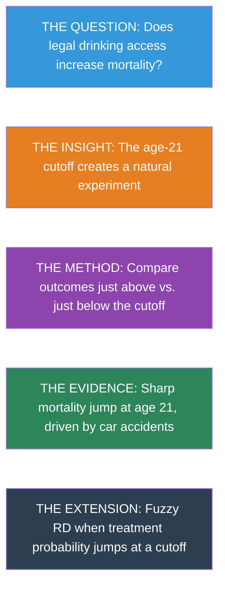
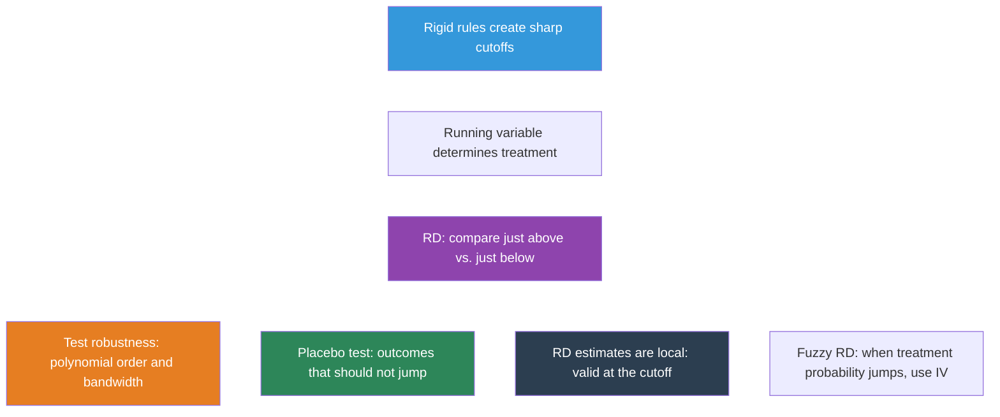

# Chapter 4: Regression Discontinuity

**Mastering Causal Metrics: An AI-Powered Study Guide**

*A companion to Mastering 'Metrics by Angrist & Pischke*

[](https://colab.research.google.com/github/cmg777/intro2causal/blob/main/notebooks_colab/04-regression-discontinuity.ipynb)

---

> 💡 **Learning Objectives**
>

By the end of this chapter, you will be able to:

- Explain how **rigid rules and cutoffs** create natural experiments
- Define the **running variable**, **cutoff**, and **treatment indicator** in an RD design
- Distinguish between **sharp** and **fuzzy** RD designs
- Estimate causal effects using **polynomial regression** at a discontinuity
- Assess robustness through **bandwidth choice** and **specification checks**
- Interpret the RD estimate as a **local causal effect** at the cutoff

This chapter shows how bureaucratic rules --- the very things that seem to reduce randomness --- can actually *create* valuable natural experiments for causal inference.




## Rules Create Experiments

Many policies have sharp eligibility rules. You can vote at 18 but not at 17. You qualify for Medicare at 65 but not at 64. You can legally drink at 21 but not at 20. These cutoffs create a powerful opportunity: people just above and just below the threshold are nearly identical in every way --- except that one group receives the treatment and the other doesn't.

This is the logic of **Regression Discontinuity (RD)** designs. The causal effect is identified by the **jump** in outcomes at the cutoff.

> 📝 **Intuition Builder: The Speed Limit Analogy**
>

Think of a speed limit sign on a highway. The road is the same on both sides of the sign --- same surface, same weather, same cars. But drivers caught going 66 mph vs. 64 mph face very different consequences if the limit is 65. The sign creates a sharp rule that affects behavior, even though the drivers on both sides are virtually identical. RD exploits exactly this kind of rule: people just above and just below a threshold are nearly interchangeable, but the rule treats them differently.

### The MLDA Question

The **minimum legal drinking age (MLDA)** is 21 in the United States. Does reaching this threshold actually affect health? Specifically, does turning 21 --- and gaining legal access to alcohol --- increase mortality?

```python
import pandas as pd
import numpy as np
import statsmodels.formula.api as smf
import matplotlib.pyplot as plt
import seaborn as sns
sns.set_style("whitegrid")

# Load clean MLDA mortality data
# Each row is one monthly age cell with death rates per 100,000
# Key variables:
#   agecell  = age in years (e.g., 19.08, 20.17, 21.00, ...)
#   age      = centered at 21 (so age=0 is the cutoff; negative = under 21)
#   over21   = treatment dummy (1 if age >= 21, 0 otherwise)
#   age2, over_age, over_age2 = polynomial/interaction terms for flexible RD models
#   all, mva, suicide, homicide, internal, alcohol = death rates by cause

# --- Data source ---
DATA = "https://raw.githubusercontent.com/cmg777/intro2causal/main/data/"

mlda = pd.read_csv(DATA + "ch4/mlda_clean.csv")
mlda.head(3)
```


**Output:**

```
   agecell    age        over21  all        mva        suicide    homicide   internal   alcohol   ext_oth    age2      over_age  over_age2
-  ---------  ---------  ------  ---------  ---------  ---------  ---------  ---------  --------  ---------  --------  --------  ---------
0  19.068493  -1.931507  0       92.825400  35.829327  11.203714  16.316818  16.617590  0.639138  12.857960  3.730720  -0.0      0.0
1  19.150684  -1.849316  0       95.100740  35.639256  12.193368  16.859964  18.327684  0.677409  12.080471  3.419968  -0.0      0.0
2  19.232876  -1.767124  0       92.144295  34.205650  11.715812  15.219254  18.911053  0.866443  12.092522  3.122728  -0.0      0.0
```


### Visualizing the Discontinuity

The first step in any RD analysis is to **plot the data**. If the causal effect is real, we should see a visible jump in mortality at age 21.

::: {#cell-fig-scatter .cell execution_count=2}
```python
# Scatter plot: mortality rate vs. age in months
fig, ax = plt.subplots(figsize=(9, 5))
ax.scatter(mlda["agecell"], mlda["all"], color="gray", alpha=0.7, s=40)  # one dot per age cell
ax.axvline(x=21, color="red", linestyle="--", alpha=0.5, label="MLDA cutoff")  # mark the cutoff
ax.set_xlabel("Age (years)")
ax.set_ylabel("Deaths per 100,000")
ax.set_title("All-cause mortality around the 21st birthday")
ax.legend()
plt.tight_layout()
plt.show()
```


**Output:**

{#fig-scatter width=854 height=470}


There is a visible jump right at age 21. Let's now estimate its size formally.

> ⚠️ **Common Misconception: RD is not just "controlling for" the running variable**
>

In standard regression (Chapter 2), we control for confounders to make treated and untreated groups comparable. RD is fundamentally different: there is **no value of the running variable where we observe both treated and untreated individuals**. Everyone over 21 is treated; everyone under 21 is untreated. Instead, RD *extrapolates* the trend from one side of the cutoff to estimate what would have happened without the jump. This is why the functional form (linear vs. quadratic) matters --- it determines how we extrapolate.

With that distinction in mind, let's build the regression model that formalizes the RD approach.

## The Sharp RD Regression

### What Is a Running Variable?

In an RD design, the **running variable** is the variable that determines treatment. Here, age is the running variable and 21 is the **cutoff**. The treatment --- legal access to alcohol --- switches on deterministically at the cutoff:

$$D_a = \begin{cases} 1 & \text{if } a \geq 21 \\ 0 & \text{if } a < 21 \end{cases}$$

where $a$ is age (the running variable) and $D_a$ is the treatment indicator. In our data, these correspond to the columns `agecell` and `over21`.

This is a **sharp RD**: treatment switches completely on at the cutoff, with no exceptions.

> 📝 **How RD regression works**
>

We regress the outcome $M_a$ (mortality rate at age $a$) on the treatment dummy $D_a$ and a smooth function of the running variable:

$$M_a = \alpha + \rho \, D_a + \gamma \, a + e_a$$

- **Intercept** ($\alpha$) = predicted mortality just below the cutoff
- **$\rho$** = the **jump at the cutoff** --- this is the causal effect we want
- **$\gamma$** = the background age trend (mortality naturally changes with age)

In Python, this is: `smf.ols("all ~ over21 + age", data=mlda)` --- where `all` is $M_a$, `over21` is $D_a$, and `age` is $a$.

The key insight: because age varies smoothly, any **sudden jump** at the cutoff must be caused by the treatment.

::: {#tbl-rd-simple .cell tbl-cap='Sharp RD estimate of the MLDA effect on all-cause mortality. The over21 coefficient is the causal jump at the cutoff.' execution_count=3}
```python
# Simple linear RD regression
model = smf.ols("all ~ over21 + age", data=mlda)
result = model.fit(cov_type="HC1")

# Extract key regression results into a clear table
pd.DataFrame({
    "Variable": result.params.index,
    "Coefficient": result.params.round(4).values,
    "Std. Error": result.bse.round(4).values,
    "t-statistic": result.tvalues.round(2).values,
    "p-value": result.pvalues.round(3).values,
})
```


**Output:**

```
           coef     std err  z        P>|z|  [0.025  0.975]
---------  -------  -------  -------  -----  ------  ------
Intercept  91.8414  0.709    129.529  0.000  90.452  93.231
over21     7.6627   1.514    5.060    0.000  4.695   10.631
age        -0.9747  0.664    -1.468   0.142  -2.276  0.326
```


The coefficient on `over21` is approximately **7.7 deaths per 100,000** --- a substantial increase caused by gaining legal access to alcohol.


## Robustness: Does the Specification Matter?

A critical question in RD is whether the estimated jump depends on how we model the age trend. We test robustness in two ways:

1. **Polynomial order**: linear vs. quadratic trends
2. **Bandwidth**: full sample (ages 19--22) vs. narrow window (ages 20--22)

::: {#tbl-rd-robust .cell tbl-cap='RD estimates across specifications and bandwidths for multiple causes of death. Robust standard errors in parentheses.' execution_count=4}
```python
# Define narrow bandwidth subsample (ages 20-22 only)
narrow = mlda[(mlda["agecell"] >= 20) & (mlda["agecell"] <= 22)]

# Outcomes to test: each cause of death
outcomes = {"all": "All causes", "mva": "Motor vehicle", "suicide": "Suicide",
            "internal": "Internal causes", "alcohol": "Alcohol-related"}

# For each cause of death, run 4 RD specifications:
#   1. Linear trend, full sample (ages 19-22)
#   2. Quadratic trend, full sample
#   3. Linear trend, narrow bandwidth (ages 20-22)
#   4. Quadratic trend, narrow bandwidth
# This tests whether the RD estimate is robust to model choice and sample window.
rows = []
for var, label in outcomes.items():
    specs = []

    # Spec 1: Linear, full sample
    model1 = smf.ols(f"{var} ~ over21 + age", data=mlda)
    r1 = model1.fit(cov_type="HC1")
    coef1 = round(r1.params["over21"], 2)
    se1 = round(r1.bse["over21"], 2)
    specs.append(str(coef1) + " (" + str(se1) + ")")

    # Spec 2: Quadratic, full sample
    model2 = smf.ols(f"{var} ~ over21 + age + age2 + over_age + over_age2",
                      data=mlda)
    r2 = model2.fit(cov_type="HC1")
    coef2 = round(r2.params["over21"], 2)
    se2 = round(r2.bse["over21"], 2)
    specs.append(str(coef2) + " (" + str(se2) + ")")

    # Spec 3: Linear, narrow bandwidth
    model3 = smf.ols(f"{var} ~ over21 + age", data=narrow)
    r3 = model3.fit(cov_type="HC1")
    coef3 = round(r3.params["over21"], 2)
    se3 = round(r3.bse["over21"], 2)
    specs.append(str(coef3) + " (" + str(se3) + ")")

    # Spec 4: Quadratic, narrow bandwidth
    model4 = smf.ols(f"{var} ~ over21 + age + age2 + over_age + over_age2",
                      data=narrow)
    r4 = model4.fit(cov_type="HC1")
    coef4 = round(r4.params["over21"], 2)
    se4 = round(r4.bse["over21"], 2)
    specs.append(str(coef4) + " (" + str(se4) + ")")

    rows.append({"Cause of death": label, "Linear (full)": specs[0],
                 "Quadratic (full)": specs[1], "Linear (narrow)": specs[2],
                 "Quadratic (narrow)": specs[3]})

pd.DataFrame(rows)
```


**Output:**

```
   Cause of death   Linear (full)  Quadratic (full)  Linear (narrow)  Quadratic (narrow)
-  ---------------  -------------  ----------------  ---------------  ------------------
0  All causes       7.66 (1.51)    9.55 (1.83)       9.75 (2.06)      9.61 (2.29)
1  Motor vehicle    4.53 (0.72)    4.66 (1.09)       4.76 (1.08)      5.89 (1.33)
2  Suicide          1.79 (0.5)     1.81 (0.78)       1.72 (0.73)      1.3 (1.14)
3  Internal causes  0.39 (0.54)    1.07 (0.8)        1.69 (0.74)      1.25 (1.01)
4  Alcohol-related  0.44 (0.21)    0.8 (0.32)        0.74 (0.33)      1.03 (0.41)
```


> ⭐ **Key findings**
>

- **All-cause mortality**: jumps by 7--10 deaths per 100,000 across all specifications
- **Motor vehicle accidents**: the primary driver (4--6 extra deaths) --- drunk driving is the main mechanism
- **Internal causes**: no significant jump --- this is a **placebo test**. Diseases shouldn't respond to the drinking age, and they don't. This validates the RD design.
- **Results are robust**: similar across linear/quadratic models and bandwidth choices

Why is the **internal causes** placebo so powerful? Diseases like cancer, heart disease, and diabetes take years or decades to develop. There is no biological reason why crossing the age-21 threshold would suddenly cause internal organ failure. So if we found a jump in internal-cause deaths, something else must be changing at 21 (perhaps data reporting practices or insurance eligibility), and we couldn't trust the MVA result either. Finding no jump in this placebo outcome gives us confidence that the design is working as intended.


## Visualizing the RD with Fitted Lines

::: {#cell-fig-rd-fitted .cell execution_count=5}
```python
# Split data at the cutoff
below = mlda[mlda["age"] < 0]   # under 21
above = mlda[mlda["age"] >= 0]  # 21 and over

# Fit separate linear regressions on each side
fit_below = smf.ols("all ~ age", data=below).fit()
fit_above = smf.ols("all ~ age", data=above).fit()

# Plot scatter + fitted lines
fig, ax = plt.subplots(figsize=(9, 5))
ax.scatter(mlda["agecell"], mlda["all"], color="gray", alpha=0.6, s=35)
ax.plot(below["agecell"], fit_below.predict(below), "k-", linewidth=2)   # left line
ax.plot(above["agecell"], fit_above.predict(above), "k-", linewidth=2)   # right line
ax.axvline(x=21, color="red", linestyle="--", alpha=0.5)
ax.set_xlabel("Age (years)")
ax.set_ylabel("Deaths per 100,000")
ax.set_title("Sharp RD: All-cause mortality around the MLDA cutoff")
plt.tight_layout()
plt.show()
```


**Output:**

{#fig-rd-fitted width=854 height=470}

The gap between the two fitted lines at age 21 is the RD estimate --- approximately 7--10 extra deaths per 100,000 caused by legal access to alcohol. Notice how the lines fit the data well on each side of the cutoff, with a clear discontinuous jump right at the threshold.

But what is *driving* this jump? Is it drunk driving, suicide, or something else entirely? The next figure breaks down mortality by cause to answer this question.

::: {#cell-fig-rd-causes .cell execution_count=6}
```python
# Plot two causes on the same figure: MVA (should jump) vs internal (should not)
fig, ax = plt.subplots(figsize=(9, 5))
ax.scatter(mlda["agecell"], mlda["mva"], color="steelblue", alpha=0.6, s=30, label="Motor vehicle")
ax.scatter(mlda["agecell"], mlda["internal"], color="darkorange", alpha=0.6, s=30, label="Internal causes")

# Fit separate regression lines on each side of the cutoff, for each cause of death.
# The outer loop picks the death cause; the inner loop picks below-21 vs. above-21.
for var, color in [("mva", "steelblue"), ("internal", "darkorange")]:
    for subset in [below, above]:
        model = smf.ols(f"{var} ~ age", data=subset)
        fit = model.fit()
        ax.plot(subset["agecell"], fit.predict(subset), color=color, linewidth=2)

ax.axvline(x=21, color="red", linestyle="--", alpha=0.5)  # cutoff line
ax.set_xlabel("Age (years)")
ax.set_ylabel("Deaths per 100,000")
ax.set_title("RD by cause: Motor vehicle accidents vs. internal causes")
ax.legend()
plt.tight_layout()
plt.show()
```


**Output:**

{#fig-rd-causes width=854 height=470}

The figure makes the story clear. Motor vehicle deaths (blue) show a sharp upward jump at age 21 --- consistent with drunk driving as the primary mechanism. Internal causes of death (orange) show no discontinuity at the cutoff, exactly as expected: diseases like cancer and heart disease do not respond to a birthday. This placebo outcome validates the RD design.


## Sharp vs. Fuzzy RD

The MLDA example is a **sharp** RD because treatment switches completely at the cutoff. Many real-world policies create fuzzier boundaries, where the cutoff changes the *probability* of treatment rather than guaranteeing it. We explore this variant conceptually here; Chapter 6's sheepskin analysis provides a concrete code example.

**Boston exam schools** illustrate a **fuzzy RD**. Students are admitted based on a test score cutoff, but not everyone above the cutoff enrolls, and some below it get in through other channels. In a fuzzy RD, the *probability* of treatment jumps at the cutoff, but doesn't go from 0 to 1.

Fuzzy RD is analyzed using **IV/2SLS**, with the cutoff dummy as the instrument for actual treatment. The first stage captures the jump in treatment probability; the second stage estimates the causal effect on compliers.

| Feature | Sharp RD | Fuzzy RD |
|:---|:---|:---|
| Treatment at cutoff | Switches completely on/off | Probability jumps |
| Estimation | OLS with running variable control | IV/2SLS with cutoff as instrument |
| Interpretation | Effect of treatment | LATE for compliers at the cutoff |

: Sharp vs. fuzzy regression discontinuity designs {.striped}

> 📝 **Connection to Chapter 3: Fuzzy RD is IV at a Cutoff**
>

Fuzzy RD is a special case of instrumental variables. The cutoff dummy serves as the instrument, the treatment probability jumps at the cutoff (first stage), and the outcome may jump too (reduced form). The ratio --- reduced form / first stage --- gives the LATE for compliers at the cutoff. If you understand IV from Chapter 3, you already understand fuzzy RD.

Research on Boston exam schools found that peer quality jumped by 0.8 standard deviations at the admissions cutoff, but student achievement showed **no corresponding jump**. This challenges the widely held belief that attending a more selective school --- with higher-ability peers --- causally improves outcomes. The policy implication is that reallocating students across schools of different selectivity may not improve achievement, even though the raw correlation between school quality and student outcomes is strong (selection bias at work again).


## Historical Perspective: Donald Campbell

The RD design was invented by **Donald Thistlethwaite and Donald Campbell** in 1960. They studied whether receiving National Merit Scholarship recognition affected students' career plans. Their RD analysis at the recognition cutoff found minimal effects --- one of the first applications of this now-ubiquitous method.

Campbell went on to pioneer quasi-experimental methods more broadly, co-authoring influential textbooks on research design that shaped how social scientists think about causal inference outside of true experiments.


## Key Takeaways




1. **RD exploits cutoff rules** where treatment switches on at a threshold of a running variable.

2. **The causal effect** is the jump in outcomes at the cutoff, after controlling for the smooth relationship between the running variable and the outcome.

3. **Always plot the data first.** Visual inspection is the most important step in RD.

4. **Test robustness** by varying polynomial order (linear vs. quadratic) and bandwidth (wide vs. narrow).

5. **Placebo tests** on outcomes unaffected by treatment (e.g., internal causes of death) validate the design.

6. **RD estimates are local** --- they apply to people near the cutoff and may not generalize to people far from it.

7. **Fuzzy RD** handles cases where treatment probability (not treatment itself) jumps, using IV at the cutoff.


## Learn by Coding

Copy this code into a Python notebook to reproduce the key results from this chapter.

```python
# ============================================================
# Chapter 4: Regression Discontinuity — Code Cheatsheet
# ============================================================
import pandas as pd
import matplotlib.pyplot as plt
import statsmodels.formula.api as smf

DATA = "https://raw.githubusercontent.com/cmg777/intro2causal/main/data/"

# --- Step 1: Load MLDA mortality data ---
mlda = pd.read_csv(DATA + "ch4/mlda_clean.csv")
print("MLDA data:", mlda.shape[0], "age cells")
print(mlda[["agecell", "over21", "all", "mva", "internal"]].head())

# --- Step 2: Plot the discontinuity ---
fig, ax = plt.subplots(figsize=(8, 5))
ax.scatter(mlda["agecell"], mlda["all"], color="gray", alpha=0.7, s=40)
ax.axvline(x=21, color="red", linestyle="--", label="MLDA cutoff (age 21)")
ax.set_xlabel("Age")
ax.set_ylabel("Deaths per 100,000")
ax.set_title("All-cause mortality around the MLDA cutoff")
ax.legend()
plt.show()

# --- Step 3: Sharp RD regression (linear) ---
model = smf.ols("all ~ over21 + age", data=mlda)
result = model.fit(cov_type="HC1")
print("\nSharp RD — linear specification:")
print(pd.DataFrame({
    "Variable": result.params.index,
    "Coefficient": result.params.round(4).values,
    "Std. Error": result.bse.round(4).values,
    "t-statistic": result.tvalues.round(2).values,
    "p-value": result.pvalues.round(3).values,
}))
print(f"  Jump at cutoff: {round(result.params['over21'], 2)} deaths per 100k")

# --- Step 4: Quadratic RD for robustness ---
model = smf.ols("all ~ over21 + age + age2 + over_age + over_age2", data=mlda)
result = model.fit(cov_type="HC1")
print("\nSharp RD — quadratic specification:")
print(f"  Jump at cutoff: {round(result.params['over21'], 2)} deaths per 100k")

# --- Step 5: Placebo test (internal causes should NOT jump) ---
model = smf.ols("internal ~ over21 + age", data=mlda)
result = model.fit(cov_type="HC1")
print(f"\nPlacebo test (internal causes): {round(result.params['over21'], 2)}")
print("  (Expect: small and insignificant — diseases don't respond to MLDA)")
```

> 💡 **Try it yourself!**
>
Copy the code above and paste it into [this Google Colab scratchpad](https://colab.research.google.com/notebooks/empty.ipynb) to run it interactively. Modify the variables, change the specifications, and see how results change!


## Exercises

### Multiple Choice Questions

> ✏️ **Multiple Choice Questions**
>

1. **What makes a regression discontinuity design possible?**
   a) Random assignment of treatment to participants
   b) A rigid rule or cutoff that determines treatment eligibility
   c) A large sample size with many treated individuals
   d) The availability of panel data over multiple time periods

2. **In a sharp RD design, the "running variable" is:**
   a) The outcome variable that we want to measure
   b) The variable that determines treatment status through a cutoff
   c) A control variable included to reduce bias
   d) The time variable in a panel dataset

3. **In the MLDA study, what serves as a placebo test?**
   a) Comparing mortality rates for people aged 25 vs. 26
   b) Checking whether internal-cause deaths (diseases) jump at age 21
   c) Testing whether the drinking age varies across states
   d) Comparing drunk driving rates before and after the policy change

4. **Why is bandwidth choice important in RD designs?**
   a) A wider bandwidth always gives more accurate estimates
   b) A narrower bandwidth reduces bias but increases variance — there is a trade-off
   c) The bandwidth must equal the distance between the cutoff and the mean
   d) Bandwidth only matters in fuzzy RD, not sharp RD

5. **A fuzzy RD differs from a sharp RD because:**
   a) The cutoff is not precisely defined
   b) The outcome variable is continuous rather than binary
   c) Treatment probability jumps at the cutoff but does not go from 0% to 100%
   d) The running variable is measured with error

### Conceptual Questions

> ✏️ **Conceptual Questions**
>

1. **Identifying RD opportunities**: A scholarship program awards funding to students who score above 80 on an entrance exam. (a) What is the running variable? (b) What is the cutoff? (c) Is this a sharp or fuzzy RD? (d) What assumption must hold for the RD estimate to be causal?

2. **The placebo test**: In our MLDA analysis, internal causes of death showed no jump at age 21. Why is this important for the credibility of the RD design? What would it mean if internal causes *did* show a significant jump?

3. **Bandwidth tradeoff**: Explain the tradeoff between using a narrow bandwidth (ages 20--22) and a wide bandwidth (ages 19--23) in an RD analysis. What does each gain and lose?

4. **Manipulation of the running variable**: Why is manipulation of the running variable a threat to RD validity? Can people manipulate their age? What about an exam score? Give an example where manipulation would be a serious concern.

5. **Local vs. global effects**: The RD estimate tells us about the effect of legal drinking for people *at* the age-21 cutoff. Why might this effect differ from the effect at age 18 or age 25? What does "local" mean in this context?

### Research Tasks

> ✏️ **Research Tasks**
>

1. **Alcohol-related deaths**: Using `mlda_clean.csv`, run the linear RD regression for `alcohol`-related deaths (instead of all-cause). Is the jump at age 21 statistically significant? How does the effect size compare to the `mva` result?

2. **Visualizing the suicide RD**: Using `mlda_clean.csv`, create an RD scatter plot for `suicide` deaths with separate fitted lines on each side of the cutoff. Does the visual pattern match what the regression coefficient suggests?

3. **Quadratic vs. linear specification**: Using `mlda_clean.csv`, run the quadratic RD model for all-cause mortality (including `age2`, `over_age`, `over_age2`). Compare the coefficient on `over21` with the linear model. Is the estimate sensitive to the polynomial order?


## Solutions

### Multiple Choice Questions

**MCQ1.** **(b)** RD exploits rigid rules --- such as age thresholds, test score cutoffs, or income limits --- that create sharp changes in treatment eligibility. People just above and just below the cutoff are nearly identical, creating a natural experiment. **(a) is wrong** because random assignment of treatment describes randomized controlled trials (RCTs), not RD --- RD is observational, with treatment determined by a cutoff rule. **(c) is wrong** because while matching on observables can help, it is not what defines RD; RD specifically relies on a known cutoff in a running variable. **(d) is wrong** because before-after comparisons describe difference-in-differences, not RD.

**MCQ2.** **(b)** The running variable is the continuous variable (like age) that determines whether someone is above or below the cutoff. In the MLDA example, age is the running variable and 21 is the cutoff. **(a) is wrong** because the death rate is the outcome variable, not the running variable --- the running variable determines treatment assignment, not the effect we measure. **(c) is wrong** because income is a potential confounder, not the variable that determines the sharp change in treatment at a cutoff. **(d) is wrong** because the treatment group label is a binary indicator derived from the running variable, not the running variable itself.

**MCQ3.** **(b)** Internal-cause deaths (cancer, heart disease) should NOT respond to turning 21, because these diseases develop over years. Finding no jump in internal-cause deaths at age 21 validates the design --- it confirms that the observed jump in motor vehicle deaths is not an artifact of data reporting or other changes at age 21. This is a placebo test: if a variable that should be unaffected by the treatment also jumps at the cutoff, the design is suspect. **(a) is wrong** because a jump in internal deaths would undermine, not confirm, the design. **(c) is wrong** because internal causes are used precisely because they should not be affected by alcohol access --- they serve as a falsification check. **(d) is wrong** because internal causes are relevant to validating the RD design, not irrelevant.

**MCQ4.** **(b)** Narrower bandwidths compare people closer to the cutoff (more comparable, less bias) but use fewer observations (more noise, higher variance). Wider bandwidths use more data but include people farther from the cutoff who may differ in other ways. This bias-variance trade-off is fundamental to RD. **(a) is wrong** because wider bandwidths do not always give better estimates --- they reduce variance but introduce bias from nonlinear trends in the running variable. **(c) is wrong** because bandwidth choice matters greatly for RD; it is not irrelevant. **(d) is wrong** because narrower bandwidths reduce bias (not increase it) by restricting comparison to more similar units near the cutoff.

**MCQ5.** **(c)** In a fuzzy RD, the probability of receiving treatment jumps at the cutoff but does not switch from 0 to 1. For example, in Boston exam schools, scoring above the admission cutoff increases the probability of enrollment but does not guarantee it. A fuzzy RD is estimated using IV, with the cutoff indicator as the instrument for actual treatment. **(a) is wrong** because a fuzzy RD does not require perfect compliance --- that would be a sharp RD. **(b) is wrong** because fuzzy RD does not mean the cutoff is unknown; the cutoff is known but compliance is imperfect. **(d) is wrong** because fuzzy RD applies to a single cutoff with partial compliance, not to multiple cutoffs.

### Conceptual Questions

**Q1.** **Designing an RD requires identifying the running variable, the cutoff, the sharpness of compliance, and the continuity assumption.**

1. The running variable is the entrance exam score --- this is the continuous measure that determines treatment assignment at the threshold.
2. The cutoff is 80. Students scoring above this threshold are eligible for funding; those below are not.
3. If all students above 80 receive funding and none below do, it is a sharp RD (perfect compliance). If some above 80 decline the scholarship and some below 80 receive funding through appeals or exceptions, it is a fuzzy RD --- estimated using IV with the cutoff indicator as the instrument for actual scholarship receipt.
4. The key assumption is continuity: all other factors affecting the outcome must vary *smoothly* at the cutoff. Students scoring 79 and 81 must be comparable in every way except scholarship receipt. If students can manipulate their scores to land above 80, this assumption fails because the two groups would differ systematically.

**Q2.** **Placebo tests using outcomes that should not respond to the treatment are essential for validating any RD design.**

1. Internal causes of death (diseases, cancer, etc.) should not be affected by legal drinking access at age 21 --- these conditions take years to develop and have no plausible connection to alcohol availability.
2. Finding no jump in internal causes at the cutoff confirms that the RD design is picking up the causal effect of alcohol access specifically, not some other factor that changes at 21.
3. If internal causes *did* show a significant jump, it would suggest that something other than drinking is changing at the cutoff (e.g., a change in health insurance eligibility, data reporting practices, or census age-heaping), casting doubt on the entire RD design.
4. This logic extends to any RD application: researchers should always test outcomes that the treatment should not affect. A clean placebo test strengthens the causal interpretation; a failed one demands investigation before results can be trusted.

**Q3.** **The bandwidth choice in RD embodies a fundamental bias-variance tradeoff: proximity to the cutoff improves comparability but reduces statistical power.**

1. A narrow bandwidth (e.g., ages 20--22) reduces bias because people very close to the cutoff are nearly identical, and nonlinear trends in the running variable have less room to confuse the estimate. The continuity assumption is most plausible for observations right at the cutoff.
2. However, a narrow bandwidth increases variance because fewer observations are used, making the estimate noisier and confidence intervals wider.
3. A wide bandwidth (ages 19--23) uses more data, giving more precise estimates, but risks bias from nonlinear trends in the outcome-running variable relationship that could be mistaken for (or mask) a discontinuity.
4. The optimal choice balances this tradeoff. In practice, researchers report estimates across multiple bandwidths to show robustness --- if the RD estimate is sensitive to bandwidth choice, it raises concerns about specification dependence.

**Q4.** **Manipulation of the running variable is the greatest threat to RD validity because it destroys the comparability of units just above and just below the cutoff.**

1. If people can manipulate the running variable to land on their preferred side of the cutoff, the groups just above and just below are no longer comparable --- those who manipulated are systematically different from those who did not (e.g., more motivated, better connected, or wealthier).
2. Age cannot be manipulated (you cannot choose your birthday), which is why the MLDA design is strong. The continuity assumption is highly credible because no one can precisely sort themselves to one side of age 21.
3. Exam scores, however, can be manipulated: students might retake exams, cheat, or receive score adjustments near the cutoff. This creates "bunching" just above the threshold.
4. A concerning example would be a tax threshold where accountants manipulate reported income to fall just below the cutoff for a higher tax rate --- the McCrary density test can detect such manipulation by checking whether the density of the running variable is discontinuous at the cutoff.

### Research Tasks

**R1.**

```python
# --- Setup ---
import pandas as pd
import statsmodels.formula.api as smf

mlda = pd.read_csv(DATA + "ch4/mlda_clean.csv")

# --- Compare RD Estimates Across Death Causes ---
# Estimate the discontinuity at age 21 for two cause-of-death categories
rows = []
for var, label in [("alcohol", "Alcohol-related"), ("mva", "Motor vehicle")]:
    r = smf.ols(f"{var} ~ over21 + age", data=mlda).fit(cov_type="HC1")  # linear RD with robust SEs
    rows.append({
        "Cause": label,
        "RD estimate (over21)": round(r.params["over21"], 2),  # jump at cutoff
        "SE": round(r.bse["over21"], 2),
        "t-stat": round(r.tvalues["over21"], 2),
    })

# --- Display Results ---
pd.DataFrame(rows)
```

**(1) What the numbers show:** The alcohol-related death jump is much smaller than the MVA jump (roughly one-fifth the size), but it is statistically significant. Both causes show a clear discontinuity at age 21. **(2) Why:** Relatively few young people die directly from alcohol poisoning, but many die in alcohol-related car accidents. The dominant mechanism through which legal drinking access kills is drunk driving, not direct alcohol toxicity. **(3) What it teaches:** Comparing RD estimates across different outcomes reveals the causal channels through which a treatment operates. The large MVA effect relative to the small alcohol-poisoning effect tells us that the policy-relevant margin of the MLDA is traffic safety, which informs where interventions (e.g., DUI enforcement) should be targeted.

**R2.**

```python
# --- Setup ---
import matplotlib.pyplot as plt
import seaborn as sns
sns.set_style("whitegrid")

# --- Split Data at Cutoff ---
below = mlda[mlda["age"] < 0]  # observations below age 21
above = mlda[mlda["age"] >= 0]  # observations at or above age 21

# --- Fit Separate Linear Trends ---
fit_below = smf.ols("suicide ~ age", data=below).fit()  # trend before cutoff
fit_above = smf.ols("suicide ~ age", data=above).fit()  # trend after cutoff

# --- Create RD Plot ---
fig, ax = plt.subplots(figsize=(9, 5))
ax.scatter(mlda["agecell"], mlda["suicide"], color="gray", alpha=0.6, s=35)  # raw data points
ax.plot(below["agecell"], fit_below.predict(below), "k-", linewidth=2)  # left-side fit
ax.plot(above["agecell"], fit_above.predict(above), "k-", linewidth=2)  # right-side fit
ax.axvline(x=21, color="red", linestyle="--", alpha=0.5)  # cutoff line
ax.set_xlabel("Age (years)")
ax.set_ylabel("Deaths per 100,000")
ax.set_title("Suicide deaths around the MLDA cutoff")
plt.tight_layout()
plt.show()
```

**(1) What the numbers show:** The visual shows a modest upward jump at age 21, consistent with the regression estimate of about 1.8 deaths per 100,000. The effect is smaller and noisier than for motor vehicle accidents. **(2) Why:** Alcohol can contribute to suicide through impulsivity and impaired judgment, but the link is less direct than for drunk driving. Suicide involves complex psychological factors that alcohol may exacerbate but rarely causes alone. **(3) What it teaches:** This RD plot illustrates why visual inspection is critical --- it reveals both the magnitude of the jump and the noise in the data. The gap between the two fitted lines at the cutoff is the RD estimate, and the scatter of points around the lines shows why standard errors matter for inference.

**Q5.** **RD estimates are inherently local --- they identify the causal effect only at the cutoff, and generalizing to other values of the running variable requires untestable assumptions.**

1. "Local" means the RD estimate applies specifically to people at the cutoff --- those just turning 21. The design compares outcomes in an infinitesimally narrow window around this threshold.
2. At age 18, people may have less driving experience, so the mortality effect of alcohol access could be larger or smaller. At age 25, people may drink more responsibly, implying a different treatment effect.
3. The RD cannot tell us about these other ages without extrapolation, which requires stronger assumptions about how the treatment effect varies with age --- assumptions that the data near the cutoff cannot verify.
4. This locality is analogous to LATE in IV: just as IV identifies effects only for compliers, RD identifies effects only at the cutoff. Both methods trade external validity for strong internal validity at a specific margin.

**R3.**

```python
# --- Setup ---
import pandas as pd
import statsmodels.formula.api as smf

mlda = pd.read_csv(DATA + "ch4/mlda_clean.csv")

# --- Linear RD Specification ---
# Controls for a linear trend in age on both sides of the cutoff
r_lin = smf.ols("all ~ over21 + age", data=mlda).fit(cov_type="HC1")

# --- Quadratic RD Specification ---
# Allows curvature and different slopes/curvature on each side via interactions
r_quad = smf.ols("all ~ over21 + age + age2 + over_age + over_age2", data=mlda).fit(cov_type="HC1")

# --- Compare Estimates ---
pd.DataFrame({
    "Specification": ["Linear", "Quadratic (interacted)"],
    "RD estimate (over21)": [round(r_lin.params["over21"], 2), round(r_quad.params["over21"], 2)],
    "SE": [round(r_lin.bse["over21"], 2), round(r_quad.bse["over21"], 2)],
})
```

**(1) What the numbers show:** The quadratic estimate is somewhat larger (~9.5 vs. ~7.7) because the quadratic specification allows the outcome trend to curve differently on each side of the cutoff, potentially capturing a steeper jump. Both estimates are statistically significant and in the same ballpark. **(2) Why:** The linear specification constrains the relationship between age and mortality to be a straight line, which may underestimate the discontinuity if the true relationship is curved. The quadratic specification with interactions (over_age, over_age2) allows different slopes and curvature on each side, providing a more flexible fit. **(3) What it teaches:** The fact that the estimate is robust to polynomial order strengthens confidence in the RD design. Sensitivity to specification would suggest that the "discontinuity" might be an artifact of functional form assumptions rather than a true jump. Reporting multiple specifications is standard RD practice and essential for credibility.
