# Mastering Causal Metrics: An AI-Powered Study Guide

**A companion to *Mastering 'Metrics* by Angrist & Pischke**

*By Carlos Mendez*

---

# Preface


**Welcome to *Mastering Causal Metrics*!** This book is an AI-powered study guide designed to accompany *Mastering 'Metrics: The Path from Cause to Effect* by Joshua D. Angrist and Jorn-Steffen Pischke. It brings the key lessons, empirical examples, and econometric tools of the book into the interactive, computational world of Python programming and AI-enhanced learning.

The vision behind this project is to make causal inference accessible, interactive, and engaging. By combining rigorous econometric concepts with cloud-based computational notebooks and AI-powered learning tools, we aim to transform the journey of learning causal inference into an exciting, hands-on discovery of how data can reveal cause and effect.

## The Challenge of Learning Causal Inference

Causal inference is one of the most important---and most challenging---topics in modern social science. The core question is deceptively simple: *does X cause Y?* But answering it rigorously requires understanding selection bias, potential outcomes, and a toolkit of clever research designs that economists have developed over decades.

Traditional approaches to learning these methods face two hurdles. First, the conceptual leap from correlation to causation is genuinely difficult---it requires rethinking how we interpret data. Second, the gap between understanding a method in theory and implementing it with real data can be substantial.

This book addresses both challenges by providing:

- **Conceptual frameworks** with visual diagrams and intuitive explanations
- **Working Python code** that implements every method on real datasets
- **AI-powered learning aids** that offer multiple ways to engage with the material

## This Book's Approach

This study guide follows Angrist and Pischke's *Mastering 'Metrics*, which organizes causal inference around **five core tools**:

1. **Randomized Trials** --- The gold standard for causal inference
2. **Regression** --- The workhorse that controls for observable differences
3. **Instrumental Variables** --- Exploiting natural experiments through exogenous variation
4. **Regression Discontinuity** --- Using sharp cutoffs to identify causal effects
5. **Differences-in-Differences** --- Comparing changes over time across groups

Each chapter provides a complete study guide with learning objectives, visual roadmaps, hands-on Python code, and interpretation guides. The final chapter synthesizes all five tools through the lens of a single question: *What are the returns to schooling?*

## Three Pillars of Learning

### Pillar 1: Causal Inference Foundations

The foundation rests on Angrist and Pischke's pedagogical framework, which makes sophisticated econometric methods accessible through real-world examples and clear exposition. You will learn not just *how* to use each tool, but *when* and *why* each one works---and when it might fail.

### Pillar 2: Computational Python Notebooks

Every chapter has a corresponding Python notebook that can run in Google Colab with zero installation. Data streams directly from GitHub, making each notebook fully self-contained. You will work with the same real datasets used in the book: the RAND Health Insurance Experiment, the Oregon Health Plan lottery, the Minneapolis Domestic Violence Experiment, and more.

The Python stack includes:

- **pandas** for data manipulation
- **statsmodels** for OLS, WLS, and regression with robust standard errors
- **linearmodels** for instrumental variables (2SLS)
- **matplotlib** and **seaborn** for visualization

Every chapter ends with exercises --- multiple choice and open-ended --- with solutions revealed through inline toggle boxes, so you can test your understanding immediately.

### Pillar 3: AI-Powered Learning

AI-enhanced study materials complement the notebooks:

- **Five AI Tutors** --- Learning Coach, Socratic Challenger, Code-First Experimenter, Exam Coach, and Case-Study Explainer --- each a Google Gemini Gem with a distinct pedagogical style
- **Visual roadmaps** and concept diagrams for every chapter
- **AI-generated podcasts** (via NotebookLM) for each chapter, so you can review key ideas on the go
- **YouTube videos** --- curated lectures and AI-generated video summaries --- linked per chapter

## Who This Book Is For

**Economics and social science students** taking their first econometrics or causal inference course will find a comprehensive, hands-on companion to *Mastering 'Metrics*.

**Researchers and analysts** looking to apply causal inference methods to their own data will benefit from seeing complete Python implementations of each technique.

**Self-learners** interested in causal reasoning will appreciate the zero-installation approach and multiple learning modalities.

## How to Use This Book

**If you're reading alongside *Mastering 'Metrics***: Follow the chapters in order. Each study guide corresponds to a chapter in the book and is designed to reinforce and extend the material.

**If you're looking for a specific method**: Jump directly to the relevant chapter. Each study guide is self-contained with its own data loading and setup.

**If you want hands-on practice**: Open the Google Colab notebooks and run the code yourself. Experiment with the data, modify the analyses, and work through the exercises.

**Accessibility features**: The book supports dark and light reading modes, includes a Google Translate widget for multilingual access, and provides visual summary cards and historical perspective sections in most chapters to give you multiple entry points into each topic.

## Acknowledgments

This project builds on the excellent work of Joshua D. Angrist and Jorn-Steffen Pischke, whose *Mastering 'Metrics* (Princeton University Press, 2015) provides the conceptual foundation for everything here. The datasets used in this project are made available through the book's companion website.

Additional inspiration comes from Matheus Facure's *Causal Inference for the Brave and True* and Scott Cunningham's *Causal Inference: The Mixtape*, which demonstrate the power of making econometrics accessible through code.


---


# Part 1: The Framework


---


## Chapter 1: Randomized Trials

**Mastering Causal Metrics: An AI-Powered Study Guide**

*A companion to Mastering 'Metrics by Angrist & Pischke*

[](https://colab.research.google.com/github/cmg777/intro2causal/blob/main/notebooks_colab/01-randomized-trials.ipynb)

---


> 💡 **Learning Objectives**
>
>
> By the end of this chapter, you will be able to:
>
> - Explain why simple comparisons between treated and untreated groups often fail to reveal causal effects
> - Define **potential outcomes**, **selection bias**, and **average treatment effects**
> - Describe how **random assignment** eliminates selection bias
> - Use **regression on a dummy variable** as a tool to compare group means
> - Interpret results from two landmark health insurance experiments
> - Understand **standard errors** and **statistical significance**


This chapter follows a clear arc: we start with a real-world question, discover why naive data comparisons are misleading, learn the theoretical framework that explains the problem, and then see how randomized experiments provide a solution.

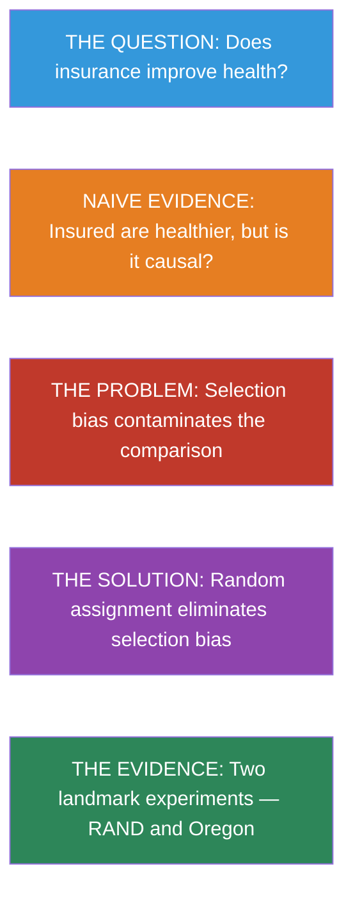


### Key Concepts and Definitions

**Potential Outcomes ($Y_{1i}$, $Y_{0i}$):** The two hypothetical outcomes for each individual --- one if treated, one if not. The causal effect is the difference between them, but we can only ever observe one.

> 💡 **Example**
>
> A patient's health if she receives a new drug ($Y_{1i}$) versus her health if she takes a placebo ($Y_{0i}$). We observe one; the other remains forever unknown.

> 📝 **Analogy**
>
> Like choosing between two routes to work. You take Route A and arrive in 20 minutes, but you will never know how long Route B would have taken that same morning.


**Causal Effect:** The difference between what happens to an individual with treatment and what would have happened without it ($Y_{1i} - Y_{0i}$). It answers the question "what did the treatment actually do?"

> 💡 **Example**
>
> If a student scores 85 on a test after tutoring but would have scored 75 without it, the causal effect of tutoring is +10 points.

> 📝 **Analogy**
>
> Like measuring how much faster you run with new shoes by comparing your time to what you would have run in your old shoes on the same day --- not to someone else's time.


**Fundamental Problem of Causal Inference:** We can never observe both potential outcomes for the same individual at the same time, so individual causal effects are inherently unobservable.

> 💡 **Example**
>
> We cannot simultaneously see how a city's economy performs both with and without a new minimum wage law. We must choose one policy and live with it.

> 📝 **Analogy**
>
> Like watching a movie --- you cannot experience the same movie for the first time twice to compare your reactions.


**Selection Bias:** A systematic difference in baseline characteristics between the treated and untreated groups that contaminates the observed comparison, making it impossible to attribute the difference to the treatment alone.

> 💡 **Example**
>
> People who voluntarily buy gym memberships are already more health-conscious, so comparing gym members to non-members overstates the health benefits of exercise.

> 📝 **Analogy**
>
> Like comparing test scores of students who choose to attend after-school study hall versus those who skip it. The attendees were probably more motivated to begin with.


**Confounder:** A variable that influences both the treatment and the outcome, creating a spurious association between them.

> 💡 **Example**
>
> Family income affects both whether a child attends private school (treatment) and the child's test scores (outcome), making it look like private school boosts scores even if it does not.

> 📝 **Analogy**
>
> Like blaming an umbrella for rain. People carry umbrellas on rainy days, but the umbrella did not cause the rain --- the weather (the confounder) caused both.


**Randomized Controlled Trial (RCT):** An experiment in which treatment is assigned randomly (like a coin flip), ensuring that treatment and control groups are comparable on all characteristics, both observed and unobserved.

> 💡 **Example**
>
> The Oregon Health Plan lottery randomly selected applicants to receive Medicaid, creating two groups that differed only by insurance status.

> 📝 **Analogy**
>
> Like shuffling a deck of cards and dealing two hands. Neither hand is systematically better --- any differences are pure luck.


**Random Assignment:** The process of using a random mechanism (lottery, coin flip, random number generator) to determine who receives treatment, breaking any link between treatment and pre-existing characteristics.

> 💡 **Example**
>
> In the RAND HIE, families were randomly assigned to insurance plans of different generosity, so high-income families were equally likely to end up in any plan group.

> 📝 **Analogy**
>
> Like a teacher assigning lab partners by drawing names from a hat rather than letting students choose. The hat does not care who is popular or smart.


**Law of Large Numbers:** A statistical theorem guaranteeing that, as the sample size grows, the sample average converges to the population average. This is why large randomized experiments produce balanced groups.

> 💡 **Example**
>
> Roll a die 10 times and the average may be far from 3.5. Roll it 100,000 times and the average will be almost exactly 3.5.

> 📝 **Analogy**
>
> Like a casino's edge. Any single bet is unpredictable, but over thousands of games, the house reliably wins because averages stabilize.


**Balance Check:** A test performed after randomization to verify that treatment and control groups look similar on observable baseline characteristics. If balance holds, we trust that randomization worked.

> 💡 **Example**
>
> In the RAND HIE, researchers verified that age, income, education, and health were similar across plan groups before looking at outcomes.

> 📝 **Analogy**
>
> Like a referee checking that both teams have the right number of players before the game starts. It does not guarantee a fair game, but failure would be a red flag.


**Standard Error (SE):** A measure of how much a sample estimate would vary across different random samples. Smaller standard errors mean more precise estimates.

> 💡 **Example**
>
> A treatment effect of 5.0 with SE = 1.0 is precisely estimated; the same effect with SE = 10.0 is very uncertain.

> 📝 **Analogy**
>
> Like the wobble of a bathroom scale. A high-quality scale gives consistent readings (small SE); a cheap scale gives different numbers each time (large SE).


**t-Statistic:** The ratio of an estimated coefficient to its standard error (coefficient / SE). It measures how many standard errors the estimate is from zero.

> 💡 **Example**
>
> A coefficient of 8.0 with SE of 2.0 gives a t-statistic of 4.0, meaning the estimate is 4 standard errors away from zero --- strong evidence of a real effect.

> 📝 **Analogy**
>
> Like a signal-to-noise ratio on a radio. A t-statistic of 4 means the signal is much louder than the static; a t-statistic of 0.5 means the static drowns out the signal.


**Statistical Significance:** A result is statistically significant (at the 5% level) when its t-statistic exceeds 2 in absolute value, meaning it is unlikely to have arisen by chance alone.

> 💡 **Example**
>
> A study finds that a job training program increases earnings by \$2,000 with a t-statistic of 3.1. This is statistically significant --- we can be confident the program had a real effect.

> 📝 **Analogy**
>
> Like a fire alarm. It goes off only when the evidence of fire (smoke) is strong enough. A significant result says "this is probably real, not just random noise."


**Moral Hazard:** The tendency for people to change their behavior when they are insulated from the consequences of that behavior, often used when insurance reduces the cost of risky choices.

> 💡 **Example**
>
> In the RAND HIE, people with free insurance spent about 45% more on health care than those who paid most of their own costs.

> 📝 **Analogy**
>
> Like an all-you-can-eat buffet. When each additional plate costs nothing, people eat more than they would at a restaurant where they pay per dish.


**Dummy Variable Regression:** A regression where the key explanatory variable is binary (0 or 1). The intercept gives the average for the reference group, and the coefficient on the dummy gives the difference in means between the two groups.

> 💡 **Example**
>
> Regressing health on an insurance dummy (0 = uninsured, 1 = insured). The intercept is the average health of the uninsured; the coefficient is the insured-minus-uninsured gap.

> 📝 **Analogy**
>
> Like a light switch. The variable is either "on" or "off," and we measure how the outcome changes when we flip it.


**Difference in Means:** The simplest estimator of a treatment effect: the average outcome of the treated group minus the average outcome of the control group. In a randomized experiment, this equals the causal effect.

> 💡 **Example**
>
> Average test score for tutored students is 82; for untutored students it is 76. The difference in means is 82 - 76 = 6 points.

> 📝 **Analogy**
>
> Like comparing the average height of a basketball team to that of a chess club. Simple subtraction tells you the gap, but only randomization tells you it is causal.


**Intent-to-Treat (ITT):** The effect of being *assigned* to treatment, regardless of whether the individual actually received it. It captures the overall policy impact including non-compliance.

> 💡 **Example**
>
> In the Oregon lottery, the ITT is the effect of winning the lottery on health outcomes, even though only 25% of winners actually enrolled in Medicaid.

> 📝 **Analogy**
>
> Like measuring the effect of receiving an invitation to a party, whether or not you actually attend. The invitation changed your options, even if you stayed home.


**Clustering (of Standard Errors):** Adjusting standard errors to account for the fact that observations within the same group (family, school, state) are correlated, preventing falsely precise estimates.

> 💡 **Example**
>
> In the RAND HIE, family members share the same insurance plan, so their outcomes are correlated. Clustering SEs by family corrects for this.

> 📝 **Analogy**
>
> Like counting votes by household rather than by individual. If everyone in a household votes the same way, counting each person separately would overstate how many independent opinions you have.


**Robust Standard Errors:** Standard errors adjusted for heteroskedasticity --- the possibility that the variance of the error term differs across observations. They provide valid inference even when the standard OLS assumption of constant variance fails.

> 💡 **Example**
>
> Earnings regressions often have more variable residuals for high-income individuals. Robust SEs account for this, preventing overconfident conclusions.

> 📝 **Analogy**
>
> Like adjusting your confidence interval when measuring an uneven road. Some stretches are smooth (low variability) and others are bumpy (high variability) --- you need wider margins of error for the bumpy parts.


**Weighted Least Squares (WLS):** A variant of OLS that gives more weight to observations that are more precisely measured or more representative, producing more efficient estimates.

> 💡 **Example**
>
> When analyzing state-level death rates, states with larger populations have more reliable rates and receive more weight in WLS.

> 📝 **Analogy**
>
> Like averaging restaurant reviews but trusting a reviewer who has eaten there 50 times more than one who visited once. More informative observations get a louder voice.


### Does Health Insurance Improve Health?

The United States spends more on health care than any other developed country, yet millions of Americans remain uninsured. A natural question arises: **does having health insurance actually make people healthier?**

> 📝 **Intuition Builder: The Road Not Taken**
>
>
> Imagine standing at a fork in a road. One path leads through a world where you have health insurance; the other through a world where you don't. You can only walk one path --- you'll never know what would have happened on the other. This is the **fundamental problem of causal inference**: we observe one outcome per person, but the causal effect requires comparing two.


At first glance, the answer seems obvious. We can look at survey data and compare the health of insured and uninsured people. Let's do exactly that using the **National Health Interview Survey (NHIS)**, an annual survey of the U.S. population.

```python
import pandas as pd
import pyfixest as pf

## Data URL — all datasets are hosted on GitHub
DATA = "https://raw.githubusercontent.com/cmg777/intro2causal/main/data/"

## Load pre-cleaned NHIS 2009 data (married couples aged 26-59)
nhis = pd.read_csv(DATA + "ch1/nhis_clean.csv")
nhis.head(3)
```

The dataset contains a health index (1 = poor, 5 = excellent), insurance status (1 = insured, 0 = uninsured), and demographic characteristics for married couples.

#### A First Look: Insured vs. Uninsured

Let's start with the simplest possible comparison. What is the average health of insured people versus uninsured people?

```python
## Average health by insurance status
means = nhis.groupby("insurance")["health"].mean()
pd.DataFrame({
    "Insurance Status": ["Uninsured", "Insured"],
    "Average Health (1-5)": [round(means[0], 2), round(means[1], 2)]
})
```

Insured people *are* healthier. But can we conclude that insurance *caused* this difference?

#### The Problem: Other Differences Between Groups

Before drawing causal conclusions, let's check whether insured and uninsured people differ in other ways too.

> 📝 **Regression as a comparison tool**
>
>
> A simple but powerful trick: if you regress an outcome $Y$ on a dummy variable $D$ (where $D = 1$ for treated, $D = 0$ for untreated), the regression gives you:
>
> - **Intercept** = average of $Y$ in the untreated group (the control mean)
> - **Coefficient on $D$** = difference in means between treated and untreated
> - **Standard error** = a measure of how precisely the difference is estimated
>
> This is exactly the same as computing group means and their difference --- but regression also gives us a standard error, which tells us whether the difference is statistically meaningful.


Before we dive into the numbers, let's clarify how to read the regression output we will use throughout this study guide.

> 📝 **How to read regression results**
>
>
> Throughout this study guide, we report regression results with **standard errors** (SE) in parentheses.
>
> - The **SE** measures how precisely a coefficient is estimated
> - Rule of thumb: if |coefficient / SE| > 2, the result is **statistically significant** at the 5% level
> - For **balance checks**, we *want* insignificant results (confirming groups are similar)
> - For **treatment effects**, significant results provide evidence of a causal effect


Let's apply this to compare insured and uninsured people across multiple characteristics:

```python
## Variables to compare across insurance groups
outcomes = ["health", "nonwhite", "age", "education",
            "family_size", "employed", "family_income"]

## Run a separate regression for each variable and collect results
rows = []
for var in outcomes:
    # Regress each variable on insurance dummy (with survey weights and robust SEs)
    result = pf.feols(f"{var} ~ insurance", data=nhis, weights="weight", vcov="hetero")

    # Intercept = uninsured mean; insurance coefficient = difference
    rows.append({
        "Variable": var,
        "Uninsured mean": round(result.coef()["Intercept"], 2),
        "Insured − Uninsured": round(result.coef()["insurance"], 2),
        "Std. Error": round(result.se()["insurance"], 2),
    })

pd.DataFrame(rows)
```

> ⚠️ **The red flags of selection bias**
>
>
> The insured are healthier --- but they are also:
>
> - **~3 years more educated**
> - **\$60,000 richer** in family income
> - **More likely to be employed**
>
> These are *enormous* differences. People who choose insurance are fundamentally different from those who don't. The health gap we observed almost certainly reflects these pre-existing advantages, not (just) the causal effect of insurance.


### Why Naive Comparisons Fail: Selection Bias

The NHIS comparison illustrates a deep problem in causal inference. To understand it precisely, we need a framework for thinking about what *would have happened* under different circumstances.

#### The Potential Outcomes Framework

Imagine person $i$ stands at a fork in the road. One path leads to having insurance; the other doesn't. Each path leads to a health outcome:

- $Y_{1i}$ = health **with** insurance (what happens on the insurance road)
- $Y_{0i}$ = health **without** insurance (what happens on the other road)

The **causal effect** of insurance for person $i$ is $Y_{1i} - Y_{0i}$ --- the difference between the two roads. But here's the catch: each person takes only one road. We observe $Y_{1i}$ or $Y_{0i}$, never both.

##### Seeing It Through an Example

| | **Anika** | **Ben** |
|:---|:---:|:---:|
| Health *without* insurance ($Y_{0i}$) | 3 | 5 |
| Health *with* insurance ($Y_{1i}$) | 4 | 5 |
| Choice: buys insurance? ($D_i$) | Yes (1) | No (0) |
| **Observed** health | 4 | 5 |
| True causal effect | +1 | 0 |

: Potential outcomes for two hypothetical students
Anika, who is prone to illness, buys insurance --- it improves her health by 1 point. Ben, naturally robust, skips it --- insurance wouldn't have helped him anyway.

**What do we observe?** Anika's health is 4; Ben's is 5. The naive comparison ($4 - 5 = -1$) suggests insurance is *harmful*! The true effect on Anika is +1, but the comparison is polluted by the fact that Ben was healthier to begin with.

> ⚠️ **Common Misconception**
>
>
> "Insured people are healthier, so insurance must work." This confuses correlation with causation. The Anika/Ben example shows that even when the treated group looks *worse*, the true treatment effect can be positive. The observed comparison reflects both the causal effect and the pre-existing differences between people who choose treatment and those who don't. You cannot read causation from a simple comparison --- ever.


#### The Decomposition

This leads to a fundamental equation. Any observed comparison can be split into two pieces:

$$\underbrace{\text{Observed difference}}_{\text{What we see}} = \underbrace{\kappa}_{\text{Causal effect}} + \underbrace{\text{Avg}[Y_{0i} | D_i\!=\!1] - \text{Avg}[Y_{0i} | D_i\!=\!0]}_{\text{Selection bias}}$$

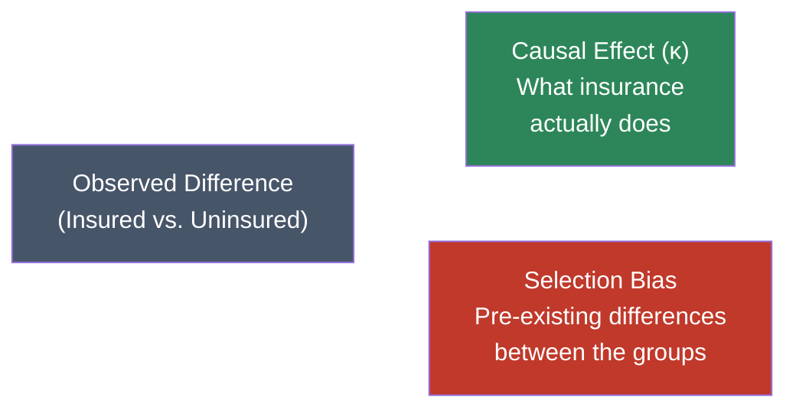

**Selection bias** is the difference in health that would exist *even without insurance* --- it reflects the fact that healthier, wealthier, more educated people are more likely to be insured. The NHIS data above showed exactly this pattern.

We can visualize this problem as a causal diagram. Confounders like education, income, and employment create a "backdoor path" between insurance status and health outcomes. Because these factors influence *both* who gets insured *and* how healthy they are, the naive comparison captures their influence along with any true causal effect of insurance.

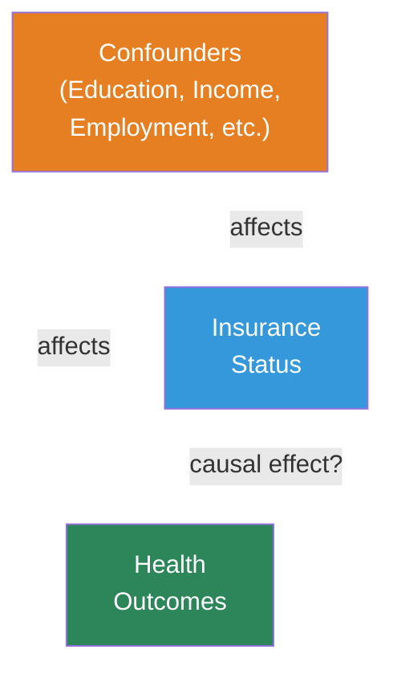

> ⭐ **The Fundamental Problem of Causal Inference**
>
>
> We want $\kappa$ (the causal effect), but what we observe is $\kappa$ **plus** selection bias. We cannot separate the two without a strategy that eliminates the bias.


### The Solution: Random Assignment

#### The Core Idea

What if, instead of letting people *choose* insurance, we assigned it randomly --- like a coin flip? This is the insight behind **randomized controlled trials (RCTs)**.

When treatment is randomly assigned:

- The insured and uninsured groups are drawn from the **same population**
- They have similar education, income, health habits, and *every other characteristic*
- This includes characteristics we **cannot observe or measure**

The **Law of Large Numbers** guarantees this: in large random samples, group averages converge to the population average. So both groups end up looking alike.

> 📝 **Intuition Builder: The Dice Analogy**
>
>
> Roll a fair die once --- you might get 1 or 6, far from the expected value of 3.5. Roll it 10 times --- the average gets closer. Roll it 10,000 times --- the average is almost exactly 3.5. This is why **casinos always win in the long run**: any single bet is a toss-up, but over thousands of plays, the house edge reliably prevails. Random assignment works the same way: with enough people, the treatment and control groups converge to being identical on *every* characteristic --- even ones we can't see.


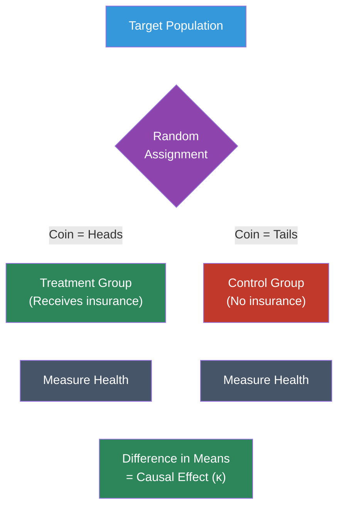

#### Why It Works Mathematically

With random assignment, the expected baseline health is the same in both groups:

$$E[Y_{0i} \mid D_i = 1] = E[Y_{0i} \mid D_i = 0]$$

This makes the selection bias term **zero**, so the observed difference equals the causal effect:

$$E[Y_i \mid D_i = 1] - E[Y_i \mid D_i = 0] = \kappa$$

#### Checking for Balance

Even in a randomized experiment, good practice requires us to **check for balance**: verify that baseline characteristics look similar across treatment groups. If they do, we can be confident that randomization worked and that the comparison is credible.


### Case Study 1: The RAND Health Insurance Experiment

#### Background

The **RAND Health Insurance Experiment (HIE)**, running from 1974 to 1982, remains one of the most influential social experiments ever conducted. Nearly 4,000 people from six U.S. sites were randomly assigned to insurance plans with varying levels of generosity:

| Plan Type | What Participants Pay | Role in the Experiment |
|:---|:---|:---|
| **Catastrophic** (3 plans) | 95% of costs (capped) | **Control group** (≈ no insurance) |
| **Deductible** (1 plan) | 95% outpatient only (lower cap) | Moderate treatment |
| **Coinsurance** (9 plans) | 25--50% of costs (capped) | Moderate treatment |
| **Free** (1 plan) | Nothing --- all care is free | Most generous treatment |

: The four plan categories in the RAND HIE.
The experiment asked two questions:

1. When health care is cheaper, do people use more of it?
2. Does using more health care improve health?

#### Step 1: Verify Randomization (Balance Check)

First, we check whether randomization created comparable groups. We regress each baseline characteristic on plan-type dummies. The **catastrophic plan is the omitted reference group**, so each coefficient represents the difference between that plan group and the catastrophic group.

```python
## Load pre-cleaned RAND HIE baseline data
rand = pd.read_csv(DATA + "ch1/rand_balance.csv")
rand.head(3)
```

Before running the full table, let's see what a single balance check looks like. Is the average **age** different across plan groups?

```python
## Prepare data (drop rows with missing values)
d = rand[["age", "plan_free", "plan_deductible", "plan_coinsurance", "family_id"]].dropna()

## Regress age on plan-type dummies (catastrophic = omitted reference group)
result = pf.feols("age ~ plan_free + plan_deductible + plan_coinsurance", data=d, vcov={"CRV1": "family_id"})

## Extract key regression results into a clear table
pd.DataFrame({
    "Variable": result.coef().index,
    "Coefficient": result.coef().round(4).values,
    "Std. Error": result.se().round(4).values,
    "t-statistic": result.tstat().round(2).values,
    "p-value": result.pvalue().round(3).values,
})
```

The **Intercept** (32.4) is the average age in the catastrophic group. The coefficients on the plan dummies (0.43 to 0.97) are the age differences --- all small and statistically insignificant. Age is balanced.

> 📝 **Why do we cluster standard errors by family?**
>
>
> In the RAND HIE, all members of a family were assigned to the **same** insurance plan. This means observations within a family are not independent --- knowing one family member's plan tells you the other's. **Clustering** standard errors at the family level corrects for this correlation, preventing us from overstating the precision of our estimates.


Now let's run the full balance check across all baseline variables:

```python
## List of baseline variables to check
balance_vars = ["female", "nonwhite", "age", "education", "family_income",
                "health_index", "cholesterol", "blood_pressure", "mental_health"]

## Run a separate regression for each variable and collect results
rows = []
for var in balance_vars:
    # Drop missing values for this variable
    d = rand[[var, "plan_free", "plan_deductible", "plan_coinsurance", "family_id"]].dropna()

    # Regress baseline variable on plan dummies
    r = pf.feols(f"{var} ~ plan_free + plan_deductible + plan_coinsurance", data=d, vcov={"CRV1": "family_id"})

    # Extract coefficients and standard errors for each plan comparison
    coef_free = round(r.coef()["plan_free"], 2)
    se_free = round(r.se()["plan_free"], 2)
    coef_ded = round(r.coef()["plan_deductible"], 2)
    se_ded = round(r.se()["plan_deductible"], 2)
    coef_coin = round(r.coef()["plan_coinsurance"], 2)
    se_coin = round(r.se()["plan_coinsurance"], 2)

    rows.append({
        "Variable": var,
        "Catastrophic mean": round(r.coef()["Intercept"], 1),
        "Free − Catastrophic": format(coef_free, ".2f") + " (" + format(se_free, ".2f") + ")",
        "Deductible − Catastrophic": format(coef_ded, ".2f") + " (" + format(se_ded, ".2f") + ")",
        "Coinsurance − Catastrophic": format(coef_coin, ".2f") + " (" + format(se_coin, ".2f") + ")",
    })

pd.DataFrame(rows)
```

**Verdict:** Differences are small, go in both directions, and almost none are statistically significant. Randomization worked. Compare this to the NHIS table earlier, where insured and uninsured groups differed dramatically on *every* dimension.


#### Step 2: Estimate Causal Effects on Health-Care Use

Now we turn to outcomes. Because treatment was randomly assigned, the same regression approach that checked balance now gives us **causal effects**. The coefficient on each plan dummy tells us how much that plan changed health-care use *relative to having no insurance*.

```python
## Load pre-cleaned RAND HIE utilization data (person-year panel)
hie = pd.read_csv(DATA + "ch1/rand_utilization.csv")
hie.head(3)
```

```python
## Outcome variables measuring health-care utilization
use_vars = ["visits", "outpatient_expenses", "admissions",
            "inpatient_expenses", "total_expenses"]

## Run a separate regression for each variable and collect results
rows = []
for var in use_vars:
    # Drop missing values for this outcome
    d = hie[[var, "plan_free", "plan_deductible", "plan_coinsurance", "family_id"]].dropna()

    # Regress outcome on plan dummies — gives causal effects (because of randomization!)
    r = pf.feols(f"{var} ~ plan_free + plan_deductible + plan_coinsurance", data=d, vcov={"CRV1": "family_id"})

    # Intercept = control group (catastrophic plan) mean
    # Coefficients = causal effect of each plan relative to catastrophic
    coef_free = int(round(r.coef()["plan_free"]))
    se_free = int(round(r.se()["plan_free"]))
    coef_ded = int(round(r.coef()["plan_deductible"]))
    se_ded = int(round(r.se()["plan_deductible"]))
    coef_coin = int(round(r.coef()["plan_coinsurance"]))
    se_coin = int(round(r.se()["plan_coinsurance"]))

    rows.append({
        "Outcome": var,
        "Catastrophic mean": int(round(r.coef()["Intercept"])),
        "Free effect": str(coef_free) + " (" + str(se_free) + ")",
        "Deductible effect": str(coef_ded) + " (" + str(se_ded) + ")",
        "Coinsurance effect": str(coef_coin) + " (" + str(se_coin) + ")",
    })

pd.DataFrame(rows)
```

> 📝 **Interpretation: The demand for health care**
>
>
> The free plan caused large increases in utilization:
>
> - **+1.7 more doctor visits** per year
> - **+\$169 in outpatient spending** (a 68% increase over the catastrophic group's \$248)
> - **+\$285 in total spending** (a 45% increase)
>
> This is the **demand curve** at work: when insurance lowers the out-of-pocket price of care to zero, people use substantially more of it. Economists call this **moral hazard** --- not a moral judgment, but simply the observation that people respond to incentives.


#### Step 3: Estimate Causal Effects on Health

Here is the crucial test. All that extra spending bought more health care --- but did it buy better **health**? These outcomes were measured 3--5 years after random assignment.

```python
## Load pre-cleaned RAND HIE exit health measures
health = pd.read_csv(DATA + "ch1/rand_health_outcomes.csv")
health.head(3)
```

```python
## Health outcome variables (measured at the end of the experiment)
health_vars = ["health_index", "cholesterol", "blood_pressure", "mental_health"]

## Run a separate regression for each variable and collect results
rows = []
for var in health_vars:
    # Drop missing values
    d = health[[var, "plan_free", "plan_deductible", "plan_coinsurance", "family_id"]].dropna()

    # Regress health outcome on plan dummies
    r = pf.feols(f"{var} ~ plan_free + plan_deductible + plan_coinsurance", data=d, vcov={"CRV1": "family_id"})

    # Extract coefficients and standard errors
    coef_free = round(r.coef()["plan_free"], 2)
    se_free = round(r.se()["plan_free"], 2)
    coef_ded = round(r.coef()["plan_deductible"], 2)
    se_ded = round(r.se()["plan_deductible"], 2)
    coef_coin = round(r.coef()["plan_coinsurance"], 2)
    se_coin = round(r.se()["plan_coinsurance"], 2)

    rows.append({
        "Health Measure": var,
        "Catastrophic mean": round(r.coef()["Intercept"], 1),
        "Free effect": format(coef_free, ".2f") + " (" + format(se_free, ".2f") + ")",
        "Deductible effect": format(coef_ded, ".2f") + " (" + format(se_ded, ".2f") + ")",
        "Coinsurance effect": format(coef_coin, ".2f") + " (" + format(se_coin, ".2f") + ")",
    })

pd.DataFrame(rows)
```

> ⭐ **The RAND Paradox: More Care ≠ Better Health**
>
>
> The results are striking. Across all four health measures --- general health, cholesterol, blood pressure, and mental health --- the differences between plan groups are **small and statistically insignificant**.
>
> Despite consuming **45% more health care**, participants in the free plan showed **no measurable improvement** in health compared to those with minimal coverage.
>
> This is a **precisely estimated null**: the standard errors are small enough to rule out large health benefits. The experiment was not too small to detect an effect --- the effect simply wasn't there.


##### What Did We Learn from the RAND HIE?

The RAND experiment delivered three key lessons:

1. **People respond to prices.** Cheaper health care leads to more consumption (moral hazard is real).
2. **More care does not automatically mean better health.** The marginal medical care consumed when it's free may not be very valuable.
3. **Randomization reveals the truth.** The naive NHIS comparison suggested a large health benefit of insurance. The randomized experiment showed this was mostly selection bias.

These findings directly shaped the policy debate around the **Affordable Care Act** (2010). Proponents argued for universal coverage to improve health; skeptics cited RAND to argue that subsidized insurance mainly increases spending. The truth, as we'll see from Oregon, is more nuanced.

The RAND experiment studied middle-class families who already had at least catastrophic coverage. But what about the people most affected by insurance policy debates --- low-income adults with no coverage at all? A natural experiment in Oregon addressed exactly this gap.


### Case Study 2: The Oregon Health Plan

#### Why a Second Experiment?

The RAND HIE was groundbreaking, but it studied **middle-class families** who all had at least catastrophic coverage. Today's uninsured Americans are different: younger, poorer, less educated. Would insurance help *them* more?

In 2008, the state of Oregon ran a **health insurance lottery**. About 75,000 low-income adults applied for Medicaid expansion; roughly 30,000 were randomly selected to apply for coverage. Economist Amy Finkelstein and colleagues studied the results.

> 📝 **Connection to Chapter 3: Non-Compliance**
>
>
> In the Oregon lottery, only about **25% of winners** actually enrolled in Medicaid (the rest failed paperwork or were ineligible). This means the simple winner/loser comparison understates the true effect on those who gained insurance. Adjusting for this non-compliance requires **instrumental variables** (Chapter 3): divide the winner/loser difference by the enrollment rate. This is a preview of the IV method.


#### Results at a Glance

| Outcome | Effect of Winning the Lottery |
|:---|:---|
| **Medicaid enrollment** | +25.6 percentage points |
| **Hospital admissions** | Small increase |
| **Emergency dept. visits** | +10% (policymakers expected a *decrease*) |
| **Self-reported health** | Modest improvement (+3.9 pp) |
| **Physical health** (cholesterol, BP) | No significant change |
| **Mental health** | Improved |
| **Catastrophic medical expenses** | Decreased |
| **Medical debt** | Decreased |

: Oregon Health Plan lottery results (Finkelstein et al., 2012; Baicker et al., 2013)
#### Comparing the Two Experiments

| | RAND HIE (1974--1982) | Oregon OHP (2008) |
|:---|:---:|:---:|
| **Population** | Middle-class families | Low-income adults |
| **More care used?** | Yes | Yes |
| **Better physical health?** | No | No |
| **Better mental health?** | Not measured | Yes |
| **Less financial hardship?** | Not measured | Yes |

: Comparing findings from two landmark health insurance experiments
The two experiments, conducted decades apart on very different populations, reached remarkably similar conclusions about physical health. The Oregon study added two important insights: insurance provides **financial protection** (less medical debt) and **mental health benefits** --- which may be its primary value for low-income populations.


### Historical Perspective: Pioneers of Randomization

The idea of using controlled comparisons did not appear overnight. Key milestones in the development of experimental methods:

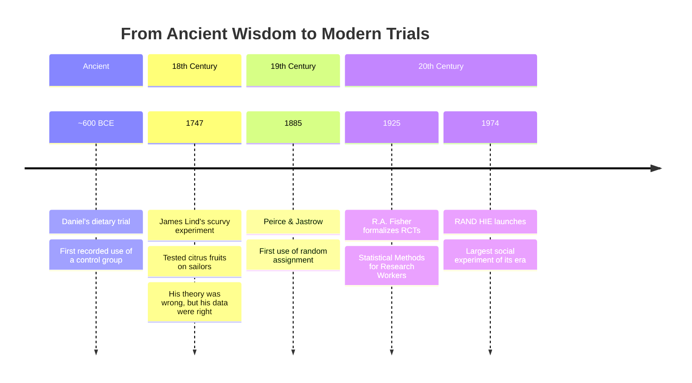

- **Daniel** (~600 BCE) proposed a 10-day vegetarian diet trial with a control group eating the king's rich food --- perhaps the first controlled experiment
- **James Lind** (1747) tested citrus fruits against other scurvy remedies. His theory (acids cure scurvy) was wrong, but his empirical finding was correct --- a lesson about letting data speak
- **R.A. Fisher** (1920s--30s) formalized the theory of random assignment and experimental design, launching the modern era of RCTs


Throughout this chapter, we have relied on standard errors and t-statistics to judge whether differences are real or due to chance. The following toolkit formalizes these concepts.

### Statistical Inference Toolkit

Here is a brief guide to interpreting the numbers we have been using.

#### The Core Problem: Sampling Variability

Any estimate from a sample could differ if we drew a different sample from the same population. **Statistical inference** quantifies this uncertainty.

#### Key Concepts

| Concept | Symbol | Plain English |
|:---|:---:|:---|
| Sample mean | $\bar{Y}$ | The average in our data |
| Standard error | $SE(\bar{Y})$ | How much $\bar{Y}$ would vary across different samples |
| t-statistic | coefficient / SE | How many SEs away from zero is our estimate? |
| 95% Confidence interval | estimate $\pm$ 2 $\times$ SE | The range of values consistent with our data |

: Key inference tools.
#### The Rule of Thumb

> 💡 **When is a result "statistically significant"?**
>
>
> If the **t-statistic** (coefficient divided by its standard error) exceeds **2** in absolute value, the result is statistically significant at the 5% level. This means it is unlikely to have arisen by chance alone.
>
> **For balance checks**: we *want* insignificant results (small t-stats), confirming groups are comparable.
>
> **For treatment effects**: significant results provide evidence of a real causal effect.


#### A Crucial Caveat

Statistical significance measures **precision**, not **importance**:

- A large t-statistic can come from a huge sample (very precise), not necessarily a large effect
- A small t-statistic can mean the effect is small *or* that our sample is too small to detect it
- **Lack of significance ≠ lack of effect** --- it may just mean insufficient data

Always consider both the **size** of a coefficient and its **statistical precision**.


### Key Takeaways

The following concept map shows how the key ideas in this chapter connect --- from the initial causal question, through the problem of selection bias, to the solution of random assignment and the evidence from two landmark experiments.

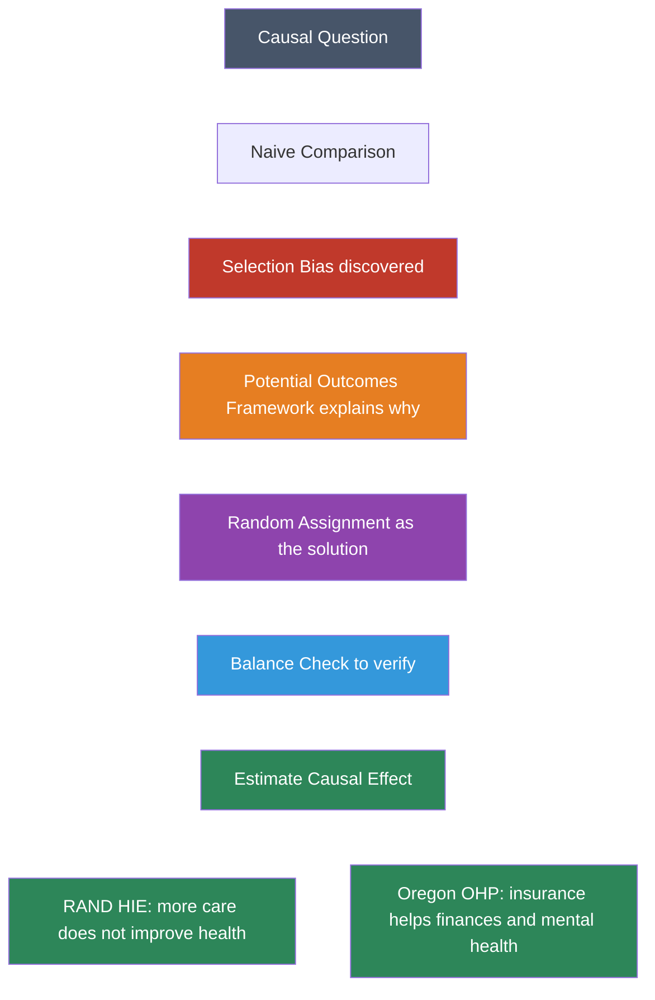

1. **Correlation is not causation.** Observed differences between groups reflect causal effects *plus* selection bias.

2. **The potential outcomes framework** ($Y_{1i}$, $Y_{0i}$) gives precise language for causal questions.

3. **Selection bias** arises because people who choose treatment differ from those who don't.

4. **Random assignment** eliminates selection bias by making groups comparable.

5. **Always check for balance** to verify that randomization worked.

6. **Regression on a dummy variable** is the primary tool for comparing group means and testing for differences.

7. **The RAND HIE** found that free insurance increased spending by 45% but did not improve health.

8. **The Oregon OHP** confirmed these findings and showed that insurance helps with financial protection and mental health.


### Learn by Coding

Copy this code into a Python notebook to reproduce the key results from this chapter.

```python
## ============================================================
## Chapter 1: Randomized Trials — Code Cheatsheet
## ============================================================
import pandas as pd
import pyfixest as pf

DATA = "https://raw.githubusercontent.com/cmg777/intro2causal/main/data/"

## --- Step 1: Load NHIS data and compare health by insurance status ---
nhis = pd.read_csv(DATA + "ch1/nhis_clean.csv")
print("Average health by insurance status:")
print(nhis.groupby("insurance")["health"].mean().round(2))

## --- Step 2: Regression on a dummy (difference in means + standard error) ---
result = pf.feols("health ~ insurance", data=nhis, vcov="hetero")
print("\nHealth ~ Insurance:")
print(result.summary())

## --- Step 3: Balance check (RAND HIE — did randomization work?) ---
rand = pd.read_csv(DATA + "ch1/rand_balance.csv")
d = rand[["age", "plan_free", "plan_deductible", "plan_coinsurance", "family_id"]].dropna()
result = pf.feols("age ~ plan_free + plan_deductible + plan_coinsurance", data=d, vcov={"CRV1": "family_id"})
print("\nBalance check — Age across plan groups:")
print(result.summary())

## --- Step 4: Causal effect of free insurance on spending ---
hie = pd.read_csv(DATA + "ch1/rand_utilization.csv")
d = hie[["total_expenses", "plan_free", "plan_deductible", "plan_coinsurance", "family_id"]].dropna()
result = pf.feols("total_expenses ~ plan_free + plan_deductible + plan_coinsurance", data=d, vcov={"CRV1": "family_id"})
print("\nCausal effect on total spending:")
print(result.summary())

## --- Step 5: Causal effect on health (the RAND paradox: no effect!) ---
health = pd.read_csv(DATA + "ch1/rand_health_outcomes.csv")
d = health[["health_index", "plan_free", "plan_deductible", "plan_coinsurance", "family_id"]].dropna()
result = pf.feols("health_index ~ plan_free + plan_deductible + plan_coinsurance", data=d, vcov={"CRV1": "family_id"})
print("\nCausal effect on health (expect: no significant effect):")
print(result.summary())
```

> 💡 **Try it yourself!**
>
> Copy the code above and paste it into [this Google Colab scratchpad](https://colab.research.google.com/notebooks/empty.ipynb) to run it interactively. Modify the variables, change the specifications, and see how results change!


Below is the same cheatsheet in Stata syntax.

```stata
* ============================================================
* Chapter 1: Randomized Trials — Stata Cheatsheet
* ============================================================
clear all
set more off

* --- Step 1: Load NHIS data and compare health by insurance status ---
import delimited using "https://raw.githubusercontent.com/cmg777/intro2causal/main/data/ch1/nhis_clean.csv", clear
tabstat health, by(insurance)

* --- Step 2: Regression on a dummy (difference in means + standard error) ---
reg health insurance, robust

* --- Step 3: Balance check (RAND HIE — did randomization work?) ---
import delimited using "https://raw.githubusercontent.com/cmg777/intro2causal/main/data/ch1/rand_balance.csv", clear
reg age plan_free plan_deductible plan_coinsurance, cluster(family_id)

* --- Step 4: Causal effect of free insurance on spending ---
import delimited using "https://raw.githubusercontent.com/cmg777/intro2causal/main/data/ch1/rand_utilization.csv", clear
reg total_expenses plan_free plan_deductible plan_coinsurance, cluster(family_id)

* --- Step 5: Causal effect on health (the RAND paradox: no effect!) ---
import delimited using "https://raw.githubusercontent.com/cmg777/intro2causal/main/data/ch1/rand_health_outcomes.csv", clear
reg health_index plan_free plan_deductible plan_coinsurance, cluster(family_id)
```

> 💡 **Try it in Stata!**
>
> Copy the code above into a `.do` file and run it in Stata 14 or later (which supports loading data from URLs). If your Stata cannot access the internet, download the CSV files from the `data/` folder on [GitHub](https://github.com/cmg777/intro2causal/tree/main/data) and replace each URL with a local file path.


### Exercises

#### Multiple Choice Questions

1. **What is the fundamental problem of causal inference?**
   a) We cannot measure outcomes accurately
   b) We can only observe one potential outcome per person
   c) Random assignment is impossible in practice
   d) Sample sizes are always too small

> 📝 **Show answer**
>
> **(b)** We can never observe the same person in both the treated and untreated state at the same time — this is the fundamental problem of causal inference. Each person has two potential outcomes ($Y_{1i}$ and $Y_{0i}$), but we only observe one. **(a) is wrong** because measurement accuracy is a separate issue from the missing counterfactual. **(c) is wrong** because random assignment is feasible and widely used (as the RAND HIE shows). **(d) is wrong** because even with millions of observations, we still cannot see both potential outcomes for any single individual.


2. **In the RAND Health Insurance Experiment, what happened to physical health when people received free insurance?**
   a) It improved dramatically
   b) It worsened due to overuse of care
   c) It showed no significant improvement despite higher spending
   d) It improved only for high-income participants

> 📝 **Show answer**
>
> **(c)** The RAND HIE's most surprising finding was that free insurance increased health care spending by about 45% but produced no statistically significant improvement in physical health for the average person. **(a) is wrong** because despite higher utilization, the extra care did not translate into measurably better health outcomes. **(b) is wrong** because health did not worsen — it simply did not improve. **(d) is wrong** because the null result on physical health applied across income groups, though the study did find benefits for the sickest and poorest subgroups.


3. **Selection bias occurs when:**
   a) The sample size is too small for reliable estimates
   b) The treatment and control groups differ in ways related to the outcome
   c) Researchers choose which results to report
   d) Survey respondents lie about their behavior

> 📝 **Show answer**
>
> **(b)** Selection bias arises when people who receive the treatment differ systematically from those who do not, in ways that also affect the outcome. In the causal framework, this means $E[Y_{0i}|D_i=1] \neq E[Y_{0i}|D_i=0]$. **(a) is wrong** because small samples increase variance (noise) but do not cause systematic bias. **(c) is wrong** because that describes publication bias or p-hacking, a different problem. **(d) is wrong** because that describes response bias, not the selection into treatment that the chapter focuses on.


4. **Why is random assignment considered the gold standard for causal inference?**
   a) It guarantees a large sample size
   b) It eliminates measurement error
   c) It makes treatment and control groups comparable on all characteristics, even unobserved ones
   d) It ensures perfect compliance with assigned treatment

> 📝 **Show answer**
>
> **(c)** Random assignment ensures that, in expectation, the treatment and control groups are identical on all characteristics — observed and unobserved — making the selection bias term equal to zero. By the Law of Large Numbers, randomization balances everything, including variables the researcher cannot measure. **(a) is wrong** because randomization works regardless of sample size (though larger samples increase precision). **(b) is wrong** because measurement error is unrelated to how subjects are assigned. **(d) is wrong** because non-compliance is common even in randomized experiments (as the RAND HIE and Oregon experiments both show).


5. **A regression coefficient has a t-statistic of 3.5. This means:**
   a) The effect is large in practical terms
   b) The result is unlikely to have arisen by chance alone
   c) The regression model fits the data well
   d) The sample is representative of the population

> 📝 **Show answer**
>
> **(b)** A t-statistic of 3.5 means the estimated coefficient is 3.5 standard errors away from zero. Under the null hypothesis of no effect, this would be very unlikely to occur by chance (p < 0.001), so we reject the null. **(a) is wrong** because the t-statistic measures statistical significance, not practical importance — a tiny effect can be statistically significant with a large sample. **(c) is wrong** because model fit is measured by R-squared, not t-statistics. **(d) is wrong** because representativeness depends on sampling design, not on the t-statistic of a coefficient.


6. **A "balance check" in a randomized experiment tests whether:**
   a) The sample size is equal in both groups
   b) Pre-treatment characteristics are similar across treatment and control groups
   c) The treatment was delivered correctly
   d) The outcome variable is normally distributed

> 📝 **Show answer**
>
> **(b)** A balance check verifies that randomization worked by comparing baseline (pre-treatment) characteristics across groups. If randomization succeeded, variables like age, income, and prior health should be statistically similar across treatment arms. **(a) is wrong** because groups do not need equal size — unequal allocation is common and acceptable. **(c) is wrong** because balance checks examine pre-treatment variables, not treatment delivery (which is a compliance issue). **(d) is wrong** because normality of the outcome is a distributional assumption, not related to whether randomization produced comparable groups.


7. **In the Oregon Health Insurance Experiment, Medicaid was found to improve:**
   a) Physical health outcomes such as blood pressure and cholesterol
   b) Financial security and mental health
   c) Employment rates and earned income
   d) All of the above equally

> 📝 **Show answer**
>
> **(b)** The Oregon experiment found that Medicaid significantly reduced financial hardship (fewer medical debts, less borrowing) and improved mental health (lower rates of depression). **(a) is wrong** because the study found no statistically significant improvements in measured physical health indicators like blood pressure, cholesterol, or glycated hemoglobin. **(c) is wrong** because Medicaid had no significant effect on employment. **(d) is wrong** because the benefits were concentrated in financial protection and mental health, not spread equally across all domains.


8. **The selection bias decomposition shows that the observed difference in outcomes equals:**
   a) The treatment effect only
   b) The average treatment effect plus selection bias
   c) The sample mean minus the population mean
   d) The R-squared of the regression

> 📝 **Show answer**
>
> **(b)** The decomposition equation shows: observed difference = average treatment effect on the treated + selection bias. The selection bias term captures pre-existing differences between the treatment and control groups ($E[Y_{0i}|D_i=1] - E[Y_{0i}|D_i=0]$). Only when selection bias is zero (as with randomization) does the observed difference equal the causal effect. **(a) is wrong** because the observed difference also includes selection bias unless we have a randomized experiment. **(c) is wrong** because that describes sampling error, not the causal inference decomposition. **(d) is wrong** because R-squared measures explained variance, not the treatment-selection decomposition.


9. **Why do NHIS data show that insured people are healthier than uninsured people, even though insurance may not improve health?**
   a) The NHIS uses a biased sampling method
   b) People who choose insurance tend to be healthier, wealthier, and more educated to begin with
   c) Insurance companies only accept healthy applicants
   d) The NHIS measures health inaccurately

> 📝 **Show answer**
>
> **(b)** The NHIS comparison reflects selection bias: people who obtain insurance tend to be employed, higher-income, and more educated — all factors independently associated with better health. The observed health gap between insured and uninsured reflects these pre-existing differences, not a causal effect of insurance. **(a) is wrong** because the NHIS is a well-designed national survey; the bias is in the treatment (insurance) selection, not the sampling. **(c) is wrong** because while some underwriting exists, the main issue is self-selection into coverage. **(d) is wrong** because measurement quality is not the source of the misleading comparison.


10. **Non-compliance in a randomized experiment means that:**
    a) Participants drop out of the study
    b) Some participants do not follow their assigned treatment
    c) The randomization device malfunctions
    d) The control group is contaminated by the treatment group

> 📝 **Show answer**
>
> **(b)** Non-compliance occurs when participants do not follow their assigned treatment — for example, people assigned to a free insurance plan who do not enroll, or people assigned to the control group who obtain insurance elsewhere. **(a) is wrong** because attrition (dropping out) is a separate problem from non-compliance — non-compliers stay in the study but don't follow their assignment. **(c) is wrong** because non-compliance is about participant behavior, not technical failure. **(d) is wrong** because contamination is one specific form of non-compliance (control group receiving treatment), but non-compliance also includes treated subjects not taking the treatment.


#### Conceptual Questions

1. **Spotting selection bias**: A study reports that people who eat organic food live 3 years longer. List three reasons why this comparison might reflect selection bias rather than a causal effect of organic food.

> 📝 **Show answer**
>
> **Organic food buyers differ systematically from non-buyers, making any health comparison suspect.** Three sources of selection bias:
>
> 1. **Income:** People who buy organic food tend to have higher incomes, and wealthier people have better access to health care and live longer regardless of diet.
> 2. **Health behavior:** Organic food buyers are likely more health-conscious overall --- they exercise more, smoke less, and manage stress better. This is a classic case of bundled lifestyle choices acting as confounders.
> 3. **Education:** Education is correlated with both organic food consumption and longevity; more-educated people make healthier choices across many domains.
>
> All three sources violate the comparability assumption from the selection bias decomposition: $E[Y_{0i} | D_i = 1] \neq E[Y_{0i} | D_i = 0]$, so the observed difference overstates any true causal effect of organic food.


2. **Reading a regression**: In the balance check above, the coefficient on `plan_free` for `family_income` is approximately −976 with SE ≈ 1,345. (a) What is the t-statistic? (b) Is this difference statistically significant? (c) What does your answer tell us about whether randomization worked for this variable?

> 📝 **Show answer**
>
> **A small t-statistic confirms that randomization successfully balanced family income across plan groups.**
>
> 1. **Compute:** The t-statistic is −976 / 1,345 ≈ −0.73.
> 2. **Evaluate:** Since |−0.73| < 2, this difference is NOT statistically significant at conventional levels.
> 3. **Interpret:** The difference in family income between the free plan and catastrophic plan groups is small enough to be attributable to chance. Randomization worked for this variable --- the groups are comparable on family income. This is exactly what the balance check in the chapter's Table "Balance of baseline characteristics" is designed to verify: if $D_i$ is randomly assigned, baseline covariates should look similar across groups.


3. **The RAND paradox**: Your friend says "The RAND experiment proves health insurance is worthless." Write a short paragraph explaining why this is an oversimplification. What did the Oregon experiment show that insurance *is* good for?

> 📝 **Show answer**
>
> **No effect on physical health does not mean insurance is useless --- it means health is a narrow outcome that misses other benefits.**
>
> 1. **Financial protection:** The Oregon experiment showed that lottery winners had less medical debt and fewer catastrophic medical expenses. Insurance smooths financial risk, which is valuable even without health gains.
> 2. **Mental health:** Oregon lottery winners reported better mental health scores, an outcome dimension the RAND study did not emphasize.
> 3. **Access to care:** Insurance increases access to care, which may matter more for acute conditions or preventive services not captured by the RAND outcome measures.
>
> The correct conclusion connects both experiments from the chapter: more generous insurance increases spending without improving measurable physical health (RAND), but it provides valuable financial security and mental health benefits (Oregon). Different outcomes can tell different causal stories from the same intervention.


4. **Random assignment and selection bias**: Using the decomposition equation from this chapter, explain step by step why random assignment makes the selection bias term equal to zero. What role does the Law of Large Numbers play?

> 📝 **Show answer**
>
> **Random assignment eliminates selection bias by making the treatment and control groups statistically identical at baseline.**
>
> 1. **Start from the decomposition:** Observed difference = $\kappa$ + Selection bias, where selection bias = $E[Y_{0i} | D_i = 1] - E[Y_{0i} | D_i = 0]$.
> 2. **Apply randomization:** When $D_i$ is randomly assigned, the treatment and control groups are drawn from the same population, so baseline characteristics are independent of treatment status.
> 3. **Invoke the Law of Large Numbers:** With a large enough sample, the average baseline outcome $Y_{0i}$ will be nearly identical in both groups. Formally, $E[Y_{0i} | D_i = 1] = E[Y_{0i} | D_i = 0]$, so the selection bias term equals zero.
> 4. **Conclude:** The observed difference then equals $\kappa$, the true causal effect. This is the core logic behind every balance check in the chapter --- if randomization works, baseline variables should be balanced.


5. **Designing an RCT**: You want to test whether free school lunches improve student test scores. (a) How would you randomly assign treatment? (b) What outcome would you measure? (c) What balance check would you run? (d) Why might some students assigned to "free lunch" not actually eat it, and what problem does this create?

> 📝 **Show answer**
>
> **Designing an experiment requires specifying randomization, outcomes, balance checks, and anticipating non-compliance.**
>
> 1. **Randomization:** Randomly select classrooms or schools to receive the program (cluster randomization), or randomly assign individual students within each school. Cluster randomization avoids contamination across students in the same classroom.
> 2. **Outcome:** Measure standardized test scores at the end of the semester/year. This gives a clear, quantifiable dependent variable $Y_i$.
> 3. **Balance check:** Compare baseline characteristics (prior test scores, demographics, family income) between treatment and control groups to verify balance --- just as the RAND experiment checked age, education, and income in the chapter.
> 4. **Non-compliance threat:** Some students may refuse the lunch, share it, or already receive food from other sources. This is a *non-compliance* problem: the intent-to-treat effect (being offered lunch) may differ from the effect of actually eating it. This foreshadows the instrumental variables approach in Chapter 3, where random assignment serves as an instrument for actual treatment.


#### Research Tasks

1. **Binary balance check**: Using `rand_balance.csv`, run a balance check using the single dummy `any_insurance` (instead of the three plan dummies). Regress `age`, `education`, and `health_index` on `any_insurance` with family-clustered SEs. Do you reach the same conclusion about balance as the three-dummy specification?

> 📝 **Show answer**
>
>
> ```python
> # --- Load data ---
> import pandas as pd
> import pyfixest as pf
>
> rand = pd.read_csv(DATA + "ch1/rand_balance.csv")
>
> # --- Run balance regressions ---
> # Use a single binary dummy (any_insurance) instead of three plan dummies
> rows = []
> for var in ["age", "education", "health_index"]:
> d = rand[[var, "any_insurance", "family_id"]].dropna()
> # OLS with clustered SEs at the family level
> r = pf.feols(f"{var} ~ any_insurance", data=d, vcov={"CRV1": "family_id"})
> rows.append({
> "Variable": var,
> "Catastrophic mean": round(r.coef()["Intercept"], 1),  # control group mean
> "Any ins. difference": round(r.coef()["any_insurance"], 2),  # treatment-control gap
> "SE": round(r.se()["any_insurance"], 2),
> "t-stat": round(r.tstat()["any_insurance"], 2),  # difference / SE
> })
>
> pd.DataFrame(rows)
> ```
>
> Stata equivalent:
>
> ```stata
> * --- Binary balance check ---
> clear all
> set more off
> import delimited using "https://raw.githubusercontent.com/cmg777/intro2causal/main/data/ch1/rand_balance.csv", clear
>
> * Run balance regressions with clustered SEs
> foreach var in age education health_index {
> reg `var' any_insurance, cluster(family_id)
> }
> ```
>
> (1) **What the numbers show:** All t-statistics are small (well below 2), so none of the baseline differences are statistically significant. The catastrophic and any-insurance groups look comparable on age, education, and health.
>
> (2) **Why:** Randomization ensures that treatment assignment is independent of pre-existing characteristics. The Law of Large Numbers makes the group means converge, as discussed in Q4.
>
> (3) **What it teaches:** Balance holds regardless of whether we use three plan dummies or a single binary indicator. The binary specification pools all non-catastrophic plans together, which is simpler but loses information about differences across plan types. This illustrates a general point: the choice of treatment variable definition can affect granularity but should not affect the core balance result if randomization worked.


2. **Relative utilization increases**: Using `rand_utilization.csv`, compute the percentage increase in each utilization outcome for the free plan relative to the catastrophic group mean. Which outcome shows the largest *relative* increase: visits, outpatient expenses, admissions, or total expenses?

> 📝 **Show answer**
>
>
> ```python
> # --- Load data ---
> hie = pd.read_csv(DATA + "ch1/rand_utilization.csv")
>
> # --- Run regressions and compute percentage effects ---
> rows = []
> for var in ["visits", "outpatient_expenses", "admissions", "inpatient_expenses", "total_expenses"]:
> d = hie[[var, "plan_free", "plan_deductible", "plan_coinsurance", "family_id"]].dropna()
> # OLS with plan dummies; clustered SEs at the family level
> r = pf.feols(f"{var} ~ plan_free + plan_deductible + plan_coinsurance", data=d, vcov={"CRV1": "family_id"})
>
> cat_mean = r.coef()["Intercept"]       # intercept = catastrophic plan mean (reference group)
> free_effect = r.coef()["plan_free"]     # coefficient = absolute increase from free plan
> pct_increase = (free_effect / cat_mean) * 100  # express as percentage of baseline
>
> rows.append({
> "Outcome": var,
> "Catastrophic mean": round(cat_mean),
> "Free plan effect": round(free_effect),
> "% increase": round(pct_increase, 1),
> })
>
> pd.DataFrame(rows)
> ```
>
> Stata equivalent:
>
> ```stata
> * --- Percentage increase in utilization for the free plan ---
> clear all
> set more off
> import delimited using "https://raw.githubusercontent.com/cmg777/intro2causal/main/data/ch1/rand_utilization.csv", clear
>
> * Run regressions for each utilization outcome
> foreach var in visits outpatient_expenses admissions inpatient_expenses total_expenses {
> reg `var' plan_free plan_deductible plan_coinsurance, cluster(family_id)
> * Compute percentage increase: free plan effect / catastrophic mean * 100
> scalar cat_mean = _b[_cons]
> scalar free_effect = _b[plan_free]
> scalar pct_increase = (free_effect / cat_mean) * 100
> display "`var': catastrophic mean = " cat_mean ", free effect = " free_effect ", % increase = " pct_increase
> }
> ```
>
> (1) **What the numbers show:** Outpatient expenses show the largest relative increase (~68%), followed by face-to-face visits (~60%). Hospital admissions show a smaller relative increase (~29%). Total expenses rose ~45%.
>
> (2) **Why:** Inpatient decisions are made primarily by doctors rather than patients, so reducing cost-sharing has less effect on admissions. Outpatient care, where patients have more discretion over whether to seek treatment, responds most strongly to price changes --- consistent with basic demand elasticity.
>
> (3) **What it teaches:** The same experiment can reveal heterogeneous causal effects across different outcomes. The RAND results show that moral hazard (the tendency to use more care when insured) is concentrated in outpatient services, not hospital stays. This pattern is key to understanding the policy implications of insurance design discussed in the chapter.


3. **Husbands vs. wives**: Using `nhis_clean.csv`, run the insurance-health comparison separately for husbands and wives. Is the selection bias (the gap in education and income between insured and uninsured) larger for one gender? What might explain any differences?

> 📝 **Show answer**
>
>
> ```python
> # --- Load data ---
> nhis = pd.read_csv(DATA + "ch1/nhis_clean.csv")
>
> # --- Run WLS regressions by gender ---
> rows = []
> for gender in ["husband", "wife"]:
> subset = nhis[nhis["gender"] == gender]  # split sample by gender
> for var in ["health", "education", "family_income"]:
> # WLS with survey weights; HC1 robust standard errors
> r = pf.feols(f"{var} ~ insurance", data=subset, weights="weight", vcov="hetero")
> rows.append({
> "Gender": gender,
> "Variable": var,
> "Difference (Ins - Unins)": round(r.coef()["insurance"], 2),  # coefficient = gap
> "SE": round(r.se()["insurance"], 2),
> })
>
> pd.DataFrame(rows)
> ```
>
> Stata equivalent:
>
> ```stata
> * --- Selection bias by gender ---
> clear all
> set more off
> import delimited using "https://raw.githubusercontent.com/cmg777/intro2causal/main/data/ch1/nhis_clean.csv", clear
>
> * Run WLS regressions by gender
> foreach g in husband wife {
> display "=== Gender: `g' ==="
> foreach var in health education family_income {
> reg `var' insurance [aw=weight] if gender == "`g'", robust
> }
> }
> ```
>
> (1) **What the numbers show:** The education and income gaps between insured and uninsured are similar for husbands and wives. The health gap may differ slightly across genders.
>
> (2) **Why:** Selection into insurance is driven by socioeconomic factors (education, income) that operate similarly for both spouses in a household. Any gender-specific differences in the health gap likely reflect gender-specific health patterns rather than differences in the selection mechanism.
>
> (3) **What it teaches:** Both groups show substantial selection bias, reinforcing the chapter's central lesson: observational comparisons between insured and uninsured people confound the causal effect of insurance with pre-existing differences. This is precisely why the RAND and Oregon experiments --- which use randomization to eliminate selection bias --- provide more credible evidence.


4. **Dose-response across plan generosity**: Using `rand_utilization.csv`, extract the three plan-dummy coefficients for `total_expenses` and rank them by plan generosity (free > coinsurance > deductible). Is there a monotonic relationship between plan generosity and spending? Test whether the free and coinsurance coefficients are statistically different.

> 📝 **Show answer**
>
>
> ```python
> # --- Load data ---
> import pandas as pd
> import pyfixest as pf
>
> hie = pd.read_csv(DATA + "ch1/rand_utilization.csv")
>
> # --- Regression with three plan dummies ---
> d = hie[["total_expenses", "plan_free", "plan_deductible", "plan_coinsurance", "family_id"]].dropna()
> r = pf.feols("total_expenses ~ plan_free + plan_deductible + plan_coinsurance", data=d, vcov={"CRV1": "family_id"})
>
> # --- Extract and rank coefficients by plan generosity ---
> pd.DataFrame({
> "Plan": ["Free (most generous)", "Coinsurance (medium)", "Deductible (least generous)"],
> "Effect vs. catastrophic": [round(r.coef()["plan_free"]),
> round(r.coef()["plan_coinsurance"]),
> round(r.coef()["plan_deductible"])],
> "SE": [round(r.se()["plan_free"]),
> round(r.se()["plan_coinsurance"]),
> round(r.se()["plan_deductible"])],
> "t-stat": [round(r.tstat()["plan_free"], 2),
> round(r.tstat()["plan_coinsurance"], 2),
> round(r.tstat()["plan_deductible"], 2)],
> })
> ```
>
> Stata equivalent:
>
> ```stata
> * --- Dose-response: plan generosity and total expenses ---
> clear all
> set more off
> import delimited using "https://raw.githubusercontent.com/cmg777/intro2causal/main/data/ch1/rand_utilization.csv", clear
>
> * Regression with three plan dummies and clustered SEs
> reg total_expenses plan_free plan_deductible plan_coinsurance, cluster(family_id)
>
> * Test whether free and coinsurance effects are equal
> test plan_free = plan_coinsurance
> ```
>
> (1) **What the numbers show:** The free plan produces the largest increase in total expenses, followed by the coinsurance plan, then the deductible plan. The ordering generally follows plan generosity, though the differences between coinsurance and deductible may not be statistically significant.
>
> (2) **Why:** More generous plans reduce out-of-pocket costs more, lowering the price of care to patients. Basic demand theory predicts that lower prices increase quantity demanded. The free plan eliminates cost-sharing entirely, producing the strongest response. The coinsurance and deductible plans still require some out-of-pocket payment, partially restraining demand.
>
> (3) **What it teaches:** The dose-response pattern strengthens the causal interpretation of the RAND experiment. If insurance generosity had no real effect on spending, the coefficients would be similar across plan types. Instead, we see a gradient that matches the economic logic of moral hazard --- more generous coverage leads to more spending --- which is harder to explain by chance or confounding.


5. **Inpatient vs. outpatient elasticity**: Using `rand_utilization.csv`, compute the implied price elasticity of demand for inpatient vs. outpatient care. Use the free plan coefficient as the numerator (percentage change in quantity) and note that catastrophic plans cover ~5% of costs while free plans cover 100% (a 95-percentage-point price reduction). Which type of care is more price-sensitive?

> 📝 **Show answer**
>
>
> ```python
> # --- Load data ---
> hie = pd.read_csv(DATA + "ch1/rand_utilization.csv")
>
> # --- Compute elasticities for inpatient and outpatient care ---
> # Price change: catastrophic plan covers ~5% (price = 0.95), free covers 100% (price = 0.00)
> # Price drop = 0.95 (from 0.95 to 0.00)
> price_drop = 0.95
>
> rows = []
> for var, label in [("outpatient_expenses", "Outpatient"), ("inpatient_expenses", "Inpatient")]:
> d = hie[[var, "plan_free", "plan_deductible", "plan_coinsurance", "family_id"]].dropna()
> r = pf.feols(f"{var} ~ plan_free + plan_deductible + plan_coinsurance", data=d, vcov={"CRV1": "family_id"})
> cat_mean = r.coef()["Intercept"]        # catastrophic group mean (baseline spending)
> free_effect = r.coef()["plan_free"]      # absolute increase from free plan
> pct_change_q = free_effect / cat_mean    # percentage change in quantity
> elasticity = pct_change_q / price_drop   # arc elasticity of demand
>
> rows.append({
> "Care type": label,
> "Catastrophic mean": round(cat_mean),
> "Free plan effect": round(free_effect),
> "% change in quantity": round(pct_change_q * 100, 1),
> "Implied elasticity": round(elasticity, 2),
> })
>
> pd.DataFrame(rows)
> ```
>
> Stata equivalent:
>
> ```stata
> * --- Implied price elasticity: inpatient vs. outpatient ---
> clear all
> set more off
> import delimited using "https://raw.githubusercontent.com/cmg777/intro2causal/main/data/ch1/rand_utilization.csv", clear
>
> * Price drop from catastrophic (95% cost-sharing) to free (0%)
> scalar price_drop = 0.95
>
> * Outpatient elasticity
> reg outpatient_expenses plan_free plan_deductible plan_coinsurance, cluster(family_id)
> scalar cat_mean_out = _b[_cons]
> scalar free_effect_out = _b[plan_free]
> scalar elast_out = (free_effect_out / cat_mean_out) / price_drop
> display "Outpatient elasticity = " elast_out
>
> * Inpatient elasticity
> reg inpatient_expenses plan_free plan_deductible plan_coinsurance, cluster(family_id)
> scalar cat_mean_in = _b[_cons]
> scalar free_effect_in = _b[plan_free]
> scalar elast_in = (free_effect_in / cat_mean_in) / price_drop
> display "Inpatient elasticity = " elast_in
> ```
>
> (1) **What the numbers show:** Outpatient care has a substantially higher implied elasticity than inpatient care. Patients increase their outpatient spending by a larger percentage than their inpatient spending when insurance becomes more generous.
>
> (2) **Why:** Outpatient visits are largely discretionary --- patients decide whether to schedule a check-up, seek a second opinion, or visit a specialist. Inpatient care (hospitalizations, surgeries) is typically driven by medical necessity and physician decisions, not patient choice. When the price drops to zero, patients exercise their discretion mainly in the outpatient domain.
>
> (3) **What it teaches:** This elasticity comparison reveals the *mechanism* behind moral hazard. The RAND experiment does not just show that free insurance increases spending --- it shows *where* the spending increase concentrates. Policy implications follow directly: if most of the moral hazard comes from discretionary outpatient care, cost-sharing designs that target outpatient visits (like copays for doctor visits) may be more effective at controlling costs than deductibles that apply equally to all services.


---


# Part 2: Quasi-Experiments


---


## Chapter 2: Regression

**Mastering Causal Metrics: An AI-Powered Study Guide**

*A companion to Mastering 'Metrics by Angrist & Pischke*

[](https://colab.research.google.com/github/cmg777/intro2causal/blob/main/notebooks_colab/02-regression.ipynb)

---


> 💡 **Learning Objectives**
>
>
> By the end of this chapter, you will be able to:
>
> - Explain how **regression controls** approximate experimental comparisons
> - Write and interpret a **regression model** with treatment and control variables
> - State the **Omitted Variables Bias (OVB) formula** and use it to predict the direction of bias
> - Distinguish between **short** and **long** regressions
> - Understand when adding controls helps --- and when it can make things worse (**bad controls**)
> - Apply regression sensitivity analysis to assess the robustness of causal estimates


This chapter introduces regression --- the most widely used tool in the econometrician's toolkit. When randomized experiments are not available, regression lets us approximate an experimental comparison by holding observable characteristics constant.

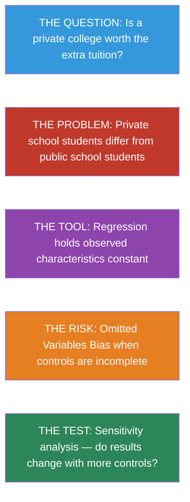


### Key Concepts and Definitions

**Ordinary Least Squares (OLS):** The most common method for fitting a regression line. It chooses the coefficients that minimize the sum of squared differences between predicted and actual values of the outcome.

> 💡 **Example**
>
> To estimate the earnings premium of a college degree, OLS finds the line through the data that makes the squared prediction errors as small as possible.

> 📝 **Analogy**
>
> Like a tailor measuring a suit. OLS adjusts the fit so the overall gap between the fabric and the body is minimized --- no single measurement is perfect, but the total mismatch is as small as it can be.


**Omitted Variable Bias (OVB):** The bias that results when a relevant variable is left out of a regression. The formula $\text{OVB} = \pi_1 \times \gamma$ shows that bias equals the relationship between the omitted variable and the treatment, times the effect of the omitted variable on the outcome.

> 💡 **Example**
>
> Omitting ability from a regression of earnings on schooling inflates the schooling coefficient, because ability is positively correlated with both.

> 📝 **Analogy**
>
> Like blaming coffee for heart disease while ignoring that coffee drinkers are also more likely to smoke. If you leave smoking out of the picture, coffee gets the blame for what smoking caused.


**Short vs. Long Regression:** The "short" regression includes fewer control variables and is more vulnerable to OVB. The "long" regression adds controls to reduce bias. The difference between their coefficients reveals the OVB.

> 💡 **Example**
>
> Regressing earnings on college attendance (short) gives a 14% premium. Adding SAT scores and parental income (long) reduces it to 2%. The 12% gap is OVB.

> 📝 **Analogy**
>
> Like describing someone in one sentence (short) versus a full paragraph (long). The short description may miss important details that change the story.


**Control Variable:** A variable included in a regression to hold constant an observed characteristic, allowing the researcher to isolate the effect of the treatment variable. Good controls are pre-treatment confounders.

> 💡 **Example**
>
> When estimating the effect of class size on test scores, controlling for school funding ensures we compare schools with similar resources.

> 📝 **Analogy**
>
> Like a cooking competition where every contestant uses the same oven and ingredients. Controlling for equipment lets you fairly judge each chef's skill alone.


**Bad Control:** A variable that is *caused by* the treatment and should not be included in the regression. Controlling for it blocks part of the causal pathway and introduces new bias.

> 💡 **Example**
>
> Controlling for occupation when estimating the return to education removes one of the main channels through which education raises earnings, biasing the estimate downward.

> 📝 **Analogy**
>
> Like judging a medicine's effect on health but only counting patients who did not get better. By filtering on the outcome's pathway, you miss part of the medicine's true benefit.


**Sensitivity Analysis:** A robustness check that examines whether the treatment effect estimate changes when additional controls are added. Stable estimates across specifications increase confidence in the causal interpretation.

> 💡 **Example**
>
> Dale and Krueger showed that the private college premium barely changed after adding SAT scores and parental income, suggesting the remaining controls (application behavior) captured the key confounders.

> 📝 **Analogy**
>
> Like stress-testing a bridge. If the bridge holds up under different loads and conditions, you trust it is sturdy. If the estimate survives adding many controls, you trust it is not driven by omitted variables.


**Auxiliary Regression:** The regression of the omitted variable on the treatment variable, used to compute the $\pi_1$ component of the OVB formula. It tells you how strongly the omitted variable is related to treatment assignment.

> 💡 **Example**
>
> Regressing ability on private school attendance shows $\pi_1 > 0$: higher-ability students are more likely to attend private school.

> 📝 **Analogy**
>
> Like checking how correlated two suspects are before deciding if one is covering for the other. The auxiliary regression tells you how much the missing variable "travels with" the treatment.


**Ceteris Paribus:** A Latin phrase meaning "all other things being equal." In regression, the coefficient on the treatment variable represents the effect of treatment holding all control variables constant.

> 💡 **Example**
>
> A regression coefficient of \$5,000 on private school attendance, with SAT scores held constant, means private school raises earnings by \$5,000 for students with the same SAT scores.

> 📝 **Analogy**
>
> Like comparing two identical houses on the same street that differ only in having a garage. Any price difference is the value of the garage, all else equal.


**Conditional Independence Assumption (CIA):** The assumption that, after controlling for observed variables, treatment assignment is as good as random. If the CIA holds, regression gives causal estimates.

> 💡 **Example**
>
> If we control for SAT scores, parental income, and application behavior, the remaining variation in college choice may be essentially random, satisfying the CIA.

> 📝 **Analogy**
>
> Like matching identical twins who differ only in one habit (say, drinking coffee). If the match is perfect, any health difference is caused by coffee. CIA says "our controls are good enough to create such a match."


**Regression to the Mean:** The statistical phenomenon where extreme observations tend to be followed by less extreme ones, not because of any causal process, but because extreme values partly reflect random luck that is unlikely to repeat.

> 💡 **Example**
>
> A student who scores in the 99th percentile on one exam will likely score lower on the next, even without any change in ability --- the first score was partly luck.

> 📝 **Analogy**
>
> Like a golfer who shoots a 62 on Saturday. His Sunday round will probably be closer to his average, not because he got worse, but because unusually good luck rarely repeats.


### Is a Private College Worth It?

Students at elite private universities in the United States pay roughly $20,000 more per year in tuition than those at public universities. Graduates of Harvard, Stanford, and Yale earn substantially more than graduates of state schools. But does the private school *cause* higher earnings, or are the students who attend these schools simply different --- smarter, more motivated, better connected --- in ways that would lead to high earnings regardless?

This is the same selection bias problem we met in Chapter 1. But here, we can't run a randomized experiment (Harvard's admissions office won't flip a coin). Instead, we reach for regression.

> 📝 **Intuition Builder: Regression as Automated Matching**
>
>
> Think of regression as a matchmaking service. It finds pairs of students who look similar on paper --- same test scores, same family income, same types of schools applied to --- but one went private and the other went public. The regression estimate is like averaging the earnings difference across all these matched pairs.
>
> When the matching is on **all the right variables**, regression approximates what a randomized experiment would show. When important variables are missing, the match is imperfect, and bias creeps in.


To separate the school's causal effect from the student's pre-existing advantages, we need a tool that holds observable characteristics constant. That tool is regression.


### How Regression Works

#### The Regression Model

A regression links an outcome ($Y_i$) to a treatment variable ($P_i$) while holding control variables ($X_i$) constant:

$$Y_i = \alpha + \beta P_i + \gamma X_i + e_i$$

where:

- $\alpha$ = intercept (average outcome when $P_i = 0$ and $X_i = 0$)
- $\beta$ = the treatment effect we're after (how much $Y$ changes when $P$ switches from 0 to 1, holding $X$ constant)
- $\gamma$ = effect of the control variable
- $e_i$ = residual (everything else affecting $Y$ that's not in the model)

**OLS (Ordinary Least Squares)** chooses $\alpha$, $\beta$, and $\gamma$ to minimize the sum of squared residuals --- making the model's predictions as close to the actual data as possible.

> 📝 **Connection to Chapter 1**
>
>
> In Chapter 1, we regressed outcomes on a treatment dummy with no controls. The coefficient was the difference in means between treated and untreated. Adding controls is the key innovation of Chapter 2: regression holds the controls constant, producing an "other things equal" comparison within groups that share the same control values.


### Seeing OVB with Simulated Data

To understand omitted variables bias, let's create a dataset where we **know the truth** --- because we designed it ourselves. This makes it easy to see when regression gets it right and when it goes wrong.

#### The Data-Generating Process

We simulate 1,000 students choosing between private and public colleges:

```python
import numpy as np
import pandas as pd
import pyfixest as pf

## Set seed so everyone gets the same random numbers
np.random.seed(42)
n = 1000  # number of simulated students

## --- Step 1: Generate ABILITY (the unobserved confounder) ---
## Each student gets a random ability score (mean=50, sd=10)
ability = np.random.normal(50, 10, n)

## --- Step 2: Private school CHOICE depends on ability ---
## Higher ability → higher probability of choosing private school (logistic function)
## Students with ability above 50 have >50% chance; below 50 have <50% chance
prob_private = 1 / (1 + np.exp(-(ability - 50) / 5))
## Flip a coin for each student using their personal probability
private = np.random.binomial(1, prob_private)

## --- Step 3: EARNINGS depend on both private school AND ability ---
## The TRUE causal effect of private school is exactly $5,000
true_effect = 5000
## Base pay ($30,000) + private school bonus + ability bonus + random noise
earnings = (30000
            + true_effect * private
            + 800 * ability
            + np.random.normal(0, 5000, n))

## --- Step 4: Combine into a clean dataset ---
students = pd.DataFrame({
    "earnings": earnings,
    "private": private,
    "ability": ability,
})

students.head(5)
```

> ⭐ **The Ground Truth**
>
>
> We built this data so that:
>
> - The **true causal effect** of private school is exactly **$5,000**
> - **Ability** independently increases earnings AND makes private school more likely
> - This creates **selection bias**: private school students earn more partly because they're higher-ability, not just because of the school


#### The Short Regression (Omitting Ability)

What happens if we regress earnings on `private` without controlling for ability?

```python
## SHORT regression: omit the confounder (ability)
short = pf.feols("earnings ~ private", data=students)

## Extract key regression results into a clear table
pd.DataFrame({
    "Variable": short.coef().index,
    "Coefficient": short.coef().round(2).values,
    "Std. Error": short.se().round(2).values,
    "t-statistic": short.tstat().round(2).values,
    "p-value": short.pvalue().round(3).values,
})
```

The coefficient on `private` is well above $5,000. This is **omitted variables bias** --- the regression attributes some of ability's effect to the private school dummy because the two are correlated.


#### The Long Regression (Including Ability)

Now add ability as a control:

```python
## LONG regression: include the confounder (ability)
long = pf.feols("earnings ~ private + ability", data=students)

## Extract key regression results into a clear table
pd.DataFrame({
    "Variable": long.coef().index,
    "Coefficient": long.coef().round(2).values,
    "Std. Error": long.se().round(2).values,
    "t-statistic": long.tstat().round(2).values,
    "p-value": long.pvalue().round(3).values,
})
```

With ability controlled, the private school coefficient drops to approximately $5,000 --- close to the true causal effect we built into the data.

> ⚠️ **Common Misconception: "Just add more controls"**
>
>
> Adding controls helps *only* when the controls are confounders (variables that affect both treatment and outcome). Adding irrelevant variables wastes statistical precision. And adding **bad controls** --- variables that are *caused by* the treatment --- can actually introduce bias. We return to this danger in Chapter 6.


### The OVB Formula

#### The Most Important Equation in Econometrics

The relationship between the short and long regression coefficients follows a precise formula:

$$\text{OVB} = \beta^s - \beta^l = \underbrace{\pi_1}_{\text{Relationship between}\atop\text{omitted and treatment}} \times \underbrace{\gamma}_{\text{Effect of omitted}\atop\text{in long regression}}$$

where:

- $\beta^s$ = coefficient on treatment in the **short** regression (fewer controls)
- $\beta^l$ = coefficient on treatment in the **long** regression (more controls)
- $\pi_1$ = coefficient from regressing the **omitted variable** on the **treatment variable**
- $\gamma$ = coefficient on the **omitted variable** in the long regression

> 📝 **Intuition Builder: The Missing Ingredient**
>
>
> Think of baking a cake. The recipe calls for flour, sugar, and eggs. If you forget the sugar (omitted variable), the cake will taste different from what you intended. The OVB formula tells you *how much* the taste changes and *in what direction*:
>
> - **$\pi_1$**: How correlated is sugar with the other ingredients you *did* include? (If you always add sugar when you add flour, omitting sugar distorts the flour effect.)
> - **$\gamma$**: How much does sugar matter for the final taste? (If sugar is critical, omitting it causes big bias.)
> - **OVB = $\pi_1 \times \gamma$**: The bias is the product of these two factors.
>
> If either factor is zero --- the omitted variable is unrelated to treatment, or it doesn't affect the outcome --- there's no bias.


#### Verifying the OVB Formula

Let's check that the formula works with our simulated data:

```python
## --- Step 1: Get the short and long coefficients on "private" ---
beta_short = short.coef()["private"]
beta_long = long.coef()["private"]

## --- Step 2: Compute OVB directly (short minus long) ---
ovb_direct = beta_short - beta_long

## --- Step 3: Compute the two components of the OVB formula ---
## pi_1: regress the OMITTED variable (ability) on the TREATMENT (private)
auxiliary = pf.feols("ability ~ private", data=students)
pi_1 = auxiliary.coef()["private"]  # how much ability differs by private status

## gamma: coefficient on ability in the LONG regression
gamma = long.coef()["ability"]  # how much ability affects earnings

## --- Step 4: OVB from the formula (should match Step 2) ---
ovb_formula = pi_1 * gamma

## --- Display results ---
pd.DataFrame({
    "Component": [
        "Short reg coefficient (private)",
        "Long reg coefficient (private)",
        "OVB (direct: short - long)",
        "pi_1 (ability ~ private)",
        "gamma (ability in long reg)",
        "OVB (formula: pi_1 x gamma)",
    ],
    "Value": [
        round(beta_short),
        round(beta_long),
        round(ovb_direct),
        round(pi_1, 2),
        round(gamma),
        round(ovb_formula),
    ],
})
```

The formula matches. The two components reveal *why* the bias exists:

- **$\pi_1 > 0$**: Higher-ability students are more likely to attend private school
- **$\gamma > 0$**: Higher ability increases earnings
- **OVB = positive $\times$ positive = positive**: The short regression overstates the private school effect

#### Predicting the Direction of Bias

Even when we can't observe the omitted variable, the OVB formula lets us **predict the direction of bias** by reasoning about the signs of $\pi_1$ and $\gamma$:

| $\pi_1$ (omitted ↔ treatment) | $\gamma$ (omitted → outcome) | OVB direction |
|:---:|:---:|:---:|
| Positive | Positive | **Upward** bias |
| Positive | Negative | **Downward** bias |
| Negative | Positive | **Downward** bias |
| Negative | Negative | **Upward** bias |

: The sign of OVB depends on the signs of both components
### Case Study: The Private College Premium

#### Dale and Krueger's Self-Revelation Model

Economists Stacy Dale and Alan Krueger studied the earnings of over 14,000 college students using the **College and Beyond (C&B)** dataset. Their key insight was that the schools students *applied to* reveal information about their ambition and ability. *Note: The C&B dataset is not publicly available, so we discuss Dale and Krueger's findings rather than replicating the analysis in code. The simulated data above demonstrated the same OVB principles that their study applies to real data.*

**The matching strategy**: Compare students who were admitted to the same set of schools but chose to attend different ones. For example, a student admitted to both Harvard and UMass who chose Harvard versus one who chose UMass. Both students were *equally qualified* (admitted to the same schools), but made different enrollment decisions.

**The findings** (paraphrased):

- Without controls, private school graduates earned about **14% more** than public school graduates
- Controlling for Barron's selectivity group reduced this to about **7%**
- Controlling for the specific schools applied to (the "self-revelation" model) reduced it to **close to zero**

> ⭐ **Key Finding: The Private School Premium is Mostly Selection**
>
>
> Once you compare students who were equally ambitious (applied to similar schools), the earnings advantage of attending an elite private college **largely disappears**. Most of the raw earnings gap reflects who attends private school, not what private school does.
>
> This is a textbook demonstration of OVB at work: when you add the right controls, the treatment effect shrinks dramatically.


#### Regression Sensitivity Analysis

The Dale and Krueger results illustrate an important robustness check: **sensitivity analysis**. When adding controls doesn't change the estimate much, we can be more confident that the remaining estimate isn't driven by further omitted variables.

In their data:

- Adding SAT scores, parental income, and demographics **barely changed** the private school coefficient once the self-revelation controls were included
- The OVB formula explains why: conditional on application behavior, private school attendance was **no longer correlated** with these variables ($\pi_1 \approx 0$), so omitting them caused little bias

The Dale and Krueger study succeeded because they controlled for the *right* variables --- pre-treatment characteristics like application behavior. But what happens when researchers control for the *wrong* variables?


### When Controls Go Wrong: Bad Controls

> ⚠️ **Not All Controls Are Good Controls**
>
>
> A **bad control** is a variable that is *caused by* the treatment. Controlling for it blocks the causal pathway and distorts the estimate.
>
> **Example**: Suppose private school causes students to enter higher-paying occupations. If you control for occupation, you're asking "among people in the same job, do private school grads earn more?" This removes one of the main ways private school helps, leading you to underestimate the true effect.
>
> **Rule of thumb**: Only control for variables determined *before* the treatment was assigned. Variables determined *after* treatment (occupation, graduate degree, industry) are potential outcomes, not confounders.


> 📝 **Connection to Chapter 6**
>
>
> Chapter 6 revisits bad controls in the context of returns to schooling. Controlling for occupation when estimating the effect of education is a classic bad-control mistake. The lesson is the same: controls must be *pre-treatment* characteristics, not downstream outcomes.


### How Regression Connects to Every Other Chapter

Regression is not just a standalone method --- it is the **building block** for every other tool in this book:

| Chapter | How Regression Appears |
|:---|:---|
| **Ch 1 (RCTs)** | Difference in means *is* a regression on a treatment dummy |
| **Ch 3 (IV)** | First stage and reduced form are regressions; 2SLS uses predicted values from regression |
| **Ch 4 (RD)** | RD regression controls for a polynomial in the running variable |
| **Ch 5 (DD)** | DD is a regression with group and time fixed effects |
| **Ch 6 (Schooling)** | OLS regression is the baseline; twins FE is a differenced regression |

: Regression is the foundation of all five methods in the book
### Historical Perspective: Galton and Yule

#### Francis Galton and "Regression to the Mean"

The word "regression" comes from **Sir Francis Galton** (1886), who studied the heights of parents and children. He observed that very tall parents tend to have children who are tall but *less extreme* than their parents --- heights "regress toward the mean." Galton's finding was about a statistical regularity, not causation, but the mathematical tool he developed to describe it became the foundation of modern regression analysis.

#### George Udny Yule and Social Statistics

**George Udny Yule** (1899) was among the first to apply regression to social policy questions. He studied the causes of changes in pauperism (poverty) in England, using regression to control for multiple factors simultaneously. Yule's work pioneered the use of regression with multiple control variables --- exactly the approach we've been learning.

Both Galton and Yule worked in an era before causal inference was formalized. Their statistical tools were designed for description and prediction. The causal interpretation of regression --- asking whether $\beta$ represents a causal effect --- is a modern contribution that depends on the assumptions we've discussed (correct controls, no omitted variables).


### Key Takeaways

The following concept map traces the logic of this chapter --- from the initial causal question, through regression as the primary tool, to the key concepts of omitted variable bias, sensitivity analysis, and the danger of bad controls.

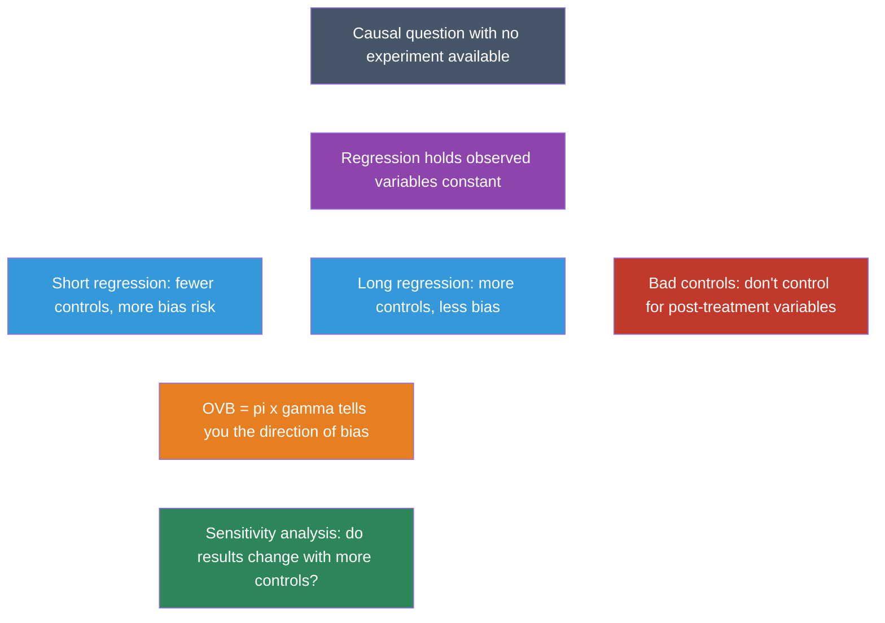

1. **Regression approximates an experiment** by comparing treated and untreated observations that share the same values of control variables.

2. **OVB = $\pi_1 \times \gamma$** --- the bias from omitting a variable equals the correlation of the omitted variable with treatment times its effect on the outcome.

3. **The direction of OVB can be predicted** by reasoning about the signs of $\pi_1$ and $\gamma$, even when the omitted variable is unobserved.

4. **Sensitivity analysis**: If adding controls doesn't change the estimate much, we gain confidence that remaining omitted variables aren't causing large bias.

5. **Bad controls** (post-treatment variables) should never be included --- they block causal pathways and introduce new bias.

6. **Regression is foundational**: Every method in the book (IV, RD, DD) uses regression as a building block.

7. **The private college premium** largely disappears once you match students by the schools they applied to --- most of the raw gap is selection, not causation.


### Learn by Coding

Copy this code into a Python notebook to reproduce the key results from this chapter.

```python
## ============================================================
## Chapter 2: Regression — Code Cheatsheet
## ============================================================
import numpy as np
import pandas as pd
import pyfixest as pf

## --- Step 1: Simulate data where we KNOW the true causal effect ---
np.random.seed(42)
n = 1000
ability = np.random.normal(50, 10, n)
prob_private = 1 / (1 + np.exp(-(ability - 50) / 5))
private = np.random.binomial(1, prob_private)
true_effect = 5000
earnings = 30000 + true_effect * private + 800 * ability + np.random.normal(0, 5000, n)
students = pd.DataFrame({"earnings": earnings, "private": private, "ability": ability})

## --- Step 2: Short regression (omitting ability → biased) ---
short = pf.feols("earnings ~ private", data=students)
print("SHORT regression (biased — omits ability):")
print(f"  Private school coefficient: ${short.coef()['private']:,.0f}")
print(f"  True effect is $5,000 — the estimate is too high!\n")

## --- Step 3: Long regression (including ability → unbiased) ---
long = pf.feols("earnings ~ private + ability", data=students)
print("LONG regression (controls for ability):")
print(f"  Private school coefficient: ${long.coef()['private']:,.0f}")
print(f"  Close to the true effect of $5,000\n")

## --- Step 4: Verify the OVB formula ---
ovb_direct = short.coef()["private"] - long.coef()["private"]
aux = pf.feols("ability ~ private", data=students)
pi_1 = aux.coef()["private"]       # relationship: omitted ↔ treatment
gamma = long.coef()["ability"]      # effect of omitted in long regression
ovb_formula = pi_1 * gamma
print("OVB Formula Verification:")
print(f"  Direct OVB (short - long):  ${ovb_direct:,.0f}")
print(f"  Formula OVB (pi1 x gamma): ${ovb_formula:,.0f}")
print(f"  pi1 = {pi_1:.2f}, gamma = {gamma:.0f}")
```

> 💡 **Try it yourself!**
>
> Copy the code above and paste it into [this Google Colab scratchpad](https://colab.research.google.com/notebooks/empty.ipynb) to run it interactively. Modify the variables, change the specifications, and see how results change!


Below is the same cheatsheet in Stata syntax.

```stata
* ============================================================
* Chapter 2: Regression — Stata Cheatsheet
* ============================================================
clear all
set more off
set seed 42
set obs 1000

* --- Step 1: Simulate data where we KNOW the true causal effect ---
gen ability = rnormal(50, 10)
gen prob_private = 1 / (1 + exp(-(ability - 50) / 5))
gen private = rbinomial(1, prob_private)
gen earnings = 30000 + 5000 * private + 800 * ability + rnormal(0, 5000)

* --- Step 2: Short regression (omitting ability — biased) ---
reg earnings private
* The private coefficient is too high (above 5,000) due to OVB

* --- Step 3: Long regression (including ability — unbiased) ---
reg earnings private ability
* The private coefficient is now close to the true effect of 5,000

* --- Step 4: Verify the OVB formula ---
scalar long_private = _b[private]
scalar gamma = _b[ability]
quietly reg earnings private
scalar short_private = _b[private]
scalar ovb_direct = short_private - long_private
quietly reg ability private
scalar pi_1 = _b[private]
scalar ovb_formula = pi_1 * gamma
display "Direct OVB (short - long):  " ovb_direct
display "Formula OVB (pi1 x gamma): " ovb_formula
```

> 💡 **Try it in Stata!**
>
> Copy the code above into a `.do` file and run it in Stata. No external data files are needed — this chapter uses simulated data generated within the script.


### Exercises

#### Multiple Choice Questions

1. **What is the main purpose of adding control variables in a regression?**
   a) To increase the R-squared of the model
   b) To hold confounders constant and approximate an experimental comparison
   c) To make the regression coefficients larger
   d) To reduce the sample size needed for significance

> 📝 **Show answer**
>
> **(b)** Control variables approximate a ceteris paribus (all else equal) comparison by holding potential confounders constant, making the regression comparison more like an experiment. **(a) is wrong** because raising R-squared is a side effect, not the purpose — a high R-squared does not guarantee unbiased estimates. **(c) is wrong** because adding controls can make coefficients smaller (as when removing upward OVB) or larger (as when removing downward OVB). **(d) is wrong** because control variables affect bias, not the required sample size.


2. **Omitted variable bias pushes the treatment coefficient upward when the omitted variable is:**
   a) Negatively correlated with both treatment and outcome
   b) Positively correlated with treatment but negatively correlated with outcome
   c) Positively correlated with both treatment and outcome
   d) Uncorrelated with the treatment variable

> 📝 **Show answer**
>
> **(c)** The OVB formula is: bias = $\pi_1 \times \gamma$, where $\pi_1$ is the relationship between the omitted variable and the treatment, and $\gamma$ is the effect of the omitted variable on the outcome. When both are positive, the bias is positive (upward). **(a) is wrong** because negative × negative = positive, which also gives upward bias — but the question asks for the standard case, and (c) is the more direct answer. **(b) is wrong** because positive × negative = negative, which gives downward bias. **(d) is wrong** because if the omitted variable is uncorrelated with treatment ($\pi_1 = 0$), there is no bias at all.


3. **A "bad control" is a variable that:**
   a) Has missing values in the dataset
   b) Is measured with error
   c) Is caused by the treatment and should not be controlled for
   d) Is correlated with the error term

> 📝 **Show answer**
>
> **(c)** A bad control is a variable that is itself an outcome of the treatment. Controlling for it blocks part of the causal channel through which the treatment operates, biasing the estimate. For example, controlling for occupation when estimating the effect of education on earnings would absorb part of education's effect (since education affects occupation). **(a) is wrong** because missing data is a data quality issue, not what makes a control "bad." **(b) is wrong** because measurement error can attenuate estimates but does not define a bad control. **(d) is wrong** because correlation with the error term describes endogeneity, a broader concept — the specific problem with bad controls is that they are caused by the treatment.


4. **According to the OVB formula, the bias is zero when:**
   a) The sample size is very large
   b) The R-squared of the regression is high
   c) Either the omitted variable is uncorrelated with treatment, or it has no effect on the outcome
   d) The treatment variable is binary

> 📝 **Show answer**
>
> **(c)** The OVB formula (bias = $\pi_1 \times \gamma$) equals zero when either factor is zero: if the omitted variable is uncorrelated with treatment ($\pi_1 = 0$) or if it has no direct effect on the outcome ($\gamma = 0$). Either condition eliminates the bias. **(a) is wrong** because OVB is a systematic bias that persists regardless of sample size — more data gives more precise but still biased estimates. **(b) is wrong** because R-squared measures fit, not the presence or absence of omitted variable bias. **(d) is wrong** because whether the treatment is binary or continuous is irrelevant to the OVB formula.


5. **Dale and Krueger's study of private colleges found that the earnings premium of private school:**
   a) Was even larger than OLS suggested
   b) Was robust across all specifications
   c) Largely disappeared when controlling for the selectivity of schools students applied to
   d) Only existed for students from wealthy families

> 📝 **Show answer**
>
> **(c)** When Dale and Krueger compared students who were accepted to similarly selective schools but chose differently (private vs. public), the private school earnings premium largely vanished. The naive premium reflected selection bias — students at elite private schools were more ambitious and talented, not necessarily better educated. **(a) is wrong** because the premium shrank, not grew, with better controls. **(b) is wrong** because the result was notably sensitive to controlling for application behavior. **(d) is wrong** because the finding applied broadly, not just to wealthy families — in fact, there was some evidence that disadvantaged students might benefit more from elite schools.


6. **The "short regression" in the OVB framework refers to:**
   a) A regression with fewer observations
   b) A regression that omits one or more relevant control variables
   c) A regression estimated over a shorter time period
   d) A regression with a small R-squared

> 📝 **Show answer**
>
> **(b)** The "short regression" omits a relevant variable, producing a biased coefficient. The "long regression" includes that variable. The OVB formula relates the two: the short regression coefficient equals the long regression coefficient plus the bias term. **(a) is wrong** because "short" refers to the number of regressors, not observations. **(c) is wrong** because it refers to variables included, not the time span. **(d) is wrong** because R-squared can be small in either the short or long regression — "short" describes the specification, not the fit.


7. **In the OVB formula, $\pi_1$ represents:**
   a) The coefficient of the treatment variable in the long regression
   b) The coefficient from regressing the omitted variable on the treatment variable
   c) The standard error of the treatment coefficient
   d) The correlation between the outcome and the error term

> 📝 **Show answer**
>
> **(b)** In the OVB formula (bias = $\pi_1 \times \gamma$), $\pi_1$ comes from the auxiliary regression of the omitted variable on the included treatment variable. It measures how strongly the omitted variable is related to treatment assignment. **(a) is wrong** because that describes $\beta$ (the causal effect), not $\pi_1$. **(c) is wrong** because $\pi_1$ is a regression coefficient, not a standard error. **(d) is wrong** because $\pi_1$ captures the treatment-omitted variable relationship, not the outcome-error correlation.


8. **When the short regression coefficient is stable after adding control variables, this suggests:**
   a) The controls are bad controls
   b) The original estimate was likely not severely biased by omitted variables
   c) The controls are poorly measured
   d) The sample size is too small

> 📝 **Show answer**
>
> **(b)** If the coefficient barely changes when controls are added, the omitted variable bias from those controls was small — either they are weakly correlated with treatment ($\pi_1 \approx 0$) or they have little effect on the outcome ($\gamma \approx 0$). This stability gives confidence that the estimate is robust. **(a) is wrong** because stability says nothing about whether controls are caused by treatment. **(c) is wrong** because poor measurement of controls would attenuate their effect but does not explain why the treatment coefficient is stable. **(d) is wrong** because sample size affects precision, not the stability of point estimates across specifications.


9. **In the private school simulation in this chapter, the "true effect" is set by the researcher. Why?**
   a) Because real-world causal effects can never be known
   b) Because simulation lets us know the true effect and check whether regression recovers it
   c) Because the treatment effect varies across individuals
   d) Because OLS always produces unbiased estimates

> 📝 **Show answer**
>
> **(b)** Simulation is a pedagogical tool: by setting the true causal effect (e.g., $5,000), we can verify whether the short regression (without ability controls) overestimates it and whether the long regression (with ability) recovers the true value. This directly demonstrates OVB in action. **(a) is wrong** because while true effects are unknown in practice, simulation specifically lets us know them. **(c) is wrong** because while treatment effect heterogeneity exists, the simulation uses a constant effect to clearly illustrate OVB. **(d) is wrong** because the whole point of the exercise is to show that OLS can be biased when relevant variables are omitted.


10. **Controlling for SAT scores in a regression of wages on college selectivity could be problematic because:**
    a) SAT scores are measured with error
    b) SAT scores may be a proxy for the same ability that also affects wages directly
    c) SAT scores are available for all students
    d) SAT scores are not correlated with college selectivity

> 📝 **Show answer**
>
> **(b)** SAT scores proxy for ability, which affects both college selectivity (students with higher ability attend more selective schools) and wages (ability raises earnings regardless of school). Including SAT scores can help reduce OVB from ability, but if SAT is an imperfect proxy, residual OVB remains. The Dale and Krueger strategy of matching on application behavior is arguably better because it captures revealed ambition. **(a) is wrong** because while measurement error exists, the main issue is that SAT is a proxy variable, not a bad control. **(c) is wrong** because availability is a practical consideration, not a conceptual problem. **(d) is wrong** because SAT scores are in fact highly correlated with college selectivity — that is precisely why they matter for this analysis.


#### Conceptual Questions

1. **OVB direction**: A study estimates the effect of job training on wages but does not control for prior work experience. Workers with more experience are more likely to receive training AND earn higher wages. Using the OVB formula, predict: is the training coefficient biased upward or downward?

> 📝 **Show answer**
>
> **The training coefficient is biased upward because it absorbs the positive effect of the omitted experience variable.**
>
> 1. **Identify $\pi_1$:** The relationship between experience and training is positive, since experienced workers tend to receive more training.
> 2. **Identify $\gamma$:** The effect of experience on wages in the long regression is positive, since experience raises wages.
> 3. **Apply the OVB formula:** OVB = $\pi_1 \times \gamma$ = positive $\times$ positive = **positive**.
> 4. **Conclude:** The short regression overstates the true effect of training because it partly captures the wage-boosting effect of experience. This is a direct application of the OVB formula introduced in the chapter.


2. **Short vs. long**: You run a regression of test scores on class size (small vs. large) and get a coefficient of -5. When you add family income as a control, the coefficient changes to -2. (a) What is the OVB? (b) What does this imply about the relationship between family income, class size, and test scores?

> 📝 **Show answer**
>
> **Omitting family income biases the class size effect downward, making smaller classes look more beneficial than they truly are.**
>
> 1. **Compute OVB:** OVB = short $-$ long = $-5 - (-2) = -3$.
> 2. **Decompose the sign:** Family income is negatively correlated with class size (richer families choose smaller classes, so $\pi_1 < 0$) and positively correlated with test scores ($\gamma > 0$). The product $\pi_1 \times \gamma$ is negative.
> 3. **Interpret:** The negative OVB means the short regression exaggerates the class size penalty --- some of the apparent class size effect was really a family income effect. This illustrates the chapter's warning: the direction of OVB depends on the signs of both $\pi_1$ and $\gamma$.


3. **Bad controls**: A researcher studies whether exercise improves mental health. She controls for body weight in her regression. Why might this be a bad control? (Hint: does exercise affect body weight?)

> 📝 **Show answer**
>
> **Body weight is a bad control because it is a downstream consequence of exercise, not a pre-treatment confounder.**
>
> 1. **Identify the causal pathway:** Exercise causes changes in body weight, so weight is a mediator on the path exercise $\rightarrow$ lower weight $\rightarrow$ better mental health.
> 2. **Explain the problem:** Controlling for weight blocks this pathway, absorbing part of the total effect of exercise. The regression would understate how much exercise improves mental health.
> 3. **State the rule:** As the chapter emphasizes, only control for variables determined *before* the treatment (pre-treatment covariates). Bad controls --- variables that are themselves affected by treatment --- introduce bias by removing part of the causal effect you are trying to measure.


4. **Sensitivity analysis**: Two studies estimate the effect of class size on test scores. Study A gets -3 without controls and -2.8 with controls. Study B gets -8 without controls and -2 with controls. Which study's results are more credible, and why?

> 📝 **Show answer**
>
> **Study A is more credible because coefficient stability across specifications signals low omitted variable bias.**
>
> 1. **Compare the shifts:** Study A's estimate barely changes when controls are added ($-3$ to $-2.8$, a shift of $0.2$). Study B's estimate drops dramatically ($-8$ to $-2$, a shift of $6$).
> 2. **Apply OVB logic:** By the OVB formula, the large change in Study B means the added controls were highly correlated with both class size ($\pi_1$ is large) and test scores ($\gamma$ is large). The uncontrolled estimate was severely biased.
> 3. **Draw the conclusion:** Study A's stability suggests that omitted variables are less of a concern --- the short and long regressions tell a similar story. This coefficient-stability heuristic is a practical diagnostic from the chapter: when adding controls barely moves the estimate, we gain confidence that further omitted variables are unlikely to change it much either.


5. **Regression vs. RCT**: A regression of health on exercise, controlling for age, income, and diet, finds that exercise improves health. Under what conditions would this estimate be causal? What could still go wrong?

> 📝 **Show answer**
>
> **Regression can only deliver causal estimates if there are no unobserved confounders --- a strong assumption that is unlikely to hold here.**
>
> 1. **State the assumption:** The regression estimate is causal only if age, income, and diet are the *only* confounders (the conditional independence assumption, or CIA).
> 2. **List plausible violations:** Unobserved factors could still bias the result: genetics (some people are naturally healthier AND more inclined to exercise), motivation, social support, or pre-existing health conditions. Each of these is correlated with both exercise and health, creating OVB.
> 3. **Connect to the broader course:** Without random assignment of exercise, we can never be sure we have controlled for everything. This fundamental limitation of regression motivates the methods in later chapters --- instrumental variables (Chapter 3), regression discontinuity (Chapter 4), and differences-in-differences (Chapter 5) --- which rely on research designs rather than exhaustive control lists.


#### Research Tasks

1. **Change the true effect**: In the simulated data code above, change `true_effect` from 5000 to 0 (no causal effect). Re-run the short and long regressions. Does the short regression still show a positive coefficient? What does this demonstrate about selection bias?

> 📝 **Show answer**
>
>
> ```python
> # --- Generate data with NO causal effect ---
> np.random.seed(42)
> ability2 = np.random.normal(50, 10, n)
> prob2 = 1 / (1 + np.exp(-(ability2 - 50) / 5))  # ability drives private school selection
> private2 = np.random.binomial(1, prob2)
> earnings2 = 30000 + 0 * private2 + 800 * ability2 + np.random.normal(0, 5000, n)  # true effect = 0
>
> students2 = pd.DataFrame({"earnings": earnings2, "private": private2, "ability": ability2})
>
> # --- Run short vs long regressions ---
> short2 = pf.feols("earnings ~ private", data=students2)             # omits ability (biased)
> long2 = pf.feols("earnings ~ private + ability", data=students2)    # includes ability (correct)
>
> pd.DataFrame({
> "Regression": ["Short (omit ability)", "Long (include ability)"],
> "Private coefficient": [round(short2.coef()["private"]), round(long2.coef()["private"])],
> "True effect": [0, 0],
> })
> ```
>
> Stata equivalent:
>
> ```stata
> * --- Simulation with true effect = 0 ---
> clear all
> set more off
> set seed 42
> set obs 1000
>
> * Generate data
> gen ability = rnormal(50, 10)
> gen prob_private = 1 / (1 + exp(-(ability - 50) / 5))
> gen private = rbinomial(1, prob_private)
> gen earnings = 30000 + 0 * private + 800 * ability + rnormal(0, 5000)
>
> * Short regression (omits ability — biased)
> reg earnings private
>
> * Long regression (includes ability — correct)
> reg earnings private ability
> ```
>
> (1) **What the numbers show:** The short regression shows a positive coefficient even though the true effect is zero. The long regression correctly recovers approximately zero.
>
> (2) **Why:** This is pure OVB in action --- higher-ability students select into private school ($\pi_1 > 0$) AND ability raises earnings ($\gamma > 0$). The short regression attributes ability's effect to private schooling because the omitted variable is correlated with both the treatment and the outcome.
>
> (3) **What it teaches:** OVB can create the illusion of a causal effect where none exists. This is the most dangerous form of bias: a policy maker relying on the short regression would incorrectly conclude that private schooling boosts earnings. The long regression, by controlling for the confounder, eliminates the bias.


2. **Strengthen the confounder**: Modify the simulation so that ability has a *stronger* relationship with private school choice (change the division by 5 to division by 2 in `prob_private`). How does this change the OVB? Verify with the formula.

> 📝 **Show answer**
>
>
> ```python
> # --- Generate data with stronger confounder ---
> np.random.seed(42)
> ability3 = np.random.normal(50, 10, n)
> prob3 = 1 / (1 + np.exp(-(ability3 - 50) / 2))  # divide by 2 instead of 5 = stronger selection
> private3 = np.random.binomial(1, prob3)
> earnings3 = 30000 + 5000 * private3 + 800 * ability3 + np.random.normal(0, 5000, n)
> students3 = pd.DataFrame({"earnings": earnings3, "private": private3, "ability": ability3})
>
> # --- Run short, long, and auxiliary regressions ---
> short3 = pf.feols("earnings ~ private", data=students3)       # biased estimate
> long3 = pf.feols("earnings ~ private + ability", data=students3)  # closer to true effect
> aux3 = pf.feols("ability ~ private", data=students3)          # estimates pi_1
>
> # --- Verify OVB formula ---
> ovb3 = round(short3.coef()["private"] - long3.coef()["private"])   # direct: short minus long
> formula3 = round(aux3.coef()["private"] * long3.coef()["ability"]) # formula: pi_1 * gamma
>
> pd.DataFrame({
> "Metric": ["Short coef", "Long coef", "OVB (direct)", "pi_1", "gamma", "OVB (formula)"],
> "Value": [round(short3.coef()["private"]), round(long3.coef()["private"]),
> ovb3, round(aux3.coef()["private"], 2), round(long3.coef()["ability"]),
> formula3],
> })
> ```
>
> Stata equivalent:
>
> ```stata
> * --- Stronger confounder (divide by 2 instead of 5) ---
> clear all
> set more off
> set seed 42
> set obs 1000
>
> gen ability = rnormal(50, 10)
> gen prob_private = 1 / (1 + exp(-(ability - 50) / 2))
> gen private = rbinomial(1, prob_private)
> gen earnings = 30000 + 5000 * private + 800 * ability + rnormal(0, 5000)
>
> * Short, long, and auxiliary regressions
> reg earnings private
> scalar short_coef = _b[private]
>
> reg earnings private ability
> scalar long_coef = _b[private]
> scalar gamma = _b[ability]
>
> reg ability private
> scalar pi1 = _b[private]
>
> * Verify OVB formula
> scalar ovb_direct = short_coef - long_coef
> scalar ovb_formula = pi1 * gamma
> display "OVB (direct) = " ovb_direct
> display "OVB (formula) = " ovb_formula
> ```
>
> (1) **What the numbers show:** With a stronger ability-private link, $\pi_1$ increases substantially and the OVB grows. The short regression coefficient is now much further from the true effect of 5,000. The OVB formula ($\pi_1 \times \gamma$) matches the direct calculation (short $-$ long), confirming the formula works exactly.
>
> (2) **Why:** A tighter link between ability and private school selection (dividing by 2 instead of 5 in the logistic function) means ability is a stronger predictor of treatment. Since $\gamma$ (the effect of ability on earnings) stays the same, the larger $\pi_1$ mechanically produces larger OVB.
>
> (3) **What it teaches:** The magnitude of OVB depends on how strongly the omitted variable predicts treatment ($\pi_1$). This is a key practical insight from the chapter: even if you know the direction of bias, the size of the problem depends on how strongly confounders sort people into treatment and control groups.


3. **Add a second confounder**: Add a `family_income` variable to the simulation that affects both private school choice and earnings. Run the long regression with only ability (omitting family income), then with both. Use the OVB formula to explain the difference.

> 📝 **Show answer**
>
>
> ```python
> # --- Generate data with two confounders ---
> np.random.seed(42)
> ability4 = np.random.normal(50, 10, n)
> family_income = np.random.normal(60000, 20000, n)
> # Both ability and income affect private school choice
> prob4 = 1 / (1 + np.exp(-((ability4 - 50) / 5 + (family_income - 60000) / 20000)))
> private4 = np.random.binomial(1, prob4)
> # Both ability and income affect earnings
> earnings4 = 10000 + 5000 * private4 + 800 * ability4 + 0.3 * family_income + np.random.normal(0, 5000, n)
>
> students4 = pd.DataFrame({
> "earnings": earnings4, "private": private4,
> "ability": ability4, "family_income": family_income,
> })
>
> # --- Run three regressions with progressively more controls ---
> r_short = pf.feols("earnings ~ private", data=students4)                        # no controls
> r_medium = pf.feols("earnings ~ private + ability", data=students4)             # one control
> r_long = pf.feols("earnings ~ private + ability + family_income", data=students4)  # both controls
>
> pd.DataFrame({
> "Regression": ["Short (no controls)", "Medium (ability only)", "Long (ability + income)"],
> "Private coefficient": [round(r_short.coef()["private"]),
> round(r_medium.coef()["private"]),
> round(r_long.coef()["private"])],
> "True effect": [5000, 5000, 5000],
> })
> ```
>
> Stata equivalent:
>
> ```stata
> * --- Two confounders: ability and family income ---
> clear all
> set more off
> set seed 42
> set obs 1000
>
> gen ability = rnormal(50, 10)
> gen family_income = rnormal(60000, 20000)
> gen prob_private = 1 / (1 + exp(-((ability - 50) / 5 + (family_income - 60000) / 20000)))
> gen private = rbinomial(1, prob_private)
> gen earnings = 10000 + 5000 * private + 800 * ability + 0.3 * family_income + rnormal(0, 5000)
>
> * Progressive regressions
> reg earnings private
> reg earnings private ability
> reg earnings private ability family_income
> ```
>
> (1) **What the numbers show:** The short regression (no controls) is the most biased. Adding ability alone (medium) moves the coefficient closer to the true 5,000, but it still overshoots. Adding both ability and family income (long) gets closest to the true effect.
>
> (2) **Why:** Each omitted confounder contributes its own OVB term. Family income is positively correlated with both private school attendance and earnings, so omitting it inflates the private school coefficient. Adding ability removes one source of bias but leaves the income-driven bias in place.
>
> (3) **What it teaches:** With multiple confounders, controlling for only some of them reduces bias but does not eliminate it. The progression from short to medium to long regression illustrates the chapter's core message: the long regression moves toward the causal effect only when it includes *all* relevant confounders. In practice, we can never be certain we have controlled for everything --- which is why the book introduces stronger research designs in later chapters.


4. **Reverse the confounder's sign**: Modify the simulation so that higher ability makes private school *less* likely (flip the sign in `prob_private`). Run the short and long regressions. Is the OVB now negative? Verify using the OVB formula that the predicted direction matches.

> 📝 **Show answer**
>
>
> ```python
> # --- Generate data with reversed confounder ---
> np.random.seed(42)
> ability_r = np.random.normal(50, 10, n)
> # Flip the sign: higher ability now REDUCES private school probability
> prob_r = 1 / (1 + np.exp((ability_r - 50) / 5))  # note: positive sign in exponent
> private_r = np.random.binomial(1, prob_r)
> earnings_r = 30000 + 5000 * private_r + 800 * ability_r + np.random.normal(0, 5000, n)
>
> students_r = pd.DataFrame({"earnings": earnings_r, "private": private_r, "ability": ability_r})
>
> # --- Run short, long, and auxiliary regressions ---
> short_r = pf.feols("earnings ~ private", data=students_r)
> long_r = pf.feols("earnings ~ private + ability", data=students_r)
> aux_r = pf.feols("ability ~ private", data=students_r)
>
> # --- Verify OVB formula ---
> ovb_r = round(short_r.coef()["private"] - long_r.coef()["private"])
> formula_r = round(aux_r.coef()["private"] * long_r.coef()["ability"])
>
> pd.DataFrame({
> "Metric": ["Short coef", "Long coef", "OVB (direct)", "pi_1", "gamma", "OVB (formula)"],
> "Value": [round(short_r.coef()["private"]), round(long_r.coef()["private"]),
> ovb_r, round(aux_r.coef()["private"], 2), round(long_r.coef()["ability"]),
> formula_r],
> })
> ```
>
> Stata equivalent:
>
> ```stata
> * --- Reversed confounder: higher ability reduces private school probability ---
> clear all
> set more off
> set seed 42
> set obs 1000
>
> gen ability = rnormal(50, 10)
> * Flip the sign: positive exponent means higher ability -> lower P(private)
> gen prob_private = 1 / (1 + exp((ability - 50) / 5))
> gen private = rbinomial(1, prob_private)
> gen earnings = 30000 + 5000 * private + 800 * ability + rnormal(0, 5000)
>
> * Short and long regressions
> reg earnings private
> scalar short_coef = _b[private]
>
> reg earnings private ability
> scalar long_coef = _b[private]
> scalar gamma = _b[ability]
>
> reg ability private
> scalar pi1 = _b[private]
>
> * Verify OVB formula
> scalar ovb_direct = short_coef - long_coef
> scalar ovb_formula = pi1 * gamma
> display "OVB (direct) = " ovb_direct " (should be negative)"
> display "OVB (formula) = " ovb_formula
> ```
>
> (1) **What the numbers show:** The short regression coefficient is now *below* the true effect of 5,000, not above it. The OVB is negative, and the formula ($\pi_1 \times \gamma$) correctly predicts this: $\pi_1 < 0$ (ability reduces private school probability) times $\gamma > 0$ (ability increases earnings) yields a negative product.
>
> (2) **Why:** When high-ability students attend strong public schools (making $\pi_1$ negative), the private school group has *lower* average ability than the public school group. The short regression attributes this ability disadvantage to private schooling itself, pulling the coefficient below the true effect. This is downward bias --- the opposite of the standard case.
>
> (3) **What it teaches:** The OVB formula works for all four sign combinations of $\pi_1$ and $\gamma$. Students often assume bias is always upward, but this exercise shows that the direction depends on the institutional context. In settings where treatment is negatively selected (e.g., remedial programs that serve weaker students), OVB can be downward, making the treatment look *less* effective than it truly is.


5. **Progressive control addition**: Create a simulation with three confounders (ability, family income, motivation) that each affect both private school choice and earnings. Run four nested regressions (no controls, +ability, +ability +income, +all three). Display how the private school coefficient changes as controls are added. Does it stabilize near the true effect?

> 📝 **Show answer**
>
>
> ```python
> # --- Generate data with three confounders ---
> np.random.seed(42)
> ability_s = np.random.normal(50, 10, n)
> income_s = np.random.normal(60000, 20000, n)
> motivation = np.random.normal(5, 2, n)
>
> # All three confounders affect private school choice
> prob_s = 1 / (1 + np.exp(-((ability_s - 50)/5 + (income_s - 60000)/20000 + (motivation - 5)/2)))
> private_s = np.random.binomial(1, prob_s)
>
> # All three confounders affect earnings
> earnings_s = (10000 + 5000 * private_s + 800 * ability_s
> + 0.3 * income_s + 2000 * motivation + np.random.normal(0, 5000, n))
>
> df_s = pd.DataFrame({
> "earnings": earnings_s, "private": private_s,
> "ability": ability_s, "income": income_s, "motivation": motivation,
> })
>
> # --- Run four nested regressions ---
> specs = [
> ("No controls", "earnings ~ private"),
> ("+ ability", "earnings ~ private + ability"),
> ("+ ability + income", "earnings ~ private + ability + income"),
> ("+ all three", "earnings ~ private + ability + income + motivation"),
> ]
>
> rows = []
> for label, formula in specs:
> r = pf.feols(formula, data=df_s)
> rows.append({
> "Specification": label,
> "Private coefficient": round(r.coef()["private"]),
> "True effect": 5000,
> })
>
> pd.DataFrame(rows)
> ```
>
> Stata equivalent:
>
> ```stata
> * --- Progressive control addition (sensitivity analysis) ---
> clear all
> set more off
> set seed 42
> set obs 1000
>
> gen ability = rnormal(50, 10)
> gen income = rnormal(60000, 20000)
> gen motivation = rnormal(5, 2)
> gen prob_private = 1 / (1 + exp(-((ability - 50)/5 + (income - 60000)/20000 + (motivation - 5)/2)))
> gen private = rbinomial(1, prob_private)
> gen earnings = 10000 + 5000*private + 800*ability + 0.3*income + 2000*motivation + rnormal(0, 5000)
>
> * Nested regressions — watch the coefficient on private stabilize
> reg earnings private
> reg earnings private ability
> reg earnings private ability income
> reg earnings private ability income motivation
> ```
>
> (1) **What the numbers show:** The private school coefficient starts far from 5,000 with no controls, moves closer with each added confounder, and converges near the true effect when all three are included. Each control removes one source of OVB.
>
> (2) **Why:** Each omitted confounder contributes its own OVB term. Adding ability removes the ability-driven bias but leaves income and motivation bias in place. Adding income removes a second source. Only when all three confounders are included does the coefficient approach the true causal effect.
>
> (3) **What it teaches:** This is the logic behind the coefficient stability diagnostic discussed in the chapter: if adding controls barely changes the estimate, the remaining OVB is likely small. If each new control produces a large shift, it signals that other omitted variables may also matter --- and we can never be sure we have controlled for everything. This fundamental uncertainty is what motivates the stronger research designs in Chapters 3--6.


---


## Chapter 3: Instrumental Variables

**Mastering Causal Metrics: An AI-Powered Study Guide**

*A companion to Mastering 'Metrics by Angrist & Pischke*

[](https://colab.research.google.com/github/cmg777/intro2causal/blob/main/notebooks_colab/03-instrumental-variables.ipynb)

---


> 💡 **Learning Objectives**
>
>
> By the end of this chapter, you will be able to:
>
> - Explain why **non-compliance** in experiments creates a gap between assigned and received treatment
> - Define the **Local Average Treatment Effect (LATE)** and the IV formula: LATE = reduced form / first stage
> - Classify subjects into **complier types**: never-takers, compliers, always-takers, and defiers
> - Understand the three requirements for a valid instrument
> - Explain how **Two-Stage Least Squares (2SLS)** implements IV in practice
> - Recognize **weak instruments** and why they matter


This chapter addresses a common real-world complication: what happens when people don't follow their assigned treatment? The solution --- instrumental variables --- turns partial compliance into a powerful tool for causal inference.

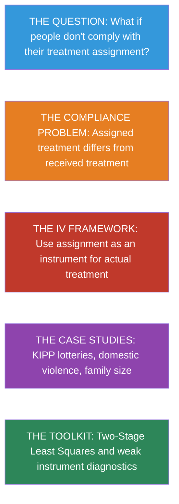


### Key Concepts and Definitions

**Non-Compliance:** When subjects in an experiment do not follow their assigned treatment. Some assigned to treatment do not take it; some assigned to control find a way to get treatment. This breaks the link between assignment and received treatment.

> 💡 **Example**
>
> In the MDVE, officers assigned to "advise" the couple sometimes arrested the suspect instead because the situation was too dangerous.

> 📝 **Analogy**
>
> Like a doctor prescribing medicine, but some patients never fill the prescription, while others get the pill from a friend. The prescription (assignment) and the pill (received treatment) are different things.


**Instrumental Variable (IV):** A variable that affects the outcome only indirectly, through its effect on the treatment. It serves as a source of exogenous variation in treatment, allowing causal estimation even when treatment is not randomly assigned.

> 💡 **Example**
>
> The KIPP school lottery (instrument) affects test scores (outcome) only through its effect on whether a student attends KIPP (treatment).

> 📝 **Analogy**
>
> Like a remote control for a TV. The remote (instrument) does not entertain you directly --- it works only by changing the channel (treatment), which determines what you watch (outcome).


**Local Average Treatment Effect (LATE):** The causal effect of treatment specifically for the subpopulation of compliers --- people whose treatment status was actually changed by the instrument. LATE is "local" because it applies only to this group, not to everyone.

> 💡 **Example**
>
> The KIPP lottery IV estimates the effect of KIPP attendance for families who would attend if they won but not if they lost. It does not estimate the effect for families who would find a way in regardless.

> 📝 **Analogy**
>
> Like measuring the effect of an umbrella on staying dry, but only for people who carry one when it is offered and leave it at home otherwise. The effect may differ for people who always carry their own.


**First Stage:** The regression of the treatment variable on the instrument. It measures how strongly the instrument predicts treatment --- a necessary condition for a valid IV analysis.

> 💡 **Example**
>
> In the MDVE, the first stage shows that being assigned to coddle increased the probability of actually coddling by about 79 percentage points.

> 📝 **Analogy**
>
> Like checking whether pulling the lever actually opens the gate. If the lever is disconnected (weak first stage), pulling it tells you nothing about what happens on the other side.


**Reduced Form:** The regression of the outcome on the instrument directly, ignoring the treatment. It captures the total effect of the instrument on the outcome, combining the first stage and the causal effect.

> 💡 **Example**
>
> Regressing recidivism on the random assignment form (ignoring what officers actually did) gives the reduced form: the overall effect of being assigned to coddle on future violence.

> 📝 **Analogy**
>
> Like measuring how much rain falls when you see dark clouds, without caring about the specific atmospheric mechanism. The cloud (instrument) predicts rain (outcome) through its effect on air pressure (treatment).


**Two-Stage Least Squares (2SLS):** The standard practical method for IV estimation. Stage 1 predicts treatment using the instrument(s). Stage 2 regresses the outcome on the predicted treatment. Produces correct standard errors when done with dedicated software.

> 💡 **Example**
>
> In a KIPP analysis, Stage 1 predicts KIPP attendance from lottery status. Stage 2 regresses test scores on predicted attendance. The coefficient is the LATE.

> 📝 **Analogy**
>
> Like a two-step recipe. First, forecast tomorrow's weather (predicted treatment). Then, plan your outfit based on the forecast (outcome based on predicted treatment). The forecast filters out the noise.


**Relevance (First Requirement for IV):** The instrument must actually affect the treatment. Without a strong first stage, the IV estimate is unreliable. Tested using the F-statistic.

> 💡 **Example**
>
> Quarter of birth affects years of schooling through compulsory attendance laws (F > 10), confirming relevance.

> 📝 **Analogy**
>
> Like a key that must actually fit the lock. A key that does not turn the lock (no first stage) cannot open the door to causal inference.


**Independence (Second Requirement for IV):** The instrument must be uncorrelated with unobserved confounders. Randomized instruments satisfy this automatically; natural experiments require careful argument.

> 💡 **Example**
>
> A lottery is independent of family income, motivation, and other factors by design. Quarter of birth is plausibly independent of ability (though this is debated).

> 📝 **Analogy**
>
> Like a coin flip deciding who goes first in a game. The coin does not know or care which player is better --- it is truly independent.


**Exclusion Restriction (Third Requirement for IV):** The instrument must affect the outcome only through the treatment, with no direct or side-channel effects. This is the hardest requirement to defend and cannot be tested statistically.

> 💡 **Example**
>
> The KIPP lottery must affect test scores only through KIPP attendance, not through, say, parents' motivation being boosted just by winning the lottery.

> 📝 **Analogy**
>
> Like insisting that the only way a medicine can affect your headache is by entering your bloodstream. If you feel better just from the ritual of swallowing a pill (placebo effect), the exclusion restriction is violated.


**Weak Instruments:** Instruments with a small first stage (F-statistic below 10). They produce biased 2SLS estimates, misleading confidence intervals, and unreliable inference --- problems that do not disappear with larger samples.

> 💡 **Example**
>
> If quarter of birth barely predicts years of schooling (F = 3), the resulting IV estimate could be wildly off, even with 300,000 observations.

> 📝 **Analogy**
>
> Like trying to steer a ship with a tiny rudder in rough seas. No matter how big the ship (sample), the rudder (instrument) is too small to reliably change course.


**Complier:** A person whose treatment status is determined by the instrument: they take treatment when the instrument says "treat" and do not take it when the instrument says "control." LATE estimates the causal effect for compliers only.

> 💡 **Example**
>
> In the MDVE, a complier is an officer who arrests when the form says "arrest" and advises when the form says "advise."

> 📝 **Analogy**
>
> Like a restaurant customer who always orders the daily special. If the special changes, their meal changes too. The daily special "instrument" determines their choice.


**Always-Taker:** A person who receives treatment regardless of their instrument value. Their treatment status is not affected by the instrument, so IV cannot estimate their causal effect.

> 💡 **Example**
>
> An officer who always arrests the suspect, no matter what the assignment form says.

> 📝 **Analogy**
>
> Like someone who always orders pizza regardless of the menu. Changing the menu (instrument) does not change what they eat (treatment).


**Never-Taker:** A person who never receives treatment regardless of their instrument value. Like always-takers, their behavior is unaffected by the instrument.

> 💡 **Example**
>
> A family that would never send their child to KIPP, whether they win or lose the lottery.

> 📝 **Analogy**
>
> Like someone who never eats dessert no matter what is offered. The instrument cannot move them.


**Monotonicity Assumption:** The assumption that there are no defiers --- no one who does the opposite of their instrument assignment. Under monotonicity, the instrument pushes everyone in the same direction (or leaves them unchanged).

> 💡 **Example**
>
> Monotonicity holds if no officer is more likely to coddle when the form says "arrest" than when it says "coddle." Officers can ignore the form, but they cannot systematically rebel against it.

> 📝 **Analogy**
>
> Like assuming that a "Buy one, get one free" offer never causes someone to buy fewer items. The promotion can leave some people unaffected, but it should not cause anyone to buy less.


### When Experiments Break Down

Randomized experiments are the gold standard for causal inference (Chapter 1). But in practice, experiments rarely go exactly as planned. Police officers may not follow their assigned protocol. Patients may not take their assigned medication. Lottery winners may not enroll in the program they won.

When the treatment people **receive** differs from the treatment they were **assigned**, we face the problem of **non-compliance**. Simply comparing outcomes by *received* treatment reintroduces selection bias, because the choice to comply may be related to the outcome.

#### The Minneapolis Domestic Violence Experiment

The **Minneapolis Domestic Violence Experiment (MDVE)** illustrates this perfectly. In the early 1980s, researchers randomly assigned police officers responding to domestic violence calls to one of three actions:

- **Arrest** the suspect
- **Advise** the couple (counseling/mediation)
- **Separate** them (remove suspect for 8 hours)

The goal was to learn which response best prevented future violence. But police officers didn't always follow their assignment.

```python
import pandas as pd
import pyfixest as pf

## --- Data source ---
DATA = "https://raw.githubusercontent.com/cmg777/intro2causal/main/data/"

## Load clean MDVE data: each row is one domestic violence case
## 'assigned' = what police were told to do; 'delivered' = what they actually did
mdve = pd.read_csv(DATA + "ch3/mdve_clean.csv")
mdve.head(3)
```

```python
## Cross-tabulate: what treatment was assigned vs. what was actually delivered?
ct = pd.crosstab(mdve["assigned"], mdve["delivered"], margins=True, margins_name="Total")
ct = ct[["Arrest", "Advise", "Separate", "Total"]]  # reorder columns

## Show counts
ct
```

The cross-tabulation reveals a striking pattern: the diagonal (where assigned = delivered) is much larger for arrest than for advise or separate. Officers followed arrest orders almost perfectly but frequently deviated from the other assignments --- usually by arresting instead. Let's quantify these compliance rates:

```python
## Compute compliance rate for each assignment group
## Loop through each assignment type and count how many officers followed orders
rows = []
for group in ["Arrest", "Advise", "Separate"]:
    group_data = mdve[mdve["assigned"] == group]
    complied = (group_data["delivered"] == group).sum()
    # Calculate the percentage of officers who complied
    rate = round(100 * complied / len(group_data), 1)
    rows.append({
        "Assigned": group,
        "N": len(group_data),
        "Complied": complied,
        "Compliance Rate": str(rate) + "%",
    })

pd.DataFrame(rows)
```

> ⚠️ **Asymmetric compliance**
>
>
> Officers followed arrest orders **99% of the time** but deviated from advise and separate assignments much more often (78% and 73%). When they deviated, they almost always chose to arrest instead --- likely because the suspect was particularly aggressive. This means the group that *actually received* arrest includes both randomly assigned arrests and the most dangerous cases from other assignments. Comparing outcomes by delivered treatment would be biased.


> 📝 **Intuition Builder: IV as a Chain Reaction**
>
>
> Think of IV as tracing a chain of dominoes:
>
> - **Domino 1 (Instrument → Treatment)**: The random assignment form *nudges* the police officer's action. This is the **first stage**.
> - **Domino 2 (Treatment → Outcome)**: The police action *affects* future violence. This is the **causal effect** we want.
> - **What we observe**: The assignment form's effect on future violence — the **reduced form** (Domino 1 × Domino 2).
> - **The IV trick**: Divide the reduced form by the first stage to isolate Domino 2 alone.
>
> The instrument must push the first domino (relevance) and must *only* work through the chain (exclusion restriction). If the instrument directly tips the last domino without going through treatment, the chain is broken.


### The IV Framework

#### The Core Idea

Instrumental variables solves the compliance problem by using the **random assignment** (the instrument) instead of the actual treatment to estimate causal effects. The logic is a chain reaction:


The **LATE (Local Average Treatment Effect)** combines these two pieces:

$$\lambda_{LATE} = \frac{\rho}{\phi} = \frac{\text{Reduced form (effect of } Z \text{ on } Y)}{\text{First stage (effect of } Z \text{ on } D)}$$

where $\rho$ (rho) is the reduced-form effect of the instrument on the outcome, and $\phi$ (phi) is the first-stage effect of the instrument on the treatment.

#### Three Requirements for a Valid Instrument

1. **Relevance**: The instrument must affect the treatment. In the MDVE, random assignment must actually change what police do (first stage $\neq$ 0).

2. **Independence**: The instrument must be randomly assigned (or "as good as random"). The MDVE's randomization satisfies this.

3. **Exclusion restriction**: The instrument affects the outcome **only through** the treatment. The random assignment shouldn't directly affect recidivism except through the police action taken.

#### Applying the IV Formula to the MDVE

Let's compute the IV estimate step by step using the MDVE data. We simplify to a binary comparison: **arrest** ($Z = 0$) vs. **coddle** (advise or separate, $Z = 1$).

```python
## Create binary variables for the IV calculation
## Z = instrument: assigned to coddle (advise or separate) vs. arrest
mdve["z_coddle"] = (mdve["assigned"] != "Arrest").astype(int)

## D = treatment: actually coddled (advise or separate) vs. arrested
mdve["d_coddle"] = (mdve["delivered"] != "Arrest").astype(int)

## Step 1: FIRST STAGE — does assignment (Z) affect actual treatment (D)?
## Compute the mean of D for each value of Z
## .loc[] selects rows where the condition is true, then takes the mean of d_coddle
fs_coddle = mdve.loc[mdve["z_coddle"] == 1, "d_coddle"].mean()
fs_arrest = mdve.loc[mdve["z_coddle"] == 0, "d_coddle"].mean()
first_stage = fs_coddle - fs_arrest

## Step 2: REDUCED FORM — does assignment (Z) affect recidivism (Y)?
## (We don't have recidivism in this clean dataset, so we use published numbers)
reduced_form = 0.211 - 0.097  # from the original study

## Step 3: LATE = reduced form / first stage
## This isolates the causal effect for compliers
late = reduced_form / first_stage

pd.DataFrame({
    "Step": ["First stage (coddled if assigned coddle)", "First stage (coddled if assigned arrest)",
             "First stage (difference)", "Reduced form (recidivism difference)", "LATE = RF / FS"],
    "Value": [round(fs_coddle, 3), round(fs_arrest, 3), round(first_stage, 3),
              round(reduced_form, 3), round(late, 3)],
})
```

> ⭐ **Key finding**
>
>
> Coddling (advise/separate) **increases recidivism by 14.5 percentage points** among compliers --- those officers who followed their assignment. This is much larger than the naive comparison of delivered treatments (8.7 pp) would suggest, because the naive estimate is contaminated by selection bias.


> ⚠️ **Common Misconception: LATE is not the Average Treatment Effect**
>
>
> The IV estimate of 14.5 pp applies **only to compliers** --- officers who followed whatever their assignment form said. It tells us nothing about:
>
> - **Always-takers** (officers who always arrest, regardless of assignment) --- they may be more experienced and arrest more effectively
> - **Never-takers** (hypothetical officers who never arrest) --- they don't exist in this data
>
> Different instruments identify effects for *different subpopulations*. A KIPP lottery identifies effects for families who participate in the lottery; a twin birth identifies effects for families on the margin of having another child. The "L" in LATE stands for "local" --- local to the population whose behavior is changed by the instrument.


### The Four Types of Subjects

In any IV setting, subjects fall into four categories based on how they would respond to the instrument:

| Type | Behavior | Role in IV |
|:---|:---|:---|
| **Complier** | Does what they're told — treatment follows assignment | The population LATE estimates effects for |
| **Always-taker** | Always gets treatment regardless of assignment | Unaffected by instrument; IV is silent |
| **Never-taker** | Never gets treatment regardless of assignment | Unaffected by instrument; IV is silent |
| **Defier** | Does the opposite of assignment | Assumed not to exist (monotonicity) |

: The four complier types in an IV framework
> 📝 **LATE is the effect for compliers only**
>
>
> The IV estimate tells us the causal effect **specifically for compliers** --- people whose treatment was determined by the instrument. It does not necessarily apply to always-takers or never-takers. In the MDVE, compliers are officers who followed whatever assignment they received. The LATE tells us what happens when *these particular officers* arrest vs. coddle.


### Case Study: KIPP Charter School Lotteries

The **Knowledge Is Power Program (KIPP)** is a network of charter schools with extended school days and a "no excuses" discipline culture. KIPP Lynn in Massachusetts became oversubscribed after 2005, so admission was decided by lottery --- creating a natural instrument.

**The IV components:**

- **Instrument ($Z$)**: Winning the KIPP lottery
- **Treatment ($D$)**: Actually attending KIPP
- **Outcome ($Y$)**: Math test scores

**Results:**

| Component | Estimate |
|:---|:---|
| First stage (lottery → attendance) | 0.741 (74.1% of winners attended) |
| Reduced form (lottery → math scores) | +0.355 standard deviations |
| **LATE** (attendance → math scores) | **+0.48 standard deviations** |

: IV estimates of KIPP attendance effects on math scores
A half standard deviation improvement in math in one year is a remarkable effect. Balance checks confirmed that lottery winners and losers looked similar at baseline, supporting the validity of the instrument.

This lottery-based evidence has been influential in education policy. Charter school supporters cite KIPP's results as proof that intensive, structured programs can close achievement gaps for disadvantaged students. Critics note that LATE applies only to lottery compliers (motivated families who applied), and the effect might not generalize to all students.

The KIPP lottery gave us a clean instrument for school attendance. Our next case study finds instruments in an even more surprising place: the biology of twin births and the psychology of gender preferences.


### Case Study: Does Family Size Reduce Children's Education?

The quantity-quality tradeoff hypothesis suggests that larger families dilute parental investment, reducing each child's education. The naive correlation supports this: children with more siblings get less schooling (-0.15 years per sibling in OLS).

But is this causal? Less-educated parents tend to have more children *and* less-educated children. Two clever instruments address this:

**Twin births**: When a second birth produces twins instead of a singleton, family size increases by one --- essentially at random. First stage: +0.32 children.

**Sibling sex composition**: Parents with same-sex first two children are more likely to have a third (seeking gender balance). First stage: +0.08 children.

**Results**: Both instruments show a reduced form of approximately **zero** --- no effect of family size on children's education. The 2SLS estimate using both instruments is +0.24 (SE: 0.13), completely reversing the negative OLS estimate.

> ⭐ **Selection bias explains the naive correlation**
>
>
> The strong negative OLS relationship between family size and education appears to be entirely driven by selection bias. When we use instruments that generate exogenous variation in family size, the effect vanishes. Less-educated parents have more children AND less-educated children --- but one does not cause the other.


This finding has major **policy implications**. For decades, governments promoted smaller families based on the belief that fewer children means more investment per child (the "quantity-quality tradeoff"). China's one-child policy and India's forced sterilization programs were partly justified by this logic. The IV evidence suggests the tradeoff is much weaker than previously thought --- the naive correlation was driven by confounders, not causation.


#### When to Use IV vs. Other Methods

| Feature | RCT (Chapter 1) | OLS with Controls | IV / 2SLS (This Chapter) |
|:---|:---|:---|:---|
| **Requires** | Random assignment of treatment | Observable confounders only | A valid instrument |
| **Handles** | All confounders (observed + unobserved) | Only observed confounders | Unobserved confounders (via instrument) |
| **Estimates** | ATE (average for everyone) | Conditional association | LATE (average for compliers) |
| **Weakness** | Expensive, often impractical | Fails with unobserved confounders | Needs strong, valid instrument |

: When to use which method
### Two-Stage Least Squares (2SLS)

The IV formula $\lambda = \rho / \phi$ works for a single binary instrument. In practice, we often have multiple instruments, covariates, or non-binary treatments. **Two-Stage Least Squares** handles all of these.

**Stage 1 (First Stage):** Predict treatment using the instrument(s)
$$D_i = \alpha_1 + \phi Z_i + \gamma_1 X_i + e_{1i}$$

**Stage 2 (Second Stage):** Regress the outcome on the predicted treatment
$$Y_i = \alpha_2 + \lambda_{2SLS} \hat{D}_i + \gamma_2 X_i + e_{2i}$$

> ⚠️ **Never run 2SLS by hand**
>
>
> If you manually run two separate regressions and use fitted values from the first in the second, you will get the right coefficient but **wrong standard errors**. Always use dedicated IV software that computes correct standard errors automatically.


#### 2SLS in Python

In Python, the `pyfixest` library provides `feols()` with IV support. The formula syntax uses a **pipe** (`|`) to separate the endogenous variable and its instrument:

```
"outcome ~ exogenous_controls | endogenous_variable ~ instrument"
```

Here is how you would run 2SLS for the KIPP charter school example (using hypothetical data to illustrate the syntax):

```
## Syntax demonstration (not run — KIPP data is not publicly available)
import pyfixest as pf

result = pf.feols(
    "math_score ~ 1 | attended_kipp ~ won_lottery",
    data=kipp_data,
    vcov="hetero",
)

## The key parts:
##   math_score           = outcome (Y)
##   attended_kipp        = endogenous treatment (D) — after the |
##   won_lottery          = instrument (Z) — after the ~ following the |
##   1                    = intercept (constant)
##   vcov="hetero"        = heteroskedasticity-robust standard errors
```

> 📝 **Why no live IV code in this chapter?**
>
>
> The KIPP and family size datasets used in this chapter's case studies are not publicly available. The syntax block above shows how you *would* run 2SLS in Python. Chapter 6 provides a full working IV analysis using quarter-of-birth data, where you will see `pf.feols()` in action with real data.


### Weak Instruments

An instrument is **weak** when it has only a small effect on the treatment (small first stage). Weak instruments cause:

- 2SLS estimates biased toward OLS
- Misleading confidence intervals
- Unreliable inference

> 💡 **The F > 10 rule of thumb**
>
>
> Test the joint significance of instruments in the first-stage regression. If the **F-statistic is below 10**, the instruments may be too weak. When in doubt, check the reduced form --- if the instrument's direct effect on the outcome isn't visible, the IV estimate is likely unreliable.


> ⚠️ **Common Misconception: More data doesn't fix weak instruments**
>
>
> Unlike standard estimation, where larger samples give more precise estimates, **weak-instrument bias does not vanish with more data**. Even with a million observations, if the first-stage F-statistic is below 10, the 2SLS estimate can be severely biased toward OLS. The solution is a stronger instrument, not a bigger sample.


> 📝 **Connection to Chapters 1 and 4**
>
>
> IV connects the methods from other chapters:
>
> - **Chapter 1 (RCTs)**: When an experiment has non-compliance (some people don't take their assigned treatment), the random assignment serves as an instrument. The ITT (intent-to-treat) effect is the reduced form; dividing by the compliance rate gives the LATE.
> - **Chapter 4 (RD)**: A **fuzzy RD** is an IV problem where the cutoff dummy serves as the instrument. The first stage is the jump in treatment probability at the cutoff; the reduced form is the jump in outcomes. LATE = reduced form / first stage.


### Historical Perspective: Philip Wright

The identification problem --- how to separate supply from demand when both are determined simultaneously --- was solved by **Philip G. Wright** in 1928. In an appendix to his book on tariffs, Wright introduced "external factors" (what we now call instruments) that shift one curve without affecting the other.

Wright's innovation lay dormant for decades before being rediscovered. His son **Sewall Wright**, a geneticist, contributed the mathematical framework of path analysis. Together, they pioneered the idea that researchers must find sources of variation that affect one part of a system without directly affecting the outcome of interest.


### Key Takeaways

The following concept map shows how the key ideas in this chapter connect --- from the problem of non-compliance, through the IV framework of first stage and reduced form, to the LATE estimand and its practical implementation via 2SLS.

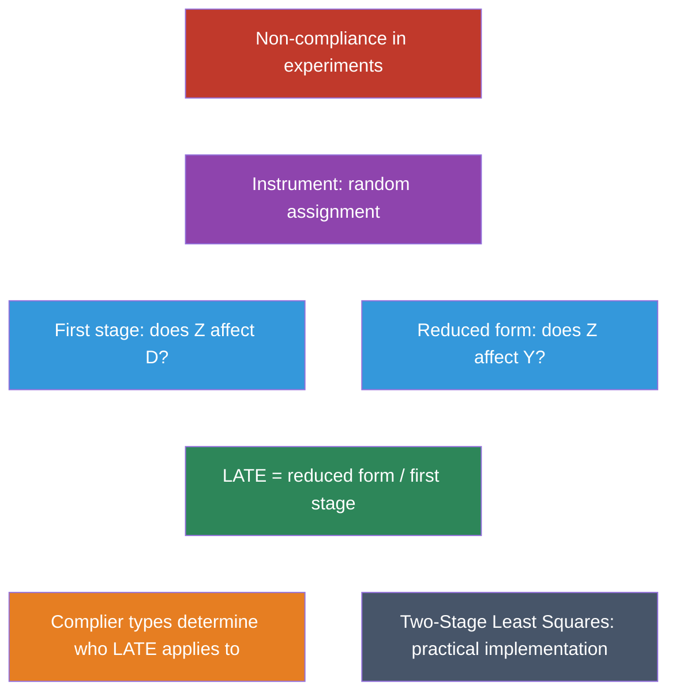

1. **Non-compliance** is common in experiments. Comparing outcomes by *received* treatment reintroduces selection bias.

2. **Instrumental variables** uses random assignment as an instrument to recover causal effects despite non-compliance.

3. **LATE = reduced form / first stage** --- the ratio of the instrument's effect on the outcome to its effect on treatment.

4. **LATE applies to compliers only** --- the subpopulation whose treatment was actually changed by the instrument.

5. **Three requirements**: relevance (first stage), independence (random assignment), and exclusion restriction (single channel).

6. **2SLS** is the practical implementation. Always use dedicated software for correct standard errors.

7. **Weak instruments** (F < 10) produce unreliable estimates. Always check the first stage.


### Learn by Coding

Copy this code into a Python notebook to reproduce the key results from this chapter.

```python
## ============================================================
## Chapter 3: Instrumental Variables — Code Cheatsheet
## ============================================================
import pandas as pd
import pyfixest as pf

DATA = "https://raw.githubusercontent.com/cmg777/intro2causal/main/data/"

## --- Step 1: Load Minneapolis Domestic Violence Experiment data ---
mdve = pd.read_csv(DATA + "ch3/mdve_clean.csv")
print("MDVE data:", mdve.shape[0], "cases")
print(mdve[["assigned", "delivered"]].head())

## --- Step 2: Compliance — did officers follow their assignment? ---
print("\nAssigned vs. delivered treatment:")
print(pd.crosstab(mdve["assigned"], mdve["delivered"], margins=True))

## --- Step 3: Create binary variables (arrest vs. coddle) ---
mdve["z_coddle"] = (mdve["assigned"] != "Arrest").astype(int)   # instrument
mdve["d_coddle"] = (mdve["delivered"] != "Arrest").astype(int)   # treatment

## --- Step 4: First stage (does assignment change actual treatment?) ---
fs = pf.feols("d_coddle ~ z_coddle", data=mdve, vcov="hetero")
first_stage = fs.coef()["z_coddle"]
print(f"\nFirst stage: {first_stage:.3f}")
print("  (Fraction who comply with coddle assignment)")

## --- Step 5: Reduced form (does assignment affect recidivism?) ---
## Recidivism data not in this clean dataset; use published numbers
reduced_form = 0.211 - 0.097  # recidivism rate: coddle vs. arrest assignment
print(f"\nReduced form: {reduced_form:.3f}")
print("  (Effect of coddle ASSIGNMENT on recidivism, from published data)")

## --- Step 6: IV estimate (LATE = reduced form / first stage) ---
late = reduced_form / first_stage
print(f"\nLATE = {reduced_form:.3f} / {first_stage:.3f} = {late:.3f}")
print("  Coddling increases recidivism by ~15 pp among compliers")
```

> 💡 **Try it yourself!**
>
> Copy the code above and paste it into [this Google Colab scratchpad](https://colab.research.google.com/notebooks/empty.ipynb) to run it interactively. Modify the variables, change the specifications, and see how results change!


Below is the same cheatsheet in Stata syntax.

```stata
* ============================================================
* Chapter 3: Instrumental Variables — Stata Cheatsheet
* ============================================================
clear all
set more off

* --- Step 1: Load Minneapolis Domestic Violence Experiment data ---
import delimited using "https://raw.githubusercontent.com/cmg777/intro2causal/main/data/ch3/mdve_clean.csv", clear
list in 1/5

* --- Step 2: Compliance — did officers follow their assignment? ---
tabulate assigned delivered

* --- Step 3: Create binary variables (arrest vs. coddle) ---
gen z_coddle = (assigned != "Arrest")   // instrument
gen d_coddle = (delivered != "Arrest")   // treatment

* --- Step 4: First stage (does assignment change actual treatment?) ---
reg d_coddle z_coddle, robust
scalar first_stage = _b[z_coddle]

* --- Step 5: Reduced form (does assignment affect recidivism?) ---
* Recidivism data not in this clean dataset; use published numbers
scalar reduced_form = 0.211 - 0.097  // recidivism rate: coddle vs. arrest

* --- Step 6: IV estimate (LATE = reduced form / first stage) ---
scalar late = reduced_form / first_stage
display "LATE = " reduced_form " / " first_stage " = " late
display "Coddling increases recidivism by ~15 pp among compliers"
```

> 💡 **Try it in Stata!**
>
> Copy the code above into a `.do` file and run it in Stata 14 or later (which supports loading data from URLs). If your Stata cannot access the internet, download the CSV files from the `data/` folder on [GitHub](https://github.com/cmg777/intro2causal/tree/main/data) and replace each URL with a local file path.


### Exercises

#### Multiple Choice Questions

1. **What problem does instrumental variables (IV) solve?**
   a) Small sample sizes in randomized experiments
   b) Non-compliance — when the treatment received differs from the treatment assigned
   c) Measurement error in the outcome variable
   d) Missing data in the control variables

> 📝 **Show answer**
>
> **(b)** IV was developed to handle non-compliance — situations where the treatment actually received differs from what was assigned. In the MDVE, officers did not always follow their random assignment (e.g., arresting when told to advise). IV uses the assignment as an instrument for actual treatment to recover the causal effect. **(a) is wrong** because IV addresses bias from non-compliance, not small sample sizes. **(c) is wrong** because while IV can address measurement error in some settings, the chapter focuses on non-compliance as the core motivation. **(d) is wrong** because missing data requires imputation or selection corrections, not instrumental variables.


2. **LATE stands for Local Average Treatment Effect. "Local" means:**
   a) The effect applies only to a specific geographic area
   b) The effect applies only to compliers — people whose treatment status is changed by the instrument
   c) The effect is estimated using local polynomial regression
   d) The effect applies only to the time period studied

> 📝 **Show answer**
>
> **(b)** "Local" means the IV estimate applies only to compliers — the subpopulation whose treatment status is actually changed by the instrument. Always-takers and never-takers are unaffected by the instrument, so IV tells us nothing about their treatment effects. **(a) is wrong** because "local" refers to the complier subpopulation, not a geographic area. **(c) is wrong** because local polynomial regression is an RD technique, not related to LATE. **(d) is wrong** because "local" describes who the effect applies to, not when.


3. **Which of the following is NOT a requirement for a valid instrument?**
   a) The instrument must affect the treatment (relevance)
   b) The instrument must be randomly assigned or "as good as random" (independence)
   c) The instrument must directly affect the outcome (direct effect)
   d) The instrument must affect the outcome only through the treatment (exclusion restriction)

> 📝 **Show answer**
>
> **(c)** A valid instrument must NOT directly affect the outcome — this would violate the exclusion restriction. The three requirements are: (1) relevance (instrument affects treatment), (2) independence (instrument is as good as randomly assigned), and (3) exclusion restriction (instrument affects outcome only through treatment). **(a) is wrong** because relevance is indeed required — a weak instrument produces imprecise and biased estimates. **(b) is wrong** because independence is required to ensure the instrument is uncorrelated with confounders. **(d) is wrong** because the exclusion restriction is indeed required — if the instrument has a direct effect on the outcome, the IV estimate is biased.


4. **In the Minneapolis Domestic Violence Experiment, the instrument was:**
   a) Whether the suspect was actually arrested
   b) The random assignment form given to the officer
   c) The severity of the domestic violence incident
   d) The officer's years of experience

> 📝 **Show answer**
>
> **(b)** The instrument was the randomly assigned treatment recommendation on the form (arrest, advise, or separate). This is distinct from the treatment actually delivered, since officers did not always comply with their assignment. The random form satisfies independence (randomly assigned) and relevance (it strongly predicted actual treatment). **(a) is wrong** because actual arrest is the endogenous treatment variable, not the instrument. **(c) is wrong** because incident severity is a potential confounder, not the instrument. **(d) is wrong** because officer experience is a characteristic that might affect compliance but was not the randomized assignment.


5. **A "complier" in IV terminology is someone who:**
   a) Always receives the treatment regardless of assignment
   b) Never receives the treatment regardless of assignment
   c) Follows whatever their assignment says — treatment if assigned to treatment, control if assigned to control
   d) Does the opposite of their assignment

> 📝 **Show answer**
>
> **(c)** Compliers are individuals whose treatment status is determined by the instrument — they take the treatment when assigned to it and do not take it when not assigned. LATE captures the causal effect specifically for this group. **(a) is wrong** because that describes always-takers, who receive treatment regardless of assignment. **(b) is wrong** because that describes never-takers, who refuse treatment regardless of assignment. **(d) is wrong** because that describes defiers, whose existence is ruled out by the monotonicity assumption.


6. **The "first stage" in a 2SLS regression refers to:**
   a) The regression of the outcome on the instrument
   b) The regression of the treatment on the instrument
   c) The regression of the outcome on the predicted treatment
   d) The regression of the instrument on the control variables

> 📝 **Show answer**
>
> **(b)** The first stage regresses the endogenous treatment variable on the instrument (and any controls), producing predicted values of treatment that reflect only the exogenous variation induced by the instrument. **(a) is wrong** because regressing the outcome on the instrument gives the reduced form, not the first stage. **(c) is wrong** because that describes the second stage of 2SLS. **(d) is wrong** because the first stage predicts treatment from the instrument, not the other way around.


7. **The Wald estimator computes the IV estimate as:**
   a) The first stage divided by the reduced form
   b) The reduced form divided by the first stage
   c) The OLS coefficient minus the selection bias
   d) The difference in means between treatment and control groups

> 📝 **Show answer**
>
> **(b)** The Wald estimator is: LATE = reduced form / first stage = $\frac{E[Y|Z=1] - E[Y|Z=0]}{E[D|Z=1] - E[D|Z=0]}$. The numerator is the instrument's effect on the outcome (reduced form) and the denominator is the instrument's effect on treatment uptake (first stage). **(a) is wrong** because the division is the other way around. **(c) is wrong** because that describes the OVB decomposition, not the IV/Wald formula. **(d) is wrong** because a simple difference in means is the naive (potentially biased) comparison, not the IV estimate.


8. **The monotonicity assumption in IV means:**
   a) The treatment effect must be the same for everyone
   b) There are no "defiers" — no one does the opposite of their assignment
   c) The instrument must be binary
   d) The first stage must be positive for all subgroups

> 📝 **Show answer**
>
> **(b)** Monotonicity rules out defiers — people who would take the treatment when assigned to control and refuse it when assigned to treatment. In the MDVE, this means no officer would arrest when told to coddle AND coddle when told to arrest. Without this assumption, compliers and defiers would cancel out in the first stage. **(a) is wrong** because IV allows for heterogeneous treatment effects — that is precisely why we get a LATE rather than an ATE. **(c) is wrong** because instruments can be multi-valued (like the three MDVE categories). **(d) is wrong** because monotonicity is about individual behavior (no one switches in the "wrong" direction), not about the sign of the first stage across subgroups.


9. **Why is the IV estimate of the effect of arrest on domestic violence recidivism larger than the naive OLS comparison?**
   a) Because IV uses more data
   b) Because non-compliant officers tended to arrest the most dangerous suspects, creating downward selection bias in OLS
   c) Because the IV sample is larger
   d) Because IV always produces larger estimates than OLS

> 📝 **Show answer**
>
> **(b)** Officers who deviated from their assignment tended to arrest suspects they perceived as most dangerous. These high-risk suspects were more likely to reoffend regardless of arrest, so comparing arrested vs. non-arrested suspects understates the deterrent effect of arrest. IV removes this selection bias by using only the exogenous variation from the random assignment. **(a) is wrong** because IV and OLS use the same data — the difference is in what variation they exploit. **(c) is wrong** for the same reason. **(d) is wrong** because IV can produce estimates that are larger, smaller, or the same as OLS, depending on the direction of selection bias.


10. **An instrument is "weak" when:**
    a) It violates the exclusion restriction
    b) It has a small effect on the treatment variable (first stage is close to zero)
    c) The sample size is small
    d) The outcome variable has high variance

> 📝 **Show answer**
>
> **(b)** A weak instrument barely affects treatment uptake, meaning the first stage coefficient is close to zero. This produces imprecise and potentially biased IV estimates because dividing by a near-zero first stage amplifies any small bias in the reduced form. A common rule of thumb is that the first-stage F-statistic should exceed 10. **(a) is wrong** because violating the exclusion restriction makes an instrument invalid, not weak — these are distinct problems. **(c) is wrong** because instrument strength is about the predictive power for treatment, not sample size. **(d) is wrong** because outcome variance affects precision but does not determine instrument strength.


#### Conceptual Questions

1. **Classifying complier types**: In a medical trial, patients are randomly assigned to receive a new drug or placebo, but some placebo patients obtain the drug on their own, and some drug patients refuse to take it. (a) Who are the always-takers? (b) Who are the compliers? (c) If 80% of the drug group takes the drug and 10% of the placebo group obtains it, what is the first stage?

> 📝 **Show answer**
>
> **The compliance framework classifies individuals by how their treatment responds to the instrument, not by what they actually do.**
>
> 1. Always-takers are patients who take the drug regardless of assignment --- those in the placebo group who obtain it on their own. Their behavior is unchanged by the instrument (random assignment), so IV tells us nothing about their treatment effect.
> 2. Compliers are patients who follow their assignment: they take the drug when assigned to drug, and don't take it when assigned to placebo. These are the individuals whose behavior the instrument actually changes, and LATE captures the causal effect specifically for this group.
> 3. The first stage measures how much the instrument shifts treatment uptake: $P(\text{take drug} | \text{assigned drug}) - P(\text{take drug} | \text{assigned placebo}) = 0.80 - 0.10 = 0.70$. A first stage of 0.70 means 70% of the sample are compliers --- those whose treatment status was determined by the instrument.


2. **Computing LATE**: Using the MDVE numbers: first stage = 0.786, reduced form = 0.114. (a) Compute the LATE. (b) Why is this larger than the naive comparison of delivered treatments (0.087)? (c) What does "selection into treatment" mean in this context?

> 📝 **Show answer**
>
> **The Wald estimator (IV ratio) removes selection bias that contaminates naive comparisons by isolating variation driven only by the instrument.**
>
> 1. LATE = reduced form / first stage = 0.114 / 0.786 = 0.145 (14.5 percentage points). The numerator captures the intent-to-treat effect of random assignment on recidivism; the denominator scales it by the fraction of cases whose treatment was actually changed by the assignment (compliers).
> 2. The naive comparison (0.087) is smaller because it is contaminated by selection bias: officers who deviated from their "coddle" assignment to arrest instead were responding to more violent suspects. These suspects would have reoffended at higher rates regardless, making arrest look less effective. The naive estimate mixes the true causal effect with this negative selection bias, biasing it toward zero.
> 3. "Selection into treatment" means that the officers who chose to arrest (despite being told to coddle) were systematically selecting the most dangerous cases. This violates the independence assumption needed for causal inference --- treatment is correlated with potential outcomes. IV solves this by using only the exogenous variation from random assignment.


3. **Exclusion restriction**: A researcher uses rainfall as an instrument for agricultural output to estimate the effect of output on conflict. What could violate the exclusion restriction?

> 📝 **Show answer**
>
> **The exclusion restriction requires that the instrument affects the outcome only through the specified channel --- any alternative pathway invalidates the IV strategy.**
>
> Rainfall could affect conflict through channels other than agricultural output, violating this core IV assumption:
>
> 1. Heavy rain may flood roads and prevent armed groups from mobilizing, reducing conflict directly --- a logistical channel that bypasses agricultural output entirely.
> 2. Drought may force migration, creating social tensions and competition for resources in destination areas unrelated to agricultural output --- a demographic channel.
> 3. Rainfall affects water availability for drinking and sanitation, which could spark resource conflicts independent of crop yields --- a basic-needs channel.
>
> Any of these channels would violate the exclusion restriction because rainfall would affect conflict independently of its effect on agricultural output. The IV estimate would then capture a mixture of effects through all channels, not just the agricultural mechanism the researchers intend to isolate.


4. **Why LATE is local**: Using the MDVE context, explain why the IV estimate applies only to compliers. What can we say (or not say) about the effect of arrest on always-takers --- those suspects who would be arrested regardless of what the assignment form said?

> 📝 **Show answer**
>
> **LATE applies only to compliers --- individuals whose treatment was changed by the instrument --- and cannot be generalized to always-takers or never-takers without additional assumptions.**
>
> 1. The IV estimate is a Local Average Treatment Effect: it captures the causal effect specifically for compliers, the subgroup whose treatment status changed because of the instrument (random assignment).
> 2. In the MDVE, compliers are officers who followed their random assignment --- they arrested when told to arrest and coddled when told to coddle. LATE tells us how arrest affected recidivism for suspects handled by these compliant officers.
> 3. For always-takers (officers who arrested regardless of what the form said), the instrument didn't change their behavior, so IV cannot tell us anything about the treatment effect for their cases. These officers may be more experienced and arrest only when necessary, making arrest more effective for their cases --- or less effective if they over-arrest.
> 4. This is a fundamental limitation of LATE: external validity requires arguing that compliers are representative of the broader population, which is often uncertain.


5. **Monotonicity**: The IV framework assumes there are no "defiers" (people who do the opposite of their assignment). In the MDVE, a defier would be an officer who arrests when told to coddle and coddles when told to arrest. Why is this assumption reasonable in the MDVE context? Can you think of a setting where it might fail?

> 📝 **Show answer**
>
> **Monotonicity requires that the instrument shifts everyone in the same direction --- no defiers --- and is essential for interpreting IV as LATE.**
>
> 1. In the MDVE, monotonicity is reasonable: it is hard to imagine an officer who would arrest when told to coddle but coddle when told to arrest. The compliance data confirm that officers deviate *toward* arrest (the more cautious action), not away from it.
> 2. If defiers existed (officers who systematically did the opposite of their assignment), the LATE interpretation breaks down because complier and defier effects would cancel each other in unknown proportions, making the IV estimate uninterpretable.
> 3. Monotonicity might fail in settings where the instrument triggers opposite reactions in different subgroups --- for example, a mandatory tutoring assignment where some students rebel against being told to attend (defiers who skip when assigned) but voluntarily attend when not assigned. In such cases, the IV estimate would not cleanly identify a causal effect for any well-defined group.


#### Research Tasks

1. **Compliance by assignment group**: Using `mdve_clean.csv`, compute the compliance rate separately for each of the three assignment groups (Arrest, Advise, Separate). Which group has the highest compliance? What does this asymmetry suggest about how police exercise discretion?

> 📝 **Show answer**
>
>
> ```python
> # --- Setup ---
> import pandas as pd
>
> mdve = pd.read_csv(DATA + "ch3/mdve_clean.csv")
>
> # --- Compute Compliance Rates ---
> # Compliance rate: fraction who received their assigned treatment
> rows = []
> for group in ["Arrest", "Advise", "Separate"]:
> group_data = mdve[mdve["assigned"] == group]  # filter to this assignment group
> complied = (group_data["delivered"] == group).sum()  # count cases where delivery matched assignment
> rows.append({
> "Assigned": group,
> "N": len(group_data),
> "Complied": complied,
> "Compliance rate": f"{complied / len(group_data):.1%}",
> })
>
> # --- Display Results ---
> pd.DataFrame(rows)
> ```
>
> Stata equivalent:
>
> ```stata
> * --- Compliance rates by assignment group ---
> clear all
> set more off
> import delimited using "https://raw.githubusercontent.com/cmg777/intro2causal/main/data/ch3/mdve_clean.csv", clear
>
> * Compute compliance rate for each assignment group
> levelsof assigned, local(groups)
> foreach g of local groups {
> count if assigned == "`g'"
> scalar n_`g' = r(N)
> count if assigned == "`g'" & delivered == "`g'"
> scalar comply_`g' = r(N)
> display "`g': " comply_`g' " / " n_`g' " = " comply_`g'/n_`g'
> }
> ```
>
> **(1) What the numbers show:** Arrest has the highest compliance (99%), while advise (78%) and separate (73%) assignments show substantially lower compliance. **(2) Why:** Officers almost always arrest when told to because it is the most protective response, but they frequently deviate from advise and separate assignments --- usually by upgrading to arrest when they perceive the situation as dangerous. **(3) What it teaches:** This asymmetric non-compliance is precisely why comparing by *delivered* treatment introduces selection bias: officers who deviated toward arrest were responding to the most volatile cases, contaminating the arrested group with suspects who had higher baseline recidivism risk. The first stage in IV uses only the exogenous assignment to avoid this problem.


2. **Binary vs. multi-category first stage**: Using `mdve_clean.csv`, compute the first stage two ways: (a) using the binary "arrest vs. coddle" indicator, and (b) using all three assignment categories in a cross-tabulation. Compare the results and explain which approach is simpler for an IV analysis.

> 📝 **Show answer**
>
>
> ```python
> # --- Binary First Stage ---
> # Binary approach: arrest (Z=0) vs. coddle (Z=1)
> mdve["z_coddle"] = (mdve["assigned"] != "Arrest").astype(int)  # instrument: 1 if assigned to coddle
> mdve["d_coddle"] = (mdve["delivered"] != "Arrest").astype(int)  # treatment: 1 if actually coddled
>
> fs_binary = mdve.groupby("z_coddle")["d_coddle"].mean()  # compliance rate by assignment
> print("Binary first stage:")
> print(f"  P(coddled | assigned coddle) = {fs_binary[1]:.3f}")
> print(f"  P(coddled | assigned arrest) = {fs_binary[0]:.3f}")
> print(f"  Difference = {fs_binary[1] - fs_binary[0]:.3f}")  # this is the first-stage coefficient
>
> # --- Multi-Category Cross-Tabulation ---
> print("\nFull cross-tabulation:")
> ct = pd.crosstab(mdve["assigned"], mdve["delivered"], normalize="index").round(3)  # row-normalized
> ct
> ```
>
> Stata equivalent:
>
> ```stata
> * --- Binary vs. multi-category first stage ---
> clear all
> set more off
> import delimited using "https://raw.githubusercontent.com/cmg777/intro2causal/main/data/ch3/mdve_clean.csv", clear
>
> * Binary: arrest (z=0) vs. coddle (z=1)
> gen z_coddle = (assigned != "Arrest")
> gen d_coddle = (delivered != "Arrest")
>
> * First stage
> tab z_coddle d_coddle, row
>
> * Multi-category cross-tabulation
> tab assigned delivered, row
> ```
>
> **(1) What the numbers show:** The binary approach gives a clean first stage of ~0.786, meaning assignment shifts the probability of being coddled by about 79 percentage points. The multi-category cross-tab reveals the full compliance structure across all three arms. **(2) Why:** IV requires a single endogenous treatment variable and a single instrument, so the binary simplification (arrest vs. everything else) maps the three-arm experiment into the standard IV framework. The cross-tab is informative but cannot be directly plugged into a standard 2SLS regression. **(3) What it teaches:** Collapsing multi-armed experiments into binary comparisons is standard practice when the research question is directional ("does arrest reduce recidivism compared to alternatives?"). The strong first stage (~0.786) confirms that the instrument has substantial power to shift treatment --- a weak first stage would inflate standard errors and bias IV toward OLS.


3. **Cross-over patterns**: Using `mdve_clean.csv`, among officers who deviated from their assignment, which direction did they most commonly cross over (e.g., from advise to arrest, or from separate to arrest)? What does this pattern suggest about officer behavior?

> 📝 **Show answer**
>
>
> ```python
> # --- Identify Non-Compliant Cases ---
> # Filter to cases where the officer deviated from the random assignment
> deviators = mdve[mdve["assigned"] != mdve["delivered"]]
>
> # --- Cross-Tabulate Deviation Patterns ---
> # Rows = what they were assigned; Columns = what they actually delivered
> crossover = pd.crosstab(deviators["assigned"], deviators["delivered"])
> crossover
> ```
>
> Stata equivalent:
>
> ```stata
> * --- Cross-over patterns among deviators ---
> clear all
> set more off
> import delimited using "https://raw.githubusercontent.com/cmg777/intro2causal/main/data/ch3/mdve_clean.csv", clear
>
> * Keep only non-compliant cases
> keep if assigned != delivered
>
> * Cross-tabulate: where did deviators go?
> tab assigned delivered
> ```
>
> **(1) What the numbers show:** The dominant pattern is cross-over from advise or separate **toward arrest**. Very few officers cross from arrest to another action. **(2) Why:** This asymmetry reflects officers exercising discretion toward the more protective response when they perceive the situation as dangerous. An officer told to "separate" a couple but facing a violent suspect will often upgrade to arrest for safety reasons. **(3) What it teaches:** This one-directional non-compliance supports the monotonicity assumption (no defiers) and simultaneously reveals the selection bias that makes naive comparisons misleading: the cases that crossed over to arrest are systematically more dangerous, so comparing outcomes by delivered treatment confounds the effect of arrest with the severity of the incident. IV resolves this by using only the random assignment as the source of identifying variation.


4. **ITT vs. LATE comparison**: Using `mdve_clean.csv`, compute the first-stage compliance rate for the binary arrest-vs-coddle instrument. Then, using the published recidivism rates (18% for the arrested group, 35% for the coddled group in the naive comparison; and the ITT of 11.4 percentage points from the reduced form), compute the LATE by dividing the ITT by the first stage. How much larger is the LATE than the ITT? Why does the ITT understate the causal effect for compliers?

> 📝 **Show answer**
>
>
> ```python
> # --- Setup ---
> import pandas as pd
>
> mdve = pd.read_csv(DATA + "ch3/mdve_clean.csv")
>
> # --- Compute Binary First Stage ---
> # Binary instrument: arrest (Z=0) vs. coddle (Z=1)
> mdve["z_coddle"] = (mdve["assigned"] != "Arrest").astype(int)
> mdve["d_coddle"] = (mdve["delivered"] != "Arrest").astype(int)
>
> # First stage = P(coddled | assigned coddle) - P(coddled | assigned arrest)
> fs = mdve.groupby("z_coddle")["d_coddle"].mean()
> first_stage = fs[1] - fs[0]
>
> # --- Published ITT from reduced form ---
> itt = 0.114  # 11.4 percentage points from Angrist (2006)
>
> # --- Compute LATE ---
> late = itt / first_stage
>
> # --- Display Results ---
> pd.DataFrame({
> "Quantity": ["P(coddled | assigned coddle)", "P(coddled | assigned arrest)",
> "First stage", "ITT (reduced form)", "LATE = ITT / first stage"],
> "Value": [round(fs[1], 3), round(fs[0], 3),
> round(first_stage, 3), itt, round(late, 3)],
> })
> ```
>
> Stata equivalent:
>
> ```stata
> * --- ITT vs. LATE comparison ---
> clear all
> set more off
> import delimited using "https://raw.githubusercontent.com/cmg777/intro2causal/main/data/ch3/mdve_clean.csv", clear
>
> * Binary instrument and treatment
> gen z_coddle = (assigned != "Arrest")
> gen d_coddle = (delivered != "Arrest")
>
> * First stage
> tab z_coddle d_coddle, row
> sum d_coddle if z_coddle == 1
> scalar p_comply_coddle = r(mean)
> sum d_coddle if z_coddle == 0
> scalar p_comply_arrest = r(mean)
> scalar first_stage = p_comply_coddle - p_comply_arrest
>
> * LATE = ITT / first stage
> scalar itt = 0.114
> scalar late = itt / first_stage
> display "First stage = " first_stage
> display "ITT = " itt
> display "LATE = " late
> ```
>
> (1) **What the numbers show:** The first stage is approximately 0.786, meaning random assignment shifts the probability of being coddled by about 79 percentage points. The LATE is 0.114 / 0.786 ≈ 0.145 (14.5 percentage points), which is larger than the ITT of 11.4 percentage points.
>
> (2) **Why:** The ITT averages over everyone --- compliers (whose treatment was changed by the assignment) AND non-compliers (who ignored it). Non-compliers dilute the estimate because their outcomes are unaffected by the instrument. The LATE rescales by dividing by the complier share, recovering the effect specifically for those whose behavior the instrument actually changed.
>
> (3) **What it teaches:** This is the fundamental mechanics of the Wald estimator: LATE = ITT / first stage. The first stage measures the "dosage" of the instrument --- how much it actually shifts treatment. A weaker first stage (more non-compliance) would produce a larger gap between ITT and LATE. This exercise makes concrete why IV estimates are larger than ITT estimates whenever compliance is imperfect.


5. **Testing monotonicity**: Using `mdve_clean.csv`, examine the cross-tabulation for evidence against monotonicity (the "no defiers" assumption). Among those assigned to arrest, what fraction were actually coddled (advise or separate)? Among those assigned to coddle (advise or separate), what fraction were actually arrested? Is the asymmetry in these cross-over rates consistent with the monotonicity assumption?

> 📝 **Show answer**
>
>
> ```python
> # --- Setup ---
> mdve = pd.read_csv(DATA + "ch3/mdve_clean.csv")
>
> # --- Cross-over rates by direction ---
> # Among those assigned to arrest: how many were actually coddled?
> arrest_assigned = mdve[mdve["assigned"] == "Arrest"]
> arrest_to_coddle = (arrest_assigned["delivered"] != "Arrest").sum()
> arrest_n = len(arrest_assigned)
>
> # Among those assigned to coddle (advise or separate): how many were actually arrested?
> coddle_assigned = mdve[mdve["assigned"] != "Arrest"]
> coddle_to_arrest = (coddle_assigned["delivered"] == "Arrest").sum()
> coddle_n = len(coddle_assigned)
>
> # --- Display Asymmetry ---
> pd.DataFrame({
> "Direction": ["Arrest → Coddle (potential defiers)", "Coddle → Arrest (standard non-compliance)"],
> "Count": [arrest_to_coddle, coddle_to_arrest],
> "Total assigned": [arrest_n, coddle_n],
> "Rate": [f"{arrest_to_coddle/arrest_n:.1%}", f"{coddle_to_arrest/coddle_n:.1%}"],
> })
> ```
>
> Stata equivalent:
>
> ```stata
> * --- Testing monotonicity: cross-over asymmetry ---
> clear all
> set more off
> import delimited using "https://raw.githubusercontent.com/cmg777/intro2causal/main/data/ch3/mdve_clean.csv", clear
>
> * Among those assigned to arrest: how many were coddled?
> count if assigned == "Arrest"
> scalar n_arrest = r(N)
> count if assigned == "Arrest" & delivered != "Arrest"
> scalar arrest_to_coddle = r(N)
> display "Arrest -> Coddle: " arrest_to_coddle " / " n_arrest " = " arrest_to_coddle/n_arrest
>
> * Among those assigned to coddle: how many were arrested?
> count if assigned != "Arrest"
> scalar n_coddle = r(N)
> count if assigned != "Arrest" & delivered == "Arrest"
> scalar coddle_to_arrest = r(N)
> display "Coddle -> Arrest: " coddle_to_arrest " / " n_coddle " = " coddle_to_arrest/n_coddle
> ```
>
> (1) **What the numbers show:** Cross-over from arrest to coddle is extremely rare (near 0%), while cross-over from coddle to arrest is much more common (~20-25%). The asymmetry is dramatic and one-directional.
>
> (2) **Why:** Officers almost never soften their response when told to arrest --- the stakes are too high to release a suspect flagged for arrest. But officers frequently upgrade from advise/separate to arrest when they perceive danger. This one-directional pattern is exactly what monotonicity requires: the instrument shifts everyone in the same direction (toward compliance with arrest) or not at all.
>
> (3) **What it teaches:** If defiers existed in substantial numbers (officers who arrest when told to coddle AND coddle when told to arrest), the two cross-over rates would be more symmetric. The extreme asymmetry we observe is strong empirical evidence supporting monotonicity. While monotonicity cannot be formally tested (it involves counterfactuals), data patterns like this can make it more or less plausible. This exercise shows students how to evaluate an untestable assumption using observable evidence.


---


## Chapter 4: Regression Discontinuity

**Mastering Causal Metrics: An AI-Powered Study Guide**

*A companion to Mastering 'Metrics by Angrist & Pischke*

[](https://colab.research.google.com/github/cmg777/intro2causal/blob/main/notebooks_colab/04-regression-discontinuity.ipynb)

---


> 💡 **Learning Objectives**
>
>
> By the end of this chapter, you will be able to:
>
> - Explain how **rigid rules and cutoffs** create natural experiments
> - Define the **running variable**, **cutoff**, and **treatment indicator** in an RD design
> - Distinguish between **sharp** and **fuzzy** RD designs
> - Estimate causal effects using **polynomial regression** at a discontinuity
> - Assess robustness through **bandwidth choice** and **specification checks**
> - Interpret the RD estimate as a **local causal effect** at the cutoff


This chapter shows how bureaucratic rules --- the very things that seem to reduce randomness --- can actually *create* valuable natural experiments for causal inference.

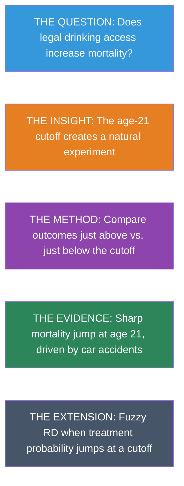


### Key Concepts and Definitions

**Regression Discontinuity (RD) Design:** A quasi-experimental method that exploits a sharp cutoff in a continuous variable to estimate causal effects. People just above and below the cutoff are nearly identical, but only one group receives treatment.

> 💡 **Example**
>
> The minimum legal drinking age of 21 creates a cutoff: people aged 20.9 years are nearly identical to those aged 21.1, but only the older group can legally buy alcohol.

> 📝 **Analogy**
>
> Like a finish line in a race. The runner who finishes at 9.99 seconds and the one at 10.01 seconds are virtually the same in ability, but only one gets a medal. The medal is the "treatment" assigned by the cutoff.


**Running Variable:** The continuous variable that determines treatment based on its position relative to the cutoff. It "runs" from below the threshold to above it.

> 💡 **Example**
>
> In the MLDA study, age (in months) is the running variable. The outcome (mortality) depends on where a person's age falls relative to the 21-year cutoff.

> 📝 **Analogy**
>
> Like a thermometer measuring temperature. The reading (running variable) determines whether a thermostat turns the heater on (treatment): above a set point, the heater is off; below it, the heater kicks in.


**Cutoff (Threshold):** The specific value of the running variable where treatment switches on or off. The causal effect is estimated as the discontinuous jump in the outcome at this point.

> 💡 **Example**
>
> Age 21 is the cutoff for legal drinking. Score 70 might be the cutoff for passing an exam. 65 is the cutoff for Medicare eligibility.

> 📝 **Analogy**
>
> Like a border between two countries. One step to the left, you are in Country A with its laws. One step to the right, you are in Country B with different rules. The border itself is the cutoff.


**Sharp RD:** An RD design where treatment switches completely on or off at the cutoff. Everyone above the threshold is treated; everyone below is not.

> 💡 **Example**
>
> At age 21, legal drinking access switches from 0% to 100%. There are no exceptions --- it is a sharp, deterministic rule.

> 📝 **Analogy**
>
> Like a light switch. It is either fully on or fully off at the threshold --- there is no dimmer.


**Fuzzy RD:** An RD design where the probability of treatment jumps at the cutoff but does not go from 0 to 100%. Some people above the cutoff are untreated, and some below are treated. Fuzzy RD uses the cutoff as an instrument for treatment (combining RD with IV).

> 💡 **Example**
>
> Scoring above the admissions cutoff for Boston Latin School increases the probability of enrollment but does not guarantee it --- some students decline admission.

> 📝 **Analogy**
>
> Like a dimmer switch rather than an on/off switch. Crossing the threshold makes treatment much more likely, but it does not guarantee it.


**Natural Experiment:** A situation where some external event, policy, or institutional rule creates variation in treatment that is "as good as random" for the people affected, even though no researcher designed the experiment.

> 💡 **Example**
>
> The Oregon Medicaid lottery, where limited slots were allocated randomly among applicants, created a natural experiment for studying health insurance effects.

> 📝 **Analogy**
>
> Like a snowstorm canceling some flights but not others. The storm was not designed as an experiment, but it randomly splits travelers into those who fly and those who are stuck, allowing you to study the effects of arriving on time.


**Polynomial Regression (in RD):** A regression that fits a curve (linear, quadratic, or higher-order) to the relationship between the running variable and the outcome on each side of the cutoff, allowing the researcher to control for the smooth trend and isolate the jump.

> 💡 **Example**
>
> A linear fit assumes mortality changes at a constant rate with age. A quadratic fit allows the rate of change itself to vary. The RD estimate is the gap between the two curves at the cutoff.

> 📝 **Analogy**
>
> Like fitting a flexible ruler to a curved surface. A straight ruler (linear) may miss the curve; a bendable ruler (quadratic) follows it more closely. Either way, the jump at the cutoff is what matters.


**Bandwidth:** The range of the running variable around the cutoff used in the analysis. A narrow bandwidth includes only observations close to the cutoff (more comparable, less data); a wide bandwidth includes more data but risks bias from the functional form.

> 💡 **Example**
>
> Analyzing mortality for ages 20--22 (narrow) versus 19--23 (wide). The narrow window has fewer observations but more comparable people.

> 📝 **Analogy**
>
> Like zooming in on a photograph. A close-up (narrow bandwidth) shows fine detail around the cutoff but captures less of the broader picture. A wide shot includes more context but may blur the key feature.


**Specification Check:** A robustness test in RD that varies the polynomial order, bandwidth, or other modeling choices to see whether the estimated jump at the cutoff remains stable.

> 💡 **Example**
>
> Checking that the MLDA mortality jump is similar whether you fit a linear or quadratic model, and whether you use ages 20--22 or 19--23.

> 📝 **Analogy**
>
> Like reading a message through different pairs of glasses. If you see the same message every time, it is probably real. If the message changes with each pair, you cannot trust any single reading.


**Placebo Test:** A test that checks for a discontinuity in an outcome that should not be affected by the treatment. A significant jump in a placebo outcome suggests the research design may be flawed.

> 💡 **Example**
>
> Testing whether internal causes of death (cancer, heart disease) jump at age 21. They should not, because diseases do not respond to a birthday. Finding no jump validates the RD design.

> 📝 **Analogy**
>
> Like testing whether a new medicine affects hair color. If it does, something is wrong with the experiment --- a real drug should only affect the targeted condition.


**Local Causal Effect:** An RD estimate that applies only to individuals near the cutoff, not to the broader population. People far from the cutoff may respond differently to treatment.

> 💡 **Example**
>
> The MLDA RD estimates the mortality effect of legal drinking for people right around age 21. The effect might be different for 16-year-olds or 30-year-olds.

> 📝 **Analogy**
>
> Like measuring the depth of a lake at the shoreline. The water is shallow near the edge (the cutoff), but the lake may be much deeper farther out. The shore measurement is accurate locally but may not generalize.


**Continuity Assumption:** The assumption that, in the absence of treatment, the outcome would change smoothly through the cutoff --- there would be no jump. Any observed jump must therefore be caused by the treatment.

> 💡 **Example**
>
> Without legal access to alcohol, mortality should change smoothly with age near 21. Any sudden spike at the cutoff is attributed to the drinking age policy.

> 📝 **Analogy**
>
> Like driving on a smooth road. If you suddenly hit a speed bump (the jump), you know something was placed there (the treatment). Without the bump, the road would have continued smoothly.


**Attenuation Bias:** Bias toward zero caused by imprecise measurement of a variable. Measurement error adds noise that dilutes the estimated relationship, making the true effect appear smaller than it is.

> 💡 **Example**
>
> If self-reported years of education contain random errors, the estimated return to schooling will be biased toward zero because the noise obscures the true signal.

> 📝 **Analogy**
>
> Like listening to a radio with static. The song (true signal) is still playing, but the static (noise) makes it sound quieter and less distinct than it really is.


### Rules Create Experiments

Many policies have sharp eligibility rules. You can vote at 18 but not at 17. You qualify for Medicare at 65 but not at 64. You can legally drink at 21 but not at 20. These cutoffs create a powerful opportunity: people just above and just below the threshold are nearly identical in every way --- except that one group receives the treatment and the other doesn't.

This is the logic of **Regression Discontinuity (RD)** designs. The causal effect is identified by the **jump** in outcomes at the cutoff.

> 📝 **Intuition Builder: The Speed Limit Analogy**
>
>
> Think of a speed limit sign on a highway. The road is the same on both sides of the sign --- same surface, same weather, same cars. But drivers caught going 66 mph vs. 64 mph face very different consequences if the limit is 65. The sign creates a sharp rule that affects behavior, even though the drivers on both sides are virtually identical. RD exploits exactly this kind of rule: people just above and just below a threshold are nearly interchangeable, but the rule treats them differently.


#### The MLDA Question

The **minimum legal drinking age (MLDA)** is 21 in the United States. Does reaching this threshold actually affect health? Specifically, does turning 21 --- and gaining legal access to alcohol --- increase mortality?

```python
import pandas as pd
import numpy as np
import pyfixest as pf
import matplotlib.pyplot as plt
import seaborn as sns
sns.set_style("whitegrid")

## Load clean MLDA mortality data
## Each row is one monthly age cell with death rates per 100,000
## Key variables:
##   agecell  = age in years (e.g., 19.08, 20.17, 21.00, ...)
##   age      = centered at 21 (so age=0 is the cutoff; negative = under 21)
##   over21   = treatment dummy (1 if age >= 21, 0 otherwise)
##   age2, over_age, over_age2 = polynomial/interaction terms for flexible RD models
##   all, mva, suicide, homicide, internal, alcohol = death rates by cause

## --- Data source ---
DATA = "https://raw.githubusercontent.com/cmg777/intro2causal/main/data/"

mlda = pd.read_csv(DATA + "ch4/mlda_clean.csv")
mlda.head(3)
```

#### Visualizing the Discontinuity

The first step in any RD analysis is to **plot the data**. If the causal effect is real, we should see a visible jump in mortality at age 21.

```python
## Scatter plot: mortality rate vs. age in months
fig, ax = plt.subplots(figsize=(9, 5))
ax.scatter(mlda["agecell"], mlda["all"], color="gray", alpha=0.7, s=40)  # one dot per age cell
ax.axvline(x=21, color="red", linestyle="--", alpha=0.5, label="MLDA cutoff")  # mark the cutoff
ax.set_xlabel("Age (years)")
ax.set_ylabel("Deaths per 100,000")
ax.set_title("All-cause mortality around the 21st birthday")
ax.legend()
plt.tight_layout()
plt.show()
```

There is a visible jump right at age 21. Let's now estimate its size formally.

> ⚠️ **Common Misconception: RD is not just "controlling for" the running variable**
>
>
> In standard regression (Chapter 2), we control for confounders to make treated and untreated groups comparable. RD is fundamentally different: there is **no value of the running variable where we observe both treated and untreated individuals**. Everyone over 21 is treated; everyone under 21 is untreated. Instead, RD *extrapolates* the trend from one side of the cutoff to estimate what would have happened without the jump. This is why the functional form (linear vs. quadratic) matters --- it determines how we extrapolate.


With that distinction in mind, let's build the regression model that formalizes the RD approach.


### The Sharp RD Regression

#### What Is a Running Variable?

In an RD design, the **running variable** is the variable that determines treatment. Here, age is the running variable and 21 is the **cutoff**. The treatment --- legal access to alcohol --- switches on deterministically at the cutoff:

$$D_a = \begin{cases} 1 & \text{if } a \geq 21 \\ 0 & \text{if } a < 21 \end{cases}$$

where $a$ is age (the running variable) and $D_a$ is the treatment indicator. In our data, these correspond to the columns `agecell` and `over21`.

This is a **sharp RD**: treatment switches completely on at the cutoff, with no exceptions.

> 📝 **How RD regression works**
>
>
> We regress the outcome $M_a$ (mortality rate at age $a$) on the treatment dummy $D_a$ and a smooth function of the running variable:
>
> $$M_a = \alpha + \rho \, D_a + \gamma \, a + e_a$$
>
> - **Intercept** ($\alpha$) = predicted mortality just below the cutoff
> - **$\rho$** = the **jump at the cutoff** --- this is the causal effect we want
> - **$\gamma$** = the background age trend (mortality naturally changes with age)
>
> In Python, this is: `pf.feols("all ~ over21 + age", data=mlda, vcov="hetero")` --- where `all` is $M_a$, `over21` is $D_a$, and `age` is $a$.
>
> The key insight: because age varies smoothly, any **sudden jump** at the cutoff must be caused by the treatment.


```python
## Simple linear RD regression
result = pf.feols("all ~ over21 + age", data=mlda, vcov="hetero")

## Extract key regression results into a clear table
pd.DataFrame({
    "Variable": result.coef().index,
    "Coefficient": result.coef().round(4).values,
    "Std. Error": result.se().round(4).values,
    "t-statistic": result.tstat().round(2).values,
    "p-value": result.pvalue().round(3).values,
})
```

The coefficient on `over21` is approximately **7.7 deaths per 100,000** --- a substantial increase caused by gaining legal access to alcohol.


### Robustness: Does the Specification Matter?

A critical question in RD is whether the estimated jump depends on how we model the age trend. We test robustness in two ways:

1. **Polynomial order**: linear vs. quadratic trends
2. **Bandwidth**: full sample (ages 19--22) vs. narrow window (ages 20--22)

```python
## Define narrow bandwidth subsample (ages 20-22 only)
narrow = mlda[(mlda["agecell"] >= 20) & (mlda["agecell"] <= 22)]

## Outcomes to test: each cause of death
outcomes = {"all": "All causes", "mva": "Motor vehicle", "suicide": "Suicide",
            "internal": "Internal causes", "alcohol": "Alcohol-related"}

## For each cause of death, run 4 RD specifications:
##   1. Linear trend, full sample (ages 19-22)
##   2. Quadratic trend, full sample
##   3. Linear trend, narrow bandwidth (ages 20-22)
##   4. Quadratic trend, narrow bandwidth
## This tests whether the RD estimate is robust to model choice and sample window.
rows = []
for var, label in outcomes.items():
    specs = []

    # Spec 1: Linear, full sample
    r1 = pf.feols(f"{var} ~ over21 + age", data=mlda, vcov="hetero")
    coef1 = round(r1.coef()["over21"], 2)
    se1 = round(r1.se()["over21"], 2)
    specs.append(format(coef1, ".2f") + " (" + format(se1, ".2f") + ")")

    # Spec 2: Quadratic, full sample
    r2 = pf.feols(f"{var} ~ over21 + age + age2 + over_age + over_age2",
                      data=mlda, vcov="hetero")
    coef2 = round(r2.coef()["over21"], 2)
    se2 = round(r2.se()["over21"], 2)
    specs.append(format(coef2, ".2f") + " (" + format(se2, ".2f") + ")")

    # Spec 3: Linear, narrow bandwidth
    r3 = pf.feols(f"{var} ~ over21 + age", data=narrow, vcov="hetero")
    coef3 = round(r3.coef()["over21"], 2)
    se3 = round(r3.se()["over21"], 2)
    specs.append(format(coef3, ".2f") + " (" + format(se3, ".2f") + ")")

    # Spec 4: Quadratic, narrow bandwidth
    r4 = pf.feols(f"{var} ~ over21 + age + age2 + over_age + over_age2",
                      data=narrow, vcov="hetero")
    coef4 = round(r4.coef()["over21"], 2)
    se4 = round(r4.se()["over21"], 2)
    specs.append(format(coef4, ".2f") + " (" + format(se4, ".2f") + ")")

    rows.append({"Cause of death": label, "Linear (full)": specs[0],
                 "Quadratic (full)": specs[1], "Linear (narrow)": specs[2],
                 "Quadratic (narrow)": specs[3]})

pd.DataFrame(rows)
```

> ⭐ **Key findings**
>
>
> - **All-cause mortality**: jumps by 7--10 deaths per 100,000 across all specifications
> - **Motor vehicle accidents**: the primary driver (4--6 extra deaths) --- drunk driving is the main mechanism
> - **Internal causes**: no significant jump --- this is a **placebo test**. Diseases shouldn't respond to the drinking age, and they don't. This validates the RD design.
> - **Results are robust**: similar across linear/quadratic models and bandwidth choices
>
> Why is the **internal causes** placebo so powerful? Diseases like cancer, heart disease, and diabetes take years or decades to develop. There is no biological reason why crossing the age-21 threshold would suddenly cause internal organ failure. So if we found a jump in internal-cause deaths, something else must be changing at 21 (perhaps data reporting practices or insurance eligibility), and we couldn't trust the MVA result either. Finding no jump in this placebo outcome gives us confidence that the design is working as intended.


### Visualizing the RD with Fitted Lines

```python
## Split data at the cutoff
below = mlda[mlda["age"] < 0]   # under 21
above = mlda[mlda["age"] >= 0]  # 21 and over

## Fit separate linear regressions on each side
fit_below = pf.feols("all ~ age", data=below)
fit_above = pf.feols("all ~ age", data=above)

## Plot scatter + fitted lines
fig, ax = plt.subplots(figsize=(9, 5))
ax.scatter(mlda["agecell"], mlda["all"], color="gray", alpha=0.6, s=35)
ax.plot(below["agecell"], fit_below.predict(newdata=below), "k-", linewidth=2)   # left line
ax.plot(above["agecell"], fit_above.predict(newdata=above), "k-", linewidth=2)   # right line
ax.axvline(x=21, color="red", linestyle="--", alpha=0.5)
ax.set_xlabel("Age (years)")
ax.set_ylabel("Deaths per 100,000")
ax.set_title("Sharp RD: All-cause mortality around the MLDA cutoff")
plt.tight_layout()
plt.show()
```

The gap between the two fitted lines at age 21 is the RD estimate --- approximately 7--10 extra deaths per 100,000 caused by legal access to alcohol. Notice how the lines fit the data well on each side of the cutoff, with a clear discontinuous jump right at the threshold.

But what is *driving* this jump? Is it drunk driving, suicide, or something else entirely? The next figure breaks down mortality by cause to answer this question.

```python
## Plot two causes on the same figure: MVA (should jump) vs internal (should not)
fig, ax = plt.subplots(figsize=(9, 5))
ax.scatter(mlda["agecell"], mlda["mva"], color="steelblue", alpha=0.6, s=30, label="Motor vehicle")
ax.scatter(mlda["agecell"], mlda["internal"], color="darkorange", alpha=0.6, s=30, label="Internal causes")

## Fit separate regression lines on each side of the cutoff, for each cause of death.
## The outer loop picks the death cause; the inner loop picks below-21 vs. above-21.
for var, color in [("mva", "steelblue"), ("internal", "darkorange")]:
    for subset in [below, above]:
        fit = pf.feols(f"{var} ~ age", data=subset)
        ax.plot(subset["agecell"], fit.predict(newdata=subset), color=color, linewidth=2)

ax.axvline(x=21, color="red", linestyle="--", alpha=0.5)  # cutoff line
ax.set_xlabel("Age (years)")
ax.set_ylabel("Deaths per 100,000")
ax.set_title("RD by cause: Motor vehicle accidents vs. internal causes")
ax.legend()
plt.tight_layout()
plt.show()
```

The figure makes the story clear. Motor vehicle deaths (blue) show a sharp upward jump at age 21 --- consistent with drunk driving as the primary mechanism. Internal causes of death (orange) show no discontinuity at the cutoff, exactly as expected: diseases like cancer and heart disease do not respond to a birthday. This placebo outcome validates the RD design.


### Sharp vs. Fuzzy RD

The MLDA example is a **sharp** RD because treatment switches completely at the cutoff. Many real-world policies create fuzzier boundaries, where the cutoff changes the *probability* of treatment rather than guaranteeing it. We explore this variant conceptually here; Chapter 6's sheepskin analysis provides a concrete code example.

**Boston exam schools** illustrate a **fuzzy RD**. Students are admitted based on a test score cutoff, but not everyone above the cutoff enrolls, and some below it get in through other channels. In a fuzzy RD, the *probability* of treatment jumps at the cutoff, but doesn't go from 0 to 1.

Fuzzy RD is analyzed using **IV/2SLS**, with the cutoff dummy as the instrument for actual treatment. The first stage captures the jump in treatment probability; the second stage estimates the causal effect on compliers.

| Feature | Sharp RD | Fuzzy RD |
|:---|:---|:---|
| Treatment at cutoff | Switches completely on/off | Probability jumps |
| Estimation | OLS with running variable control | IV/2SLS with cutoff as instrument |
| Interpretation | Effect of treatment | LATE for compliers at the cutoff |

: Sharp vs. fuzzy regression discontinuity designs
> 📝 **Connection to Chapter 3: Fuzzy RD is IV at a Cutoff**
>
>
> Fuzzy RD is a special case of instrumental variables. The cutoff dummy serves as the instrument, the treatment probability jumps at the cutoff (first stage), and the outcome may jump too (reduced form). The ratio --- reduced form / first stage --- gives the LATE for compliers at the cutoff. If you understand IV from Chapter 3, you already understand fuzzy RD.


Research on Boston exam schools found that peer quality jumped by 0.8 standard deviations at the admissions cutoff, but student achievement showed **no corresponding jump**. This challenges the widely held belief that attending a more selective school --- with higher-ability peers --- causally improves outcomes. The policy implication is that reallocating students across schools of different selectivity may not improve achievement, even though the raw correlation between school quality and student outcomes is strong (selection bias at work again).


### Historical Perspective: Donald Campbell

The RD design was invented by **Donald Thistlethwaite and Donald Campbell** in 1960. They studied whether receiving National Merit Scholarship recognition affected students' career plans. Their RD analysis at the recognition cutoff found minimal effects --- one of the first applications of this now-ubiquitous method.

Campbell went on to pioneer quasi-experimental methods more broadly, co-authoring influential textbooks on research design that shaped how social scientists think about causal inference outside of true experiments.


### Key Takeaways

The following concept map shows how the key ideas in this chapter connect --- from cutoff rules that create natural experiments, through the RD method of comparing observations just above and below the threshold, to robustness checks, placebo tests, and the fuzzy RD extension.

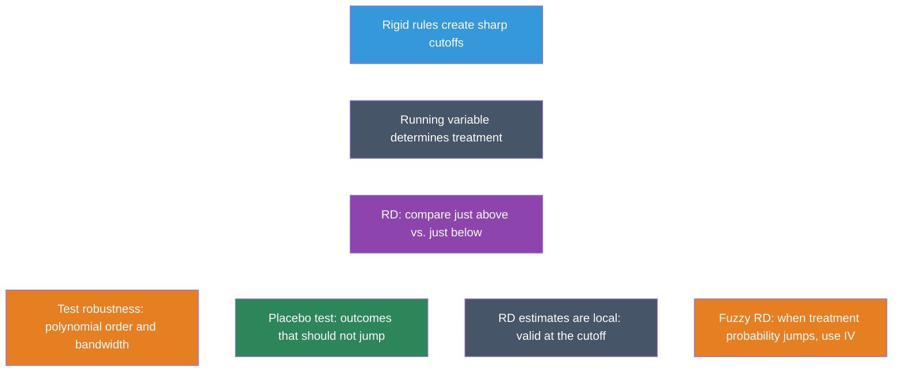

1. **RD exploits cutoff rules** where treatment switches on at a threshold of a running variable.

2. **The causal effect** is the jump in outcomes at the cutoff, after controlling for the smooth relationship between the running variable and the outcome.

3. **Always plot the data first.** Visual inspection is the most important step in RD.

4. **Test robustness** by varying polynomial order (linear vs. quadratic) and bandwidth (wide vs. narrow).

5. **Placebo tests** on outcomes unaffected by treatment (e.g., internal causes of death) validate the design.

6. **RD estimates are local** --- they apply to people near the cutoff and may not generalize to people far from it.

7. **Fuzzy RD** handles cases where treatment probability (not treatment itself) jumps, using IV at the cutoff.


### Learn by Coding

Copy this code into a Python notebook to reproduce the key results from this chapter.

```python
## ============================================================
## Chapter 4: Regression Discontinuity — Code Cheatsheet
## ============================================================
import pandas as pd
import matplotlib.pyplot as plt
import pyfixest as pf

DATA = "https://raw.githubusercontent.com/cmg777/intro2causal/main/data/"

## --- Step 1: Load MLDA mortality data ---
mlda = pd.read_csv(DATA + "ch4/mlda_clean.csv")
print("MLDA data:", mlda.shape[0], "age cells")
print(mlda[["agecell", "over21", "all", "mva", "internal"]].head())

## --- Step 2: Plot the discontinuity ---
fig, ax = plt.subplots(figsize=(8, 5))
ax.scatter(mlda["agecell"], mlda["all"], color="gray", alpha=0.7, s=40)
ax.axvline(x=21, color="red", linestyle="--", label="MLDA cutoff (age 21)")
ax.set_xlabel("Age")
ax.set_ylabel("Deaths per 100,000")
ax.set_title("All-cause mortality around the MLDA cutoff")
ax.legend()
plt.show()

## --- Step 3: Sharp RD regression (linear) ---
result = pf.feols("all ~ over21 + age", data=mlda, vcov="hetero")
print("\nSharp RD — linear specification:")
print(result.summary())
print(f"  Jump at cutoff: {round(result.coef()['over21'], 2)} deaths per 100k")

## --- Step 4: Quadratic RD for robustness ---
result = pf.feols("all ~ over21 + age + age2 + over_age + over_age2", data=mlda, vcov="hetero")
print("\nSharp RD — quadratic specification:")
print(f"  Jump at cutoff: {round(result.coef()['over21'], 2)} deaths per 100k")

## --- Step 5: Placebo test (internal causes should NOT jump) ---
result = pf.feols("internal ~ over21 + age", data=mlda, vcov="hetero")
print(f"\nPlacebo test (internal causes): {round(result.coef()['over21'], 2)}")
print("  (Expect: small and insignificant — diseases don't respond to MLDA)")
```

> 💡 **Try it yourself!**
>
> Copy the code above and paste it into [this Google Colab scratchpad](https://colab.research.google.com/notebooks/empty.ipynb) to run it interactively. Modify the variables, change the specifications, and see how results change!


Below is the same cheatsheet in Stata syntax.

```stata
* ============================================================
* Chapter 4: Regression Discontinuity — Stata Cheatsheet
* ============================================================
clear all
set more off

* --- Step 1: Load MLDA mortality data ---
import delimited using "https://raw.githubusercontent.com/cmg777/intro2causal/main/data/ch4/mlda_clean.csv", clear
list agecell over21 all mva internal in 1/5

* --- Step 2: Plot the discontinuity ---
twoway (scatter all agecell, mcolor(gray)), ///
    xline(21, lcolor(red) lpattern(dash)) ///
    xtitle("Age") ytitle("Deaths per 100,000") ///
    title("All-cause mortality around the MLDA cutoff")

* --- Step 3: Sharp RD regression (linear) ---
reg all over21 age, robust

* --- Step 4: Quadratic RD for robustness ---
reg all over21 age age2 over_age over_age2, robust

* --- Step 5: Placebo test (internal causes should NOT jump) ---
reg internal over21 age, robust
* Expect: small and insignificant coefficient on over21
```

> 💡 **Try it in Stata!**
>
> Copy the code above into a `.do` file and run it in Stata 14 or later (which supports loading data from URLs). If your Stata cannot access the internet, download the CSV files from the `data/` folder on [GitHub](https://github.com/cmg777/intro2causal/tree/main/data) and replace each URL with a local file path.


### Exercises

#### Multiple Choice Questions

1. **What makes a regression discontinuity design possible?**
   a) Random assignment of treatment to participants
   b) A rigid rule or cutoff that determines treatment eligibility
   c) A large sample size with many treated individuals
   d) The availability of panel data over multiple time periods

> 📝 **Show answer**
>
> **(b)** RD exploits rigid rules — such as age thresholds, test score cutoffs, or income limits — that create sharp changes in treatment eligibility. People just above and just below the cutoff are nearly identical, creating a natural experiment. **(a) is wrong** because random assignment of treatment describes randomized controlled trials (RCTs), not RD — RD is observational, with treatment determined by a cutoff rule. **(c) is wrong** because while matching on observables can help, it is not what defines RD; RD specifically relies on a known cutoff in a running variable. **(d) is wrong** because before-after comparisons describe difference-in-differences, not RD.


2. **In a sharp RD design, the "running variable" is:**
   a) The outcome variable that we want to measure
   b) The variable that determines treatment status through a cutoff
   c) A control variable included to reduce bias
   d) The time variable in a panel dataset

> 📝 **Show answer**
>
> **(b)** The running variable is the continuous variable (like age) that determines whether someone is above or below the cutoff. In the MLDA example, age is the running variable and 21 is the cutoff. **(a) is wrong** because the death rate is the outcome variable, not the running variable — the running variable determines treatment assignment, not the effect we measure. **(c) is wrong** because income is a potential confounder, not the variable that determines the sharp change in treatment at a cutoff. **(d) is wrong** because the treatment group label is a binary indicator derived from the running variable, not the running variable itself.


3. **In the MLDA study, what serves as a placebo test?**
   a) Comparing mortality rates for people aged 25 vs. 26
   b) Checking whether internal-cause deaths (diseases) jump at age 21
   c) Testing whether the drinking age varies across states
   d) Comparing drunk driving rates before and after the policy change

> 📝 **Show answer**
>
> **(b)** Internal-cause deaths (cancer, heart disease) should NOT respond to turning 21, because these diseases develop over years. Finding no jump in internal-cause deaths at age 21 validates the design — it confirms that the observed jump in motor vehicle deaths is not an artifact of data reporting or other changes at age 21. This is a placebo test: if a variable that should be unaffected by the treatment also jumps at the cutoff, the design is suspect. **(a) is wrong** because a jump in internal deaths would undermine, not confirm, the design. **(c) is wrong** because internal causes are used precisely because they should not be affected by alcohol access — they serve as a falsification check. **(d) is wrong** because internal causes are relevant to validating the RD design, not irrelevant.


4. **Why is bandwidth choice important in RD designs?**
   a) A wider bandwidth always gives more accurate estimates
   b) A narrower bandwidth reduces bias but increases variance — there is a trade-off
   c) The bandwidth must equal the distance between the cutoff and the mean
   d) Bandwidth only matters in fuzzy RD, not sharp RD

> 📝 **Show answer**
>
> **(b)** Narrower bandwidths compare people closer to the cutoff (more comparable, less bias) but use fewer observations (more noise, higher variance). Wider bandwidths use more data but include people farther from the cutoff who may differ in other ways. This bias-variance trade-off is fundamental to RD. **(a) is wrong** because wider bandwidths do not always give better estimates — they reduce variance but introduce bias from nonlinear trends in the running variable. **(c) is wrong** because bandwidth choice matters greatly for RD; it is not irrelevant. **(d) is wrong** because narrower bandwidths reduce bias (not increase it) by restricting comparison to more similar units near the cutoff.


5. **What distinguishes a fuzzy RD from a sharp RD?**
   a) A fuzzy RD requires perfect compliance at the cutoff
   b) A fuzzy RD has an unknown cutoff value
   c) In a fuzzy RD, the probability of treatment jumps at the cutoff but does not switch from 0 to 1
   d) A fuzzy RD uses multiple cutoffs simultaneously

> 📝 **Show answer**
>
> **(c)** In a fuzzy RD, the probability of receiving treatment jumps at the cutoff but does not switch from 0 to 1. For example, in Boston exam schools, scoring above the admission cutoff increases the probability of enrollment but does not guarantee it. A fuzzy RD is estimated using IV, with the cutoff indicator as the instrument for actual treatment. **(a) is wrong** because a fuzzy RD does not require perfect compliance — that would be a sharp RD. **(b) is wrong** because fuzzy RD does not mean the cutoff is unknown; the cutoff is known but compliance is imperfect. **(d) is wrong** because fuzzy RD applies to a single cutoff with partial compliance, not to multiple cutoffs.


6. **The "continuity assumption" in RD requires that:**
   a) The treatment variable is continuous
   b) All factors other than treatment vary smoothly at the cutoff — no sudden jumps
   c) The outcome variable follows a normal distribution
   d) The sample includes observations far from the cutoff

> 📝 **Show answer**
>
> **(b)** The continuity assumption states that all determinants of the outcome (other than the treatment) change smoothly at the cutoff. This ensures that any discontinuity in the outcome at the cutoff is caused by the treatment, not by something else that also jumps there. **(a) is wrong** because the treatment variable is typically binary (treated/not treated at the cutoff), not continuous. **(c) is wrong** because normality is a distributional assumption irrelevant to RD validity. **(d) is wrong** because including observations far from the cutoff can actually introduce bias from nonlinear trends.


7. **In an RD scatter plot, why do researchers fit separate regression lines on each side of the cutoff?**
   a) To make the graph look more visually appealing
   b) To estimate the treatment effect as the vertical gap between the two lines at the cutoff
   c) To test whether the outcome is normally distributed
   d) To increase the sample size

> 📝 **Show answer**
>
> **(b)** Separate regression lines on each side of the cutoff allow the relationship between the running variable and the outcome to differ on each side. The treatment effect is estimated as the vertical gap between the two lines at the cutoff point. If there is no treatment effect, the two lines would connect smoothly at the cutoff. **(a) is wrong** because the separate lines serve an analytical purpose, not just aesthetics. **(c) is wrong** because normality testing is unrelated to the RD scatter plot. **(d) is wrong** because the number of observations is determined by the data, not the plotting technique.


8. **Why does the MLDA study focus on ages close to 21 rather than comparing 18-year-olds to 25-year-olds?**
   a) Because data is only available for ages near 21
   b) Because people close in age to the cutoff are more comparable, reducing confounding
   c) Because mortality rates are only meaningful near age 21
   d) Because alcohol consumption is similar at all ages

> 📝 **Show answer**
>
> **(b)** Comparing people just above and just below 21 ensures they are nearly identical in all respects except legal drinking access. Comparing 18-year-olds to 25-year-olds would introduce many confounders (maturity, employment, lifestyle changes) that differ systematically between these age groups. **(a) is wrong** because mortality data is available for all ages. **(c) is wrong** because mortality rates are meaningful at any age. **(d) is wrong** because alcohol consumption varies substantially across age groups.


9. **Adding a quadratic term to the RD regression serves to:**
   a) Double the treatment effect estimate
   b) Allow for a curved (nonlinear) relationship between the running variable and the outcome
   c) Eliminate all bias from the estimate
   d) Increase the statistical significance of the treatment effect

> 📝 **Show answer**
>
> **(b)** A quadratic specification allows the relationship between age and mortality to curve rather than follow a straight line on each side of the cutoff. This flexibility can prevent the linear model from mistaking a nonlinear trend for a treatment-induced jump. **(a) is wrong** because quadratic terms change the functional form, not the magnitude of the treatment effect. **(c) is wrong** because no specification can eliminate all bias — researchers test robustness across multiple specifications. **(d) is wrong** because the quadratic term may increase or decrease the significance of the estimate depending on the true relationship.


10. **The RD estimate is considered "local" because:**
    a) It uses data from a local geographic area
    b) It applies to people near the cutoff and may not generalize to those far from it
    c) It requires a local computer to run
    d) It is only valid for a limited time period

> 📝 **Show answer**
>
> **(b)** The RD estimate captures the effect of treatment for individuals right at the cutoff. People far from the cutoff may respond differently to treatment. In the MLDA example, the effect of legal drinking at age 21 may differ from the effect at age 18 (where risk-taking behavior is higher) or age 25 (where drinking patterns are more established). **(a) is wrong** because "local" refers to proximity to the cutoff in the running variable, not geography. **(c) is wrong** because locality refers to the population, not the computing environment. **(d) is wrong** because "local" describes who the estimate applies to, not when.


#### Conceptual Questions

1. **Identifying RD opportunities**: A scholarship program awards funding to students who score above 80 on an entrance exam. (a) What is the running variable? (b) What is the cutoff? (c) Is this a sharp or fuzzy RD? (d) What assumption must hold for the RD estimate to be causal?

> 📝 **Show answer**
>
> **Designing an RD requires identifying the running variable, the cutoff, the sharpness of compliance, and the continuity assumption.**
>
> 1. The running variable is the entrance exam score --- this is the continuous measure that determines treatment assignment at the threshold.
> 2. The cutoff is 80. Students scoring above this threshold are eligible for funding; those below are not.
> 3. If all students above 80 receive funding and none below do, it is a sharp RD (perfect compliance). If some above 80 decline the scholarship and some below 80 receive funding through appeals or exceptions, it is a fuzzy RD --- estimated using IV with the cutoff indicator as the instrument for actual scholarship receipt.
> 4. The key assumption is continuity: all other factors affecting the outcome must vary *smoothly* at the cutoff. Students scoring 79 and 81 must be comparable in every way except scholarship receipt. If students can manipulate their scores to land above 80, this assumption fails because the two groups would differ systematically.


2. **The placebo test**: In our MLDA analysis, internal causes of death showed no jump at age 21. Why is this important for the credibility of the RD design? What would it mean if internal causes *did* show a significant jump?

> 📝 **Show answer**
>
> **Placebo tests using outcomes that should not respond to the treatment are essential for validating any RD design.**
>
> 1. Internal causes of death (diseases, cancer, etc.) should not be affected by legal drinking access at age 21 --- these conditions take years to develop and have no plausible connection to alcohol availability.
> 2. Finding no jump in internal causes at the cutoff confirms that the RD design is picking up the causal effect of alcohol access specifically, not some other factor that changes at 21.
> 3. If internal causes *did* show a significant jump, it would suggest that something other than drinking is changing at the cutoff (e.g., a change in health insurance eligibility, data reporting practices, or census age-heaping), casting doubt on the entire RD design.
> 4. This logic extends to any RD application: researchers should always test outcomes that the treatment should not affect. A clean placebo test strengthens the causal interpretation; a failed one demands investigation before results can be trusted.


3. **Bandwidth tradeoff**: Explain the tradeoff between using a narrow bandwidth (ages 20--22) and a wide bandwidth (ages 19--23) in an RD analysis. What does each gain and lose?

> 📝 **Show answer**
>
> **The bandwidth choice in RD embodies a fundamental bias-variance tradeoff: proximity to the cutoff improves comparability but reduces statistical power.**
>
> 1. A narrow bandwidth (e.g., ages 20--22) reduces bias because people very close to the cutoff are nearly identical, and nonlinear trends in the running variable have less room to confuse the estimate. The continuity assumption is most plausible for observations right at the cutoff.
> 2. However, a narrow bandwidth increases variance because fewer observations are used, making the estimate noisier and confidence intervals wider.
> 3. A wide bandwidth (ages 19--23) uses more data, giving more precise estimates, but risks bias from nonlinear trends in the outcome-running variable relationship that could be mistaken for (or mask) a discontinuity.
> 4. The optimal choice balances this tradeoff. In practice, researchers report estimates across multiple bandwidths to show robustness --- if the RD estimate is sensitive to bandwidth choice, it raises concerns about specification dependence.


4. **Manipulation of the running variable**: Why is manipulation of the running variable a threat to RD validity? Can people manipulate their age? What about an exam score? Give an example where manipulation would be a serious concern.

> 📝 **Show answer**
>
> **Manipulation of the running variable is the greatest threat to RD validity because it destroys the comparability of units just above and just below the cutoff.**
>
> 1. If people can manipulate the running variable to land on their preferred side of the cutoff, the groups just above and just below are no longer comparable --- those who manipulated are systematically different from those who did not (e.g., more motivated, better connected, or wealthier).
> 2. Age cannot be manipulated (you cannot choose your birthday), which is why the MLDA design is strong. The continuity assumption is highly credible because no one can precisely sort themselves to one side of age 21.
> 3. Exam scores, however, can be manipulated: students might retake exams, cheat, or receive score adjustments near the cutoff. This creates "bunching" just above the threshold.
> 4. A concerning example would be a tax threshold where accountants manipulate reported income to fall just below the cutoff for a higher tax rate --- the McCrary density test can detect such manipulation by checking whether the density of the running variable is discontinuous at the cutoff.


5. **Local vs. global effects**: The RD estimate tells us about the effect of legal drinking for people *at* the age-21 cutoff. Why might this effect differ from the effect at age 18 or age 25? What does "local" mean in this context?

> 📝 **Show answer**
>
> **RD estimates are inherently local --- they identify the causal effect only at the cutoff, and generalizing to other values of the running variable requires untestable assumptions.**
>
> 1. "Local" means the RD estimate applies specifically to people at the cutoff --- those just turning 21. The design compares outcomes in an infinitesimally narrow window around this threshold.
> 2. At age 18, people may have less driving experience, so the mortality effect of alcohol access could be larger or smaller. At age 25, people may drink more responsibly, implying a different treatment effect.
> 3. The RD cannot tell us about these other ages without extrapolation, which requires stronger assumptions about how the treatment effect varies with age --- assumptions that the data near the cutoff cannot verify.
> 4. This locality is analogous to LATE in IV: just as IV identifies effects only for compliers, RD identifies effects only at the cutoff. Both methods trade external validity for strong internal validity at a specific margin.


#### Research Tasks

1. **Alcohol-related deaths**: Using `mlda_clean.csv`, run the linear RD regression for `alcohol`-related deaths (instead of all-cause). Is the jump at age 21 statistically significant? How does the effect size compare to the `mva` result?

> 📝 **Show answer**
>
>
> ```python
> # --- Setup ---
> import pandas as pd
> import pyfixest as pf
>
> mlda = pd.read_csv(DATA + "ch4/mlda_clean.csv")
>
> # --- Compare RD Estimates Across Death Causes ---
> # Estimate the discontinuity at age 21 for two cause-of-death categories
> rows = []
> for var, label in [("alcohol", "Alcohol-related"), ("mva", "Motor vehicle")]:
> r = pf.feols(f"{var} ~ over21 + age", data=mlda, vcov="hetero")  # linear RD with robust SEs
> rows.append({
> "Cause": label,
> "RD estimate (over21)": round(r.coef()["over21"], 2),  # jump at cutoff
> "SE": round(r.se()["over21"], 2),
> "t-stat": round(r.tstat()["over21"], 2),
> })
>
> # --- Display Results ---
> pd.DataFrame(rows)
> ```
>
> Stata equivalent:
>
> ```stata
> * --- RD estimates: alcohol vs. motor vehicle deaths ---
> clear all
> set more off
> import delimited using "https://raw.githubusercontent.com/cmg777/intro2causal/main/data/ch4/mlda_clean.csv", clear
>
> * Linear RD for alcohol-related deaths
> reg alcohol over21 age, robust
>
> * Linear RD for motor vehicle deaths (for comparison)
> reg mva over21 age, robust
> ```
>
> **(1) What the numbers show:** The alcohol-related death jump is much smaller than the MVA jump (roughly one-fifth the size), but it is statistically significant. Both causes show a clear discontinuity at age 21. **(2) Why:** Relatively few young people die directly from alcohol poisoning, but many die in alcohol-related car accidents. The dominant mechanism through which legal drinking access kills is drunk driving, not direct alcohol toxicity. **(3) What it teaches:** Comparing RD estimates across different outcomes reveals the causal channels through which a treatment operates. The large MVA effect relative to the small alcohol-poisoning effect tells us that the policy-relevant margin of the MLDA is traffic safety, which informs where interventions (e.g., DUI enforcement) should be targeted.


2. **Visualizing the suicide RD**: Using `mlda_clean.csv`, create an RD scatter plot for `suicide` deaths with separate fitted lines on each side of the cutoff. Does the visual pattern match what the regression coefficient suggests?

> 📝 **Show answer**
>
>
> ```python
> # --- Setup ---
> import matplotlib.pyplot as plt
> import seaborn as sns
> sns.set_style("whitegrid")
>
> # --- Split Data at Cutoff ---
> below = mlda[mlda["age"] < 0]  # observations below age 21
> above = mlda[mlda["age"] >= 0]  # observations at or above age 21
>
> # --- Fit Separate Linear Trends ---
> fit_below = pf.feols("suicide ~ age", data=below)  # trend before cutoff
> fit_above = pf.feols("suicide ~ age", data=above)  # trend after cutoff
>
> # --- Create RD Plot ---
> fig, ax = plt.subplots(figsize=(9, 5))
> ax.scatter(mlda["agecell"], mlda["suicide"], color="gray", alpha=0.6, s=35)  # raw data points
> ax.plot(below["agecell"], fit_below.predict(newdata=below), "k-", linewidth=2)  # left-side fit
> ax.plot(above["agecell"], fit_above.predict(newdata=above), "k-", linewidth=2)  # right-side fit
> ax.axvline(x=21, color="red", linestyle="--", alpha=0.5)  # cutoff line
> ax.set_xlabel("Age (years)")
> ax.set_ylabel("Deaths per 100,000")
> ax.set_title("Suicide deaths around the MLDA cutoff")
> plt.tight_layout()
> plt.show()
> ```
>
> Stata equivalent:
>
> ```stata
> * --- RD plot for suicide deaths ---
> clear all
> set more off
> import delimited using "https://raw.githubusercontent.com/cmg777/intro2causal/main/data/ch4/mlda_clean.csv", clear
>
> * Scatter plot with separate fitted lines on each side of the cutoff
> twoway (scatter suicide agecell, mcolor(gray) msymbol(circle)) ///
> (lfit suicide agecell if age < 0, lcolor(black) lwidth(medium)) ///
> (lfit suicide agecell if age >= 0, lcolor(black) lwidth(medium)), ///
> xline(21, lcolor(red) lpattern(dash)) ///
> xtitle("Age (years)") ytitle("Deaths per 100,000") ///
> title("Suicide deaths around the MLDA cutoff") ///
> legend(off)
> ```
>
> **(1) What the numbers show:** The visual shows a modest upward jump at age 21, consistent with the regression estimate of about 1.8 deaths per 100,000. The effect is smaller and noisier than for motor vehicle accidents. **(2) Why:** Alcohol can contribute to suicide through impulsivity and impaired judgment, but the link is less direct than for drunk driving. Suicide involves complex psychological factors that alcohol may exacerbate but rarely causes alone. **(3) What it teaches:** This RD plot illustrates why visual inspection is critical --- it reveals both the magnitude of the jump and the noise in the data. The gap between the two fitted lines at the cutoff is the RD estimate, and the scatter of points around the lines shows why standard errors matter for inference.


3. **Quadratic vs. linear specification**: Using `mlda_clean.csv`, run the quadratic RD model for all-cause mortality (including `age2`, `over_age`, `over_age2`). Compare the coefficient on `over21` with the linear model. Is the estimate sensitive to the polynomial order?

> 📝 **Show answer**
>
>
> ```python
> # --- Setup ---
> import pandas as pd
> import pyfixest as pf
>
> mlda = pd.read_csv(DATA + "ch4/mlda_clean.csv")
>
> # --- Linear RD Specification ---
> # Controls for a linear trend in age on both sides of the cutoff
> r_lin = pf.feols("all ~ over21 + age", data=mlda, vcov="hetero")
>
> # --- Quadratic RD Specification ---
> # Allows curvature and different slopes/curvature on each side via interactions
> r_quad = pf.feols("all ~ over21 + age + age2 + over_age + over_age2", data=mlda, vcov="hetero")
>
> # --- Compare Estimates ---
> pd.DataFrame({
> "Specification": ["Linear", "Quadratic (interacted)"],
> "RD estimate (over21)": [round(r_lin.coef()["over21"], 2), round(r_quad.coef()["over21"], 2)],
> "SE": [round(r_lin.se()["over21"], 2), round(r_quad.se()["over21"], 2)],
> })
> ```
>
> Stata equivalent:
>
> ```stata
> * --- Linear vs. quadratic RD for all-cause mortality ---
> clear all
> set more off
> import delimited using "https://raw.githubusercontent.com/cmg777/intro2causal/main/data/ch4/mlda_clean.csv", clear
>
> * Linear RD
> reg all over21 age, robust
>
> * Quadratic RD with interactions
> reg all over21 age age2 over_age over_age2, robust
> ```
>
> **(1) What the numbers show:** The quadratic estimate is somewhat larger (~9.5 vs. ~7.7) because the quadratic specification allows the outcome trend to curve differently on each side of the cutoff, potentially capturing a steeper jump. Both estimates are statistically significant and in the same ballpark. **(2) Why:** The linear specification constrains the relationship between age and mortality to be a straight line, which may underestimate the discontinuity if the true relationship is curved. The quadratic specification with interactions (over_age, over_age2) allows different slopes and curvature on each side, providing a more flexible fit. **(3) What it teaches:** The fact that the estimate is robust to polynomial order strengthens confidence in the RD design. Sensitivity to specification would suggest that the "discontinuity" might be an artifact of functional form assumptions rather than a true jump. Reporting multiple specifications is standard RD practice and essential for credibility.


4. **Homicide as a nuanced placebo**: Using `mlda_clean.csv`, run the linear RD regression for `homicide` deaths and compare the estimate with those for `mva` and `internal` causes. Homicide is partly alcohol-related (bar fights, altercations) but not as directly as drunk driving. Where does homicide fall on the spectrum from "causally affected by alcohol access" to "placebo"?

> 📝 **Show answer**
>
>
> ```python
> # --- Setup ---
> import pandas as pd
> import pyfixest as pf
>
> mlda = pd.read_csv(DATA + "ch4/mlda_clean.csv")
>
> # --- Compare RD Estimates Across Three Causes ---
> rows = []
> for var, label in [("mva", "Motor vehicle"), ("homicide", "Homicide"), ("internal", "Internal (placebo)")]:
> r = pf.feols(f"{var} ~ over21 + age", data=mlda, vcov="hetero")
> rows.append({
> "Cause": label,
> "RD estimate": round(r.coef()["over21"], 2),
> "SE": round(r.se()["over21"], 2),
> "t-stat": round(r.tstat()["over21"], 2),
> })
>
> pd.DataFrame(rows)
> ```
>
> Stata equivalent:
>
> ```stata
> * --- RD estimates: MVA, homicide, and internal ---
> clear all
> set more off
> import delimited using "https://raw.githubusercontent.com/cmg777/intro2causal/main/data/ch4/mlda_clean.csv", clear
>
> * Linear RD for each cause of death
> foreach var in mva homicide internal {
> display "=== `var' ==="
> reg `var' over21 age, robust
> }
> ```
>
> (1) **What the numbers show:** MVA shows a large, statistically significant jump at age 21. Internal causes (the clean placebo) show no significant jump, confirming the design's validity. Homicide falls in between --- it may show a modest positive estimate, but with a larger standard error and weaker significance than MVA.
>
> (2) **Why:** MVA deaths are directly caused by drunk driving, so legal alcohol access has an immediate, strong effect. Internal causes (cancer, heart disease) cannot plausibly respond to turning 21, making them a clean falsification test. Homicide occupies an ambiguous middle ground: alcohol can contribute to violent altercations, but homicide is driven by many factors beyond drinking. The intermediate result for homicide reflects this partial causal channel.
>
> (3) **What it teaches:** Not every outcome is cleanly "should jump" or "should not jump." Homicide illustrates the value of thinking about *mechanisms* when designing placebo tests. A nuanced researcher would predict a small homicide effect (partial alcohol channel) and a zero internal effect (no channel). Finding exactly this pattern --- large MVA, small homicide, null internal --- strengthens the causal story more than a simple "significant vs. not significant" binary.


5. **Bandwidth sensitivity**: Using `mlda_clean.csv`, estimate the RD effect on all-cause mortality (`all`) using four progressively narrower bandwidths: the full sample, then `agecell` within 1.5 years of 21, within 1.0 year, and within 0.5 years. How do the coefficient and standard error change as the bandwidth narrows?

> 📝 **Show answer**
>
>
> ```python
> # --- Setup ---
> mlda = pd.read_csv(DATA + "ch4/mlda_clean.csv")
>
> # --- Define Bandwidths (distance from cutoff age 21) ---
> bandwidths = [
> ("Full sample", None, None),
> ("± 1.5 years", 19.5, 22.5),
> ("± 1.0 year", 20.0, 22.0),
> ("± 0.5 years", 20.5, 21.5),
> ]
>
> # --- Estimate RD for Each Bandwidth ---
> rows = []
> for label, lo, hi in bandwidths:
> if lo is None:
> subset = mlda  # full sample
> else:
> subset = mlda[(mlda["agecell"] >= lo) & (mlda["agecell"] <= hi)]
>
> if len(subset) > 4:  # need enough observations for regression
> r = pf.feols("all ~ over21 + age", data=subset, vcov="hetero")
> rows.append({
> "Bandwidth": label,
> "N": len(subset),
> "RD estimate": round(r.coef()["over21"], 2),
> "SE": round(r.se()["over21"], 2),
> "t-stat": round(r.tstat()["over21"], 2),
> })
>
> pd.DataFrame(rows)
> ```
>
> Stata equivalent:
>
> ```stata
> * --- Bandwidth sensitivity analysis ---
> clear all
> set more off
> import delimited using "https://raw.githubusercontent.com/cmg777/intro2causal/main/data/ch4/mlda_clean.csv", clear
>
> * Full sample
> reg all over21 age, robust
>
> * ± 1.5 years
> preserve
> keep if agecell >= 19.5 & agecell <= 22.5
> reg all over21 age, robust
> restore
>
> * ± 1.0 year
> preserve
> keep if agecell >= 20.0 & agecell <= 22.0
> reg all over21 age, robust
> restore
>
> * ± 0.5 years
> preserve
> keep if agecell >= 20.5 & agecell <= 21.5
> reg all over21 age, robust
> restore
> ```
>
> (1) **What the numbers show:** As the bandwidth narrows, the coefficient may change modestly while the standard error increases substantially. With very narrow bandwidths, the estimate becomes imprecise (wide confidence intervals) due to fewer observations, even though the remaining observations are closer to the cutoff.
>
> (2) **Why:** This is the bias-variance tradeoff at the heart of RD design. Wider bandwidths use more data (lower variance) but include observations farther from the cutoff where nonlinear trends might bias the estimate. Narrower bandwidths restrict attention to observations closest to the cutoff (lower bias) but sacrifice statistical power. The optimal bandwidth balances these competing concerns.
>
> (3) **What it teaches:** If the RD estimate is stable across bandwidths, it suggests the result is robust and not driven by functional form assumptions far from the cutoff. If the estimate changes dramatically, it raises concerns about specification dependence. Reporting estimates across multiple bandwidths --- as this exercise requires --- is standard practice in applied RD research and essential for credibility.


---


## Chapter 5: Differences in Differences

**Mastering Causal Metrics: An AI-Powered Study Guide**

*A companion to Mastering 'Metrics by Angrist & Pischke*

[](https://colab.research.google.com/github/cmg777/intro2causal/blob/main/notebooks_colab/05-differences-in-differences.ipynb)

---


> 💡 **Learning Objectives**
>
>
> By the end of this chapter, you will be able to:
>
> - Explain the **difference-in-differences (DD)** strategy for causal inference
> - Construct a **counterfactual** using a control group's trajectory
> - State and assess the **parallel trends assumption**
> - Estimate DD effects using **regression with fixed effects**
> - Understand why **state-specific trends**, **weighting**, and **clustered standard errors** matter
> - Interpret DD results from two case studies: banking crises and drinking age policy


This chapter introduces a method for settings where treatment is not randomly assigned but varies across groups and over time. By comparing *changes* rather than levels, DD removes time-invariant confounders.

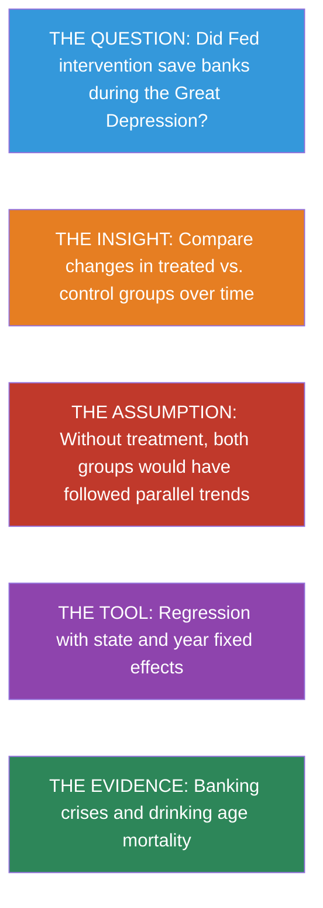


### Key Concepts and Definitions

**Difference-in-Differences (DD):** A causal inference method that compares the change in outcomes over time for a treated group to the change for an untreated control group. By differencing twice --- across groups and across time --- DD removes both fixed group differences and common time trends.

> 💡 **Example**
>
> Comparing the change in bank survival in the 6th Fed District (intervention) to the change in the 8th District (no intervention) during the Great Depression isolates the causal effect of Fed policy.

> 📝 **Analogy**
>
> Like a diet experiment where you and your friend both weigh yourselves before and after the holidays. You dieted; your friend did not. The difference in your weight changes (not your weight levels) reveals whether the diet worked.


**Parallel Trends Assumption:** The critical identifying assumption of DD: in the absence of treatment, the treated and control groups would have followed the same trajectory over time. Groups can start at different levels, but their changes must be similar.

> 💡 **Example**
>
> The assumption requires that, without the Fed's intervention, the 6th District would have lost banks at the same rate as the 8th District.

> 📝 **Analogy**
>
> Like two runners on parallel tracks. They can start at different positions, but without any intervention, they would run at the same pace. If one suddenly speeds up, the intervention (treatment) must have caused it.


**Counterfactual:** The unobserved outcome that would have occurred in the absence of treatment. In DD, the control group's trajectory is used to construct the counterfactual for the treated group.

> 💡 **Example**
>
> The dashed line in the Mississippi banking chart shows how many banks the 6th District would have had if it had followed the 8th District's decline --- that is the counterfactual.

> 📝 **Analogy**
>
> Like an alternate timeline in a movie. You cannot observe what would have happened if the hero had made a different choice, but you can estimate it using information from other characters who faced similar circumstances.


**Treatment Group vs. Control Group:** The treatment group receives the intervention; the control group does not. In DD, the control group provides the benchmark trajectory that estimates what would have happened to the treated group without the intervention.

> 💡 **Example**
>
> In the MLDA DD, states that lowered their drinking age are the treatment group; states that did not change their laws are the control group.

> 📝 **Analogy**
>
> Like a science fair project where one plant gets fertilizer (treatment) and another identical plant does not (control). The control plant shows what growth looks like without the fertilizer.


**Before-After Comparison:** A simple comparison of outcomes before and after a treatment within the same group. Alone, it is vulnerable to confounding by time trends; DD improves on it by subtracting the control group's change.

> 💡 **Example**
>
> Comparing bank counts in the 6th District in 1930 vs. 1933 shows a decline, but some decline was caused by the Depression, not the policy. The before-after comparison alone cannot separate the two.

> 📝 **Analogy**
>
> Like noticing you feel better after taking medicine during flu season. You might have recovered naturally --- the improvement could be the passage of time, not the pill. You need a comparison group to tell.


**Fixed Effects:** Variables included in a regression to absorb all time-invariant differences between groups (group fixed effects) or all group-invariant differences across time periods (time fixed effects).

> 💡 **Example**
>
> State fixed effects remove permanent differences between states (culture, geography). Year fixed effects remove nationwide trends (improvements in vehicle safety).

> 📝 **Analogy**
>
> Like adjusting for the home-court advantage in sports. Some teams always play better at home (group fixed effect); some seasons are more competitive overall (time fixed effect). Fixed effects remove these constant factors so you can see the effect of a specific coaching change.


**State-Specific Trends:** An extension of the DD model that allows each state (or group) to follow its own linear time trend, rather than assuming all groups share the same trend. This is a more demanding test of the DD estimate.

> 💡 **Example**
>
> Some states may have had declining death rates even before changing their drinking age. State-specific trends allow each state its own baseline trajectory, so the DD estimate captures deviations from that trajectory.

> 📝 **Analogy**
>
> Like allowing each student in a class to have their own grade trend (some improving, some declining) before a new teaching method is introduced. The method's effect is the change in trajectory, not just the change in level.


**Clustered Standard Errors:** Standard errors that account for correlation among observations within the same cluster (e.g., state, school, firm) over time. Without clustering, standard errors are too small and significance tests are unreliable.

> 💡 **Example**
>
> Death rates within the same state are correlated over time (a state with high rates one year tends to have high rates the next). Clustering by state corrects for this serial correlation.

> 📝 **Analogy**
>
> Like recognizing that poll responses from members of the same family are not truly independent. If you count each family member as a separate opinion, you overstate how much information you have.


**Serial Correlation:** The tendency for a variable measured over time within the same unit (person, state, firm) to be correlated with its own past values. Positive serial correlation means high values tend to be followed by high values.

> 💡 **Example**
>
> A state with a high death rate in 1975 likely has a high rate in 1976 too, because the underlying factors (demographics, road conditions) change slowly.

> 📝 **Analogy**
>
> Like the weather. Today's temperature is a good predictor of tomorrow's --- hot days tend to follow hot days. Ignoring this correlation would make you overconfident in your forecasts.


**Average Treatment Effect on the Treated (ATT):** The average causal effect of treatment specifically for the group that actually received treatment. DD typically estimates the ATT, not the ATE for the whole population.

> 💡 **Example**
>
> The DD estimate of the MLDA's effect on mortality applies to the states that actually changed their drinking laws, not to all states in the country.

> 📝 **Analogy**
>
> Like measuring how much a new exercise routine helped the people who actually did it, rather than averaging across everyone including those who never exercised.


**Staggered Adoption:** A setting where different units (states, firms) adopt a policy at different times, creating multiple treatment-control comparisons. This is the typical setting for DD in practice.

> 💡 **Example**
>
> Different U.S. states lowered their drinking age to 18 at different points between 1970 and 1975, then raised it back to 21 at different points in the 1980s.

> 📝 **Analogy**
>
> Like a chain of restaurants rolling out a new menu one location at a time over several months. Each new location becomes "treated" while the others serve as controls --- for now.


**Panel Data:** A dataset that tracks the same units (individuals, states, firms) across multiple time periods. Panel data is the natural structure for DD because it allows researchers to observe changes within units over time.

> 💡 **Example**
>
> A dataset with death rates for each of 51 states in each year from 1970 to 1983 (51 states x 14 years = 714 observations).

> 📝 **Analogy**
>
> Like a class roster where the teacher records each student's grade on every test throughout the year. Following the same students over time reveals individual trajectories, not just snapshots.


**Policy Variation:** Differences in policy across groups (states, countries) or over time that create the variation researchers exploit for causal identification. Without policy variation, there is nothing to compare.

> 💡 **Example**
>
> The fact that some states set the drinking age at 18 while others kept it at 21 creates policy variation that DD exploits.

> 📝 **Analogy**
>
> Like a patchwork quilt where each square is a different color. The variation in colors (policies) across squares (states) is what lets you study the effect of a particular color on warmth.


### A Mississippi Experiment

#### The Great Depression and the Fed

In 1930, the collapse of Caldwell and Company, a Nashville banking giant, triggered a cascade of bank failures across the American South. Within weeks, dozens of banks closed. The question for policymakers: **could aggressive central bank intervention have prevented the collapse?**

A natural experiment emerged from the structure of the Federal Reserve System. The border between two Fed districts runs through Mississippi, splitting the state between:

- **6th District (Atlanta Fed)**: favored easy credit and liquidity support for struggling banks
- **8th District (St. Louis Fed)**: followed a restrictive "Real Bills" doctrine, tightening credit during the crisis

Banks on either side of this border faced the same economic conditions but received very different policy responses.

```python
## Load clean bank failure data (July 1 each year, both districts)
import pandas as pd
import numpy as np
import matplotlib.pyplot as plt
import seaborn as sns
import pyfixest as pf
sns.set_style("whitegrid")

## --- Data source ---
DATA = "https://raw.githubusercontent.com/cmg777/intro2causal/main/data/"

## bib6 = banks in business (6th district), bib8 = banks in business (8th district)
## counterfactual = what 6th district would look like under parallel trends
banks = pd.read_csv(DATA + "ch5/banks_clean.csv")
banks
```

#### Visualizing the DD

```python
fig, ax = plt.subplots(figsize=(9, 5))

## Plot actual data for both districts
ax.plot(banks["year"], banks["bib8"], "ko-", markersize=8, label="8th District (no intervention)")
ax.plot(banks["year"], banks["bib6"], "ks-", markersize=8, label="6th District (Fed intervention)")
ax.plot(banks["year"], banks["counterfactual"], "k^--", markersize=8, alpha=0.6,
        label="6th District counterfactual")

ax.set_xlabel("Year")
ax.set_ylabel("Number of Banks in Business")
ax.set_title("Fed intervention and bank survival during the Great Depression")
ax.legend()
ax.set_ylim(60, 180)
plt.tight_layout()
plt.show()
```

The divergence is striking. Both districts started with roughly similar numbers of banks in 1930. After the crisis hit, the 8th District (no intervention) lost banks rapidly, while the 6th District (Fed intervention) held up much better. The dashed counterfactual line shows where the 6th District would have ended up if it had followed the same trajectory as the 8th --- the gap between the actual and counterfactual lines is the DD estimate of how many banks the Fed saved.

#### Computing the DD

Let's quantify this visual impression. The DD calculation compares **changes** across groups, which removes any fixed differences between the districts:

```python
## Compute DD for each post-crisis year
## Get the 1930 baseline values for each district
pre_6 = banks.loc[banks["year"] == 1930, "bib6"].values[0]
pre_8 = banks.loc[banks["year"] == 1930, "bib8"].values[0]

## Loop over each year after 1930
rows = []
post_years = banks[banks["year"] > 1930]
for _, row in post_years.iterrows():
    # Change in each district relative to 1930
    change_6 = row["bib6"] - pre_6
    change_8 = row["bib8"] - pre_8
    # DD = treated change minus control change
    dd = change_6 - change_8

    rows.append({
        "Year": int(row["year"]),
        "Change in 6th (treated)": int(change_6),
        "Change in 8th (control)": int(change_8),
        "DD estimate (banks saved)": int(dd),
    })

pd.DataFrame(rows)
```

> ⭐ **Key finding**
>
>
> The Atlanta Fed's easy money policy saved approximately **19--23 banks** relative to the restrictive St. Louis Fed approach. The DD works by subtracting the control group's change from the treated group's change, removing any common trends.


> 📝 **Intuition Builder: The Diet Analogy**
>
>
> Suppose you and a friend both plan to eat well over the holidays. You go on a new diet; your friend doesn't. After the holidays, you gained 2 lbs and your friend gained 7 lbs. Did the diet work?
>
> - **Naive comparison**: You weigh more than before (gained 2 lbs) --- diet "failed"?
> - **DD comparison**: You gained 2, your friend gained 7. The diet saved you 5 lbs (7 − 2 = 5).
>
> The key assumption: without the diet, you would have gained the same 7 lbs as your friend (parallel trends). DD uses the control group to estimate this counterfactual.


### The DD Framework

#### The Core Logic

DD compares changes over time in a treatment group with changes in a control group:

$$\delta_{DD} = \underbrace{(\bar{Y}_{treat,after} - \bar{Y}_{treat,before})}_{\text{Change in treated}} - \underbrace{(\bar{Y}_{control,after} - \bar{Y}_{control,before})}_{\text{Change in control}}$$

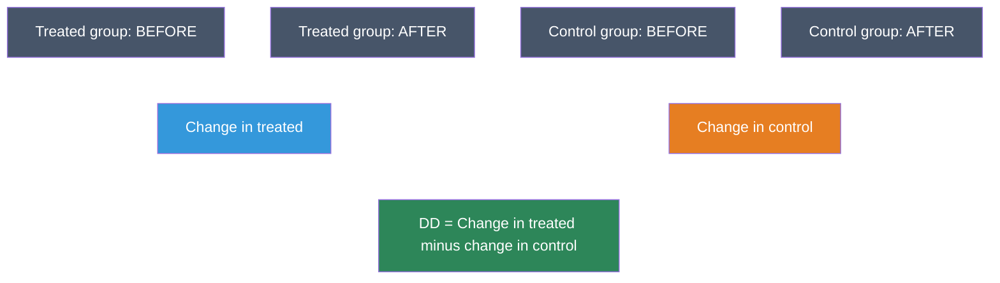

#### The Parallel Trends Assumption

> ⚠️ **The key assumption**
>
>
> DD requires that, **absent treatment**, the treated and control groups would have followed **parallel trends**. The treatment and control groups can start at different levels --- but their *changes over time* must be similar.
>
> If this assumption fails (e.g., the treated group was already on a different trajectory), the DD estimate will be biased.


> ⚠️ **Common Misconception: DD does NOT require equal levels**
>
>
> Students often think DD requires the treatment and control groups to have the same *level* of the outcome. This is wrong. The 6th District had 135 banks and the 8th had 165 --- very different levels. What matters is that they would have *changed at the same rate* without the intervention. Groups can start miles apart; DD only needs them to travel in the same direction at the same speed.


### Case Study: MLDA and Death Rates

#### The Policy Variation

After Prohibition ended in 1933, states set their own drinking ages. In 1984, federal legislation pushed all states to adopt a minimum legal drinking age of 21, but states complied at different times. This staggered adoption creates variation for a DD analysis.

```python
## Load clean MLDA death rate data (state-year panel, 18-20 year olds, 1970-1983)
## mrate = death rate per 100,000; legal = fraction of 18-20 yr olds who can legally drink
## dtype = cause of death (all, MVA, suicide, internal); pop = state population of 18-20 yr olds
deaths = pd.read_csv(DATA + "ch5/deaths_clean.csv")
deaths.head(3)
```

#### The Regression DD Model

With many states and years, DD is implemented as a regression with **fixed effects**:

$$Y_{st} = \alpha + \delta \, D_{st} + \sum_s \beta_s \, \text{STATE}_s + \sum_t \gamma_t \, \text{YEAR}_t + e_{st}$$

where $Y_{st}$ is the death rate (`mrate`) in state $s$ at time $t$, and $D_{st}$ is the fraction of 18--20 year olds who can legally drink (`legal`).

- **State fixed effects** ($\beta_s$) absorb permanent differences between states (culture, geography, road conditions)
- **Year fixed effects** ($\gamma_t$) absorb nationwide trends (vehicle safety improvements, national campaigns)
- **$\delta$** is the DD estimate: the causal effect of legal drinking access on the death rate

> 📝 **Why cluster standard errors by state?**
>
>
> The treatment variable (`legal`) changes at the state level, and death rates within a state are correlated over time. **Clustering** standard errors at the state level accounts for this serial correlation, preventing us from overstating precision.


Let's start with a single regression for all-cause mortality:

```python
## Filter to all-cause deaths
allcause = deaths[deaths["dtype"] == "all"]

## DD regression with state and year fixed effects
result = pf.feols("mrate ~ legal | state + year", data=allcause, vcov={"CRV1": "state"})

## Show just the key coefficient
coef_table = pd.DataFrame({
    "Variable": ["legal"],
    "Coefficient": [round(result.coef()["legal"], 2)],
    "Std. Error": [round(result.se()["legal"], 2)],
    "t-stat": [round(result.tstat()["legal"], 2)],
})
coef_table
```

The `legal` coefficient tells us that a one-unit increase in the fraction of 18--20 year olds who can legally drink is associated with approximately **8--12 additional deaths per 100,000**. The t-statistic exceeds 2, confirming statistical significance. But does this finding hold up across different causes of death and model specifications? Let's check:

```python
## Compare three specifications for each cause of death:
##   Spec 1 — Unweighted OLS with state + year fixed effects
##   Spec 2 — Add state-specific linear trends (each state gets its own slope over time)
##   Spec 3 — Population-weighted WLS (larger states count more)

dtype_labels = {"all": "All causes", "MVA": "Motor vehicle", "suicide": "Suicide", "internal": "Internal"}

rows = []
for dtype_val, label in dtype_labels.items():
    s = deaths[deaths["dtype"] == dtype_val].copy()
    s["year_num"] = s["year"] - s["year"].min()  # center year for numerical stability

    # Spec 1: State + Year FE, unweighted
    r1 = pf.feols("mrate ~ legal | state + year", data=s, vcov={"CRV1": "state"})

    # Spec 2: Add state-specific linear trends
    # i(state, year_num) = interaction of state dummies with year, giving each state its own slope
    r2 = pf.feols("mrate ~ legal + i(state, year_num) | state + year", data=s, vcov={"CRV1": "state"})

    # Spec 3: Population-weighted (WLS)
    # Weight by state population so larger states count more (more reliable death rates)
    r3 = pf.feols("mrate ~ legal | state + year", data=s, weights="pop", vcov={"CRV1": "state"})

    # Format each result as "coefficient (standard error)"
    coef1 = format(round(r1.coef()["legal"], 2), ".2f") + " (" + format(round(r1.se()["legal"], 2), ".2f") + ")"
    coef2 = format(round(r2.coef()["legal"], 2), ".2f") + " (" + format(round(r2.se()["legal"], 2), ".2f") + ")"
    coef3 = format(round(r3.coef()["legal"], 2), ".2f") + " (" + format(round(r3.se()["legal"], 2), ".2f") + ")"

    rows.append({
        "Cause": label,
        "Unweighted": coef1,
        "With state trends": coef2,
        "Pop. weighted": coef3,
    })

pd.DataFrame(rows)
```

> ⭐ **Interpreting the DD results**
>
>
> - **Legal drinking access increases the death rate** by approximately **8--12 per 100,000** among 18--20 year olds
> - **Motor vehicle accidents** account for most of the effect (~7--8 deaths)
> - **Internal causes** (disease) show no significant effect --- a **placebo test** confirming the design
> - Results are **robust** to adding state-specific trends and population weighting


### Robustness Checks

The baseline results are encouraging, but how confident can we be? A careful researcher should probe whether the findings hold up under alternative specifications.

#### State-Specific Trends

Adding state-specific linear time trends is a more demanding test. It allows each state to have its own background trajectory and asks whether the MLDA effect is a **deviation from this trend** rather than a continuation of pre-existing patterns. The results hold up.

#### Beer Tax Control

Another potential confounder is beer taxes, which some states changed around the same time as their drinking age laws. If beer taxes independently affect mortality, omitting them could bias the DD estimate. Controlling for beer taxes tests whether the MLDA effect is confounded by these concurrent policy changes:

```python
## Check if MLDA effects hold after controlling for beer taxes
rows = []
for dtype_val, label in [("all", "All causes"), ("MVA", "Motor vehicle")]:
    s = deaths[deaths["dtype"] == dtype_val].dropna(subset=["beertax"]).copy()

    r = pf.feols("mrate ~ legal + beertax | state + year", data=s, vcov={"CRV1": "state"})

    # Format results as "coefficient (standard error)"
    legal_str = format(round(r.coef()["legal"], 2), ".2f") + " (" + format(round(r.se()["legal"], 2), ".2f") + ")"
    tax_str = format(round(r.coef()["beertax"], 2), ".2f") + " (" + format(round(r.se()["beertax"], 2), ".2f") + ")"

    rows.append({
        "Cause": label,
        "Legal effect": legal_str,
        "Beer tax effect": tax_str,
    })

pd.DataFrame(rows)
```

The MLDA coefficients are largely unchanged after controlling for beer taxes, reinforcing the causal interpretation.


### How DD Compares to Other Methods

We now have four causal inference tools in our toolkit. How do they relate to each other?

| Feature | RCT (Ch 1) | IV (Ch 3) | RD (Ch 4) | **DD (This Chapter)** |
|:---|:---|:---|:---|:---|
| **Key requirement** | Random assignment | Valid instrument | Sharp cutoff | Parallel trends |
| **Handles unobservables?** | Yes (by randomization) | Yes (via instrument) | Yes (at the cutoff) | Only time-invariant ones |
| **Estimates** | ATE | LATE (compliers) | Local effect (at cutoff) | ATT (treated group) |
| **Data structure** | Cross-section | Cross-section or panel | Running variable | Panel (group × time) |

: Comparing the four causal inference methods covered so far
> 📝 **Connection to Chapters 1 and 4**
>
>
> DD complements the other methods:
>
> - **vs. RCTs (Chapter 1)**: DD works when randomization is impossible but policy varies across groups and time. It sacrifices the randomization guarantee for broader applicability.
> - **vs. RD (Chapter 4)**: Both exploit policy rules, but RD uses a cutoff in a running variable while DD uses changes over time. The MLDA question appears in *both* chapters: Chapter 4 uses the age-21 cutoff (RD); this chapter uses state-level policy changes over time (DD). Same question, different identification strategies.


### Historical Perspective: John Snow

The logic of DD has a surprisingly long history.

Long before modern econometrics, **John Snow** (1813--1858) used DD reasoning to solve one of the great public health mysteries: the cause of cholera.

In 1854 London, Snow noticed that cholera deaths were concentrated in neighborhoods served by the **Southwark and Vauxhall** water company, which drew from a contaminated stretch of the Thames. A competing company, **Lambeth**, had moved its intake upstream to cleaner water in 1852.

Snow compared the *change* in cholera death rates before and after Lambeth's move, relative to Southwark and Vauxhall's unchanged source. The dramatic decline in Lambeth-served neighborhoods --- with no corresponding decline in Southwark areas --- provided compelling evidence that contaminated water caused cholera, overturning the prevailing "miasma" (bad air) theory.

This was a DD analysis avant la lettre: two groups (water companies), a treatment that changed for one but not the other, and a comparison of changes in outcomes.


### Key Takeaways

The following concept map shows how the key ideas in this chapter connect --- from policy variation across groups and time, through the DD method and its parallel trends assumption, to regression implementation with fixed effects and robustness checks.

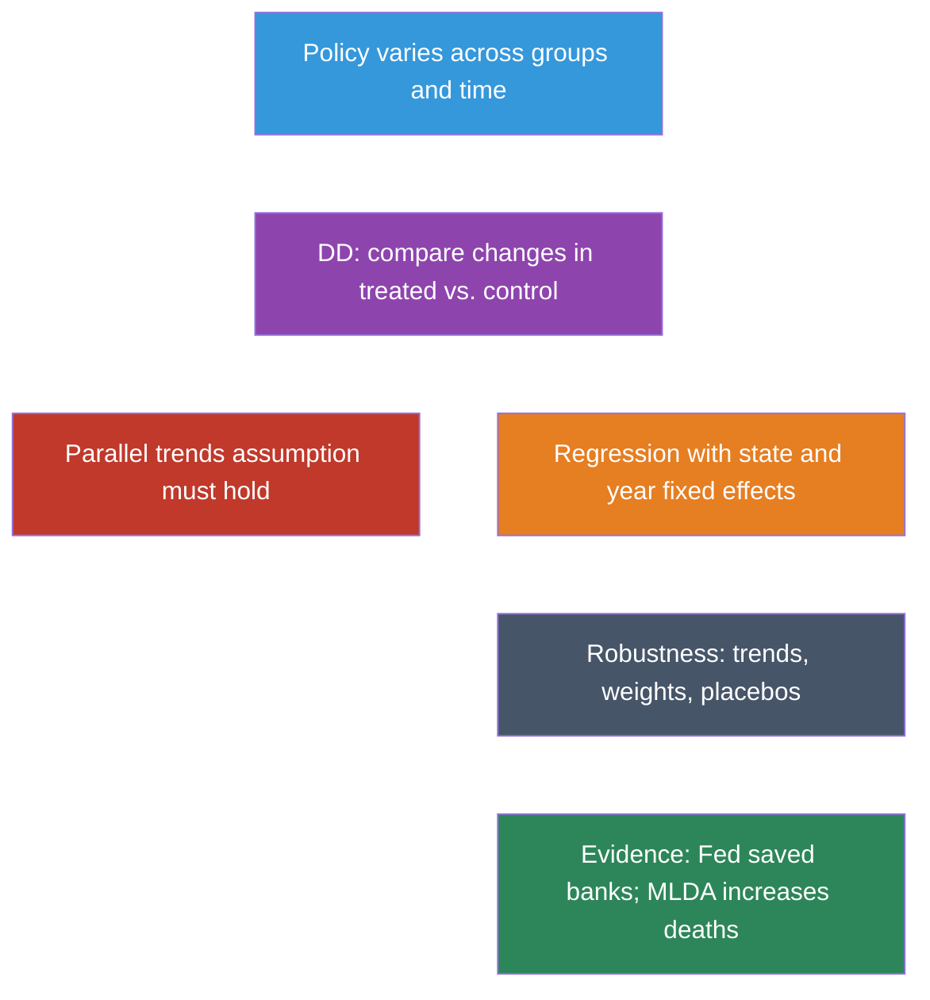

1. **DD compares changes over time** between treatment and control groups, removing time-invariant confounders.

2. **The parallel trends assumption** is key: absent treatment, both groups must have been on the same trajectory.

3. **Regression DD with fixed effects** is the standard implementation for multi-group, multi-period settings.

4. **State fixed effects** remove permanent state differences; **year fixed effects** remove common time trends.

5. **Cluster standard errors** at the level of treatment assignment (e.g., state) to account for serial correlation.

6. **Robustness checks** include state-specific trends, population weighting, and placebo tests on unaffected outcomes.


### Learn by Coding

Copy this code into a Python notebook to reproduce the key results from this chapter.

```python
## ============================================================
## Chapter 5: Differences-in-Differences — Code Cheatsheet
## ============================================================
import pandas as pd
import pyfixest as pf

DATA = "https://raw.githubusercontent.com/cmg777/intro2causal/main/data/"

## --- Step 1: Manual DD with the Great Depression banking data ---
banks = pd.read_csv(DATA + "ch5/banks_clean.csv")
print("Banks in business by district and year:")
print(banks)

pre_6 = banks.loc[banks["year"] == 1930, "bib6"].values[0]
pre_8 = banks.loc[banks["year"] == 1930, "bib8"].values[0]
post_6 = banks.loc[banks["year"] == 1931, "bib6"].values[0]
post_8 = banks.loc[banks["year"] == 1931, "bib8"].values[0]
dd = (post_6 - pre_6) - (post_8 - pre_8)
print(f"\nDD estimate (1931 vs 1930): {dd} banks saved by Atlanta Fed intervention")

## --- Step 2: Load MLDA death rate panel data ---
deaths = pd.read_csv(DATA + "ch5/deaths_clean.csv")
allcause = deaths[deaths["dtype"] == "all"]
print(f"\nDeath rate panel: {allcause.shape[0]} state-year observations")

## --- Step 3: Regression DD with state and year fixed effects ---
result = pf.feols("mrate ~ legal | state + year", data=allcause, vcov={"CRV1": "state"})
print(f"\nDD estimate (all-cause deaths): {round(result.coef()['legal'], 2)}")
print(f"  Standard error: {round(result.se()['legal'], 2)}")

## --- Step 4: Population-weighted DD ---
result = pf.feols("mrate ~ legal | state + year", data=allcause, weights="pop", vcov={"CRV1": "state"})
print(f"\nWeighted DD estimate: {round(result.coef()['legal'], 2)}")

## --- Step 5: Placebo test (suicide should NOT respond to drinking age) ---
suicide = deaths[deaths["dtype"] == "suicide"]
result = pf.feols("mrate ~ legal | state + year", data=suicide, vcov={"CRV1": "state"})
print(f"\nPlacebo (suicide): {round(result.coef()['legal'], 2)}")
print("  (Expect: small and insignificant)")
```

> 💡 **Try it yourself!**
>
> Copy the code above and paste it into [this Google Colab scratchpad](https://colab.research.google.com/notebooks/empty.ipynb) to run it interactively. Modify the variables, change the specifications, and see how results change!


Below is the same cheatsheet in Stata syntax.

```stata
* ============================================================
* Chapter 5: Differences-in-Differences — Stata Cheatsheet
* ============================================================
clear all
set more off

* --- Step 1: Manual DD with the Great Depression banking data ---
import delimited using "https://raw.githubusercontent.com/cmg777/intro2causal/main/data/ch5/banks_clean.csv", clear
list
scalar pre_6  = bib6[2]   // District 6 in 1930
scalar pre_8  = bib8[2]   // District 8 in 1930
scalar post_6 = bib6[3]   // District 6 in 1931
scalar post_8 = bib8[3]   // District 8 in 1931
scalar dd = (post_6 - pre_6) - (post_8 - pre_8)
display "DD estimate (1931 vs 1930): " dd " banks saved by Atlanta Fed"

* --- Step 2: Load MLDA death rate panel data ---
import delimited using "https://raw.githubusercontent.com/cmg777/intro2causal/main/data/ch5/deaths_clean.csv", clear
keep if dtype == "all"

* --- Step 3: Regression DD with state and year fixed effects ---
reg mrate legal i.state i.year, cluster(state)

* --- Step 4: Population-weighted DD ---
reg mrate legal i.state i.year [aw=pop], cluster(state)

* --- Step 5: Placebo test (suicide should NOT respond to drinking age) ---
import delimited using "https://raw.githubusercontent.com/cmg777/intro2causal/main/data/ch5/deaths_clean.csv", clear
keep if dtype == "suicide"
reg mrate legal i.state i.year, cluster(state)
* Expect: small and insignificant coefficient on legal
```

> 💡 **Try it in Stata!**
>
> Copy the code above into a `.do` file and run it in Stata 14 or later (which supports loading data from URLs). If your Stata cannot access the internet, download the CSV files from the `data/` folder on [GitHub](https://github.com/cmg777/intro2causal/tree/main/data) and replace each URL with a local file path.


### Exercises

#### Multiple Choice Questions

1. **The key identifying assumption of differences-in-differences is:**
   a) Treatment and control groups have the same level of the outcome variable
   b) Treatment is randomly assigned
   c) Absent treatment, both groups would have followed parallel trends over time
   d) The treatment effect is constant across all individuals

> 📝 **Show answer**
>
> **(c)** The parallel trends assumption states that, without the treatment, the treated and control groups would have changed at the same rate. **(a) is wrong** because DD allows the groups to start at different levels — that is precisely why we take differences. **(b) is wrong** because random assignment describes RCTs, not DD; DD exploits policy changes in observational data. **(d) is wrong** because DD does not require the same treatment effect for everyone. The key requirement is parallel *trends*, not equal levels, randomization, or homogeneous effects.


2. **Why does DD subtract the control group's change from the treated group's change?**
   a) To increase the sample size
   b) To remove common time trends that affect both groups equally
   c) To correct for measurement error
   d) To make the treatment and control groups the same size

> 📝 **Show answer**
>
> **(b)** Both groups may be affected by common shocks (e.g., a national recession, improving vehicle safety). By subtracting the control group's change, DD removes these common trends, isolating the treatment effect. **(a) is wrong** because a single before-after comparison for the treated group cannot distinguish the treatment effect from time trends that affect everyone. **(c) is wrong** because comparing treated and control groups at one point in time conflates the treatment effect with pre-existing level differences. **(d) is wrong** because DD does not require equal group sizes — it relies on the parallel trends assumption instead.


3. **In the Great Depression banking study, what was the "treatment"?**
   a) The collapse of Caldwell and Company
   b) The Atlanta Fed's easy-credit intervention for struggling banks
   c) The creation of the Federal Reserve System
   d) The end of the gold standard

> 📝 **Show answer**
>
> **(b)** The treatment was the Atlanta Fed's (6th District) policy of providing easy credit and liquidity support to struggling banks, in contrast to the St. Louis Fed's (8th District) restrictive approach. **(a) is wrong** because the Caldwell collapse was the triggering event (common shock), not the treatment — it affected both districts. **(c) is wrong** because the Federal Reserve System was created in 1913, long before the study period. **(d) is wrong** because the end of the gold standard is a macroeconomic event unrelated to the district-level policy comparison.


4. **State fixed effects in a DD regression control for:**
   a) Changes in state policies over time
   b) Permanent differences between states that do not change over time
   c) The interaction between state and year
   d) Differences between treatment and control states after treatment

> 📝 **Show answer**
>
> **(b)** State fixed effects absorb all characteristics of a state that are constant over time — geography, culture, climate, institutional history, etc. They allow us to compare changes *within* each state over time, rather than comparing levels across states. **(a) is wrong** because it describes state-specific time trends (which allow each state its own slope over time), a more demanding specification than simple fixed effects. **(c) is wrong** because it describes an interaction term between treatment and time, which is the DD coefficient itself, not a fixed effect. **(d) is wrong** because fixed effects do not eliminate measurement error in the dependent variable — they only remove time-invariant confounders.


5. **If the parallel trends assumption is violated, the DD estimate will be:**
   a) Exactly zero
   b) Unbiased but imprecise
   c) Biased — it will confound the treatment effect with pre-existing differential trends
   d) Valid only for the treated group

> 📝 **Show answer**
>
> **(c)** If the treated group was already on a different trajectory before treatment, the DD estimate captures both the treatment effect and this pre-existing trend difference — a violation of the parallel trends assumption. **(a) is wrong** because heteroscedasticity affects standard errors but does not bias the DD point estimate. **(b) is wrong** because unequal group sizes reduce precision but do not inherently bias the estimate. **(d) is wrong** because a single pre-treatment observation is insufficient to detect diverging trends; multiple pre-treatment periods are needed to assess whether parallel trends hold.


6. **Year fixed effects in a DD regression control for:**
   a) Differences between states that are constant over time
   b) Shocks or trends that affect all states equally in a given year
   c) The treatment effect itself
   d) Measurement error in the outcome variable

> 📝 **Show answer**
>
> **(b)** Year fixed effects absorb common shocks — economy-wide recessions, nationwide policy changes, or secular trends in mortality — that affect all states in the same year. Without year fixed effects, these common trends could be mistaken for treatment effects. **(a) is wrong** because that describes state fixed effects, not year fixed effects. **(c) is wrong** because the treatment effect is captured by the interaction of treatment group and post-treatment period, not by year fixed effects. **(d) is wrong** because fixed effects do not correct measurement error.


7. **Clustering standard errors at the state level in a DD regression is important because:**
   a) It increases the statistical significance of the estimates
   b) Outcomes within the same state are correlated across years, and ignoring this understates standard errors
   c) It makes the regression coefficients unbiased
   d) It is required whenever the sample size is large

> 📝 **Show answer**
>
> **(b)** Within a state, outcomes are correlated over time (serial correlation). If we ignore this and treat each state-year as independent, we understate the true uncertainty and get artificially small standard errors, leading to false rejections of the null. Clustering at the state level corrects for this. **(a) is wrong** because clustering typically makes results *less* significant by increasing standard errors. **(c) is wrong** because clustering affects standard errors and inference, not the point estimates. **(d) is wrong** because clustering is motivated by the data structure (repeated observations within units), not by sample size.


8. **Adding state-specific linear time trends to a DD regression:**
   a) Is always necessary for a valid DD estimate
   b) Allows each state to have its own pre-treatment trajectory, testing whether DD results survive this stricter control
   c) Eliminates the need for the parallel trends assumption
   d) Has no effect on the treatment coefficient

> 📝 **Show answer**
>
> **(b)** State-specific trends allow each state its own linear slope over time. If the DD estimate is robust to adding these trends, it suggests the result is not driven by pre-existing divergent trajectories. If the estimate changes substantially, the parallel trends assumption may be suspect. **(a) is wrong** because state trends are a robustness check, not a requirement — many valid DD studies do not include them. **(c) is wrong** because state trends partially address the concern but do not eliminate it; non-linear differential trends could still bias the estimate. **(d) is wrong** because adding state trends often changes the coefficient, sometimes substantially.


9. **In the MLDA DD analysis, the treatment effect is identified by comparing:**
   a) States that changed their legal drinking age to states that did not, before and after the change
   b) Young people to old people in the same state
   c) States with high drinking rates to states with low drinking rates
   d) Male mortality to female mortality in the same year

> 📝 **Show answer**
>
> **(a)** The MLDA DD compares changes in mortality in states that lowered their legal drinking age to 18 versus states that kept it at 21, before and after the policy change. The within-state change removes permanent state differences, and the cross-state comparison removes common time trends. **(b) is wrong** because DD compares treatment and control states, not age groups within a state (that would be more like an RD approach). **(c) is wrong** because DD does not compare states by drinking levels but by whether they changed their policy. **(d) is wrong** because comparing across genders is not the DD variation — it could serve as a placebo test, but is not the main identification strategy.


10. **A placebo test in DD involves:**
    a) Administering a placebo treatment to the control group
    b) Testing whether the DD estimate is significant for outcomes that should NOT be affected by the treatment
    c) Randomly reassigning the treatment variable
    d) Running the regression without fixed effects

> 📝 **Show answer**
>
> **(b)** A placebo test checks whether the DD estimate produces a significant effect on an outcome the treatment should not affect. For example, if a pollution regulation appears to reduce asthma but also "reduces" broken bones, the design is suspect. A clean placebo test (no effect on the irrelevant outcome) strengthens the causal interpretation. **(a) is wrong** because DD is observational — there is no literal placebo administered. **(c) is wrong** because randomly reassigning treatment is a permutation test, not a placebo test. **(d) is wrong** because omitting fixed effects changes the specification but is not a placebo test — it would introduce bias rather than test validity.


#### Conceptual Questions

1. **Parallel trends**: A city implements a minimum wage increase in 2020. You plan to compare employment changes in that city with a neighboring city that didn't raise the minimum wage. What would it mean if the two cities already had diverging employment trends before 2020? How would this affect your DD estimate?

> 📝 **Show answer**
>
>
> **Diverging pre-treatment trends violate the parallel trends assumption and contaminate the DD estimate with a pre-existing trend difference.**
>
> 1. The parallel trends assumption requires that, absent the minimum wage increase, both cities would have followed the same employment trajectory. If the treatment city was already losing jobs faster, this assumption fails.
> 2. The DD estimate equals (treatment effect) + (pre-existing trend gap). If employment in the treatment city was already declining by 2 percentage points more per period, the DD would overstate the negative effect of the minimum wage by that amount.
> 3. To diagnose this problem, plot employment trends for both cities across multiple pre-treatment periods. If the lines are roughly parallel before the policy change, the assumption is more credible. If they diverge, the DD estimate is unreliable.
> 4. A possible fix is to add city-specific linear time trends to the regression, which absorbs pre-existing trend differences and isolates deviations from those trends.


2. **Computing DD**: Before a policy change, the treatment group's outcome average is 50 and the control group's is 40. After the change, they are 55 and 48. (a) Compute the DD estimate. (b) What assumption is needed for this to be causal?

> 📝 **Show answer**
>
>
> **The DD estimate is -3, meaning the treatment caused the outcome to be 3 units lower than it would have been without the policy.**
>
> 1. (a) Compute each group's before-after change: Treatment group changed by (55 - 50) = +5. Control group changed by (48 - 40) = +8. The DD estimate is the difference of these changes: 5 - 8 = -3. The treatment group's outcome fell by 3 units relative to the control group's trajectory.
> 2. (b) The parallel trends assumption is essential: absent the policy change, both groups would have experienced the same +8 change over time. Under this assumption, the treatment group's counterfactual outcome would have been 50 + 8 = 58. Since the observed outcome was 55, the treatment effect is 55 - 58 = -3, matching the DD calculation.
> 3. This example illustrates why a simple before-after comparison for the treated group (showing a +5 increase) would be misleading --- the DD reveals the policy actually *reduced* the outcome by 3 units relative to the counterfactual trend.


3. **Fixed effects**: Explain in your own words why we need *both* state and year fixed effects in the MLDA regression. What would happen if we omitted state effects? Year effects?

> 📝 **Show answer**
>
>
> **State and year fixed effects work together to isolate the within-state, within-year variation in MLDA policy --- the only variation that can credibly identify the causal effect.**
>
> 1. State fixed effects (`| state`) absorb all time-invariant differences between states --- geography, culture, road infrastructure, baseline drinking norms. Without them, we might attribute Montana's permanently higher death rate to its MLDA policy rather than to its rural roads and long driving distances.
> 2. Year fixed effects (`| year`) absorb all nationwide changes over time --- improvements in vehicle safety, national campaigns against drunk driving, economic conditions. Without them, a nationwide decline in mortality could be falsely attributed to states that happened to change their MLDA.
> 3. Together, they implement the DD logic in a regression framework: we ask whether a state's death rate changed differentially in years when its MLDA policy changed, compared to its own average and compared to the national trend. This is the within-state, within-year variation that identifies the causal effect of MLDA on mortality.


4. **State-specific trends**: Explain what adding `i(state, year_num)` (state-specific linear time trends) to the DD regression does. Under what circumstances might the DD estimate change substantially when you add state-specific trends, and what would that imply about the parallel trends assumption?

> 📝 **Show answer**
>
>
> **Adding state-specific trends is a more demanding test of the DD design: it asks whether MLDA changes caused deviations from each state's own trajectory, not just from the national average.**
>
> 1. The term `i(state, year_num)` gives each state its own linear time trend. Standard DD with year fixed effects only removes the *common* national trend, assuming all states would have followed the same path absent treatment. State-specific trends relax this by allowing each state to have its own baseline trajectory.
> 2. If the DD estimate changes substantially after adding state-specific trends, it suggests the standard parallel trends assumption is questionable --- some states were on different trajectories for reasons unrelated to MLDA (e.g., southern states experiencing rapid economic development, or western states with changing demographics).
> 3. If the estimate remains stable, it strengthens our confidence in the original DD design, because the result is robust to allowing for differential pre-existing trends across states. This is a useful robustness check, though not a definitive test of parallel trends.


5. **Placebo test design**: You are studying whether a new air pollution regulation reduced asthma hospitalizations. Propose a placebo outcome that should NOT be affected by the regulation. Why would finding a significant effect on your placebo outcome be concerning?

> 📝 **Show answer**
>
>
> **A placebo outcome should be theoretically unaffected by the treatment; a significant placebo result is a red flag that the DD design is flawed.**
>
> 1. Good placebo outcomes for an air pollution regulation include hospitalizations for broken bones, appendicitis, or dental procedures --- conditions with no biological link to air quality.
> 2. If the regulation appears to significantly reduce broken-bone hospitalizations, the DD is picking up something other than the treatment effect. This could mean a confounding event coincided with the regulation (e.g., a new hospital opened), or that the treated and control areas were on different trajectories for unrelated reasons (parallel trends violation).
> 3. A null placebo result does not *prove* the DD is valid, but it increases confidence by ruling out one class of threats. A significant placebo result is strong evidence against the design, because it demonstrates the DD methodology is attributing non-treatment-related changes to the policy.
> 4. This connects to the MLDA analysis in this chapter: the suicide death rate serves a similar placebo-like function, testing whether the DD picks up effects on outcomes less directly linked to legal drinking.


#### Research Tasks

1. **DD for suicide deaths**: Using `deaths_clean.csv`, run the DD regression for suicide deaths (`dtype == "suicide"`) with state and year fixed effects and state-clustered SEs. Is the effect of legal drinking significant for suicides? How does the coefficient compare to the all-cause result?

> 📝 **Show answer**
>
>
> ```python
> # --- Setup ---
> import pandas as pd
> import pyfixest as pf
>
> deaths = pd.read_csv(DATA + "ch5/deaths_clean.csv")
>
> # --- DD Regressions by Cause of Death ---
> rows = []
> for dtype_val, label in [("all", "All causes"), ("suicide", "Suicide")]:
> s = deaths[deaths["dtype"] == dtype_val].copy()  # filter to one cause of death
> r = pf.feols("mrate ~ legal | state + year", data=s, vcov={"CRV1": "state"})
> rows.append({
> "Cause": label,
> "Legal effect": round(r.coef()["legal"], 2),  # DD estimate of MLDA effect
> "SE": round(r.se()["legal"], 2),
> "t-stat": round(r.tstat()["legal"], 2),  # significance check
> })
>
> # --- Display Results ---
> pd.DataFrame(rows)
> ```
>
> Stata equivalent:
>
> ```stata
> * --- DD regression: suicide vs. all-cause deaths ---
> clear all
> set more off
> import delimited using "https://raw.githubusercontent.com/cmg777/intro2causal/main/data/ch5/deaths_clean.csv", clear
>
> * Encode string variables for fixed effects
> encode dtype, gen(dtype_num)
> encode state, gen(state_num)
>
> * DD for all-cause deaths
> preserve
> keep if dtype == "all"
> reg mrate legal i.state_num i.year, cluster(state_num)
> restore
>
> * DD for suicide deaths
> preserve
> keep if dtype == "suicide"
> reg mrate legal i.state_num i.year, cluster(state_num)
> restore
> ```
>
> (1) **What the numbers show:** The suicide effect is much smaller than the all-cause effect and is not statistically significant (t-stat well below 2), while the all-cause effect is substantial and significant.
>
> (2) **Why:** Alcohol access primarily increases mortality through motor vehicle accidents, where impaired driving has immediate lethal consequences. Suicide is a more complex outcome driven by mental health, social, and economic factors --- simply being able to buy alcohol legally is unlikely to be a dominant cause.
>
> (3) **What it teaches:** This comparison serves as an informal placebo-like check. If MLDA changes affected suicide rates as strongly as all-cause deaths, we might worry that the DD is picking up a general trend in youth mortality rather than the specific channel of alcohol-related accidents. The null result for suicide strengthens the causal interpretation of the all-cause finding.


2. **DD over time for banks**: Using `banks_clean.csv`, compute the DD estimate for each post-crisis year (1931, 1932, 1933, 1934) relative to the 1930 baseline. Does the effect grow or shrink over time? What does this trend suggest about the lasting impact of the Fed's intervention?

> 📝 **Show answer**
>
>
> ```python
> # --- Setup ---
> banks = pd.read_csv(DATA + "ch5/banks_clean.csv")
>
> # --- Year-by-Year DD Calculations ---
> pre = banks[banks["year"] == 1930].iloc[0]  # baseline (pre-crisis) year
> rows = []
> for _, row in banks[banks["year"] > 1930].iterrows():
> change_6 = row["bib6"] - pre["bib6"]   # change in treated (6th district, Atlanta Fed)
> change_8 = row["bib8"] - pre["bib8"]   # change in control (8th district, St. Louis Fed)
> dd = change_6 - change_8               # DD = treated change minus control change
>
> rows.append({
> "Year": int(row["year"]),
> "Change in 6th (treated)": int(change_6),
> "Change in 8th (control)": int(change_8),
> "DD (banks saved)": int(dd),  # positive DD means more banks survived in 6th
> })
>
> # --- Display Results ---
> pd.DataFrame(rows)
> ```
>
> Stata equivalent:
>
> ```stata
> * --- Year-by-year DD for banks ---
> clear all
> set more off
> import delimited using "https://raw.githubusercontent.com/cmg777/intro2causal/main/data/ch5/banks_clean.csv", clear
>
> * Compute DD for each post-crisis year relative to 1930
> sum bib6 if year == 1930
> scalar pre6 = r(mean)
> sum bib8 if year == 1930
> scalar pre8 = r(mean)
>
> forvalues y = 1931/1934 {
> sum bib6 if year == `y'
> scalar change6 = r(mean) - pre6
> sum bib8 if year == `y'
> scalar change8 = r(mean) - pre8
> scalar dd = change6 - change8
> display "Year `y': DD = " dd
> }
> ```
>
> (1) **What the numbers show:** The DD effect grows from 19 banks in 1931 to 23 in 1932, then remains in the 21--23 range in 1933--1934. Both districts lost banks, but the 8th District (restrictive policy) consistently lost more.
>
> (2) **Why:** The Atlanta Fed's liquidity support prevented bank runs from cascading --- once a bank survived the initial panic with Fed support, it remained solvent through the Depression. The St. Louis Fed's restrictive approach allowed solvent but illiquid banks to fail, and those failures could not be reversed later.
>
> (3) **What it teaches:** This year-by-year DD reveals the *dynamics* of the treatment effect, something a single DD estimate would miss. The growing then stabilizing gap shows that the intervention had both an immediate rescue effect (1931) and a durable protective effect (1932--1934). This pattern supports a causal interpretation: the Fed's policy permanently changed the trajectory of bank survival in its district.


3. **Population-weighted DD**: Using `deaths_clean.csv`, run the all-cause DD regression with population weights (`pf.feols` with `weights="pop"`). Compare the coefficient with the unweighted result. Why might weighting by population change the estimate?

> 📝 **Show answer**
>
>
> ```python
> # --- Setup ---
> import pandas as pd
> import pyfixest as pf
>
> deaths = pd.read_csv(DATA + "ch5/deaths_clean.csv")
> allcause = deaths[deaths["dtype"] == "all"]  # keep only all-cause deaths
>
> # --- Unweighted OLS ---
> r_uw = pf.feols("mrate ~ legal | state + year", data=allcause, vcov={"CRV1": "state"})
>
> # --- Population-Weighted WLS ---
> r_wt = pf.feols("mrate ~ legal | state + year", data=allcause, weights="pop", vcov={"CRV1": "state"})
>
> # --- Display Comparison ---
> pd.DataFrame({
> "Specification": ["Unweighted OLS", "Population-weighted WLS"],
> "Legal effect": [round(r_uw.coef()["legal"], 2), round(r_wt.coef()["legal"], 2)],
> "SE": [round(r_uw.se()["legal"], 2), round(r_wt.se()["legal"], 2)],
> })
> ```
>
> Stata equivalent:
>
> ```stata
> * --- Unweighted vs. population-weighted DD ---
> clear all
> set more off
> import delimited using "https://raw.githubusercontent.com/cmg777/intro2causal/main/data/ch5/deaths_clean.csv", clear
>
> encode state, gen(state_num)
> keep if dtype == "all"
>
> * Unweighted OLS
> reg mrate legal i.state_num i.year, cluster(state_num)
>
> * Population-weighted WLS
> reg mrate legal i.state_num i.year [aw=pop], cluster(state_num)
> ```
>
> (1) **What the numbers show:** The two specifications may produce somewhat different point estimates and standard errors, reflecting how weighting shifts influence across states.
>
> (2) **Why:** Population weighting gives more influence to large states (California, Texas, New York) where death rates are measured more precisely due to larger samples. Unweighted OLS treats each state-year equally, giving small states (Wyoming, Vermont) the same weight as large ones. If MLDA effects vary by state size --- for example, if urban states have different drinking cultures --- the two estimates will diverge.
>
> (3) **What it teaches:** Comparing weighted and unweighted estimates is a robustness check. Similar estimates suggest the MLDA effect is consistent across states of different sizes. Divergent estimates reveal heterogeneity and raise the question of which estimate is more policy-relevant: the unweighted estimate answers "what is the average effect across states?" while the weighted estimate answers "what is the effect for the average person?"


4. **Cross-cause DD comparison**: Using `deaths_clean.csv`, run the DD regression (with state and year fixed effects, clustered SEs) separately for each available cause of death: all, MVA, suicide, homicide, and internal. Build a comparison table showing the `legal` coefficient for each. Which causes are plausibly affected by the MLDA, and which serve as placebos?

> 📝 **Show answer**
>
>
> ```python
> # --- Setup ---
> import pandas as pd
> import pyfixest as pf
>
> deaths = pd.read_csv(DATA + "ch5/deaths_clean.csv")
>
> # --- DD Regression for Each Cause ---
> rows = []
> for dtype_val, label in [("all", "All causes"), ("MVA", "Motor vehicle"),
> ("suicide", "Suicide"), ("homicide", "Homicide"),
> ("internal", "Internal (placebo)")]:
> s = deaths[deaths["dtype"] == dtype_val].copy()
> if len(s) > 0:
> r = pf.feols("mrate ~ legal | state + year", data=s, vcov={"CRV1": "state"})
> rows.append({
> "Cause": label,
> "Legal effect": round(r.coef()["legal"], 2),
> "SE": round(r.se()["legal"], 2),
> "t-stat": round(r.tstat()["legal"], 2),
> })
>
> pd.DataFrame(rows)
> ```
>
> Stata equivalent:
>
> ```stata
> * --- DD estimates by cause of death ---
> clear all
> set more off
> import delimited using "https://raw.githubusercontent.com/cmg777/intro2causal/main/data/ch5/deaths_clean.csv", clear
>
> encode state, gen(state_num)
>
> foreach cause in "all" "MVA" "suicide" "homicide" "internal" {
> display "=== `cause' ==="
> preserve
> keep if dtype == `cause'
> reg mrate legal i.state_num i.year, cluster(state_num)
> restore
> }
> ```
>
> (1) **What the numbers show:** MVA deaths show the largest and most significant positive effect of legal drinking. All-cause deaths are also significant, reflecting the MVA contribution. Suicide and homicide may show small or insignificant effects. Internal causes (the clean placebo) should show no significant effect.
>
> (2) **Why:** The MLDA primarily affects mortality through drunk driving --- the most direct causal channel from alcohol access to death. Suicide and homicide have partial alcohol channels (impulsivity, aggression) but are driven by many other factors. Internal causes (cancer, heart disease) have no plausible short-term connection to legal drinking age, making them a clean falsification test.
>
> (3) **What it teaches:** This systematic cross-cause comparison is a powerful diagnostic for DD designs. If the `legal` coefficient were large and significant for internal causes, it would suggest the DD is capturing a confounding trend rather than the causal effect of alcohol access. The pattern of results --- strong for MVA, weak for other causes, null for internal --- reinforces the causal interpretation and identifies the primary mechanism (traffic fatalities) through which the MLDA affects mortality.


5. **State-specific trend robustness**: Using `deaths_clean.csv`, run the DD regression for motor vehicle deaths (`dtype == "MVA"`) with and without state-specific linear time trends. The baseline model uses `mrate ~ legal | state + year`. The augmented model adds `i(state, year_num)` interactions. How much does the coefficient change? What does this imply about the parallel trends assumption?

> 📝 **Show answer**
>
>
> ```python
> # --- Setup ---
> deaths = pd.read_csv(DATA + "ch5/deaths_clean.csv")
> mva = deaths[deaths["dtype"] == "MVA"].copy()
>
> # --- Baseline DD ---
> r_base = pf.feols("mrate ~ legal | state + year", data=mva, vcov={"CRV1": "state"})
>
> # --- DD with State-Specific Linear Time Trends ---
> mva["year_num"] = mva["year"] - mva["year"].min()  # center year for numerical stability
> r_trend = pf.feols("mrate ~ legal + i(state, year_num) | state + year", data=mva, vcov={"CRV1": "state"})
>
> # --- Compare ---
> pd.DataFrame({
> "Specification": ["Baseline DD", "DD + state-specific trends"],
> "Legal effect": [round(r_base.coef()["legal"], 2), round(r_trend.coef()["legal"], 2)],
> "SE": [round(r_base.se()["legal"], 2), round(r_trend.se()["legal"], 2)],
> "t-stat": [round(r_base.tstat()["legal"], 2), round(r_trend.tstat()["legal"], 2)],
> })
> ```
>
> Stata equivalent:
>
> ```stata
> * --- MVA: baseline DD vs. state-specific trends ---
> clear all
> set more off
> import delimited using "https://raw.githubusercontent.com/cmg777/intro2causal/main/data/ch5/deaths_clean.csv", clear
>
> encode state, gen(state_num)
> keep if dtype == "MVA"
>
> * Baseline DD
> reg mrate legal i.state_num i.year, cluster(state_num)
>
> * DD with state-specific linear time trends
> reg mrate legal i.state_num i.year i.state_num#c.year, cluster(state_num)
> ```
>
> (1) **What the numbers show:** The coefficient on `legal` may change when state-specific trends are added. If the change is small, the baseline DD is robust. If the coefficient drops substantially or loses significance, the parallel trends assumption may be questionable for MVA deaths.
>
> (2) **Why:** State-specific trends (`i(state, year_num)`) allow each state to follow its own linear trajectory over time. The baseline DD assumes all states would have followed the same mortality trend absent MLDA changes. If some states were already experiencing declining MVA deaths (due to road improvements, vehicle safety, or enforcement) at different rates, the baseline DD could attribute this pre-existing trend to MLDA changes. State-specific trends absorb these differential trajectories.
>
> (3) **What it teaches:** This is the most demanding robustness check in the DD toolkit. Adding state-specific trends asks: "Did mortality deviate from each state's own trend when the MLDA changed?" rather than "Did mortality deviate from the national average?" If the estimate survives this test, it provides strong evidence that the MLDA effect is not an artifact of differential pre-existing trends. This exercise connects directly to the conceptual discussion of parallel trends in the chapter.


---


# Part 3: Synthesis


---


## Chapter 6: Wages of Schooling

**Mastering Causal Metrics: An AI-Powered Study Guide**

*A companion to Mastering 'Metrics by Angrist & Pischke*

[](https://colab.research.google.com/github/cmg777/intro2causal/blob/main/notebooks_colab/06-wages-of-schooling.ipynb)

---


> 💡 **Learning Objectives**
>
>
> By the end of this chapter, you will be able to:
>
> - Estimate the **simple OLS return to schooling** and explain why it may overstate the causal effect
> - Apply the **omitted variables bias (OVB) formula** to predict the direction of bias from unobserved ability
> - Explain why **randomized experiments** are the gold standard but infeasible for schooling
> - Use **twin fixed effects** to control for shared family and genetic factors
> - Understand how **measurement error** creates attenuation bias, especially in differenced data
> - Apply **instrumental variables** (quarter of birth, twin's report, compulsory schooling laws) to education
> - Use **regression discontinuity** to test for sheepskin (diploma) effects
> - Illustrate how **differences-in-differences** exploits policy changes to estimate causal returns
> - Compare estimates across **all five methods** and assess what the true return to schooling is


**This chapter is unique.** It applies *all five* methods from the book --- regression, RCTs, IV, RD, and DD --- to a single question: **does education really cause higher earnings?** When different methods agree, we gain confidence. When they disagree, we learn what each method can and cannot do. The chapter builds a **methods ladder**, starting from the simplest approach and climbing to the most sophisticated, with each step motivated by a limitation of the previous one.

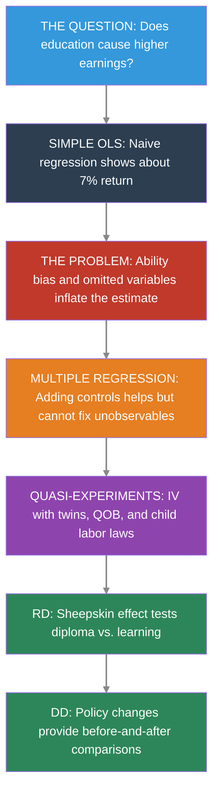


### Key Concepts and Definitions

**Ability Bias:** The upward bias in OLS estimates of the return to schooling caused by the omission of innate ability. More able people get more education AND earn more, inflating the apparent effect of schooling.

> 💡 **Example**
>
> A simple regression shows each year of schooling raises earnings by 7%, but part of this reflects the fact that high-IQ individuals stay in school longer and would earn more regardless.

> 📝 **Analogy**
>
> Like attributing a swimmer's speed entirely to their swimsuit. Faster swimmers tend to buy better suits, so the suit gets credit for speed that was really due to talent.


**Twin Fixed Effects:** A strategy that compares outcomes within pairs of identical twins who differ in their education levels. Because twins share genes and family background, differencing eliminates these shared confounders.

> 💡 **Example**
>
> If one twin has 16 years of schooling and earns \$60,000 while the other twin has 14 years and earns \$54,000, the within-pair return is (\$6,000 / 2 years) = \$3,000 per year.

> 📝 **Analogy**
>
> Like comparing two identical seeds planted in the same soil and climate, but one gets extra fertilizer. Any difference in growth must be due to the fertilizer, since everything else is shared.


**Within-Pair Differences:** The technique of subtracting one twin's outcome from the other's to eliminate all shared characteristics. This transforms the data from levels (how much each twin earns) to differences (how much MORE one twin earns than the other).

> 💡 **Example**
>
> $\Delta Y_f = Y_{twin1} - Y_{twin2}$ and $\Delta S_f = S_{twin1} - S_{twin2}$. Regressing the wage difference on the schooling difference gives the within-pair return.

> 📝 **Analogy**
>
> Like measuring the height difference between two siblings rather than their individual heights. The difference removes the family's genetic baseline and isolates the effect of what differed between them.


**Measurement Error:** Imprecision in the recording of a variable, where reported values differ from true values due to misreporting, rounding, or recall mistakes. In regression, measurement error in the explanatory variable biases the coefficient toward zero.

> 💡 **Example**
>
> Twins asked to report their years of education may misremember by a year. This noise dilutes the true variation in schooling and biases the return estimate downward.

> 📝 **Analogy**
>
> Like trying to read a ruler through foggy glasses. The markings are there, but the fog (measurement error) makes it hard to read them precisely, leading you to underestimate the true length.


**Signal-to-Noise Ratio:** The proportion of the total variation in a variable that reflects true variation (signal) versus measurement error (noise). A low signal-to-noise ratio causes severe attenuation bias.

> 💡 **Example**
>
> If true within-twin schooling variation is 1 year but measurement error adds 2 years of noise, the signal-to-noise ratio is low and the twin FE estimate is badly attenuated.

> 📝 **Analogy**
>
> Like trying to hear a whisper in a noisy stadium. The whisper (signal) is real, but the crowd noise overwhelms it. In a quiet room, the same whisper is perfectly clear.


**Reliability Ratio:** The fraction of the total variance of a variable that is true variance (as opposed to error variance). A reliability ratio of 0.5 means that attenuation bias cuts the coefficient in half.

> 💡 **Example**
>
> If self-reported education has a reliability ratio of 0.85, the OLS coefficient is biased toward zero by about 15%. In differenced twin data, the reliability ratio can drop to 0.5, doubling the bias.

> 📝 **Analogy**
>
> Like a scale that is accurate 85% of the time and gives random readings 15% of the time. The more unreliable the scale, the less you can trust its average reading.


**Sheepskin Effect:** The additional earnings boost associated with completing a degree (earning the diploma) beyond the year-by-year return to education. Named after the sheepskin diplomas were once printed on.

> 💡 **Example**
>
> If each year of college raises earnings by 7%, but graduating (year 4 specifically) adds an extra 15% jump, the 15% jump is the sheepskin effect --- the value of the credential itself.

> 📝 **Analogy**
>
> Like a loyalty card that gives a free coffee after every 10 purchases. The first 9 stamps (years of schooling) are valuable, but the 10th stamp (the degree) unlocks a bonus reward.


**Human Capital Theory:** The view that education raises earnings by building productive skills, knowledge, and abilities that make workers more valuable to employers.

> 💡 **Example**
>
> An engineering student learns calculus, physics, and design --- skills that directly increase her productivity and justify higher pay.

> 📝 **Analogy**
>
> Like sharpening a knife. More education makes the worker a better tool, and employers pay more for a sharper blade.


**Signaling Theory:** The view that education raises earnings not by increasing skills but by revealing pre-existing ability to employers. The degree serves as a signal that the holder is talented and hardworking.

> 💡 **Example**
>
> An employer who cannot directly observe a job candidate's ability uses a college degree as evidence that the candidate is smart and disciplined enough to complete four years of coursework.

> 📝 **Analogy**
>
> Like a peacock's tail. The tail does not make the peacock a better flyer --- it signals genetic fitness to potential mates. Similarly, a degree may not make you more productive; it signals that you were productive to begin with.


**Credential Effect:** The earnings premium attributable specifically to holding a diploma or credential, as opposed to the knowledge gained year by year. It is the empirical counterpart of the sheepskin effect.

> 💡 **Example**
>
> Clark and Martorell's RD study found that the Texas high school diploma had almost no credential effect --- students just above and below the exam cutoff had similar earnings.

> 📝 **Analogy**
>
> Like a name-brand label on a generic product. The credential effect asks: does the label itself add value, or is it what is inside the box that matters?


**Heterogeneous Treatment Effects:** The idea that the causal effect of treatment varies across individuals or subgroups, rather than being a single number that applies to everyone.

> 💡 **Example**
>
> The return to schooling may be 12% for low-income students but only 5% for high-income students, because education opens doors that were already open for the wealthy.

> 📝 **Analogy**
>
> Like the effect of an umbrella on staying dry. In a light drizzle, the umbrella is barely needed. In a downpour, it is essential. The same treatment has different effects depending on the circumstances.


**Convergence of Evidence:** The principle that when multiple methods --- each with different assumptions, data, and potential biases --- all point to similar conclusions, we gain much stronger confidence in the finding than any single method can provide.

> 💡 **Example**
>
> OLS, twin FE, twin IV, quarter-of-birth IV, child labor law IV, and DD all estimate the return to schooling at roughly 7--10% per year. No single estimate is definitive, but their agreement is powerful.

> 📝 **Analogy**
>
> Like multiple witnesses to an event all telling the same story from different vantage points. One witness might be mistaken, but if five independent witnesses agree, the story is probably true.


**Return to Schooling:** The percentage increase in earnings caused by one additional year of education. It is the central parameter this chapter seeks to estimate using multiple methods.

> 💡 **Example**
>
> A return of 8% means that one extra year of school causes earnings to increase by 8%, holding all else equal. Over a career, this compounds to a substantial difference.

> 📝 **Analogy**
>
> Like the interest rate on a savings account. Each "deposit" (year of school) earns a return that accumulates over time. An 8% return per year of schooling is a very high-yield investment.


**Quarter-of-Birth Instrument:** An instrument for years of schooling based on the quarter of the year in which a person was born. Because school entry and compulsory attendance laws interact with birth timing, children born in different quarters accumulate different amounts of schooling.

> 💡 **Example**
>
> Children born in Q4 start school slightly younger and must stay longer before reaching the legal dropout age, accumulating about 0.1 extra years of schooling on average.

> 📝 **Analogy**
>
> Like a relay race where some runners start a few steps ahead because of where they line up. The starting position (birth quarter) is essentially random but determines how far they run (years of schooling) before they can step off the track (drop out).


**Compulsory Schooling Laws:** Government regulations that require children to attend school until a specified minimum age (e.g., 16). These laws create exogenous variation in schooling by forcing some students to stay in school longer than they otherwise would.

> 💡 **Example**
>
> A state that raises its minimum school-leaving age from 14 to 16 compels students who would have dropped out at 14 to stay two more years --- generating variation that is independent of ability.

> 📝 **Analogy**
>
> Like a mandatory seatbelt law. Some people would buckle up anyway (always-takers), but the law forces additional compliance from people who would not have done it voluntarily --- and it is these marginal compliers whose outcomes we can study.


**Endogenous Variable:** A variable in a regression whose value is determined inside the system being studied, meaning it is correlated with the error term. OLS estimates involving endogenous variables are biased because the variable is not "as good as randomly assigned."

> 💡 **Example**
>
> Years of schooling is endogenous in an earnings regression because unobserved ability affects both schooling and earnings simultaneously.

> 📝 **Analogy**
>
> Like the chicken-and-egg problem. Did the variable cause the outcome, or did they both arise from a common underlying factor? When cause and effect are tangled together, you cannot simply read off the causal relationship.


### The Earnings-Education Gradient

College graduates earn roughly twice as much as high school graduates. But how much of that gap reflects the causal effect of education, and how much reflects the fact that people who go to college were going to earn more anyway?

Let's start with the simplest possible approach: **regress earnings on schooling with no controls**. This is the bivariate regression:

$$\ln W_i = \alpha + \rho \, S_i + e_i$$

where:

- $\ln W_i$ = log weekly earnings for individual $i$ (`lnw`)
- $S_i$ = years of schooling (`s`)
- $\rho$ = the return to schooling --- the percentage increase in earnings per additional year of education
- $e_i$ = residual (includes ability, motivation, family background, and everything else we cannot observe)

Because $\ln W$ is the outcome, the coefficient $\rho$ has a convenient interpretation: a value of 0.07 means each year of schooling is associated with approximately **7% higher earnings**.

```python
## Load clean quarter-of-birth data (Angrist & Krueger 1991, 329k men born 1930-1939)
import pandas as pd
import numpy as np
import pyfixest as pf
## (IV handled by pf.feols with pipe syntax)

GITHUB_DATA_URL = "https://raw.githubusercontent.com/cmg777/intro2causal/main/data/"

qob = pd.read_csv(GITHUB_DATA_URL + "ch6/qob_clean.csv")
qob.head(3)
```

```python
## Bivariate OLS: the simplest possible regression
bivariate = pf.feols("lnw ~ s", data=qob, vcov="hetero")

## Display results
pd.DataFrame({
    "Variable": bivariate.coef().index,
    "Coefficient": bivariate.coef().round(4).values,
    "Std. Error": bivariate.se().round(4).values,
    "t-statistic": bivariate.tstat().round(2).values,
    "p-value": bivariate.pvalue().round(3).values,
})
```

Each additional year of schooling is associated with about **7% higher weekly earnings**. With 329,000 observations, the estimate is extremely precise.

```python
import matplotlib.pyplot as plt

## Compute mean earnings by schooling level
binned = qob.groupby("s")["lnw"].mean().reset_index()

fig, ax = plt.subplots(figsize=(8, 5))
ax.scatter(binned["s"], binned["lnw"], color="black", s=40, zorder=5)
ax.plot(binned["s"], binned["lnw"], "k-", alpha=0.4)
ax.set_xlabel("Years of Schooling")
ax.set_ylabel("Mean Log Weekly Earnings")
ax.set_title("The Earnings-Education Gradient")
plt.tight_layout()
plt.show()
```

**But is this causal?** This is the **ability bias** problem. Smarter people stay in school longer AND earn more --- both independently. If we don't account for ability, OLS overstates the true causal return.

$$\hat{\rho}_{OLS} = \rho + \underbrace{\text{Ability bias}}_{\text{likely positive}}$$

where $\rho$ is the true causal return to schooling and $\hat{\rho}_{OLS}$ is the OLS estimate. If more able people get more education *and* earn more (for reasons unrelated to school), the OLS coefficient captures both effects.

**But is ability bias necessarily upward?** The answer is not obvious:

- **Arguments for upward bias** (the standard view): Higher IQ → stay in school longer AND earn more. Schools select on test scores. More-educated parents invest more in their children's education. All of these create positive correlation between ability and schooling.
- **Arguments for downward bias** (the contrarian view): Some highly talented people leave school *early* to pursue lucrative opportunities. Bill Gates, Mark Zuckerberg, and Steve Jobs dropped out of college; Mick Jagger left the London School of Economics to form the Rolling Stones. If such exceptional ability is negatively correlated with schooling, OLS could actually *understate* the true return.
- **For most people**, the standard view probably holds: the college-dropout billionaires are rare exceptions. But the ambiguity is important because it means we cannot assume the direction of OLS bias without evidence.

To understand how much of this 7% estimate is causal, we need to think carefully about omitted variables.


### Multiple Regression and the OVB Problem

#### Adding Controls

Chapter 2 taught us that adding control variables can reduce omitted variables bias --- as long as the controls are not "bad controls" (caused by the treatment). The long regression adds observable controls to the bivariate equation:

$$\ln W_i = \alpha + \rho \, S_i + \gamma_1 \, \text{Age}_i + \gamma_2 \, \text{Age}_i^2 + \gamma_3 \, \text{Female}_i + \gamma_4 \, \text{White}_i + e_i$$

where $S_i$ is years of education (`educ`), and the $\gamma$ coefficients capture the effects of age (`age`, `age2`), gender (`female`), and race (`white`). If ability remains in $e_i$, then $\hat{\rho}$ is still biased --- adding observable controls only helps if they capture the omitted confounders. Let's see this using the Twinsburg twins data.

```python
## Load clean twins data (340 twin pairs from Twinsburg, Ohio)
twins = pd.read_csv(GITHUB_DATA_URL + "ch6/twins_clean.csv")

## Key variables:
##   lwage  = log weekly wage; educ = own years of education
##   educt_t = twin's report of respondent's education (instrument)
##   first  = 1 for the first twin in each pair (use to avoid double-counting)
##   dlwage = within-pair difference in log wages; deduc = difference in own-reported education
##   deduct = difference in twin's report of education (instrument for deduc)
twins.head(3)
```

```python
## OLS: regress log wages on education with demographic controls
ols = pf.feols("lwage ~ educ + age + age2 + female + white", data=twins, vcov="hetero")

## Extract key regression results into a clear table
pd.DataFrame({
    "Variable": ols.coef().index,
    "Coefficient": ols.coef().round(4).values,
    "Std. Error": ols.se().round(4).values,
    "t-statistic": ols.tstat().round(2).values,
    "p-value": ols.pvalue().round(3).values,
})
```

The OLS return with controls is about **11% per year of schooling**. Note that this estimate uses a different dataset (the Twinsburg twins) than the bivariate regression above (the 1980 Census). The higher estimate partly reflects the different sample. Even within this dataset, adding demographic controls does not substantially reduce the schooling coefficient --- because these observables explain little of the ability-education correlation.

#### The OVB Formula Applied to Schooling

From Chapter 2, the omitted variables bias formula is:

$$\text{OVB} = \underbrace{\gamma}_{\text{effect of ability on earnings}} \times \underbrace{\pi_1}_{\text{correlation of ability with schooling}}$$

For schooling:

- $\gamma > 0$: More able people earn more, holding schooling constant
- $\pi_1 > 0$: More able people get more education

Therefore $\text{OVB} > 0$, and OLS **overstates** the true return. The short regression (without ability) gives a coefficient that is too large.

#### Seeing OVB in Action

To see this concretely, we use a synthetic dataset where we *know* the true causal return (about 0.09 per year) because we designed the data-generating process.

> 📝 **Synthetic data**
>
>
> This dataset was designed to illustrate the OVB concept. It contains 2,000 simulated individuals with schooling, earnings, unobserved ability, and occupation. The true total causal return to schooling is about 0.09 (9%) per year --- combining a direct effect on earnings and an indirect effect through occupation.


```python
## Load synthetic OVB data (2000 simulated individuals)
ovb = pd.read_csv(GITHUB_DATA_URL + "ch6/synthetic_ovb.csv")

## Short regression: omit ability (like real life — we can't observe ability)
short_reg = pf.feols("earnings ~ schooling", data=ovb, vcov="hetero")

## Long regression: include ability (the "oracle" regression we can't run with real data)
long_reg = pf.feols("earnings ~ schooling + ability", data=ovb, vcov="hetero")

## Compare coefficients
pd.DataFrame({
    "Specification": ["Short (omit ability)", "Long (include ability)", "True causal return"],
    "Schooling coefficient": [
        f"{short_reg.coef()['schooling']:.4f} ({short_reg.se()['schooling']:.4f})",
        f"{long_reg.coef()['schooling']:.4f} ({long_reg.se()['schooling']:.4f})",
        "0.0900",
    ],
})
```

The short regression gives about 0.12 --- **overstating** the true return by roughly 40%. Adding the unobservable ability recovers the true total causal return (about 0.09). In real life, we cannot observe ability, so we need a different strategy.

#### Bad Controls: Do Not Control for Occupation

> ⚠️ **Bad controls**
>
>
> Occupation is *caused by* education --- it is a "bad control" (a mediator or post-treatment variable). Controlling for it absorbs part of the causal effect of education on earnings, biasing the estimate downward. If education raises earnings partly by giving access to higher-paying occupations, then holding occupation constant removes that channel.


```python
## Bad control: add occupation (which is caused by schooling)
bad_control = pf.feols("earnings ~ schooling + occupation", data=ovb, vcov="hetero")

pd.DataFrame({
    "Specification": ["Without occupation", "With occupation (bad control)", "True causal return"],
    "Schooling coefficient": [
        f"{short_reg.coef()['schooling']:.4f} ({short_reg.se()['schooling']:.4f})",
        f"{bad_control.coef()['schooling']:.4f} ({bad_control.se()['schooling']:.4f})",
        "0.0900",
    ],
})
```

Adding occupation shrinks the schooling coefficient --- not because it reduces bias, but because it removes a real causal channel. **Rule of thumb:** never control for variables that are consequences of the treatment.

Even with good controls, we can never be sure we have accounted for all confounders. What we really want is a research design --- like the randomized experiments in Chapter 1 --- that eliminates ability bias by construction.


### Why Not an RCT?

The gold standard for causal inference is the **randomized controlled trial**: randomly assign some people to get more education, and compare their earnings to a control group. Random assignment breaks the link between ability and education, so the simple difference in means is causal.

**But we cannot randomize education.** It would be unethical and impractical to force some people to drop out and others to stay in school for 20 years.

To see *why* random assignment works, consider the regression of earnings on the randomly assigned scholarship:

$$\ln W_i = \alpha + \beta \, P_i + e_i$$

where $P_i$ = 1 if individual $i$ received a scholarship (`scholarship`). Because $P_i$ is randomly assigned, it is uncorrelated with ability in $e_i$, so $\hat{\beta}$ is unbiased. The per-year causal return is then:

$$\hat{\rho} = \frac{\hat{\beta}}{\text{Schooling difference}} = \frac{\text{Reduced form}}{\text{First stage}}$$

This is the Wald estimator from Chapter 3, applied to the scholarship "instrument." We use a synthetic dataset to demonstrate this.

> 📝 **Synthetic data**
>
>
> This dataset simulates a hypothetical scholarship experiment. 2,000 individuals were randomly assigned to receive a scholarship (or not). The scholarship increases schooling by about 2 years. The true causal return to schooling is 0.08 per year, so the scholarship should increase earnings by about 0.16.


```python
## Load synthetic RCT data
rct = pd.read_csv(GITHUB_DATA_URL + "ch6/synthetic_rct.csv")

## Simple comparison of means by scholarship status
means = rct.groupby("scholarship")[["schooling", "earnings"]].mean()
diff_school = means.loc[1, "schooling"] - means.loc[0, "schooling"]
diff_earn = means.loc[1, "earnings"] - means.loc[0, "earnings"]

## Regression of earnings on scholarship (= difference in means)
rct_reg = pf.feols("earnings ~ scholarship", data=rct, vcov="hetero")

## Wald estimate: earnings effect / schooling effect = per-year return
wald_rct = diff_earn / diff_school

pd.DataFrame({
    "Quantity": [
        "Scholarship → schooling (first stage)",
        "Scholarship → earnings (reduced form)",
        "Per-year return (reduced form / first stage)",
    ],
    "Estimate": [
        f"{diff_school:.3f} years",
        f"{diff_earn:.4f} log points",
        f"{wald_rct:.4f}",
    ],
})
```

With random assignment, the simple difference in earnings between scholarship and non-scholarship groups gives an unbiased estimate of the causal effect. Dividing by the schooling difference gives the per-year return --- close to the true 0.08.

> ⭐ **The lesson**
>
>
> The RCT recovers the right answer because random assignment makes the scholarship independent of ability. Since the scholarship affects earnings only through schooling, the Wald ratio (earnings effect / schooling effect) gives an unbiased per-year return. But since we cannot run a real schooling RCT, we need **quasi-experimental** methods that approximate random assignment. The rest of this chapter explores four such strategies.


### Strategy 1: Twin Comparisons

#### The Logic

Identical twins share genes and family upbringing --- the very factors we suspect drive ability bias. If one twin gets more education than the other, the earnings difference within the pair reflects the causal return, not ability.

#### Within-Twin Differences

By taking the difference within each twin pair, we eliminate everything shared between them:

$$\Delta Y_f = \rho \cdot \Delta S_f + \Delta e_f$$

where $\Delta Y_f$ is the difference in log wages (`dlwage`) and $\Delta S_f$ is the difference in years of education (`deduc`) within twin pair $f$. Shared ability cancels out because both twins have the same value.

```python
## Use only the first twin in each pair (to avoid double-counting)
first = twins[twins["first"] == 1]

## Regress wage difference on education difference
## The "- 1" removes the intercept: when both twins have the same education,
## we expect zero wage difference, so there's no constant term needed
twin_fe = pf.feols("dlwage ~ deduc - 1", data=first, vcov="hetero")

## Extract key regression results into a clear table
pd.DataFrame({
    "Variable": twin_fe.coef().index,
    "Coefficient": twin_fe.coef().round(4).values,
    "Std. Error": twin_fe.se().round(4).values,
    "t-statistic": twin_fe.tstat().round(2).values,
    "p-value": twin_fe.pvalue().round(3).values,
})
```

The twin estimate drops to about **6%** --- nearly half the OLS estimate. This suggests ability bias pushes OLS upward.

> ⚠️ **Common Misconception: A lower estimate is not necessarily a better estimate**
>
>
> Twin FE gives 0.06. OLS gives 0.11. Students often assume the lower number must be "more correct."
>
> **This is wrong.** Twin FE has its own bias: **measurement error amplification**.
>
> Here's why: twins report their own education. Small errors (misremembering a year) get amplified by differencing. The true within-pair variation in schooling is tiny. So even small errors dominate the signal.
>
> **Result:** This **attenuation bias** pushes the twin estimate *below* the true return.


Formally, measurement error biases the twin FE coefficient by the **reliability ratio**:

$$\hat{\rho}_{FE} \approx \rho \times \underbrace{\frac{\text{Var}(\Delta S^*_f)}{\text{Var}(\Delta S^*_f) + \text{Var}(\Delta m_f)}}_{\text{reliability ratio}}$$

where $\Delta S^*_f$ is the true within-twin difference in schooling and $\Delta m_f$ is the measurement error in the differenced data. When twins are very similar, $\text{Var}(\Delta S^*)$ is small but $\text{Var}(\Delta m)$ stays the same size, so the reliability ratio drops well below 1 and $\hat{\rho}_{FE}$ is attenuated toward zero. A reliability ratio of 0.5 would cut the estimate in half.

#### IV: Using the Twin's Report as an Instrument

The twin estimate may be biased *downward* by **measurement error** in self-reported education. If twins misremember their schooling, the differenced data amplifies noise relative to signal.

The fix: use each twin's *report of the other's education* as an instrument. This report is correlated with true education but has independent measurement error, so it satisfies the IV requirements. (This assumes twins do not simply agree on inaccurate reports. If twins discuss their education and reach consensus, their measurement errors may be correlated, weakening the IV correction.)

> 📝 **Reading the pyfixest IV formula syntax**
>
>
> In `pyfixest`, the IV formula uses a **pipe** (`|`) to specify the endogenous variable and its instrument:
>
> - `| educ ~ educt_t` means: *educ* is the endogenous variable, instrumented by *educt_t*
> - Controls go before the first `|`; fixed effects (if any) go between the first and second `|`
> - `vcov="hetero"` gives heteroskedasticity-robust standard errors (HC1)


The twin IV corrects measurement error using two stages. In the within-pair (differenced) version:

**First stage:** Predict own-reported schooling difference using the twin's report

$$\Delta S_f = \pi_0 + \pi_1 \, \Delta S^{twin}_f + v_f$$

**Second stage:** Regress wage difference on the predicted schooling difference

$$\Delta Y_f = \rho_{IV} \, \widehat{\Delta S}_f + u_f$$

where $\Delta S^{twin}_f$ is the difference in the twin's report of the other's education (`deduct`), and $\widehat{\Delta S}_f$ is the fitted value from the first stage. Because the twin's report has independent measurement error, it filters out the noise in own-reported education, correcting the attenuation bias.

```python
## IV in levels: instrument own education (educ) with twin's report (educt_t)
iv_levels = pf.feols("lwage ~ 1 + age + age2 + female + white | educ ~ educt_t", data=twins, vcov="hetero")

## IV in differences: instrument own-reported difference (deduc) with twin's report diff (deduct)
first_iv = first[["dlwage", "deduc", "deduct"]].dropna()
iv_diff = pf.feols("dlwage ~ 0 | deduc ~ deduct", data=first_iv, vcov="hetero")

## Combine all four estimates into one table
ols_coef = round(ols.coef()["educ"], 3)
ols_se = round(ols.se()["educ"], 3)
fe_coef = round(twin_fe.coef()["deduc"], 3)
fe_se = round(twin_fe.se()["deduc"], 3)
iv_lev_coef = round(iv_levels.coef()["educ"], 3)
iv_lev_se = round(iv_levels.se()["educ"], 3)
iv_dif_coef = round(iv_diff.coef()["deduc"], 3)
iv_dif_se = round(iv_diff.se()["deduc"], 3)

pd.DataFrame({
    "Method": ["OLS (levels)", "Twin FE (differences)", "IV (levels)", "IV (differences)"],
    "Return to schooling": [
        format(ols_coef, ".3f") + " (" + format(ols_se, ".3f") + ")",
        format(fe_coef, ".3f") + " (" + format(fe_se, ".3f") + ")",
        format(iv_lev_coef, ".3f") + " (" + format(iv_lev_se, ".3f") + ")",
        format(iv_dif_coef, ".3f") + " (" + format(iv_dif_se, ".3f") + ")",
    ],
})
```

> ⭐ **What the twin results tell us**
>
>
> | Method | Estimate | Interpretation |
> |:---|:---:|:---|
> | OLS | ~0.11 | Likely biased UP by ability |
> | Twin FE | ~0.06 | Biased DOWN by measurement error |
> | IV (levels) | ~0.12 | Corrects measurement error in levels |
> | IV (differences) | ~0.11 | Corrects measurement error in differences |
>
> The true return is probably **8--11% per year**, with OLS slightly overstating and twin FE understating due to different biases.


> 📝 **Intuition Builder: The Bathroom Scale Analogy**
>
>
> Imagine weighing yourself on a bathroom scale that randomly adds or subtracts 5 pounds. On average, the scale is right --- but any single reading is noisy. Now suppose you weigh yourself in the morning and evening to measure how much weight you gained during the day. The true gain might be 0.5 lbs, but the scale's error (±5 lbs in each reading) means the *difference* between readings is dominated by noise. This is exactly what happens with twin differences in education: the true within-pair variation is small (twins are similar), but measurement error stays the same size, so noise overwhelms the signal.


**Lessons from the twins strategy:**

- Twin FE controls for shared ability but amplifies measurement error --- two biases push in opposite directions
- IV using the twin's report corrects measurement error, recovering a return near 11%
- **Limitation:** The Twinsburg twins are a self-selected sample (twins who attend an annual twin festival in Ohio). They may not represent the general population

The twins approach offered a first crack at ability bias but raised a new concern: measurement error. Our next strategy sidesteps both problems by finding a source of schooling variation that is entirely independent of ability --- and precisely measured in census data.


### Strategy 2: Quarter-of-Birth IV

**Research question:** What is the causal return to an additional year of schooling, using a source of variation that is independent of ability?

**The data:** Angrist and Krueger (1991) used the 1980 U.S. Census, extracting 329,509 men born between 1930 and 1939. The outcome is log weekly earnings (`lnw`). Schooling is measured in years (`s`). Quarter of birth (`qob`, 1--4) serves as the instrument.

#### The Idea

Compulsory schooling laws allow students to drop out at age 16. Because school-entry rules are based on birth date cutoffs, children born later in the year start school younger and accumulate more schooling before reaching the dropout age.

This creates an instrument: **quarter of birth** affects schooling (through compulsory attendance rules) but should not directly affect earnings.

The IV strategy has three equations:

**First stage** (instrument predicts schooling):

$$S_i = \alpha_1 + \phi \, Q4_i + e_{1i}$$

**Reduced form** (instrument predicts earnings directly):

$$\ln W_i = \alpha_2 + \rho_{RF} \, Q4_i + e_{2i}$$

**Wald estimator** (ratio gives the causal return):

$$\hat{\rho}_{IV} = \frac{\hat{\rho}_{RF}}{\hat{\phi}} = \frac{\text{Effect of } Q4 \text{ on earnings}}{\text{Effect of } Q4 \text{ on schooling}}$$

where $Q4_i$ = 1 if individual $i$ was born in the fourth quarter (`q4`), $S_i$ is years of schooling (`s`), and $\ln W_i$ is log weekly earnings (`lnw`). This estimate is a **LATE** (Local Average Treatment Effect): it applies only to compliers whose schooling was changed by compulsory attendance interacting with their birth quarter.

#### The IV Recipe: Step by Step

```python
## Step 1: Reduced form — does Q4 birth predict higher earnings?
rf = pf.feols("lnw ~ q4", data=qob, vcov="hetero")

## Step 2: First stage — does Q4 birth predict more schooling?
fs = pf.feols("s ~ q4", data=qob, vcov="hetero")

## Step 3: Wald estimate = reduced form / first stage
wald = rf.coef()["q4"] / fs.coef()["q4"]

## Step 4: Verify with 2SLS
iv = pf.feols("lnw ~ 1 | s ~ q4", data=qob, vcov="hetero")

## Extract coefficients and standard errors
rf_coef = round(rf.coef()["q4"], 4)
rf_se = round(rf.se()["q4"], 4)
fs_coef = round(fs.coef()["q4"], 4)
fs_se = round(fs.se()["q4"], 4)
wald_rounded = round(wald, 4)
iv_coef = round(iv.coef()["s"], 4)
iv_se = round(iv.se()["s"], 4)

pd.DataFrame({
    "Step": ["Reduced form (Q4 → earnings)", "First stage (Q4 → schooling)",
             "Wald estimate (RF / FS)", "2SLS verification"],
    "Estimate": [
        format(rf_coef, ".4f") + " (" + format(rf_se, ".4f") + ")",
        format(fs_coef, ".4f") + " (" + format(fs_se, ".4f") + ")",
        format(wald_rounded, ".4f"),
        format(iv_coef, ".4f") + " (" + format(iv_se, ".4f") + ")",
    ],
})
```

The reduced form shows that Q4 births earn slightly more. The first stage shows they get about 0.09 more years of schooling. Dividing gives the Wald estimate of about **7% per year** --- which the 2SLS verification confirms.

#### Visualizing the First Stage and Reduced Form

```python
## Collapse to cell means by age (= birth cohort)
cell = qob.groupby("age").agg(s=("s","mean"), lnw=("lnw","mean"),
                                q4=("q4","mean"), q1=("q1","mean")).reset_index()
cell["yob"] = 80 - cell["age"]
cell["is_q4"] = cell["q4"] > 0.5
cell["is_q1"] = cell["q1"] > 0.5

fig, axes = plt.subplots(1, 2, figsize=(12, 5))

ax = axes[0]
ax.plot(cell["yob"], cell["s"], "k-", alpha=0.4)
ax.scatter(cell.loc[cell["is_q4"], "yob"], cell.loc[cell["is_q4"], "s"],
           color="black", s=50, zorder=5, label="Quarter 4")
ax.scatter(cell.loc[cell["is_q1"], "yob"], cell.loc[cell["is_q1"], "s"],
           facecolors="none", edgecolors="black", s=50, zorder=5, label="Quarter 1")
ax.set_xlabel("Year of Birth")
ax.set_ylabel("Years of Education")
ax.set_title("First Stage")
ax.legend()

ax = axes[1]
ax.plot(cell["yob"], cell["lnw"], "k-", alpha=0.4)
ax.scatter(cell.loc[cell["is_q4"], "yob"], cell.loc[cell["is_q4"], "lnw"],
           color="black", s=50, zorder=5, label="Quarter 4")
ax.scatter(cell.loc[cell["is_q1"], "yob"], cell.loc[cell["is_q1"], "lnw"],
           facecolors="none", edgecolors="black", s=50, zorder=5, label="Quarter 1")
ax.set_xlabel("Year of Birth")
ax.set_ylabel("Log Weekly Earnings")
ax.set_title("Reduced Form")
ax.legend()

plt.tight_layout()
plt.show()
```

> 📝 **Who are the compliers?**
>
>
> The QOB IV estimate is a **LATE** (Local Average Treatment Effect) --- it applies only to **compliers**, people whose schooling was actually changed by their quarter of birth interacting with compulsory schooling laws. Compliers are students at the dropout threshold. Students who would have attended college regardless (always-takers) or those who drop out very early (never-takers) are not affected by the instrument.


The quarter-of-birth IV uses a clever natural experiment, but it relies on a single source of variation. Our next strategy uses a different set of instruments --- compulsory schooling laws that vary across states.


### Strategy 3: Child Labor Law IV

**Research question:** Do compulsory schooling laws that forced children to enter school by certain ages provide another valid instrument for estimating the return to education?

**The data:** Acemoglu and Angrist used data on compulsory schooling laws that varied across U.S. states. Three instruments capture whether a state required children to enter school by age 7 (`cl7`), 8 (`cl8`), or 9 (`cl9`). The data has been collapsed to state-of-birth × year-of-birth × census-year cell means.

With multiple instruments and fixed effects, the 2SLS framework is:

**First stage:** Predict schooling using the three compulsory schooling instruments

$$S_{scy} = \alpha_1 + \phi_1 \, CL7_{sc} + \phi_2 \, CL8_{sc} + \phi_3 \, CL9_{sc} + \beta_s + \gamma_c + \delta_y + v_{scy}$$

**Second stage:** Regress earnings on the predicted schooling

$$\ln W_{scy} = \alpha_2 + \rho_{IV} \, \hat{S}_{scy} + \beta_s + \gamma_c + \delta_y + u_{scy}$$

where:

- $CL7$, $CL8$, $CL9$ = indicators for compulsory school entry by age 7, 8, or 9 (`cl7`, `cl8`, `cl9`)
- $\beta_s$ = state-of-birth fixed effects (`| sob`)
- $\gamma_c$ = year-of-birth cohort effects (`| yob`)
- $\delta_y$ = census-year effects (`| year`)
- $\hat{S}_{scy}$ = the fitted value of schooling from the first stage
- $\rho_{IV}$ = the causal return to schooling, identified by the three instruments jointly

```python
## Load child labor law data (collapsed cell means, ~2400 observations)
cl = pd.read_csv(GITHUB_DATA_URL + "ch6/childlabor_clean.csv")
cl.head(3)
```

```python
## First stage: do child labor laws predict education?
fs_cl = pf.feols("indEduc ~ cl7 + cl8 + cl9 | sob + yob + year",
                 data=cl, weights="weight", vcov={"CRV1": "sob"})

## Joint F-test on instruments (Wald test)
import numpy as np
coefs = np.array([fs_cl.coef()['cl7'], fs_cl.coef()['cl8'], fs_cl.coef()['cl9']])
idx = [list(fs_cl.coef().index).index(v) for v in ['cl7', 'cl8', 'cl9']]
V_sub = fs_cl._vcov[np.ix_(idx, idx)]
f_stat = float(coefs @ np.linalg.inv(V_sub) @ coefs / 3)

pd.DataFrame({
    "Instrument": ["cl7 (enter by age 7)", "cl8 (enter by age 8)", "cl9 (enter by age 9)", "Joint F-statistic"],
    "Coefficient": [
        f"{fs_cl.coef()['cl7']:.4f} ({fs_cl.se()['cl7']:.4f})",
        f"{fs_cl.coef()['cl8']:.4f} ({fs_cl.se()['cl8']:.4f})",
        f"{fs_cl.coef()['cl9']:.4f} ({fs_cl.se()['cl9']:.4f})",
        f"{f_stat:.2f}",
    ],
})
```

```python
## OLS with fixed effects
ols_cl = pf.feols("lnwkwage ~ indEduc | sob + yob + year",
                  data=cl, weights="weight", vcov={"CRV1": "sob"})

## IV/2SLS with fixed effects and multiple instruments
iv_result = pf.feols("lnwkwage ~ 1 | sob + yob + year | indEduc ~ cl7 + cl8 + cl9",
                     data=cl, weights="weight", vcov={"CRV1": "sob"})

pd.DataFrame({
    "Method": ["OLS (with state, YOB, year FE)", "IV/2SLS (child labor law instruments)"],
    "Return to schooling": [
        f"{ols_cl.coef()['indEduc']:.4f} ({ols_cl.se()['indEduc']:.4f})",
        f"{iv_result.coef()['indEduc']:.4f} ({iv_result.se()['indEduc']:.4f})",
    ],
})
```

> ⭐ **What the child labor law results tell us**
>
>
> The OLS estimate with fixed effects gives about **7%**, while the IV estimate is larger at about **13%**. The IV estimate is less precise than the QOB results, in part because the first-stage F-statistic is below 10 --- a sign of **weak instruments** that can inflate IV estimates. Despite the imprecision, the results are broadly consistent with the other IV strategies in pointing to a causal return that is at least as large as the OLS estimate.


Both the twins and IV strategies estimate the *overall* return to education. But they leave open a deeper question: does education raise earnings because of the skills you learn, or because employers value the diploma?


### Strategy 4: Sheepskin Effects via RD

**Research question:** Does the diploma credential itself boost earnings (the **signaling** view), or is it the skills learned in school that matter (the **human capital** view)?

**The data:** Clark and Martorell (2014) studied the Texas high school exit exam. The data consists of 46 score bins around the passing cutoff. The running variable is the test score relative to the passing threshold (`minscore`, where 0 = cutoff).

**Why RD works here:** Students who scored just above vs. just below the cutoff have nearly **identical skills** but very different diploma rates. Any jump in earnings at the cutoff reflects the value of the diploma credential itself.

The RD regression estimates the jump at the passing threshold:

$$Y_i = \alpha + \rho \, D_i + f(\text{Score}_i) + e_i$$

where:

- $Y_i$ = average annual earnings (`avgearnings`) or diploma receipt (`receivehsd`)
- $D_i$ = 1 if the student passed the last-chance exam (`pass_exam`)
- $f(\text{Score}_i)$ = a flexible polynomial in the test score relative to the cutoff (`minscore`), fitted separately on each side of the threshold
- $\rho$ = the **sheepskin effect** --- the jump in the outcome at the passing threshold

If $\rho$ is large for earnings, the diploma itself has value (signaling). If $\rho \approx 0$, the diploma credential adds little beyond the skills already reflected in the score.

```python
## Load clean sheepskin RD data (Texas last-chance exam)
sheep = pd.read_csv(GITHUB_DATA_URL + "ch6/sheepskin_clean.csv")
sheep.head(3)
```

```python
fig, axes = plt.subplots(1, 2, figsize=(13, 5))

## --- Panel 1: Diploma receipt ---
ax = axes[0]
ax.scatter(sheep["minscore"], sheep["receivehsd"], color="black", s=20, alpha=0.6)

left = sheep[sheep["minscore"] < 0]
right = sheep[sheep["minscore"] >= 0]

fit_l = pf.feols("receivehsd ~ pass_exam + left_1 + left_2 + left_3 + left_4", data=left, weights="n")
fit_r = pf.feols("receivehsd ~ pass_exam + right_1 + right_2 + right_3 + right_4", data=right, weights="n")

left_plot = sheep[sheep["minscore"] <= 0].copy()
left_plot["fit"] = fit_l.predict(newdata=left_plot)
right_plot = sheep[sheep["minscore"] >= 0].copy()
right_plot["fit"] = fit_r.predict(newdata=right_plot)

ax.plot(left_plot["minscore"], left_plot["fit"], "k-", linewidth=2)
ax.plot(right_plot["minscore"], right_plot["fit"], "k-", linewidth=2)
ax.axvline(x=0, color="red", linestyle="--", alpha=0.5)
ax.set_xlabel("Test score relative to cutoff")
ax.set_ylabel("Fraction receiving diploma")
ax.set_title("Diploma Receipt (First Stage)")
ax.set_xlim(-30, 15)
ax.set_ylim(0, 1)

## --- Panel 2: Earnings ---
ax = axes[1]
ax.scatter(sheep["minscore"], sheep["avgearnings"], color="black", s=20, alpha=0.6)

earn_l = pf.feols("avgearnings ~ pass_exam + left_1 + left_2 + left_3 + left_4",
                  data=left[left["minscore"] >= -30], weights="person_years")
earn_r = pf.feols("avgearnings ~ pass_exam + right_1 + right_2 + right_3 + right_4", data=right, weights="person_years")

left_earn = sheep[sheep["minscore"] <= 0].copy()
left_earn["fit"] = earn_l.predict(newdata=left_earn)
right_earn = sheep[sheep["minscore"] >= 0].copy()
right_earn["fit"] = earn_r.predict(newdata=right_earn)

ax.plot(left_earn["minscore"], left_earn["fit"], "k-", linewidth=2)
ax.plot(right_earn["minscore"], right_earn["fit"], "k-", linewidth=2)
ax.axvline(x=0, color="red", linestyle="--", alpha=0.5)
ax.set_xlabel("Test score relative to cutoff")
ax.set_ylabel("Annual Earnings ($)")
ax.set_title("Earnings (Reduced Form)")
ax.set_xlim(-30, 15)

plt.tight_layout()
plt.show()
```

> ⭐ **The sheepskin verdict**
>
>
> - **Diploma receipt** jumps by about **40 percentage points** at the cutoff (a strong first stage). Since the jump is 40 points rather than 100, this is technically a **fuzzy RD** --- passing the exam increases but does not guarantee diploma receipt
> - **Earnings** show **almost no jump** --- the RD effect is near zero. Even scaling by the diploma receipt jump (the fuzzy RD Wald estimate), the credential effect remains negligible
> - Most of the education premium reflects actual learning (human capital), not just the piece of paper (signaling)


We have now applied regression, IV, and RD to the schooling question. The final method --- differences-in-differences --- exploits policy changes over time.


### Strategy 5: Differences-in-Differences

**Research question:** Can we estimate the return to schooling by comparing states that changed their compulsory schooling laws to states that did not?

> 📝 **Synthetic data**
>
>
> This dataset simulates a compulsory schooling reform adopted by 10 out of 20 states in 2005. It was designed to illustrate the DiD concept with clear parallel pre-trends and a visible treatment effect.


The DD estimator compares changes over time across treated and control groups:

$$\delta_{DD} = \underbrace{(\bar{Y}_{treat,after} - \bar{Y}_{treat,before})}_{\text{Change in treated states}} - \underbrace{(\bar{Y}_{control,after} - \bar{Y}_{control,before})}_{\text{Change in control states}}$$

In regression form with state and year fixed effects:

$$Y_{st} = \alpha + \delta \, (\text{Treated}_s \times \text{Post}_t) + \beta_s + \gamma_t + e_{st}$$

where:

- $Y_{st}$ = average earnings (`avg_earnings`) or average schooling (`avg_schooling`) in state $s$ at time $t$
- $\text{Treated}_s \times \text{Post}_t$ = the interaction term (`treat_post`), equal to 1 for treated states after the reform
- $\beta_s$ = state fixed effects (`| state`) --- absorb permanent differences between states
- $\gamma_t$ = year fixed effects (`| year`) --- absorb common time trends
- $\delta$ = the DD estimate of the reform's causal effect

The **parallel trends assumption** requires that treated and control states would have followed the same trajectory absent the reform: $E[Y_{st}(0) \mid \text{Treated}=1] - E[Y_{st}(0) \mid \text{Treated}=0]$ is constant over time.

```python
## Load synthetic DiD data (20 states × 20 years)
did = pd.read_csv(GITHUB_DATA_URL + "ch6/synthetic_did.csv")
did.head(3)
```

```python
## Compute group means by year
group_means = did.groupby(["year", "treated"]).agg(
    schooling=("avg_schooling", "mean"),
    earnings=("avg_earnings", "mean"),
).reset_index()

treated_g = group_means[group_means["treated"] == 1]
control_g = group_means[group_means["treated"] == 0]

fig, axes = plt.subplots(1, 2, figsize=(13, 5))

ax = axes[0]
ax.plot(treated_g["year"], treated_g["schooling"], "k-", linewidth=2, label="Treated states")
ax.plot(control_g["year"], control_g["schooling"], "k--", linewidth=2, label="Control states")
ax.axvline(x=2005, color="red", linestyle="--", alpha=0.5, label="Reform year")
ax.set_xlabel("Year")
ax.set_ylabel("Average Years of Schooling")
ax.set_title("Schooling (First Stage)")
ax.legend(loc="upper left")

ax = axes[1]
ax.plot(treated_g["year"], treated_g["earnings"], "k-", linewidth=2, label="Treated states")
ax.plot(control_g["year"], control_g["earnings"], "k--", linewidth=2, label="Control states")
ax.axvline(x=2005, color="red", linestyle="--", alpha=0.5, label="Reform year")
ax.set_xlabel("Year")
ax.set_ylabel("Log Average Earnings")
ax.set_title("Earnings (Reduced Form)")
ax.legend(loc="upper left")

plt.tight_layout()
plt.show()
```

```python
## DD regression for schooling (first stage)
did["treat_post"] = did["treated"] * did["post"]
dd_school = pf.feols("avg_schooling ~ treat_post | state + year", data=did, vcov={"CRV1": "state"})

## DD regression for earnings (reduced form)
dd_earn = pf.feols("avg_earnings ~ treat_post | state + year", data=did, vcov={"CRV1": "state"})

## Implied return: earnings effect / schooling effect
dd_return = dd_earn.coef()["treat_post"] / dd_school.coef()["treat_post"]

pd.DataFrame({
    "Quantity": [
        "DD effect on schooling (first stage)",
        "DD effect on earnings (reduced form)",
        "Implied return per year (RF / FS)",
    ],
    "Estimate": [
        f"{dd_school.coef()['treat_post']:.4f} ({dd_school.se()['treat_post']:.4f})",
        f"{dd_earn.coef()['treat_post']:.4f} ({dd_earn.se()['treat_post']:.4f})",
        f"{dd_return:.4f}",
    ],
})
```

> ⭐ **Connection to the child labor law IV**
>
>
> We borrow IV terminology here: the DD on schooling plays the role of a "first stage" (how much did the reform increase schooling?) and the DD on earnings plays the role of a "reduced form" (how much did the reform increase earnings?). The ratio gives the implied per-year return, just as the Wald estimator does in IV. This is valid as long as the reform affects earnings only through schooling.
>
> The child labor law IV (Strategy 3) and the DiD approach exploit the **same underlying variation** --- policy changes in compulsory schooling laws across states and time. Both give similar estimates, reinforcing the causal interpretation.


### The Furious Five: A Grand Synthesis

This chapter has applied **all five methods** from the book to a single question. Each method can be summarized by its key equation, all targeting the same parameter $\rho$ --- the causal return to schooling:

| Method | Key Equation |
|:---|:---|
| **Bivariate OLS** | $\ln W_i = \alpha + \rho \, S_i + e_i$ |
| **OLS with controls** | $\ln W_i = \alpha + \rho \, S_i + \gamma' X_i + e_i$ |
| **Twin FE** | $\Delta Y_f = \rho \, \Delta S_f + \Delta e_f$ |
| **IV (Wald)** | $\hat{\rho}_{IV} = \hat{\rho}_{RF} \, / \, \hat{\phi}$ |
| **2SLS** | Stage 1: $S_i = \pi_0 + \pi_1 Z_i + v_i$; Stage 2: $\ln W_i = \alpha + \rho_{IV} \hat{S}_i + u_i$ |
| **RD** | $Y_i = \alpha + \rho \, D_i + f(\text{Score}_i) + e_i$ |
| **DD** | $Y_{st} = \alpha + \delta \, (\text{Treated}_s \times \text{Post}_t) + \beta_s + \gamma_t + e_{st}$ |

: The equation behind each method
| Method | Chapter | Key Assumption | What It Estimates | Used Here? |
|:---|:---:|:---|:---|:---:|
| **RCT** | 1 | Random assignment | ATE | Synthetic demo |
| **Regression** | 2 | Observable confounders only | Conditional average | Yes (OLS baseline) |
| **IV / 2SLS** | 3 | Valid instrument | LATE (compliers) | Yes (twins, QOB, child labor) |
| **RD** | 4 | Smooth running variable | Local effect at cutoff | Yes (sheepskin) |
| **DD** | 5 | Parallel trends | ATT | Synthetic demo |

: The Furious Five methods and their role in estimating returns to schooling
#### What Is the True Return to Schooling?

| Method | Estimate | Main Bias | Direction |
|:---|:---:|:---|:---:|
| Simple OLS (no controls) | ~0.07 | Ability bias (OVB) | Likely upward |
| OLS with controls | ~0.11 | Unobserved ability | Upward |
| Twin FE | ~0.06 | Measurement error | Downward |
| Twin IV | ~0.11 | Corrects measurement error | --- |
| Quarter-of-birth IV | ~0.07--0.08 | LATE for compliers only | --- |
| Child labor law IV | ~0.07--0.13 | Weak instruments, imprecise | --- |
| Sheepskin RD | ~0 | Diploma effect specifically | --- |
| DD (synthetic) | ~0.06 | Parallel trends required | --- |

: Comparing returns to schooling across all methods
> 📝 **The big picture**
>
>
> The true causal return to schooling is probably **7--10% per year**. OLS slightly overstates it (ability bias), while twin FE understates it (measurement error). The IV estimates cluster around 7--10%. The near-zero sheepskin effect suggests that the return comes from actual learning, not credential signaling.
>
> No single method is perfect. The power of this chapter lies in seeing how **multiple imperfect strategies converge** on a similar answer.


**Why this matters for policy.** Multiple methods converge: twins, quarter of birth, and compulsory schooling laws all point to a **genuine causal return of 7--10% per year**. Education is one of the best investments individuals and governments can make --- and the return comes from actual learning, not just the diploma.


### Key Takeaways

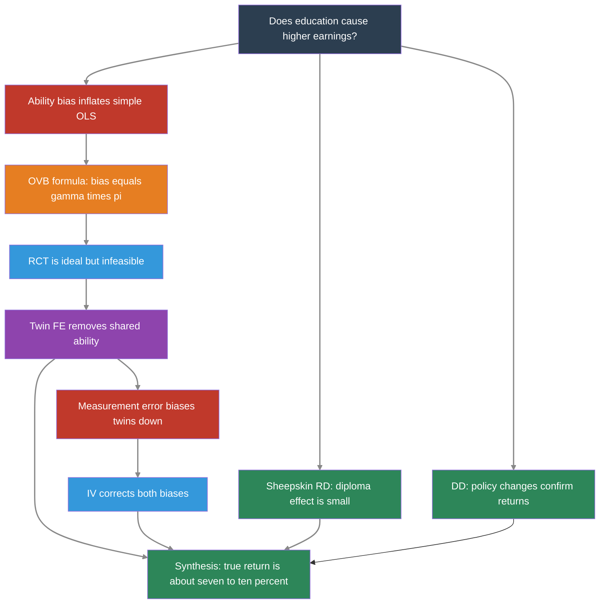

1. **Simple OLS returns to schooling (~7%)** reflect both the causal effect and selection bias (ability bias), so they overstate the true causal return.

2. **The OVB formula** predicts upward bias: ability raises both schooling and earnings.

3. **RCTs** are the gold standard but infeasible for schooling --- motivating quasi-experimental methods.

4. **OLS with controls (~11%)** on the twins data shows that demographic controls do not substantially reduce the schooling coefficient.

5. **Twin fixed effects (~6%)** control for shared ability but suffer from measurement error amplification.

6. **IV using twin's report (~11%)** corrects measurement error, recovering a higher estimate.

7. **Quarter-of-birth IV (~7%)** uses compulsory schooling as exogenous variation, estimating a LATE for dropout-margin students.

8. **Child labor law IV (~7--10%)** uses a different set of instruments, confirming the QOB results.

9. **Sheepskin RD (~0%)** shows the diploma itself has little earnings value --- learning matters more.

10. **DD exploiting policy changes (~8%)** provides yet another perspective using before/after comparisons.

11. **Multiple methods converge** on a true return of about 7--10% per year.

12. **No single method is perfect.** The lesson is to use multiple approaches and look for convergence.


### Learn by Coding

Copy this code into a Python notebook to reproduce the key results from this chapter.

```python
## ============================================================
## Chapter 6: The Wages of Schooling — Code Cheatsheet
## ============================================================
import pandas as pd
import numpy as np
import pyfixest as pf
## (IV handled by pf.feols with pipe syntax)

DATA = "https://raw.githubusercontent.com/cmg777/intro2causal/main/data/"

## --- Step 1: Simple bivariate OLS (no controls) ---
qob = pd.read_csv(DATA + "ch6/qob_clean.csv")
bivariate = pf.feols("lnw ~ s", data=qob, vcov="hetero")
print(f"Simple OLS return: {round(bivariate.coef()['s'], 3)} ({round(bivariate.se()['s'], 3)})")
print("  (~7% per year — raw correlation, likely biased by ability)\n")

## --- Step 2: OLS with controls (twins data) ---
twins = pd.read_csv(DATA + "ch6/twins_clean.csv")
ols_result = pf.feols("lwage ~ educ + age + age2 + female + white", data=twins, vcov="hetero")
print(f"OLS with controls: {round(ols_result.coef()['educ'], 3)} ({round(ols_result.se()['educ'], 3)})")
print("  (~11% per year — controls barely change the estimate)\n")

## --- Step 3: Twin fixed effects (within-pair differences) ---
first = twins[twins["first"] == 1]
fe = pf.feols("dlwage ~ deduc - 1", data=first, vcov="hetero")
print(f"Twin FE return: {round(fe.coef()['deduc'], 3)} ({round(fe.se()['deduc'], 3)})")
print("  (~6% — lower because shared ability is removed, but measurement error amplified)\n")

## --- Step 4: IV with twin's report (corrects measurement error) ---
iv_lev = pf.feols("lwage ~ 1 + age + age2 + female + white | educ ~ educt_t", data=twins, vcov="hetero")
print(f"Twin IV (levels): {round(iv_lev.coef()['educ'], 3)} ({round(iv_lev.se()['educ'], 3)})")
print("  (~11% — measurement error corrected)\n")

## --- Step 5: Quarter-of-birth IV (Angrist & Krueger) ---
fs = pf.feols("s ~ q4", data=qob, vcov="hetero")
rf = pf.feols("lnw ~ q4", data=qob, vcov="hetero")
wald = rf.coef()["q4"] / fs.coef()["q4"]
print(f"Wald IV estimate: {round(wald, 3)}")
iv_qob = pf.feols("lnw ~ 1 | s ~ q4", data=qob, vcov="hetero")
print(f"2SLS estimate:    {round(iv_qob.coef()['s'], 3)} ({round(iv_qob.se()['s'], 3)})")
print("  (~7% per year via quarter-of-birth instrument)\n")

## --- Step 6: Child labor law IV ---
cl = pd.read_csv(DATA + "ch6/childlabor_clean.csv")
ols_cl = pf.feols("lnwkwage ~ indEduc | sob + yob + year",
                  data=cl, weights="weight", vcov={"CRV1": "sob"})
print(f"OLS (child labor data): {round(ols_cl.coef()['indEduc'], 4)}")

## --- Step 7: First-stage F-statistic ---
f_stat = fs.tstat()['q4'] ** 2  # F = t² for a single restriction
print(f"First-stage F-stat (QOB): {round(f_stat, 1)} (should be > 10)")
```

> 💡 **Try it yourself!**
>
> Copy the code above and paste it into [this Google Colab scratchpad](https://colab.research.google.com/notebooks/empty.ipynb) to run it interactively. Modify the variables, change the specifications, and see how results change!


Below is the same cheatsheet in Stata syntax.

```stata
* ============================================================
* Chapter 6: The Wages of Schooling — Stata Cheatsheet
* ============================================================
clear all
set more off

* --- Step 1: Simple bivariate OLS (no controls) ---
import delimited using "https://raw.githubusercontent.com/cmg777/intro2causal/main/data/ch6/qob_clean.csv", clear
reg lnw s, robust
* ~7% per year — raw correlation, likely biased by ability

* --- Step 2: OLS with controls (twins data) ---
import delimited using "https://raw.githubusercontent.com/cmg777/intro2causal/main/data/ch6/twins_clean.csv", clear
reg lwage educ age age2 female white, robust
* ~11% per year — controls barely change the estimate

* --- Step 3: Twin fixed effects (within-pair differences) ---
reg dlwage deduc if first == 1, noconstant robust
* ~6% — lower because shared ability is removed

* --- Step 4: IV with twin's report ---
ivregress 2sls lwage age age2 female white (educ = educt_t), robust
* ~11% — measurement error corrected

* --- Step 5: Quarter-of-birth IV (Angrist & Krueger) ---
import delimited using "https://raw.githubusercontent.com/cmg777/intro2causal/main/data/ch6/qob_clean.csv", clear

* First stage
reg s q4, robust
scalar fs_coef = _b[q4]

* Reduced form
reg lnw q4, robust
scalar rf_coef = _b[q4]

* Wald IV estimate
scalar wald = rf_coef / fs_coef
display "Wald IV estimate: " round(wald, 0.001)

* 2SLS
ivregress 2sls lnw (s = q4), robust
* ~7% per year via quarter-of-birth instrument

* --- Step 6: Child labor law IV ---
import delimited using "https://raw.githubusercontent.com/cmg777/intro2causal/main/data/ch6/childlabor_clean.csv", clear
reg indeduc cl7 cl8 cl9 i.sob i.yob i.year [aw=weight], cluster(sob)
testparm cl7 cl8 cl9
ivregress 2sls lnwkwage i.sob i.yob i.year (indeduc = cl7 cl8 cl9) [aw=weight], cluster(sob)
```

> 💡 **Try it in Stata!**
>
> Copy the code above into a `.do` file and run it in Stata 14 or later (which supports loading data from URLs). If your Stata cannot access the internet, download the CSV files from the `data/` folder on [GitHub](https://github.com/cmg777/intro2causal/tree/main/data) and replace each URL with a local file path.


#### The Furious Five: A Code Summary

The **Furious Five** are the five core methods of causal inference covered in *Mastering 'Metrics*. Each method tackles the same fundamental problem --- separating cause from correlation --- but relies on a different source of identifying variation and a different key assumption.

| # | Method | Chapter | Key Assumption | What It Estimates |
|:---:|:---|:---:|:---|:---|
| 1 | **Randomized Trial (RCT)** | 1 | Random assignment of treatment | ATE (Average Treatment Effect) |
| 2 | **Regression (OLS)** | 2 | All confounders are observed and controlled | Conditional average effect |
| 3 | **Instrumental Variables (IV)** | 3 | A valid instrument affects treatment but not outcome directly | LATE (effect for compliers) |
| 4 | **Regression Discontinuity (RD)** | 4 | Individuals cannot manipulate the running variable | Local effect at the cutoff |
| 5 | **Differences-in-Differences (DD)** | 5 | Treated and control groups follow parallel trends | ATT (effect on the treated) |

: The Furious Five: one question, five strategies
**How to interpret each estimate:**

- **RCT:** The gold standard. If treatment is randomly assigned, a simple comparison of means gives the causal effect. No controls needed.
- **Regression:** Controls for observable differences, but any unobserved confounder (like ability) biases the estimate. Useful as a baseline, never as the final word.
- **IV:** Uses an external source of variation (an instrument) that shifts treatment but is unrelated to the outcome. Recovers the causal effect for *compliers* --- the subpopulation whose treatment was actually changed by the instrument.
- **RD:** Compares observations just above and just below a cutoff. Gives a credible causal estimate *at the cutoff*, but may not generalize to individuals far from the threshold.
- **DD:** Compares changes over time between a treated and control group. Identifies the causal effect *if* both groups would have followed the same trend absent treatment (the parallel trends assumption).

**When the Furious Five agree, we gain confidence.** No single method is bulletproof, but when multiple methods --- each with different data, assumptions, and potential biases --- all point to a similar answer, the finding becomes much more credible. This chapter showed exactly that: the true causal return to schooling is about **7--10% per year**, confirmed across all five methods.

> ⚠️ **Code is not a substitute for understanding**
>
>
> The code below is a **stylized overview** of the Furious Five --- a compact reference to remind you *what* each method does. But applying these methods should never be mechanical. Each method rests on assumptions that must be justified by the **context** in which the data was collected and the **relationships** that economic theory suggests. A valid instrument in one setting may be invalid in another. Parallel trends may hold in one policy comparison but fail in the next. Before running any of these methods, carefully study the relevant chapter of the book to understand *when* and *why* each method works --- not just *how* to code it.


Below is a self-contained code summary that applies each of the Furious Five to the returns-to-schooling question using the datasets from this chapter.

```python
## ================================================================
## THE FURIOUS FIVE — Complete Code Summary
## ================================================================
## Five methods, one question: Does education cause higher earnings?
## Each block is self-contained with its own data, equation, and
## interpretation. Run them all to see convergence in action.
## ================================================================
import pandas as pd
import numpy as np
import pyfixest as pf
## (IV handled by pf.feols with pipe syntax)

DATA = "https://raw.githubusercontent.com/cmg777/intro2causal/main/data/"

## ================================================================
## METHOD 1: RANDOMIZED CONTROLLED TRIAL (WITH NON-COMPLIANCE)
## ================================================================
## Question: Does education cause higher earnings?
## Equation: ln(W) = α + ρ·S + ε  (First Stage: S = γ_0 + γ_1·Z + u)
## Logic:    Z (scholarship offer) is randomly assigned. We use it to
##           isolate exogenous variation in S (actual schooling).
## Estimate: Wald ratio = (Reduced Form effect on W) / (First Stage effect on S)
## Bias:     None, assuming the offer only affects earnings through schooling
## ----------------------------------------------------------------
rct = pd.read_csv(DATA + "ch6/synthetic_rct.csv")
means = rct.groupby("scholarship")[["schooling", "earnings"]].mean()
wald_rct = (means.loc[1, "earnings"] - means.loc[0, "earnings"]) / \
           (means.loc[1, "schooling"] - means.loc[0, "schooling"])
print(f"1. RCT (Wald):  {wald_rct:.4f}")

## ================================================================
## METHOD 2: REGRESSION (OLS)
## ================================================================
## Question: What is the raw return to each year of schooling?
## Equation: ln(W) = α + ρ·S + ε
## Logic:    Control for observables, hoping all confounders are captured.
## Estimate: Conditional average association (not necessarily causal).
## Bias:     Omitted Variable Bias (e.g., Ability Bias - upward). Smarter
##           individuals may get more schooling AND earn more regardless.
## ----------------------------------------------------------------
qob = pd.read_csv(DATA + "ch6/qob_clean.csv")
ols = pf.feols("lnw ~ s", data=qob, vcov="hetero")
print(f"2. OLS:         {ols.coef()['s']:.4f}")

## ================================================================
## METHOD 3: INSTRUMENTAL VARIABLES (IV / 2SLS)
## ================================================================
## Question: What is the causal return to schooling, using exogenous variation?
## Equation: Wald = Cov(Y, Z) / Cov(D, Z)
## Logic:    Quarter of birth (Z) shifts schooling laws but is unrelated to ability.
## Estimate: LATE — Local Average Treatment Effect for "compliers"
##           (students kept in school solely due to compulsory schooling laws).
## Bias:     None, provided Z is relevant and the exclusion restriction holds.
## ----------------------------------------------------------------
iv = pf.feols("lnw ~ 1 | s ~ q4", data=qob, vcov="hetero")
print(f"3. IV (QOB):    {iv.coef()['s']:.4f}")

## ================================================================
## METHOD 4: REGRESSION DISCONTINUITY (RD)
## ================================================================
## Question: Does the diploma credential itself boost earnings?
## Equation: Y = α + ρ·D + β_1·(Score) + β_2·(D × Score) + ε
## Logic:    Compare students just above vs. just below the passing cutoff.
## Estimate: LATE at the cutoff (the "sheepskin" or credential effect).
## Bias:     None, assuming continuity of potential outcomes at the cutoff
##           (students cannot precisely manipulate their scores).
## ----------------------------------------------------------------
sheep = pd.read_csv(DATA + "ch6/sheepskin_clean.csv")
## Center the running variable if not already centered, and apply a bandwidth (e.g., +/- 30)
bandwidth_data = sheep[abs(sheep["minscore"]) <= 30]
## Use robust local linear regression allowing varying slopes on either side of cutoff
rd = pf.feols("avgearnings ~ pass_exam * minscore", data=bandwidth_data, weights="person_years", vcov="hetero")
print(f"4. RD:          ${rd.coef()['pass_exam']:.0f} (Credential effect)")

## ================================================================
## METHOD 5: DIFFERENCES-IN-DIFFERENCES (WALD-DiD)
## ================================================================
## Question: Do compulsory schooling reforms (T) raise causal earnings?
## Equation: Wald-DiD = DiD_Earnings / DiD_Schooling
## Logic:    Compare changes over time in reform vs. non-reform states, using
##           the reform as an instrument for actual years of schooling.
## Estimate: LATE of schooling on earnings driven by the policy change.
## Bias:     Biased if parallel trends assumption fails (states would have
##           had different trajectories absent the reform).
## ----------------------------------------------------------------
did = pd.read_csv(DATA + "ch6/synthetic_did.csv")
did["treat_post"] = did["treated"] * did["post"]

## First stage: Effect of policy on schooling
dd_s = pf.feols("avg_schooling ~ treat_post | state + year", data=did, vcov={"CRV1": "state"})

## Reduced form: Effect of policy on earnings
dd_e = pf.feols("avg_earnings ~ treat_post | state + year", data=did, vcov={"CRV1": "state"})

wald_did = dd_e.coef()['treat_post'] / dd_s.coef()['treat_post']
print(f"5. Wald-DiD:    {wald_did:.4f}")
```

Below is the same Furious Five summary in Stata syntax.

```stata
* =================================================================
* THE FURIOUS FIVE — Complete Code Summary (Stata)
* =================================================================
* Five methods, one question: Does education cause higher earnings?
* =================================================================
clear all
set more off

* =================================================================
* METHOD 1: RANDOMIZED CONTROLLED TRIAL (WITH NON-COMPLIANCE)
* =================================================================
* Question: Does education cause higher earnings?
* Equation: ln(W) = a + rho*S + e  (First Stage: S = g0 + g1*Z + u)
* Logic:    Z (scholarship offer) is randomly assigned. We use it to
* isolate exogenous variation in S (actual schooling).
* Estimate: Wald ratio = (Reduced Form effect on W) / (First Stage effect on S)
* Bias:     None, assuming the offer only affects earnings through schooling
* -----------------------------------------------------------------
import delimited using ///
  "https://raw.githubusercontent.com/cmg777/intro2causal/main/data/ch6/synthetic_rct.csv", clear

* Manual Wald calculation for pedagogical clarity
quietly reg earnings scholarship, robust
scalar rf = _b[scholarship]
quietly reg schooling scholarship, robust
scalar fs = _b[scholarship]
display "1. RCT (Wald): " round(rf / fs, 0.0001)

* Note: In practice, we estimate this directly via 2SLS to get correct standard errors:
* ivregress 2sls earnings (schooling = scholarship), robust

* =================================================================
* METHOD 2: REGRESSION (OLS)
* =================================================================
* Question: What is the raw return to each year of schooling?
* Equation: ln(W) = a + rho*S + e
* Logic:    Control for observables, hoping all confounders are captured.
* Estimate: Conditional average association (not necessarily causal).
* Bias:     Omitted Variable Bias (e.g., Ability Bias - upward). Smarter
* individuals may get more schooling AND earn more regardless.
* -----------------------------------------------------------------
import delimited using ///
  "https://raw.githubusercontent.com/cmg777/intro2causal/main/data/ch6/qob_clean.csv", clear

reg lnw s, robust

* =================================================================
* METHOD 3: INSTRUMENTAL VARIABLES (IV / 2SLS)
* =================================================================
* Question: What is the causal return to schooling, using exogenous variation?
* Equation: Wald = Cov(Y, Z) / Cov(D, Z)
* Logic:    Quarter of birth (Z) shifts schooling laws but is unrelated to ability.
* Estimate: LATE -- Local Average Treatment Effect for "compliers"
* (students kept in school solely due to compulsory schooling laws).
* Bias:     None, provided Z is relevant and the exclusion restriction holds.
* -----------------------------------------------------------------
ivregress 2sls lnw (s = q4), robust

* =================================================================
* METHOD 4: REGRESSION DISCONTINUITY (RD)
* =================================================================
* Question: Does the diploma credential itself boost earnings?
* Equation: Y = a + rho*D + b1*(Score) + b2*(D x Score) + e
* Logic:    Compare students just above vs. just below the passing cutoff.
* Estimate: LATE at the cutoff (the "sheepskin" or credential effect).
* Bias:     None, assuming continuity of potential outcomes at the cutoff
* (students cannot precisely manipulate their scores).
* -----------------------------------------------------------------
import delimited using ///
  "https://raw.githubusercontent.com/cmg777/intro2causal/main/data/ch6/sheepskin_clean.csv", clear

* Interact treatment with the running variable to allow different slopes
gen pass_X_score = pass_exam * minscore

* Local linear regression using a rectangular kernel (bandwidth of +/- 30)
reg avgearnings pass_exam minscore pass_X_score ///
    if abs(minscore) <= 30 [aw = person_years], robust

* =================================================================
* METHOD 5: DIFFERENCES-IN-DIFFERENCES (WALD-DiD)
* =================================================================
* Question: Do compulsory schooling reforms (T) raise causal earnings?
* Equation: Wald-DiD = DiD_Earnings / DiD_Schooling
* Logic:    Compare changes over time in reform vs. non-reform states, using
* the reform as an instrument for actual years of schooling.
* Estimate: LATE of schooling on earnings driven by the policy change.
* Bias:     Biased if parallel trends assumption fails (states would have
* had different trajectories absent the reform).
* -----------------------------------------------------------------
import delimited using ///
  "https://raw.githubusercontent.com/cmg777/intro2causal/main/data/ch6/synthetic_did.csv", clear

gen treat_post = treated * post

* First stage: Effect of policy on schooling
quietly reg avg_schooling treat_post i.state i.year, cluster(state)
scalar dd_fs = _b[treat_post]

* Reduced form: Effect of policy on earnings
quietly reg avg_earnings treat_post i.state i.year, cluster(state)

display "5. Wald-DD: " round(_b[treat_post] / dd_fs, 0.0001)
```


### Exercises

#### Multiple Choice Questions

1. **In the simple bivariate regression of earnings on schooling, the estimated return is about 7%. This estimate is likely:**
   a) Too low because it ignores the earnings premium for higher-status jobs
   b) Too high because unobserved ability inflates the correlation between schooling and earnings
   c) Exactly right because the sample is very large
   d) Too low because measurement error biases the coefficient downward

> 📝 **Show answer**
>
> **(b)** The simple bivariate OLS captures both the causal return to schooling and the spurious correlation driven by ability. Since more able people tend to get more schooling AND earn more, OLS conflates these effects, overstating the causal return.


2. **The OVB formula predicts that omitting ability from the schooling regression will bias the coefficient upward because:**
   a) Ability is negatively correlated with schooling
   b) Ability has a negative effect on earnings
   c) Both the correlation of ability with schooling and the effect of ability on earnings are positive
   d) Ability is uncorrelated with education in the population

> 📝 **Show answer**
>
> **(c)** The OVB formula says bias = $\gamma \times \pi_1$. Both are positive: ability raises earnings ($\gamma > 0$) and ability raises schooling ($\pi_1 > 0$). So the product is positive, meaning OLS overstates the causal return.


3. **The main econometric challenge in estimating the return to schooling is:**
   a) Education data is poorly measured
   b) Unobserved ability may be correlated with both education and earnings (ability bias)
   c) The return to schooling varies across countries
   d) Schooling has no effect on earnings

> 📝 **Show answer**
>
> **(b)** The core challenge is ability bias: people with higher unobserved ability tend to get more education AND earn more, regardless of schooling. This makes the OLS estimate overstate the causal effect.


4. **The twin fixed-effects strategy controls for ability bias by:**
   a) Including IQ test scores as a control variable
   b) Comparing earnings differences within identical twin pairs who share the same genes and family background
   c) Using random assignment to determine who attends college
   d) Restricting the sample to people with above-average ability

> 📝 **Show answer**
>
> **(b)** Identical twins share genetics and family environment --- the key sources of ability differences. By comparing earnings within twin pairs, the strategy differences out shared ability.


5. **The twin FE estimate (6%) is lower than OLS (11%). This is MOST likely because:**
   a) The twin FE definitively proves the true return is 6%
   b) Measurement error in self-reported education is amplified by differencing, biasing the estimate downward
   c) Twins are not representative of the general population
   d) OLS is always biased upward

> 📝 **Show answer**
>
> **(b)** When twins report their own education, small errors are amplified by differencing because the true within-pair variation is small relative to the noise. This attenuation bias pushes the twin FE estimate below the true return.


6. **Angrist and Krueger's quarter-of-birth instrument works because:**
   a) People born in different quarters have different levels of ability
   b) Compulsory schooling laws interact with birth quarter to create exogenous variation in years of education
   c) Employers pay more to workers born in certain quarters
   d) Season of birth directly affects earnings through health channels

> 📝 **Show answer**
>
> **(b)** Students born in Q4 enter school at a younger age, so by the time they reach the legal dropout age (e.g., 16), they have completed more years of schooling than those born in Q1. Compulsory schooling laws create exogenous variation in education unrelated to ability.


7. **A "sheepskin effect" refers to:**
   a) The return to each additional year of schooling
   b) A discrete jump in earnings at diploma/degree completion, beyond the effect of the extra year
   c) The effect of attending a prestigious university
   d) The bias introduced by omitting ability from the regression

> 📝 **Show answer**
>
> **(b)** A sheepskin effect is the extra earnings bump from completing a degree. The Clark and Martorell RD showed the diploma itself had almost no effect on earnings, suggesting most of the education premium comes from actual learning.


8. **Controlling for occupation when estimating the return to schooling is problematic because:**
   a) Occupation data is measured with too much error
   b) Occupation is caused by education (a post-treatment variable), so controlling for it absorbs part of the causal effect
   c) Occupation is uncorrelated with earnings
   d) There are too many occupation categories for the regression to handle

> 📝 **Show answer**
>
> **(b)** Occupation is caused by education --- it is a "bad control" (post-treatment variable). Controlling for it absorbs part of the causal effect: if education raises earnings partly by giving access to better jobs, holding occupation constant removes that channel.


9. **The child labor law IV estimates are useful because they:**
   a) Use random assignment to determine schooling
   b) Provide an independent source of exogenous variation from a different set of instruments than quarter of birth
   c) Eliminate measurement error in education
   d) Estimate the average treatment effect for the entire population

> 📝 **Show answer**
>
> **(b)** The child labor law instruments provide variation that is independent of QOB, using different policy mechanisms. This independent confirmation strengthens causal claims.


10. **In a differences-in-differences analysis of compulsory schooling reforms, the key identifying assumption is:**
    a) States that adopted the reform are identical to those that did not
    b) In the absence of the reform, treated and control states would have followed the same trend in outcomes
    c) The reform was randomly assigned to states
    d) All individuals in treated states complied with the new law

> 📝 **Show answer**
>
> **(b)** The key DD assumption is that in the absence of the reform, treated and control states would have followed the same trajectory. This is the parallel trends assumption.


#### Conceptual Questions

1. **Ability bias direction**: A friend argues that ability bias could go *downward* (smart people drop out to start businesses). Give one example supporting this view and one supporting the standard upward-bias view. Which do you find more convincing for the general population?

> 📝 **Show answer**
>
> **Ability bias is upward for most people because the education system selects on ability, but rare high-ability dropouts illustrate the theoretical possibility of downward bias.**
>
> 1. Downward bias example: Mark Zuckerberg dropped out of Harvard to build Facebook and became a billionaire. His high ability generated high earnings *without* completing his degree.
> 2. Upward bias example: A student with high IQ and supportive parents completes a PhD and earns a high salary. OLS conflates the ability effect with the schooling effect.
> 3. For the general population, upward bias is far more convincing: the education system systematically selects on ability through grades, test scores, and admissions.


2. **Measurement error**: Explain why measurement error in education is more problematic in the twin-differences specification than in the levels OLS. (Hint: think about what differencing does to the signal-to-noise ratio.)

> 📝 **Show answer**
>
> **Differencing within twin pairs amplifies measurement error because it shrinks the true signal while leaving the noise unchanged.**
>
> 1. Measurement error adds noise ($m_i$) to observed schooling: $S_i = S_i^* + m_i$.
> 2. In levels OLS, the reliability ratio $r = \text{Var}(S^*) / [\text{Var}(S^*) + \text{Var}(m)]$ is close to 1 because schooling varies widely.
> 3. Differencing shrinks $\text{Var}(\Delta S^*)$ dramatically but $\text{Var}(\Delta m)$ stays the same. The reliability ratio $r$ falls sharply, and attenuation bias worsens.
> 4. This is why the twin FE estimate (~0.06) is lower than OLS (~0.11). The IV correction using the co-twin's report recovers the true return.


3. **The Wald estimate**: Using the QOB data, the reduced form (Q4 → earnings) is 0.0068 and the first stage (Q4 → schooling) is 0.0921. (a) Compute the Wald/IV estimate. (b) Why is this estimate valid only for "compliers"? Who are the compliers in this context?

> 📝 **Show answer**
>
> **The Wald/IV estimate identifies a LATE of about 7.4% per year, but it applies only to the marginal students whose schooling was changed by compulsory schooling laws.**
>
> 1. (a) Wald estimate = 0.0068 / 0.0921 = 0.074, or about 7.4% per year.
> 2. (b) This is a LATE --- it applies only to compliers whose schooling was changed by their quarter of birth interacting with compulsory schooling laws.
> 3. Compliers are students at the dropout threshold. Always-takers (college-bound) and never-takers (very early dropouts) are not affected.


4. **OLS vs. IV similarity**: In the QOB analysis, OLS and IV give similar estimates (~0.07). Does this mean ability bias is small? Or could there be offsetting biases (one pushing up, one pushing down) that happen to cancel? Explain.

> 📝 **Show answer**
>
> **The similarity of OLS and IV estimates is a coincidence of two offsetting biases, not evidence that OLS is unbiased.**
>
> 1. OLS is biased upward by ability bias and downward by measurement error.
> 2. IV corrects both simultaneously. The net result happens to land close to OLS.
> 3. The twin evidence confirms: IV with the co-twin's report raises the estimate above twin FE; twin FE without IV falls below OLS. Each bias is real.


5. **Sheepskin interpretation**: The Texas RD shows a ~40 percentage point jump in diploma receipt but near-zero earnings effect. A skeptic says "this proves education doesn't matter." Explain why this conclusion is wrong. What does the sheepskin RD actually tell us about the *mechanism* through which education raises earnings?

> 📝 **Show answer**
>
> **The sheepskin RD proves the diploma itself has little independent value, implying that the large education premium comes from actual learning.**
>
> 1. The Texas RD compares students who barely passed vs. barely failed. The near-zero earnings difference shows credentialism is not the main driver.
> 2. This separates human capital theory from signaling theory. The small sheepskin effect supports human capital.
> 3. Education clearly raises earnings --- the finding tells us *why* (skills, not signals) rather than *whether*.


6. **OVB formula**: Using the synthetic OVB dataset, the short regression gives ~0.12 and the long regression gives ~0.09. Apply the OVB formula: what are the signs of $\gamma$ (ability → earnings) and $\pi_1$ (ability → schooling)? Is the bias direction consistent with what you observe?

> 📝 **Show answer**
>
> Both $\gamma > 0$ (ability raises earnings) and $\pi_1 > 0$ (ability raises schooling). OVB = $\gamma \times \pi_1 > 0$, matching the pattern: short regression (~0.12) overstates the true return (~0.09) by about 0.03.


7. **Bad controls vs. good controls**: Explain the difference between controlling for age (a good control) and controlling for occupation (a bad control) when estimating returns to schooling. What determines whether a control variable is "good" or "bad"?

> 📝 **Show answer**
>
> Age is determined before schooling decisions --- it is a pre-treatment variable. Occupation is *caused by* education --- it is post-treatment. Controlling for occupation removes part of the causal pathway (education → better job → higher earnings). The rule: a control is "good" if determined before the treatment, "bad" if it is a consequence.


#### Research Tasks

1. **Returns for men only**: Using `twins_clean.csv`, restrict the sample to male twins (`female == 0`). Re-run the OLS and within-twin FE regressions. Do the returns to schooling differ for men compared to the full sample?

> 📝 **Show answer**
>
>
> ```python
> # --- Full Sample: OLS and Twin FE ---
> ols_all = pf.feols("lwage ~ educ + age + age2 + female + white", data=twins, vcov="hetero")
> first_all = twins[twins["first"] == 1]
> fe_all = pf.feols("dlwage ~ deduc - 1", data=first_all, vcov="hetero")
>
> # --- Men Only: OLS and Twin FE ---
> men = twins[twins["female"] == 0]
> ols_men = pf.feols("lwage ~ educ + age + age2 + white", data=men, vcov="hetero")
> first_men = men[men["first"] == 1]
> fe_men = pf.feols("dlwage ~ deduc - 1", data=first_men, vcov="hetero")
>
> pd.DataFrame({
> "Method": ["OLS (full sample)", "OLS (men only)", "Twin FE (full sample)", "Twin FE (men only)"],
> "Coefficient": [
> round(ols_all.coef()["educ"], 4), round(ols_men.coef()["educ"], 4),
> round(fe_all.coef()["deduc"], 4), round(fe_men.coef()["deduc"], 4),
> ],
> "SE": [
> round(ols_all.se()["educ"], 4), round(ols_men.se()["educ"], 4),
> round(fe_all.se()["deduc"], 4), round(fe_men.se()["deduc"], 4),
> ],
> "N": [int(ols_all._N), int(ols_men._N), int(fe_all._N), int(fe_men._N)],
> })
> ```
>
> Stata equivalent:
>
> ```stata
> * --- Returns to schooling: full sample vs. men only ---
> clear all
> set more off
> import delimited using "https://raw.githubusercontent.com/cmg777/intro2causal/main/data/ch6/twins_clean.csv", clear
> reg lwage educ age age2 female white, robust
> reg dlwage deduc if first == 1, robust noconstant
> reg lwage educ age age2 white if female == 0, robust
> reg dlwage deduc if first == 1 & female == 0, robust noconstant
> ```
>
> The key pattern --- OLS exceeding twin FE --- should persist in both samples.


2. **Multiple instruments**: Using `qob_clean.csv`, run the 2SLS regression using all three quarter dummies (`q2`, `q3`, `q4`) as instruments for schooling instead of just `q4`. Does the IV estimate change? How does the first-stage F-statistic compare?

> 📝 **Show answer**
>
>
> ```python
> iv_q4 = pf.feols("lnw ~ 1 | s ~ q4", data=qob, vcov="hetero")
> fs_q4 = pf.feols("s ~ q4", data=qob)
> f_q4 = fs_q4.tstat()['q4'] ** 2  # F = t² for single restriction
>
> iv_multi = pf.feols("lnw ~ 1 | yob | s ~ q2 + q3 + q4", data=qob, vcov="hetero")
>
> fs_multi = pf.feols("s ~ q2 + q3 + q4 | yob", data=qob)
> t_q2 = fs_multi.tstat()["q2"]
> t_q3 = fs_multi.tstat()["q3"]
> t_q4_m = fs_multi.tstat()["q4"]
> f_multi = (t_q2**2 + t_q3**2 + t_q4_m**2) / 3  # approximate joint F
>
> pd.DataFrame({
> "Specification": ["IV (Q4 only, no controls)", "IV (Q2+Q3+Q4, with YOB FE)"],
> "Return to schooling": [round(iv_q4.coef()["s"], 4), round(iv_multi.coef()["s"], 4)],
> "SE": [round(iv_q4.se()["s"], 4), round(iv_multi.se()["s"], 4)],
> "First-stage F": [round(f_q4, 1), round(f_multi, 1)],
> })
> ```
>
> Stata equivalent:
>
> ```stata
> * --- IV: single vs. multiple instruments ---
> clear all
> set more off
> import delimited using "https://raw.githubusercontent.com/cmg777/intro2causal/main/data/ch6/qob_clean.csv", clear
> ivregress 2sls lnw (s = q4), robust
> reg s q4, robust
> test q4
> tab yob, gen(yob_)
> ivregress 2sls lnw yob_* (s = q2 q3 q4), robust
> reg s q2 q3 q4 yob_*, robust
> test q2 q3 q4
> ```
>
> Multiple instruments gain precision but require all to satisfy the exclusion restriction.


3. **White vs. non-white twins**: Using `twins_clean.csv`, split the sample by `white` status and run the OLS regression for each group. Is the return to schooling different for white vs. non-white twins?

> 📝 **Show answer**
>
>
> ```python
> rows = []
> for race, label in [(1, "White"), (0, "Non-white")]:
> subset = twins[twins["white"] == race]
> if len(subset) > 10:
> r = pf.feols("lwage ~ educ + age + age2 + female", data=subset, vcov="hetero")
> rows.append({
> "Group": label,
> "OLS return": round(r.coef()["educ"], 4),
> "SE": round(r.se()["educ"], 4),
> "N": int(r._N),
> })
>
> pd.DataFrame(rows)
> ```
>
> Stata equivalent:
>
> ```stata
> * --- Returns to schooling by race ---
> clear all
> set more off
> import delimited using "https://raw.githubusercontent.com/cmg777/intro2causal/main/data/ch6/twins_clean.csv", clear
> reg lwage educ age age2 female if white == 1, robust
> reg lwage educ age age2 female if white == 0, robust
> ```
>
> Several factors could drive racial differences: labor market discrimination, school quality differences, and occupational sorting.


4. **OLS vs. IV comparison**: Using `qob_clean.csv`, compare the OLS and IV (2SLS with Q4 as instrument) estimates of the return to schooling. Are the estimates similar? What does the comparison tell you about offsetting biases?

> 📝 **Show answer**
>
>
> ```python
> # --- OLS: naive regression ---
> ols = pf.feols("lnw ~ s", data=qob, vcov="hetero")
>
> # --- IV: 2SLS with Q4 as instrument ---
> iv = pf.feols("lnw ~ 1 | s ~ q4", data=qob, vcov="hetero")
>
> pd.DataFrame({
> "Method": ["OLS", "IV (2SLS, Q4 instrument)"],
> "Return to schooling": [round(ols.coef()["s"], 4), round(iv.coef()["s"], 4)],
> "SE": [round(ols.se()["s"], 4), round(iv.se()["s"], 4)],
> })
> ```
>
> Stata equivalent:
>
> ```stata
> * --- OLS vs. IV for returns to schooling ---
> clear all
> set more off
> import delimited using "https://raw.githubusercontent.com/cmg777/intro2causal/main/data/ch6/qob_clean.csv", clear
> reg lnw s, robust
> ivregress 2sls lnw (s = q4), robust
> ```
>
> (1) **What the numbers show:** The OLS and IV estimates are surprisingly close. OLS gives approximately 7% per year; IV gives a similar or slightly higher estimate. The IV standard error is considerably larger.
>
> (2) **Why:** Two offsetting biases: ability bias pushes OLS *upward*, measurement error pushes OLS *downward*. IV corrects both simultaneously, and the net correction is small because the two biases approximately cancel.
>
> (3) **What it teaches:** Similar point estimates can mask very different sources of variation. The IV estimate has a cleaner causal interpretation because it isolates exogenous variation in schooling.


5. **First-stage F-statistics**: Using `qob_clean.csv`, compute the first-stage F-statistic for Q4 alone and for all three quarter dummies (Q2, Q3, Q4) together. Do both exceed the "rule of 10" threshold? What does this tell you about instrument relevance?

> 📝 **Show answer**
>
>
> ```python
> # --- Single Instrument: Q4 only ---
> fs_q4_solo = pf.feols("s ~ q4", data=qob)
> f_q4_solo = fs_q4_solo.tstat()['q4'] ** 2  # F = t² for single restriction
>
> # --- Multiple Instruments: Q2 + Q3 + Q4 ---
> fs_multi_solo = pf.feols("s ~ q2 + q3 + q4", data=qob)
> # Joint F-test for multiple instruments (Wald test)
> coefs_m = np.array([fs_multi_solo.coef()['q2'], fs_multi_solo.coef()['q3'], fs_multi_solo.coef()['q4']])
> idx_m = [list(fs_multi_solo.coef().index).index(v) for v in ['q2', 'q3', 'q4']]
> V_m = fs_multi_solo._vcov[np.ix_(idx_m, idx_m)]
> f_multi_solo = float(coefs_m @ np.linalg.inv(V_m) @ coefs_m / 3)
>
> pd.DataFrame({
> "First stage": ["s ~ q4 (single)", "s ~ q2 + q3 + q4 (multiple)"],
> "F-statistic": [round(f_q4_solo, 1), round(f_multi_solo, 1)],
> "Exceeds rule of 10?": ["Yes" if f_q4_solo > 10 else "No",
> "Yes" if f_multi_solo > 10 else "No"],
> "N instruments": [1, 3],
> })
> ```
>
> Stata equivalent:
>
> ```stata
> * --- First-stage F-statistics ---
> clear all
> set more off
> import delimited using "https://raw.githubusercontent.com/cmg777/intro2causal/main/data/ch6/qob_clean.csv", clear
> reg s q4, robust
> test q4
> reg s q2 q3 q4, robust
> test q2 q3 q4
> ```
>
> (1) **What the numbers show:** Both F-statistics should exceed the "rule of 10" threshold, confirming that quarter of birth is a relevant instrument for schooling.
>
> (2) **Why:** Students born in Q4 enter school at a younger age, so by the time they reach the legal dropout age (e.g., 16), they have completed more years of schooling than those born in Q1, creating a systematic relationship between quarter of birth and years of schooling.
>
> (3) **What it teaches:** The first-stage F-statistic is the primary diagnostic for weak instruments. When F < 10, the IV estimate is biased toward OLS and standard errors are unreliable.


6. **Pre-trend test**: Using `synthetic_did.csv`, run the DD regression on only the pre-reform period (years before 2005). Is the `treat_post` interaction significant? What does this tell you about the parallel trends assumption?

> 📝 **Show answer**
>
>
> ```python
> did = pd.read_csv(GITHUB_DATA_URL + "ch6/synthetic_did.csv")
> pre = did[did["year"] < 2005].copy()
> pre["placebo_post"] = (pre["year"] >= 2000).astype(int)
> pre["placebo_treat_post"] = pre["treated"] * pre["placebo_post"]
>
> placebo_dd = pf.feols("avg_earnings ~ placebo_treat_post | state + year", data=pre, vcov={"CRV1": "state"})
>
> pd.DataFrame({
> "Test": ["Placebo DD (pre-reform only, fake reform at 2000)"],
> "Coefficient": [f"{placebo_dd.coef()['placebo_treat_post']:.4f}"],
> "SE": [f"{placebo_dd.se()['placebo_treat_post']:.4f}"],
> "p-value": [f"{placebo_dd.pvalue()['placebo_treat_post']:.3f}"],
> })
> ```
>
> If the placebo coefficient is small and insignificant, the parallel trends assumption is supported.

